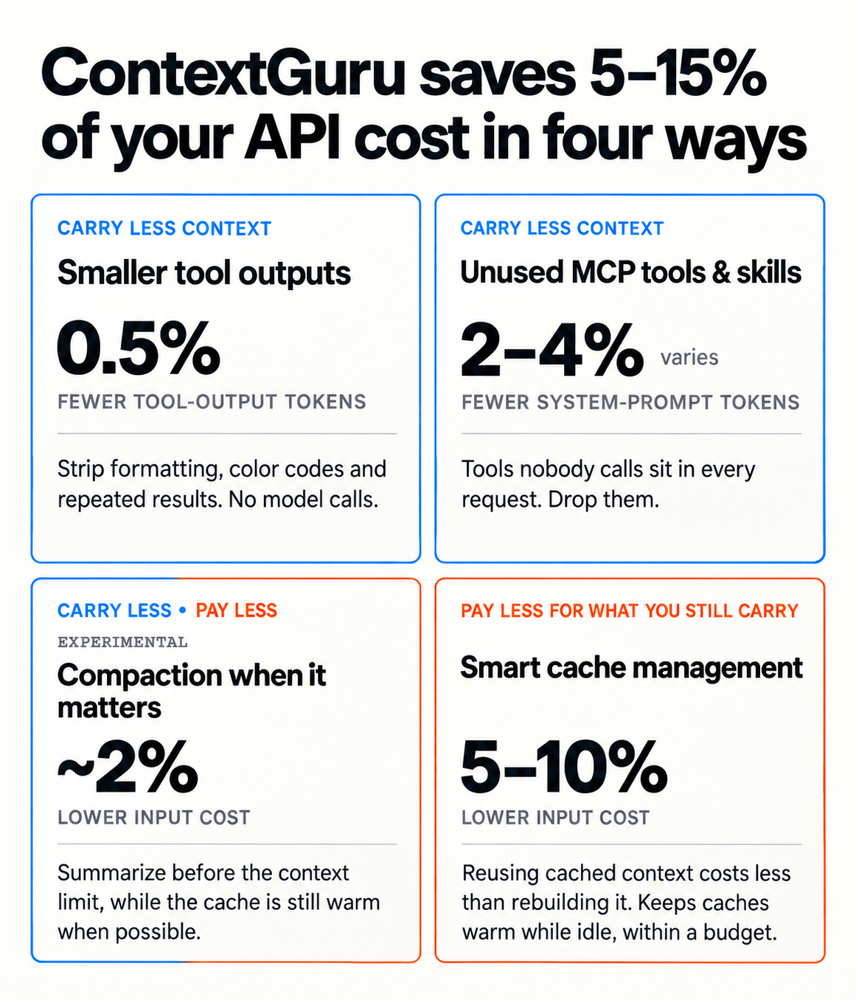

<div align="center">


# context-guru

**Provider-agnostic context engineering for LLM agents.**

[](https://rossoctl.github.io/context-guru/)
[](https://pkg.go.dev/github.com/rossoctl/context-guru)
[](LICENSE)
[](go.mod)

</div>

---

context-guru cuts the token cost of your agent's traffic in two ways: **carry less context**
(drop redundant tool output, collapse superseded runs, summarize before you hit the limit), and
**pay less for what you still carry** (keep your prompt cache warm, split the volatile tail off
the system prompt so the rest stays cacheable). Paying less is the **default** — it's on out of
the box, before you opt into anything that trims content.

Full docs: **[rossoctl.github.io/context-guru](https://rossoctl.github.io/context-guru/)**.

<p align="center">

</p>

## Install

Choose your setup. Each button opens only the instructions for that path.

| | **Personal use** | **Enterprise use** |
|---|:---:|:---:|
| **Claude Code** | [](docs/how-to/install-plugin.md) | [](docs/hosted.md#user-setup) |
| **Codex** | [](codex-marketplace/plugins/context-guru/README.md) | [](docs/hosted.md#user-setup) |

Codex routing and observability work today, but Responses traffic is not yet context-reduced. That
work is tracked in [#373](https://github.com/rossoctl/context-guru/issues/373).

## Presets

Change what gets trimmed with:

```
/context-guru:preset-picker
```

It's an effort ladder — each tier is everything in the one before it, plus more:

| Preset | What it adds | Spends on its own |
|---|---|---|
| `off` | nothing — requests forwarded untouched (the default; only keep-alive spends, if that's on) | no |
| `conservative` | deterministic trimming of tool output (repeats, dead runs) — no model calls | no |
| `medium` | `conservative` plus a cheap model that keeps only what looks relevant in recent tool output | yes |
| `high` | `medium` plus a summarizer that compacts older turns once the context window is nearly full | yes |
| `xhigh` | `high` plus a periodic deep-adjudication sweep over turns whose prompt cache has gone cold — the deepest cut | yes |

Run the picker above any time to switch tiers — it explains each one before asking which to set.
A restart is required — it takes effect at the next proxy start, not the current session; run
`/context-guru:status` afterward to confirm it stuck. Full pipelines:
[docs/reference/presets.md](docs/reference/presets.md).

Everything else — architecture, the full benchmark, every component, the proxy/gateway path,
config reference — is in **[docs/design.md](docs/design.md)** and
**[docs/get-started/how-it-saves.md](docs/get-started/how-it-saves.md)**.

## Updating

The proxy **binary** is what matters and what changes often. A routed session checks for a newer
release every 5 minutes and tells you once, with three answers: update now, always update
automatically, or do nothing for that release. Update it any time with:

```
/context-guru:update
```

**The plugin itself** (skills, hooks, scripts) rarely needs updating — most releases only touch the
proxy binary, which `/context-guru:update` already covers. If you do want the latest plugin code:

```
/plugin marketplace update rossoctl/context-guru
/reload-plugins
```

More: [docs/how-to/install-plugin.md](docs/how-to/install-plugin.md#upgrading).

## Troubleshooting

**If something breaks and Claude can't fix it**, run the recovery script — no session, no proxy,
no network needed:

```
~/.local/state/context-guru/context-guru-reset
```

Prefer it over `/context-guru:uninstall` or `/plugin uninstall context-guru@context-guru` when a
session is actually stuck: a dead proxy fails every request, including the ones an uninstall
command would need. More: [docs/how-to/install-plugin.md#troubleshooting](docs/how-to/install-plugin.md#troubleshooting).

**The two are not the same, though.** `/context-guru:uninstall` undoes **one** install — the one
routing the project you run it in — and leaves any other alone; the recovery script un-routes
**every** settings file the plugin edited, machine-wide one included.

```
/context-guru:uninstall
```

More:
[docs/how-to/install-plugin.md](docs/how-to/install-plugin.md#removing-it-uninstall-or-reset).

## Upgrading from project level to user level

Installed in one project and now want it everywhere? Install again with `--global` and keep both —
each gets its own port, and a project you later reset falls back to the machine-wide one.

```
/context-guru:install --global
```

More:
[docs/how-to/install-plugin.md](docs/how-to/install-plugin.md#upgrading-from-project-level-to-user-level).

## License

Apache-2.0. See [LICENSE](LICENSE). A [Rossoctl](https://github.com/rossoctl) platform component.
