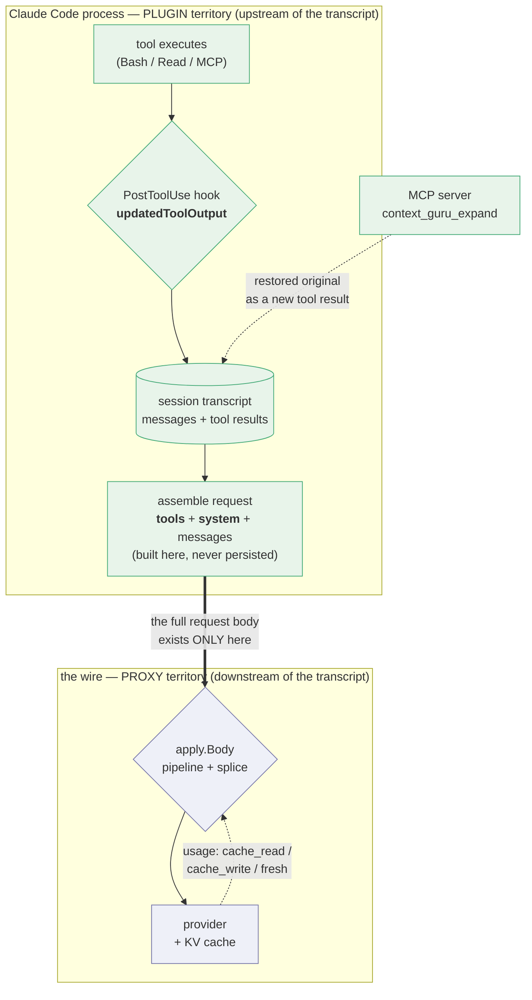

# Claude Code plugin as a third transport for context-guru

Scope: can the existing `components` core be deployed as a [Claude Code
plugin](https://code.claude.com/docs/en/plugins) — as a *thin* fourth host next to
`proxy/`, the AuthBridge plugin and `adapters/bifrost`, reusing components via
configuration rather than reimplementing them? And does building it help the DAM push?

Not a replacement for the proxy. Deployment/transport only.

## The one constraint that decides everything

**No plugin surface can read or write the outbound Messages API request.** Confirmed
against the [hooks reference](https://code.claude.com/docs/en/hooks#decision-control):
across all ~34 hook events there is no field that rewrites `messages[]`, `system[]`,
`tools[]`, or any `cache_control`. `UserPromptSubmit` explicitly "can't replace the
prompt; it only injects `additionalContext` alongside it". Plugin `settings.json` accepts
only `agent` and `subagentStatusLine`, so a plugin cannot even set `ANTHROPIC_BASE_URL`
to point the session at the proxy.

What *is* interceptable is **one tool result, at the moment it is produced, before it
enters context** — `PostToolUse` → `hookSpecificOutput.updatedToolOutput`, which
"replaces the tool's output with the provided value before it is sent to Claude". The
docs name this use case directly: *"For redaction or transformation use cases, intercept
at `PreToolUse` for outbound tool inputs and `PostToolUse` for inbound tool results."*

So the dividing line through our component set is not lossy-vs-lossless. It is:

- **per-tool-output text transform** → works, sometimes better than the proxy;
- **needs the request envelope, or needs to rewrite an *earlier* message** → impossible.

That second clause is the expensive one. `PostToolUse` fires once, at message birth. It
can never go back.

## The one picture: the transcript is the boundary

Everything below follows from *where* each host sits relative to Claude Code's session
transcript. The plugin is **upstream** of it; the proxy is **downstream** of it.



Read off the consequences:

| | Plugin (upstream) | Proxy (downstream) |
|---|---|---|
| Sees `tools` / `system` / `cache_control` | **No** — assembled after it, never persisted | Yes |
| Sees provider usage (cache tiers, cost) | **No** | Yes |
| Sees one tool output before it is recorded | **Yes** | No — only after, re-sent every turn |
| Effect on the transcript | **Permanent** — rewrites history at birth | Per-request — must re-derive each turn |
| Knows session lifecycle (`Stop`, `SessionEnd`, `PreCompact`) | **Yes, explicitly** | Inferred from traffic |

So the split is not "which components are portable". It is: **anything that needs the
request body or the provider's response must be on the wire, and that is the definition of
the proxy. The plugin's entire boundary is "everything except the wire."**

That single fact decides `cachesplit`, `cacheinject`, the keepalive ping, `/stats` cost
accounting, and the freeze/replay layer — in that order of importance.

## Why this distribution method fits offloaders but not cache management

The two families differ in *what they need to touch*, and the plugin boundary cuts exactly
between them.

**An offloader needs one tool output.** `cmdfilter` filtering `terraform plan` noise,
`collapse` windowing a 2,000-line log, `skeleton` reducing a source read — each is a pure
function from one blob of text to a shorter blob of text. It needs no neighbouring message,
no `system` array, no provider response. `PostToolUse` hands it exactly that blob and
accepts a replacement. The unit of work and the unit of interception are the same size, so
the transport is a fit rather than a compromise.

**Cache management needs the whole request, and needs to write metadata into it.** Not one
message — the *shape* of the entire prefix:

- `cachesplit` restructures the top-level `system` array. Components never see it; only
  `apply` does, from the raw body.
- `cacheinject` reasons over `messages[]` positionally — divergence point, turn-stable
  anchors, the 4-slot budget counted across `system` + `tools` + `messages` together — and
  its output is a `cache_control` key, which is request metadata, not content.
- the keepalive must *originate* a request that byte-exactly reproduces a prefix, and price
  the decision from `CachedTokens`, which only the provider's response carries.

None of that is a large tool output. It is the envelope, and the envelope is assembled after
the plugin's last hook has run and is never written to disk (verified: a session transcript
carries `messages` and `toolUseResult`, and no system prompt or tool schemas — see
`scripts/inspect_transcript.py`).

So the rule is not "lossy vs lossless" or "cheap vs expensive". It is:

> **Content-scoped work distributes to the harness. Envelope-scoped work requires being on
> the wire.**

And there is a second, sharper asymmetry in how the two families *fail*. An offloader that
gets it wrong wastes an expand round-trip — bounded, recoverable, and reversibility is
type-enforced. Cache work that gets it wrong inverts: a mistimed keepalive creates an entry
at 1.25× instead of refreshing at 0.1×; a breakpoint over budget is a hard 400; a
representation flip inside a cached prefix re-writes the suffix at 11.5×. Envelope-scoped
work has no fail-open direction that is merely "no saving" — which is precisely why it wants
the host that can see the whole request and the provider's answer to it.

## The KV-cache layer: the defensive half is free, the offensive half is impossible

This is the part that matters most, and the answer is not one answer. Our KV-cache
awareness is two separate mechanisms with opposite fates under a plugin.

### Defensive: keep the provider's cached prefix byte-stable

`components/offload/state.go`, `Ctx.CacheAware` / `Ctx.MaxCachedIdx`, `modes.Tracker`,
`cg:frz:`, `FrozenLost` / `repairLostFreeze`, `frozen_flips`, the sticky-session set,
`cg:len:`. This is the single hardest body of code in the repo, and `state.go` states
exactly why it exists:

> once an offloader compacts an output, it must send the SAME bytes for that output on
> every later turn — **otherwise the agent (which re-sends the ORIGINAL each turn)** makes
> the output flip compacted→full→compacted, churning the provider KV cache.

The parenthetical is the whole load-bearing premise, and **a `PostToolUse` hook falsifies
it.** The agent cannot re-send the original because the agent never received the original.
`updatedToolOutput` replaces the output *before it enters Claude Code's transcript*, so
the reduced bytes are what the transcript holds and what gets re-sent, verbatim, forever.

Every consequence follows mechanically:

- **No re-derivation, so no freeze.** `freeze` / `reapplyFrozen` / `frozenKey` exist to
  reproduce byte-identical output on turn *n+1*. There is no turn *n+1* decision to make.
- **No lost-freeze problem.** `frozenLost`, `repairLostFreeze`, `FrozenLoser`,
  `frozen_dropped` / `frozen_repaired` / `frozen_flips`, and the "fail direction inverts
  for an established compaction" reasoning in design.md all describe a store entry whose
  loss corrupts a cached prefix. Nothing is replayed, so nothing can be lost.
- **No tail gate.** `MaxCachedIdx` / `TailOnly` / `modes.Tracker` restrict mutation to
  messages the provider hasn't cached. A hook mutates content that has **never been sent
  to the provider at all** — it is not merely in the uncached tail, it is pre-wire. This is
  strictly stronger than the invariant the tracker enforces, and it removes the
  read-then-write race that `Tracker.Turn` was built to fix.
- **`extract_llm`'s nondeterminism stops being disqualifying.** It is excluded from
  `repairLostFreeze` because a sampled model output "may emit different bytes at depth". A
  decision made exactly once cannot differ from itself. (Its *economics* still don't work
  on caching backends — separate problem, unchanged.)
- **Sticky ids and the overcount correction go away.** `saved_tokens` vs
  `saved_tokens_unique` exists because the agent re-sends history and the cumulative figure
  double-counts. In plugin form each saving is realized once, at birth.
- **Agent self-compaction stops being inferred.** `proxy/agentcompaction.go` detects it by
  string-matching the agent's compaction prompt — pinned to Claude Code 2.1.215's
  `Jao()`/`GMu()` internals, with a documented reachable false positive (our own docs page
  quoting the phrase). A plugin gets `PreCompact` / `PostCompact` as first-class events. A
  fragile phrase match against a specific agent build is replaced by a signal.

So the defensive half isn't ported — it's **obviated**. That is the strongest argument for
the plugin, and it is structural rather than a matter of care.

### Offensive: make the provider cache more of the prefix

`cachesplit` (the volatile-tail system split) and `cacheinject` (breakpoint placement).
Both write request metadata. Both are categorically unreachable — see the component table.

**But this half only exists on explicit-breakpoint backends.** `apply/prefixsplit.go` is
explicit:

> Only meaningful where breakpoints are EXPLICIT (Anthropic family). Under an implicit
> longest-prefix cache the match already ends at the divergence, so a block boundary buys
> nothing.

That splits the verdict by backend, and it is the crux of the whole evaluation:

| Backend | Offensive half | Plugin's net cache position |
|---|---|---|
| Anthropic / Bedrock / Vertex (explicit `cache_control`) | `cachesplit` = **−34.1% cost, 0% → 96.7% hit** | **Real loss.** The best-evidenced component in the repo is unreachable. |
| vLLM / llm-d / on-prem, OpenAI auto-cache (implicit longest-prefix) | `cachesplit` and `cacheinject` are **already no-ops** | **No loss at all** — and the defensive half, which is the *entire* cache story there, comes free. Strictly better than the proxy on the cache axis. |

Given `extract_llm.go`'s "on-prem vLLM under KV-cache pressure" measurements and the llm-d
TOON config, the implicit case is a real target, not a hypothetical. On that traffic a
plugin is the better cache deployment. On Anthropic traffic — which is what Claude Code on
DAM will actually be — it is not.

## Component verdicts

### Reformat (lossless)

| Component | Plugin | Why |
|---|---|---|
| `format` | **Yes** | Acts only on tool messages whose text is JSON — a pure per-output recompaction. Nothing envelope-level despite the name. |
| `toon` | **Yes** | Same shape: one tool output's uniform JSON array → TOON. |
| `cacheinject` | **No — categorically** | Four independent blockers, below. |
| `cachesplit` | **No — categorically** | Its whole effect is a rewrite of the top-level `system` array (`apply/prefixsplit.go`). There is no `system` array in plugin-land. |

**`cacheinject` in detail** — the offensive half's second component, and the single worst
fit in the repo:

1. Its output *is* request metadata. `cache_control` on a message content block. No hook
   emits that.
2. Even granted a write channel, the algorithm is **positional over the whole
   `messages[]` array**: `want[len(req.Input)-1]`, `commonPrefix(prev, now)` for the
   divergence point, and the `lookbackBlocks`-strided turn-stable anchors. A
   `PostToolUse` hook sees one tool result and no array at all.
3. `Ctx.ExistingBreakpoints` is computed by `apply` from the **raw wire body**, spanning
   `system` + `tools` + `tool_result` blocks — the exact three places components can't
   see, which is what issue #32 was. That body does not exist in a hook.
4. The v2 contract is *"keep every breakpoint the caller set, then spend the leftover
   slots"* — where the caller is Claude Code itself. A plugin cannot observe Claude
   Code's own breakpoints, so it cannot compute the budget, and overshooting the
   provider's cap of 4 is a hard 400.

`cacheinject` is in no preset today (placement is unmeasured), so losing it costs nothing
measured. **`cachesplit` is the real loss**: it is in *every* preset and it is the
best-evidenced component we have — −34.1% cost, 0% → 96.7% cache hit in an isolated A/B.
The plugin gives that up entirely.

### Offload (lossy, reversible)

| Component | Plugin | Why |
|---|---|---|
| `cmdfilter` | **Yes — better than the proxy** | Per-output DSL filter, and the hook input hands you the actual `tool_input.command`. The proxy has to infer the command from the transcript; a hook is told. Should cut `cmdfilter_selector_misses`. |
| `collapse` | **Yes** | Head/tail window over one oversized output. |
| `smartcrush` | **Yes** | Crushes one output's homogeneous array. |
| `extract` | **Yes** | Deterministic per-output noise collapse. |
| `skeleton` | **Yes — better than the proxy** | Per-output tree-sitter reduction, and the hook supplies `tool_input.file_path`, so language selection stops being content sniffing. Still needs the `cg_skeleton` build tag. |
| `dedup` | **Yes, with state** | Replaces the *later* byte-identical output — forward-only, which is exactly what a hook can do. Needs cross-turn digests, so it needs a store that outlives one hook process. |
| `extract_llm` | **Technically yes; leave it off** | The transform is per-output, but its economic gate needs the caching-backend fact and the fresh/cache-read token split, none of which a hook can see. Since #28 it declines on caching backends anyway (~8× underwater, break-even ~30,500 tokens/output). A synchronous cheap-model call inside a per-tool-call hook is also the worst place to put one. |
| `failed_run` | **No** | It keeps the newest run and collapses **earlier** runs. Retroactive by definition; at the moment run 2 is produced, run 1 is already in Claude Code's transcript and immutable. |
| `mask` | **No** | Age-based GC of *older* tool outputs. Same retroactivity. This is the top measured lever on our target traffic — 27.5% on Terminal-Bench, 12.5% on SWE-bench — and it is unreachable. |
| `summarize` | **No** | Whole transcript, and it changes the message count. |

### Infrastructure

| Package | Plugin | Notes |
|---|---|---|
| `expand/` | **Yes — strictly better** | Ship `context_guru_expand` as an MCP tool via `.mcp.json`. This deletes the proxy's worst machinery: the 3-round `maxExpandRounds` cap, the response parsing, the continuation builder, and above all the **SSE buffering** (today a streaming response must be buffered whole to detect an expand call — `sse_buffered_pct` / `sse_ttfb_ms_avg_buffered`). An MCP tool call is just a tool call. Nothing to buffer, no round cap. |
| `store/`, `session/` | **Yes, needs a home** | Hooks are one-shot processes; our store is in-memory with sliding TTL and pinned prefixes. Either a long-lived process holds it (the MCP server already is one) or SQLite under `${CLAUDE_PLUGIN_DATA}`. Session keying gets *simpler*: hook input carries `session_id`, so `session.Resolve`'s content-hash fallback is never needed. |
| `config/` | **Yes, unchanged** | One new preset. This is the "reuse via specific configuration" the plugin should be. |
| `metrics/`, `/stats` | **Partial — and this bites** | Content-token savings are countable. The four provider-billed tiers (`fresh_input_tokens`, `cache_read_tokens`, `cache_write_tokens`, `output_tokens`) come from the API *response*, which a plugin never sees. So `savings_pct_attempted`, `savings_pct_new_input`, every cost figure, and the `deploy/harbor/*.py` reproduction path do not exist in plugin mode. Worse, Claude Code's own OTel spans capture the **original** output — the docs are explicit that telemetry runs before the hook. **The plugin cannot be benchmarked the way the proxy is.** |
| `dash/` | **Yes** | Runs alongside; `monitors/monitors.json` can launch it, a skill can open it. Content capture stays opt-in. |
| `modes.Tracker`, `MaxCachedIdx`, `TailOnly`, freeze/repair | **Moot — and that is the upside** | See below. |
| `apply/` | **No — replaced by something much smaller** | No wire body, so `normalize`, the round-trip guard, the `metawrite` metadata exception, `wireBreakpoints` and `prefixsplit` all have nothing to do. A new `adapters/cchook` needs none of it. |
| `proxy/` control plane — `spendgate`, `tenancy`, `limits`, `refusals`, `promexport` | **No** | Multi-tenant gateway concerns. A plugin is single-user and local. |
| `adapters/bifrost` | N/A | |

## Permanence cuts both ways

The defensive-half argument above is the plugin's best property, but it has a symmetric
downside that has to be priced in.

Under the proxy, an offload decision is re-made every turn and is therefore *revisable*.
Under a hook it is made once and is **irrevocable from the transcript's point of view**:

- A good reduction is permanently good — realized once, re-sent free forever.
- A **premature offload is permanently bad.** Today a bounce (`wasted_tokens` / `bounces`)
  costs one round-trip and the next turn can decide differently. In plugin form, when the
  model calls `context_guru_expand`, the restored original arrives as a *new* MCP tool
  result appended to the transcript — the marker stays where it was, and now both the marker
  and the full original are re-sent for the rest of the session. An expand goes from a
  per-turn cost to a permanent one, *plus* the marker overhead.

Note what this does to `state.go`'s kept-verbatim machinery: `keptKey` / `isKeptVerbatim` /
`MarkKeptVerbatim` exist to stop an expand→re-compact→expand loop. That loop is impossible
here (the hook never revisits the message), so the guard is unnecessary — but the *reason*
it was needed becomes a worse problem rather than a solved one.

The design consequence is concrete: **the plugin should be tuned more conservatively than
the proxy**, favouring high-confidence deterministic reductions (`cmdfilter`, `format`,
`toon`, `extract`) over speculative ones (`collapse`'s blind head/tail window). It also
makes `mask`'s `keep_head_chars` head-peek idea — which measurably stops needless expands —
more valuable exactly where it cannot run.

One piece of `state.go` gets *better*, not obviated: the **global (session-independent)
result cache**. `getResultGlobal` / `extract.ResultKey` exploit cross-session content
recurrence — measured 82 of 103 unique contents recurring across sessions, ~93% of
`extract_llm`'s realized value. The proxy holds that in an in-memory store that dies on
restart. A plugin store under `${CLAUDE_PLUGIN_DATA}` is a per-user file that survives
session exit and reboot, so it can realize *more* of that reuse than the proxy does.
`markSeenContent`'s recurrence signal keeps working for the same reason.

## What the plugin would actually contain

```
context-guru-plugin/
  .claude-plugin/plugin.json     # userConfig: preset, ttl, dashboard, log level
  .mcp.json                      # context-guru --mcp  → context_guru_expand (+ holds the Store)
  hooks/hooks.json               # PostToolUse (matcher ".*") → context-guru --hook
  monitors/monitors.json         # optional: dashboard / stats tail
  skills/                        # /cg:stats, /cg:preset, /cg:explain
  bin/                           # the binary, if not vendored via userConfig path
```

New Go code, all of it thin:

- `adapters/cchook` — read the hook JSON on stdin, wrap the tool output as a single
  synthetic `role:"tool"` `ChatMessage`, run the configured pipeline, emit
  `updatedToolOutput`. Fail open on everything (echo nothing → original stands).
- an MCP stdio mode on the existing binary, serving `expand/`'s tool def and owning the
  store the hook talks to.
- one preset, e.g. `hook: format → toon → dedup → cmdfilter → extract → smartcrush → collapse`
  — `general` minus `mask`, `failed_run`, `cachesplit`, `extract_llm`, `summarize`.

Everything under `components/`, `components/offload/`, `components/dsl/`, `store/`,
`session/`, `config/`, `expand/`, `metrics/`, `dash/` is reused unmodified.

## Three things to verify empirically before committing

**0. Does `updatedToolOutput` persist into the session transcript?** This is the gate
everything above rests on, and the docs do not state it directly. The whole
defensive-half-is-free argument requires that the *replacement* is what Claude Code stores
and re-sends on every later turn. Two data points point that way — the docs say the value
is substituted "before it is sent to Claude", and for `additionalContext` they say Claude
Code "saves the injected text in the session transcript … replays the saved text rather
than re-running the hook" on resume — but neither is a statement about
`updatedToolOutput`'s persistence. The counter-hypothesis is that the original is retained
and the replacement applies to one request only.

If persistence does **not** hold, the plugin saves tokens on exactly one request per tool
call and nothing thereafter, the entire freeze/replay layer is needed again (with no way to
run it, since the hook can't see the request), and the whole proposition collapses. **Test
this first, before anything else is built:** run a `PostToolUse` hook that replaces a Bash
output with a sentinel string, take two more turns, then inspect the session transcript
JSONL and — decisively — a captured outbound request body to confirm the sentinel is what
gets re-sent.

1. **Is `updatedToolOutput` subject to the 10,000-character cap?** The docs cap
   "`additionalContext`, `systemMessage`, and plain stdout" and do not name
   `updatedToolOutput` — but if the cap applies to total hook stdout, the hook is unusable
   for exactly the large outputs that matter. Test with a >10 KB reduced output.
2. **Shape validation fails silently.** "For built-in tools, a value that doesn't match the
   tool's output schema is ignored and the original output is used." That is fail-open,
   which suits us, but it is *invisible* — the same class of bug as #32, where a component
   applied 46 breakpoints and 0 reached the wire. The hook must verify its own emission and
   count rejections, or we will ship a silently inert plugin again.

Also note `PostToolUse` does not fire for tool calls rejected before execution, and tool
*errors* route to `PostToolUseFailure` instead — a nonzero-exit `Bash` call is still a
success, so the `cmdfilter` path is covered, but a plugin wanting full coverage needs both
events.

## Does this help the DAM push?

[DAM](https://github.com/dam-agents/dam) is TypeScript, explicitly harness-plural (Claude
Code, Pi Agent, Bob, Codex, plus "bring your own harness — any runtime compatible with
ACP"), and runs agents in isolated pods behind **policy-enforced gateways** with zero-trust
credentials the runtime never sees.

**Mostly no.**

- A Claude Code plugin covers **one of four named harnesses** and none of the
  bring-your-own case. The proxy covers all of them because it sits at the transport.
- DAM's egress shape *is already* our gateway credential model — provider key injected at
  the gateway, agent holds a placeholder. `proxy/` drops into that path introducing no new
  concept; the plugin would have to be installed and force-enabled per harness, per pod.
- Long-lived agents are DAM's headline, which makes **cache economics** the dominant cost
  term. Claude Code on DAM means Anthropic/Bedrock — the explicit-breakpoint column, where
  the offensive half is worth −34.1% and is unreachable from a plugin. (Were DAM routing to
  an on-prem vLLM/llm-d backend, this row would flip: there the offensive half is already a
  no-op and the plugin's free defensive half would be the better cache deployment. Worth
  confirming which backends DAM actually targets before treating this as settled.)
- `spendgate`, `tenancy`, `limits`, `promexport` are what a platform actually needs to
  enforce, and they are proxy-only. A plugin is user-installable and user-disableable; a
  platform wants a policy.
- No `/stats`, so no benchmark reproduction on DAM traffic.

**The narrow yes.** DAM already ships `.agents/skills`, so it has a skills-shaped
distribution channel. Three pieces are worth shipping there *on top of* the gateway:

1. the **MCP expand server** — valuable regardless of transport, because it removes SSE
   buffering from the gateway's hot path;
2. the **operator surface** — skills for `/cg:stats`, the dashboard monitor;
3. the **`adapters/cchook` boundary itself** — a per-tool-output adapter is reusable by any
   ACP harness exposing a tool-result hook, so the refactor has cross-harness value even
   where the packaging does not.

## What the plugin is actually for

Stated bluntly, because it is easy to lose in the detail: **the keepalive idle signal is not
a reason to build a plugin.** It is a rider on one, worth having only if a plugin exists for
other reasons. If the list below doesn't stand up, don't build it.

Ranked by what the plugin uniquely provides — things the proxy *cannot* do, not things it
already does:

1. **Offload at birth, permanently** *(the whole case — and it is conditional)*. Rewriting a
   tool output before it enters the transcript means the reduction is realized once and
   re-sent free forever, and the entire defensive KV-cache layer — `state.go`'s
   freeze/replay, `MaxCachedIdx`, `Tracker`, `frozen_flips`, sticky ids — stops being
   necessary rather than being ported. That is the only item here that changes the
   architecture. **It rests entirely on the unverified persistence check (§0).**
2. **`context_guru_expand` as an MCP tool.** Deletes the 3-round `maxExpandRounds` cap, the
   response parsing, and the whole-SSE-buffering penalty. Worth doing *even with no hook at
   all*, and it works alongside the proxy rather than instead of it.
3. **Better selectors for free.** `cmdfilter` gets the actual `tool_input.command` and
   `skeleton` gets `tool_input.file_path`, instead of inferring both from transcript text.
4. **Explicit lifecycle signals.** `PreCompact`/`PostCompact` replace
   `proxy/agentcompaction.go`'s string match against Claude Code 2.1.215's internals — which
   has a documented reachable false positive. `SessionEnd` tells a proxy-side keepalive that
   a session is dead rather than thinking, which is the waste that caps `K` at 2–3.
5. **Durable cross-session result cache.** `${CLAUDE_PLUGIN_DATA}` survives restarts; the
   proxy's in-memory store does not. On the measured 82-of-103 cross-session content
   recurrence, that realizes more reuse than the proxy can.
6. **Distribution.** `/plugin install` and a marketplace, versus "point your agent at a
   proxy". Real, but packaging, not capability.

Items 3–6 are worth a few hundred lines. They do not justify the project on their own. **The
project is item 1, or it is item 2 alone.** Decide it with the §0 experiment before writing
adapter code.

## Recommendation

Build it, scoped as a convenience/transport layer, not as a strategy:

- **Do**: MCP expand server, `PostToolUse` offload hook, operator skills, one `hook` preset.
- **Don't**: attempt `cacheinject`, `cachesplit`, `mask`, `failed_run`, or `/stats` cost
  accounting in plugin form. Cache work and multi-tenant policy stay in the proxy, which
  remains the only place they are possible.
- **For DAM**: land the proxy in the gateway. Ship the plugin as the Claude-Code-session
  layer on top of it — never as the DAM integration.
- **Gate the work** on check 0 — transcript persistence — before writing any adapter code.
  It is a half-day experiment and it decides whether the plugin is worth building at all. If
  it holds, the defensive KV-cache half comes free and a large amount of our hardest code is
  simply not needed in that deployment. If it doesn't, stop: build the expand MCP server
  alone and leave the pipeline in the proxy. Check 1 (the 10 KB cap) is the second gate; if
  it bites, same outcome.
