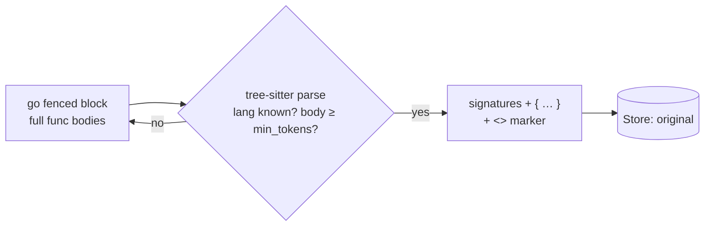
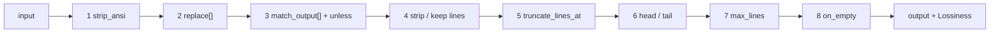

# Components

Every registered component, exactly as it behaves in code. All operate on tool-output
messages (`role:"tool"`; for Anthropic, `tool_result` blocks normalized to that shape by
`apply`). **Reformat** = lossless. **Offload** = drops bytes, stashes the original, leaves a
`<<cg:HASH>>` marker recoverable via `context_guru_expand` / `GET /expand`.

## Summary

| Component | Kind | What it drops | Recoverable | Fires on | Key config (default) |
|---|---|---|---|---|---|
| `format` | Reformat | nothing (compacts JSON) | n/a (lossless) | pretty-printed JSON tool output | `min_tokens` (50) |
| `toon` | Reformat | nothing (re-encodes JSON arrays as TOON) | n/a (lossless) | uniform flat JSON object-arrays; **opt-in, RETIRED from every preset 2026-08** — 0 acts in 5,752 production requests, 0 convertible candidates in 11.67M measured tokens, at 1.53 ms + a `TextTokens` call per tool message | `min_tokens` (50) |
| `textclean` | Reformat | nothing (strips ANSI + `\r` redraws) | n/a (lossless) | plain-text tool output with terminal control | `min_tokens` (50) |
| `searchfold` | Reformat | nothing (folds the repeated path prefix out of search output) | n/a (lossless, exact inverse) | any tool output with a repeated path prefix — routed by CONTENT, attempted everywhere, kept only when its own inverse round-trips; **in every preset** since 2026-08 | `min_tokens` (50) |
| `toolschema` | Reformat | nothing (strips JSON-Schema annotation keywords from `tools`) | n/a (lossless) | any request carrying tool schemas; **opt-in, in no preset** — it re-anchors the cached prefix once, see the break-even | — (no config) |
| `toolfilter` | Reformat | the tool/MCP declarations the account listed in `remove` (82.7% of a session's declared tokens are never invoked) | yes — delete the name from `remove` (re-anchors the prefix once) | any request carrying declarations; **opt-in, in no preset** — it never removes a name the account did not list, and keeps any name still described in the system prompt's prose, see [declaration-removal](how-to/declaration-removal.md) | `remove` (empty) |
| `cacheinject` | Reformat | nothing (adds `cache_control`) | n/a (lossless) | Anthropic-family requests; **opt-in, in no preset** — placement is unmeasured | `ttl` (5m) |
| `cachesplit` | Reformat | nothing (splits a `system` block) | n/a (lossless) | Anthropic-family requests; **in every caching preset** — enables the measured volatile-tail split | — (no config) |
| `skeleton` | Offload | function/method bodies | via expand | fenced ` ```lang ` code blocks and raw file dumps (`Read`/`cat`/`sed -n`); **behind the `cg_skeleton` build tag, needs CGO, in no preset, and must not be enabled** — it removes 0 tokens per live turn because every `Read` is the newest of its path, and the guards that make it safe are what make it worthless, see the measurement | `min_tokens` (80) |
| `dedup` | Offload | later byte-identical tool outputs | via expand | repeated identical outputs | `min_tokens` (100) |
| `readlifecycle` | Offload | file `Read` bodies the transcript proves are stale (file edited later) or superseded (re-read later) | via expand | `Read` results in an editing session; **opt-in, in no preset** — 0 tokens warm, a third of a *cold* request, see the break-even | `min_tokens` (100), `stale`, `superseded`, `bash_edits`, `stale_at_depth`, `cold_cache` |
| `collapse` | Offload | middle of an oversized output | via expand | any large tool output (fallback) | `max_tokens` (2000), `head_lines` (20), `tail_lines` (20), `cold_cache` (**true**) |
| `failed_run` | Offload | earlier superseded test/build runs | via expand | ≥2 run-like outputs | `min_tokens` (100), `cold_cache` (**true**) |
| `cmdfilter` | Offload | lines per declarative DSL filter | via expand | output matching a filter | `filters` ([]), `disable_builtins` (false), `min_size` (400) |
| `linecap` | Offload | the tail of any line over 500 chars, and every NON-adjacent repeat of a line (first copy annotated `(xN)`) | via expand | any tool output ≥ `min_size`; command-agnostic, so it fires where per-command filters do not | `max_line_chars` (500), `collapse_duplicate_lines` (true), `min_size` (400) |
| `extract` | Offload | obvious noise (repeated lines/blocks, blank runs, progress bars) | via expand | any large output | `min_tokens` (300), `trigger` |
| `extract_llm` | Offload (LLM) | query-irrelevant content via an LLM-written sandboxed filter | via expand | large output in a large request | `strategy` (code), `model.source`, `trigger`, `rewrite`, `skip_file_reads` |
| `smartcrush` | Offload | middle items of a JSON array | via expand | JSON-array tool output | `min_items` (5), `min_tokens` (200), `keep_first` (3), `keep_last` (2) |
| `mask` | Offload | older tool outputs (age-based) | via expand | more than `keep_recent` outputs | `keep_recent` (3), `min_tokens` (100), `keep_head_chars` (96), `cold_cache` (**true**) |
| `summarize` | Offload (LLM) | the middle of the transcript → one summary | via expand | long trajectories | `summary_level` (regular), `keep_last` (3), `min_tokens` (500), `resummarize_tokens` (6000), `model.source`, `trigger` |
| [`agentdiet`](components/agentdiet.md) | Offload (LLM) | useless/redundant/**expired** content in the step that just aged past the delay | via expand | a step above `min_step_tokens`, `delay_steps` turns back | `delay_steps` (2), `context_steps` (1), `min_step_tokens` (500), `min_saved_tokens` (400), `max_keep_ratio` (0.8), `model.source` |

Presets (`config/config.go`), verbatim: **`codesmart`** (the proxy default)
`[format, textclean, searchfold, dedup, failed_run, cmdfilter, extract_llm, extract, linecap, cachesplit]` ·
**`codesafe`**
`[format, textclean, searchfold, dedup, failed_run, cmdfilter, extract, collapse, linecap, cachesplit]`
(deterministic-only) · `off` `[]` · `safe` `[format, textclean, searchfold, cachesplit]` · `balanced`
`[format, textclean, searchfold, dedup, failed_run, cmdfilter, linecap, cachesplit]` · `aggressive`
`[format, textclean, searchfold, dedup, failed_run, cmdfilter, smartcrush, extract, extract_llm, linecap, cachesplit]` ·
`coding` `[format, textclean, searchfold, dedup, cmdfilter, extract, linecap, cachesplit]` ·
`mcp` `[format, textclean, smartcrush, cachesplit]` ·
**`agent`** `[format, textclean, searchfold, dedup, failed_run, mask, extract, extract_llm, cachesplit]` —
for long agentic sessions; `mask` is the biggest lever there (~27–30% content-token savings, no reward
loss — see [RESULTS.md](RESULTS.md)) ·
**`general`**
`[format, textclean, searchfold, dedup, failed_run, cmdfilter, mask, extract, extract_llm, collapse, linecap, cachesplit]`
— the recommended all-round pipeline: the reward-neutral levers of `agent` plus the situational
shrinkers (`cmdfilter`/`linecap`/`collapse`) that cost nothing when they don't fire. `balanced` is
**not** recommended for agentic traffic — it omits `mask`, so it barely helps (6% vs 31% in the
Terminal-Bench replay) ·
`summarize` `[summarize]` (run alone — it restructures the whole transcript) ·
`agentdiet` `[format, agentdiet, cachesplit]` (a published-method **baseline** for A/B, run without
our own offloaders so its effect is attributable — see [agentdiet](components/agentdiet.md)).

**The lossless trio leads every working preset** (`mcp` takes only `format` + `textclean` — it
serves JSON list endpoints with no search output to fold). `format`, `textclean` and `searchfold` all
verify-then-adopt, so there is no risk argument for omitting one, and running them first makes every
downstream token count honest. Two of the three used to be missing: `textclean` shipped in `general`
alone while 49.6% of corpus messages carry ANSI, and `searchfold` shipped in NO preset at all.
`toon` is retired from all of them — it acted 0 times on 5,752 production requests.

**Cold turns sweep at depth.** `mask`, `failed_run` and `collapse` default to `cold_cache: true`:
on a turn whose prompt cache has provably expired there is no cached prefix to protect, and
production was freezing 90.8% of the context (38.4M of 42.3M tokens across 742 `ttl_expiry`
requests) to protect a cache that was already gone — on exactly the turns where a removed token is
worth ~12.5x a warm-turn one. Set `cold_cache: false` per component to restore the tail restriction.
It is **not** defaulted on for `readlifecycle` or `skeleton`, whose replacements are not pure
functions of (content, config).

Every preset that touches caching carries `cachesplit`, never `cacheinject` — see
[Presets](reference/presets.md).

**Dynamic, model-aware triggers.** Trigger thresholds can be expressed as **fractions of the model's
context window** (resolved dynamically via LiteLLM's public model map, no hand-maintained list):
`min_request_frac`, `min_output_frac`, and a hard `huge_output_frac` ("huge tool call" — act regardless of
the request-level gate). `collapse.max_frac` scales its size budget likewise.
Absolutes (`min_request_tokens`, etc.) still win; when the window is unknown, fractions are ignored and
absolutes apply (backward compatible). This lets one config generalize across models/benchmarks.

**Reversibility in practice.** The `context_guru_expand` tool is advertised on outgoing requests
(`INJECT_EXPAND=auto|always|never`, default `auto` = whenever the request already declares
tools and the store persists), so Offload markers are genuinely recoverable — not just described in marker text.
Both conditions are properties of the **session**, not of the turn, so the `tools` array a session
sends is byte-identical on every request in it. That matters more than it looks: `tools` sits ahead of
`system` and `messages` in the provider's prompt-cache hash, so any change to the array discards the
**entire** cached prefix. `auto` used to also require a marker on the request, which made the array
grow on the first offloading turn and shrink again on the next turn that carried none — a whole-prefix
miss in both directions. Every
offloader also applies a **marker-inclusive** never-worse check per message, so a rewrite never grows a
message by the marker's tokens.

**LLM-based components** (`extract_llm`, `summarize`, `agentdiet`) call a model, chosen by
`model.source`: `incoming` (default — reuse the proxied request's own model + key) or `config` (a dedicated
cheap model set via `CHEAP_MODEL*` env / the gateway's `CheapModel`). When no model is available they
degrade — `extract_llm` to a no-op (the deterministic `extract` beside it in every preset does the
cheap pass), `summarize` to a no-op, `agentdiet` to replaying only what it already froze.
`extract` itself never calls a model. See
[design.md](design.md#llm-components).

Common gates every Offload respects: skip non-text (`Rewritable`) messages, skip content already
carrying a marker (no double-offload), and skip if the rewrite (marker + hint included) isn't
actually smaller.

---

## Reformat (lossless)

### `format`
Re-encodes a pretty-printed JSON tool output as compact JSON — same value, fewer whitespace
tokens. Only acts on tool messages whose trimmed text starts with `{`/`[`, is valid JSON, is
≥ `min_tokens`, and gets smaller. It is json-compact only; re-encoding a uniform array as
TOON is [`toon`](#toon)'s job, a separate component, and both can run in one pipeline.

```
before:  { "id": 1,           after:  {"id":1,"name":"ada","tags":["x","y"]}
           "name": "ada",
           "tags": [ "x", "y" ] }
```

- **Lossiness:** none — nothing stashed. **Shines:** verbose pretty-printed JSON/MCP payloads.
  **Inert:** already-compact JSON, non-JSON text, small outputs.

### `toon`
Re-encodes a JSON array of uniform, flat objects as **TOON** (Token-Oriented Object Notation):
one header listing the field names once, then one comma-separated row per element. It drops the
braces, repeated keys, and quotes that dominate a JSON array's token cost. It's a Reformat (repack
in place, nothing stashed): every scalar value is preserved, with one small representational
simplification — JSON `null` renders as an empty cell (indistinguishable from `""`). Only arrays
whose elements share one key set and hold scalar values are encoded; anything nested, ragged, or
non-array is left untouched, and the pipeline's never-worse guard reverts any case that fails to
shrink.

```
before:  [{"id":1,"name":"Alice"},{"id":2,"name":"Bob"}]
after:   [2]{id,name}:
         1,Alice
         2,Bob
```

- **Config:** `min_tokens` (50). **Lossiness:** none — nothing stashed (JSON `null` → empty cell).
  **Shines:** long homogeneous JSON arrays (the llm-d TOON config). **Inert:** nested/ragged/non-array
  output, or not smaller.

### `searchfold`
Folds the repeated path prefix out of search output — `rg`/`grep -rn` hit lists and
`find`/`ls -1`/`rg -l` path lists — by emitting each path (or its parent directory) once as a
heading with the rows beneath it. Routing is by **content**: the fold is attempted on every tool
output and kept only when it round-trips, because the fold self-verifies so a misroute costs CPU
and never correctness.

```
before:  pkg/a.go:12:foo      after:   pkg/a.go
         pkg/a.go:31:foo               12:foo
         pkg/b.go:7:foo                31:foo
                                       pkg/b.go
                                       7:foo
```

It is lossless *by construction*, not by argument: every fold has an exact inverse, and a fold is
adopted only when applying that inverse reproduces the input **byte for byte** and the result is
strictly smaller. Anything else — output already grouped by file, a content line that reads as a
path, a basename ending in `/` — is declined and passes through untouched. No path, line number or
line is ever dropped, so there is nothing to stash and no marker.

- **Config:** `min_tokens` (50). **Lossiness:** none. **Measured** on 466 real captured
  search-command outputs (Terminal-Bench + SWE-bench): it fires on 81 of them and takes those from
  21,088 to 14,410 tokens (**−31.7%**), which is −7.0% across all search-command output.
  **Inert:** single-file `grep -n`, prose, already-grouped output.

  It used to pre-gate on the producing command, and that gate was measured a strict loss on 1,795
  real captured requests: 234,722 tokens folded with it against **333,764 without**, at 1.174
  ms/request against 0.509. It declined 29,737 candidate messages, 99,042 tokens of which had
  exactly the repeated path prefix this folds — the pairing says which command *ran*, not what its
  output looks like, and resolving one `json.Unmarshal`s a whole argument object per tool message.
  The general rule for a self-verifying fold: attempt it, keep what round-trips. A cheap *shape*
  pre-check still earns its keep (`format`'s `not_json_shaped` is a one-byte test guarding a full
  parse); one that has to reconstruct request *structure* does not.

### `cacheinject`
Places Anthropic `cache_control: {type: ephemeral}` breakpoints at the positions that minimise
billed input cost, so the provider KV cache is read rather than re-processed. Adds control
directives, changes no model-visible content.

**In no preset — opt in explicitly.** The placement policy has never been shown to help: the one
live measurement is n=1 and mildly *harmful* per step, with no mechanism established. The presets
carry [`cachesplit`](components/cachesplit.md) instead, which enables the measured volatile-tail
split without the placement — see
[cacheinject](components/cacheinject.md#what-placement-is-actually-worth).

- **Lossiness:** none. **Shines:** Anthropic/Bedrock/Vertex agents that don't self-cache (the
  savings lever is provider-side cache hits, invisible to `/stats` token counts). **Inert:**
  non-cache-aware providers, string-content messages (can't carry a block breakpoint), a
  breakpoint already present. `/stats` will list it under `top_passthrough` since it saves no
  *content* tokens — that's expected, not dead weight.

### `cachesplit`
Splits the volatile tail of the top-level `system` array off its stable head — `[stable][volatile]`
as two text blocks with the same concatenated text, breakpoint on the first — so the provider's
cache boundary excludes the churn. Adjacent text blocks concatenate, so the model sees a
byte-identical prompt.

**In every caching preset.** It is a *marker* component: the `Reformat` method always skips, and the
rewrite is body-level (`apply/prefixsplit.go`), gated on this name being in the pipeline. That
separation exists so disabling breakpoint placement does not silently disable the split.

- **Config:** none. **Lossiness:** none. **Shines:** Anthropic-family agents whose system prompt
  carries a churning tail (env snapshot, git status, timestamp) in front of a breakpoint — measured
  −34.1% mean cost on one Terminal-Bench task over three trials. **Inert:** implicit-prefix-cache
  providers (OpenAI, Gemini), or a system block with no separable tail. Always in
  `top_passthrough` (its saving is a provider-side cache effect). Full page:
  [cachesplit](components/cachesplit.md).

---

## Offload (lossy, reversible)

### `skeleton`
Parses fenced ` ```lang ` code blocks with tree-sitter and replaces function/method/constructor
**bodies** with a placeholder, keeping signatures, imports, types, and class bodies (so method
signatures survive). Stashes the whole original message.



```
before:  func Add(a, b int) int {          after:  func Add(a, b int) int { … }
             return a + b                           func Sub(a, b int) int { … }
         }                                          <<cg:9f2a…>> [full source: call context_guru_expand]
```

- **Config:** `min_tokens` (80, per body), `marker_mode`. Grammars: go, python, js/ts/tsx, rust, java, c/cpp,
  ruby, php, c#, kotlin, swift, scala. **Shines:** the `coding` preset — the agent reads big
  source files but mostly needs the shape. **Inert:** no fenced blocks, unfenced file reads,
  unknown language, skeleton not smaller than the body.
- **Build tag.** The only cgo component, so it is gated behind `cg_skeleton` to keep the default
  build pure-Go. Without the tag it is **not registered**, and a pipeline naming it fails to
  build rather than running without it — so the `coding` preset needs a `cg_skeleton` binary.
  See [skeleton](components/skeleton.md).

### `dedup`
Replaces a tool output byte-identical to an earlier one in the same request with a short pointer +
marker. Exact match only (near-duplicate is deferred).

```
before:  <big config dump>  … (later, identical) <same big config dump>
after:   <big config dump>  … [identical to an earlier tool output] <<cg:1c8e…>>
```

- **Config:** `min_tokens` (100), `marker_mode`. **Shines:** agents that re-read the same file/command output
  repeatedly. **Inert:** no exact repeats, small outputs.

### `collapse`
Content-agnostic fallback for an oversized tool output nothing more specific handled: keep a
`head_lines` + `tail_lines` window, stash the full original. Runs late (after cmdfilter/format);
skips content already marked.

```
before:  <2,000-line log>
after:   <first 20 lines>
         ... (1960 lines omitted) <<cg:44ab…>> [full output: call context_guru_expand]
         <last 20 lines>
```

- **Config:** `max_tokens` (2000 threshold), `max_frac` (fraction of the context window; wins when
  known), `head_lines` (20), `tail_lines` (20), `marker_mode`. **Shines:** a
  catch-all last stage for huge outputs. **Inert:** output ≤ `max_tokens`, or too few lines for
  head/tail to help.

### `failed_run`
Recognizes test/build run output (regex: `N passed/failed`, `BUILD SUCCESS/FAIL`, `Traceback`,
`FAILED`, `panic:`, `npm ERR!`, pytest session banners). Keeps the **most recent** run in full,
collapses every earlier run to a pointer + marker — a superseded run is safely recoverable.

```
before:  [run 1] 3 failed, 5 passed …   [run 2 after fix] 8 passed
after:   [superseded by a later run] <<cg:7d1c…>> [full output: …]   [run 2] 8 passed
```

- **Config:** `min_tokens` (100), `marker_mode`. Needs ≥2 run-like outputs. **Shines:** iterative fix→re-run
  loops. **Inert:** <2 runs detected, small outputs. False positives cost only an expand
  round-trip, never data.

### `cmdfilter`
Shrinks tool output with **declarative DSL filters** (see below). Matches a filter on the output's
first **six** non-empty lines (the selector), applies its 8-stage pipeline, stashes the original, and
appends a recovery hint only when the filter was actually lossy — typed by *what* was lost. Ships
**26** filters across 5 families (`builds` 11, `pkg` 8, `iac` 3, `net` 3, `tests` 1) — see
[cmdfilter](components/cmdfilter.md).

```
before:  pytest … 100 lines of PASSED + warnings + 1 failure
after:   <failures + summary, passing noise stripped, ≤80 lines> <<cg:…>> [full output: …]
```

- **Config:** `filters` (inline filter YAML docs, added with no recompile), `disable_builtins`,
  `marker_mode`, `min_size` (400-byte floor — a **measured** value, not rtk's inherited 500; see
  [cmdfilter](components/cmdfilter.md#size-floor)). `Enabled` only when ≥1 filter is loaded. **Shines:** noisy but structured
  command/log output (test runners, package managers, build tools). **Inert:** output whose selector
  matches no filter (logged in `cmdfilter_selector_misses`), output under `min_size`, or where
  filtering doesn't shrink it.

### `linecap`
**Deterministic, command-agnostic.** The two output rules that do not need a command signature: a
per-line character cap, and a collapse of **non-adjacent** repeated lines.

This exists because per-command filters do not pay. `cmdfilter` ships 939 lines of them and
production has matched exactly two (`ssh`, `uv-sync`; `no_filter_match` 164,865); sixteen further
rtk command signatures — pytest, apt, npm, pip, go test, cargo, tsc, eslint, mypy, ruff, docker,
kubectl, make, gcc, git log, ps — were replayed against 9,763 real messages and **every one matched
zero**. These two rules fire on the same corpus for 1.75M tokens, **20.3% of everything shipped**.

```
before:  resolving dependency graph for module   after:  resolving dependency graph for module  (x30)
         step 1 done                                     step 1 done
         resolving dependency graph for module            step 2 done
         step 2 done                                      …
         <a 2,000-char minified blob>                     <the first 497 chars>... <<cg:…>>
```

- **Cap:** 500 chars, from the measured sweep (tokens removed / messages touched): @200
  2,031,381/2,742 · @300 1,606,241/2,520 · **@500 1,105,387/1,337** · @1000 745,350/862. 500 takes
  54% of @200's tokens while touching *half* as many messages, and an untouched message is one whose
  bytes stay stable for the provider's cache.
- **Never-truncate allow-list:** a line carrying a file path, a source location (`path:line[:col]`),
  a stack frame, an error/exception/traceback, a test verdict, an exit status, a diff marker, a hunk
  header or a URL survives **any** cap intact. Those lines are long for the same reason the noise is,
  and they are the ones the agent has to act on. This is what makes a generic cap deployable.
- **Duplicate collapse** is the non-adjacent case (649,330 tokens); `extract`'s `collapseObviousNoise`
  already handles adjacent repeats and was measured at **63 tokens** of remaining value. Guards: skip
  diff-shaped blobs entirely (two identical `+ return nil` lines are two distinct edits), never
  collapse lines that differ only in a source location (two findings, not one repeated), never under
  8 trimmed chars, never the first or last 3 lines (banner + summary). The `(xN)` keeps the elision
  visible and is rendered *after* the cap, so the cap cannot eat it.
- Duplicates collapse **before** the cap, so a dropped duplicate is not also charged as a capped
  line — the other order double-counts the same tokens.
- **It runs last among the offloaders**, and that position is measured. Every offload leaves a
  marker and every offload skips marker-bearing content (`skipReduce`), so a *modest* reducer ahead
  of a *drastic* one steals its candidates. On `general` over 1,795 real captured requests: 7th in
  the pipeline it saved 5,524,476 tokens — **worse than the 5,556,801 with no `linecap` at all**,
  because it took 39,335 tokens off messages `collapse` would have taken 76,554 off, and its marker
  then made `mask`/`extract`/`collapse` decline those messages outright. Last, it saves
  **5,811,621 (+1.33 pp over the baseline)**.
- **Config:** `max_line_chars` (500; 0 disables), `collapse_duplicate_lines` (true), `min_size`
  (400), `marker_mode`. **Lossiness:** whole-blob (`LossWhole`) — reversible via expand.
  **Measured** on 1,795 real captured requests: acts on 735, **171,473 tokens**, 1.41 ms/request.
  **Inert:** output under `min_size`, output with no over-long or repeated lines, marker-bearing
  content.

### `extract`
**Deterministic, no-LLM.** Collapses only *obvious, provably redundant* noise: consecutively repeated
lines/blocks (up to 12 lines), runs of blank lines, and progress-bar/spinner churn — keeping every
unique informative line verbatim. Runs cheaply on every request; stashes the original.

```
before:  resolved 200 packages                after:  resolved 200 packages
         warning: peer dependency unmet                warning: peer dependency unmet
         warning: peer dependency unmet   (×15)        build complete in 4.2s
         …                                             <<cg:40b571fdebccdcd4>> [full output: …]
         build complete in 4.2s
```
*(captured live: 15 identical warnings → 1, blank runs collapsed.)*

- **Config:** `min_tokens` (300), `trigger`, `marker_mode`. **Shines:** build/install logs,
  package-manager output, anything with repeated warnings/progress bars. **Inert:** below floor,
  nothing obviously redundant, or not smaller once the marker is added. Full page:
  [extract](components/extract.md).

### `extract_llm` (LLM)
The relevance-aware counterpart to `extract`: a **cheap model writes a sandboxed Starlark filter**
(no imports/IO, step + 2s limits) specific to that output, deleting the irrelevant lines/records and
— in `rewrite` mode — rewording/collapsing spans, while keeping ids/paths/errors verbatim. It sees
the full output (bounded ~32k chars). JSON bodies are filtered structurally.

```
before:  2024 GET /users/0 200 12ms   (×60)   after:  2024 GET /users/58 200 12ms
         ERROR auth timeout on token refresh          2024 GET /users/59 200 12ms
         2024 GET /items/0 200 8ms    (×60)            ERROR auth timeout on token refresh
                                                       2024 GET /items/0 200 8ms
                                                       2024 GET /items/1 200 8ms
                                                       [auth timeout error + context; repetitive
                                                        successful requests elided] <<cg:9233…>>
```
*(captured live via `aws/claude-haiku-4-5`; query: "find the auth timeout error and nearby context".)*

- **Guarantee:** `rewrite: false` accepts a result only if it is an in-order **character subsequence**
  of the input (deletion-only, provably no fabrication/reorder). Default `rewrite: true` is the more
  powerful mode (sanity + strictly-smaller only; ids/paths/errors still required verbatim).
- **Model:** `model.source` = `incoming` (proxied model+key) or `config` (`CHEAP_MODEL*`). No model →
  no-op.
- **Throttled + reused:** gated by `trigger` and throttled per session (`llm_every_n_requests`) / per
  request (`llm_max_per_request`); a reduced output is checkpointed per session and **reused
  byte-for-byte** on later turns (no new call, prefix stays KV-cache stable). `skip_file_reads` (auto)
  leaves prompt-cached source dumps verbatim since they already bill cheap.
- **Config:** `strategy` (`code`), `min_tokens`, `model.source`, `trigger`, `rewrite`,
  `llm_every_n_requests`, `llm_max_per_request`, `skip_file_reads`, `marker_mode`. Full page:
  [extract_llm](components/extract_llm.md).

### `smartcrush`
Statistical JSON-**array** compressor: parse the array, keep `keep_first` + `keep_last` items plus
any item whose raw JSON carries an error signal, drop the rest, stash the full original. Kept items
are verbatim (schema-preserving).

```
before:  [ {…}, {…}, … 200 items … ]
after:   [ item0, item1, item2, item198, item199 ] [5 of 200 items shown; full array: call …] <<cg:…>>
```

- **Config:** `min_items` (5), `min_tokens` (200), `keep_first` (3), `keep_last` (2), `marker_mode`. **Shines:**
  long homogeneous JSON arrays (list endpoints, search hits) — the `mcp` preset. **Inert:**
  non-array output, fewer than `min_items`, nothing to drop. v1 uses fixed anchors (headroom's
  Kneedle adaptive-K is a documented refinement).

### `mask`
Age-based garbage collection: keep the newest `keep_recent` tool outputs verbatim, replace older
ones (≥ `min_tokens`) with a short marker + stash. Complementary to the content-based offloaders.

```
after (older):  [older tool output masked; starts: 700 701 def __rmul__(self, m): 702 …] <<cg:…>> [full output: call context_guru_expand]
```

- **Config:** `keep_recent` (3), `min_tokens` (100), `keep_head_chars` (96), `marker_mode`. **Shines:** long agent
  trajectories where old tool results are unlikely to matter (top lever on terminal/code traffic: 27.5%
  on Terminal-Bench, 12.5% on SWE-bench; scales down to ~4% on small structured customer-service outputs).
  **Inert:** ≤ `keep_recent` tool outputs, small outputs.
- **`keep_head_chars`** leaves a one-line head-peek of the hidden output inside the marker (see above) so
  the model knows *what* was masked without a blind `expand` round-trip — evidence showed a bare marker on
  a masked source-file read forces needless expands. Set `0` for the opaque marker (≈2pp more savings).

### `summarize` (LLM)
Compresses the **middle of the trajectory** into one LLM-written summary (ported from CE-Manager's
ReSum-style summarizer). Restructures the message list to `[msg0, <summary system message>, last-K]`;
the replaced span is stashed under a marker carried in the summary message, so `expand` restores the
full earlier trajectory. This is the one component that changes the message count — `apply.Body`
rebuilds the body keeping the retained messages byte-identical.

```
before:  [system, u1, tool, a1, tool, u2, … 30 turns …, uN-1, uN]
after:   [system, "=== History Summary === … <summary> … <<cg:…>>", uN-1, uN]
```

The summarizer is grounded in the **current task** (first user turn + recent turns are passed as
"summarize toward this"), not a blind digest of the middle.

- **Config:** `summary_level` (`concise`|`regular`|`highly_detailed`), `keep_last` (3),
  `min_tokens` (500 — span floor), `include_tool_calls` (false → tool outputs masked in the
  trajectory), `model.source`, `trigger`, `resummarize_tokens` (6000), `marker_mode`.
- **Gating + reuse:** a `trigger` (`min_request_tokens`, `min_messages`; legacy `start_from_message`
  folds into `min_messages`) gates the first summary so it fires only on a large/deep transcript.
  After that, the summary is **checkpointed per session** and **reused verbatim** (no model call, and
  byte-identical so the prefix stays KV-cache stable) until the un-summarized tail grows past
  `resummarize_tokens`, when the checkpoint rolls forward with a fresh summary. This is what stops it
  re-summarizing every turn.
- **Shines:** long agentic sessions where the bulk is stale middle context. **Inert:** transcript
  below `trigger`, span below `min_tokens`, or no model available (no-op). Run it **alone** (its own
  preset) — it restructures the whole transcript.

---

## The DSL filter engine

`components/dsl` is a declarative, user-extensible text-filter engine (adapted from rtk — Apache-2.0,
see `THIRD-PARTY-NOTICES`), wrapped by `cmdfilter`. Filters are authored in YAML (no recompile),
matched by **descending `priority` then by name**, and each runs a fixed **8-stage** pipeline. Because
filters drop lines they are lossy, which is why the wrapping `cmdfilter` component is an Offload (it
stashes the original first).



Filter fields (all optional except `match`): `match` (regex vs the selector = the first six
non-empty lines, compiled with `(?m)`), `family` (per-family `/stats` attribution), `priority`
(match order, higher first), `strip_ansi`, `replace` (chained `pattern`→`replacement`, `$1`
backrefs), `match_output` (whole-blob short-circuit: `pattern`/`message`/`unless`),
`strip_lines_matching` **xor** `keep_lines_matching`, `truncate_lines_at` (per-line char cap),
`head_lines`/`tail_lines`, `cap`/`cap_reduce` (a shared line-budget class), `max_lines` (absolute
cap with omission marker, wins over `cap`), `on_empty` (replacement when output is blank).

`Lossiness` reported back to `cmdfilter` (drives *which* recovery hint is appended): `None`
(nothing dropped / reversible reformat → no hint), `Tail` (a clean contiguous tail dropped → the
hint names the cut point, since re-reading from there is cheaper than a full expand), `Whole`
(non-contiguous or whole-blob loss → the hint points at the expand tool). `Tail` and `Whole` used
to share one hint text; they are now distinct.

```yaml
schema_version: 1
filters:
  pytest:
    description: keep failures + summary, drop passing noise
    family: tests
    priority: 10
    match: "(pytest|=+ test session starts)"
    strip_lines_matching: ["^\\s*$", " PASSED", "^\\.+$"]
    cap: buildlog            # shared budget class; or a literal max_lines
    on_empty: "pytest: all passed"
tests:                       # inline; run AT LOAD, and via dsl.RunTests
  pytest:
    - name: all-green
      input: "pytest\n....\n"
      expected: "pytest: all passed"
```

Documents load with `schema_version: 1` and strict unknown-field rejection. Inline `tests`
(input → expected) run **at load time** as well as via `dsl.RunTests`, so a filter whose tests fail
never loads at all. Load also rejects duplicate filter names, an uncompilable regex, `strip` and
`keep` both set, an unknown `cap` class, and `cap_reduce` without `cap`.
