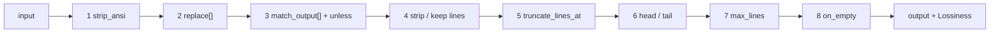
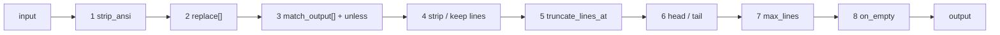

# The DSL filter engine

!!! info "DSL engine — powers `cmdfilter` (lossy)"
    A declarative, user-extensible text-filter engine authored in YAML (no recompile), wrapped by the `cmdfilter` Offload component.

## How it works

`components/dsl` is a declarative, user-extensible text-filter engine (adapted from rtk — see
`THIRD-PARTY-NOTICES`), wrapped by [`cmdfilter`](cmdfilter.md). Filters are authored in YAML (no
recompile), matched by descending `priority` then by name, and each runs a fixed **8-stage**
pipeline. Because filters drop lines they are lossy, which is why the wrapping `cmdfilter` component
is an Offload (it stashes the original first).



## Filter fields

All optional except `match`:

- `match` — regex vs the selector (= the first few non-empty lines, `(?m)` applied so `^`/`$`
  anchor per line). When the request pairs the output with the call that produced it, the selector
  is PREFIXED with a `$ <command>` line, so a filter can be keyed on the command instead —
  `match: '^\$ (rg|grep)\s'` — the way rtk's are. Shape signatures remain the default because
  they fire on unpaired traffic too.
- `family` — command family for per-family metrics (`builds` / `tests` / `iac` / `pkg` / `net` / …)
- `priority` — match order; higher first, then by name. Absent (`0`) is today's name ordering.
- `strip_ansi`
- `replace` — chained `pattern`→`replacement`, `$1` backrefs
- `match_output` — whole-blob short-circuit: `pattern`/`message`/`unless`
- `strip_lines_matching` **xor** `keep_lines_matching`
- `truncate_lines_at` — per-line char cap
- `head_lines` / `tail_lines`
- `cap` / `cap_reduce` — a shared line budget (see below); an explicit `max_lines` wins
- `max_lines` — absolute cap with omission marker
- `on_empty` — replacement when output is blank

### `priority`, and why order matters more here

`cmdfilter` matches on the *shape of the output* (a command line is available too, but every
shipped filter is shape-keyed) and against several leading lines rather than one — so a generic pattern can shadow a specific one in a way rtk's command matching
never had to deal with. This is not hypothetical: widening the selector made `gcc` start claiming
`make`, `swift-build` and `dotnet-build` output, because a bare `file:line: error:` line appears
inside all of them. `priority` makes specific-before-generic explicit instead of dependent on
alphabetical luck. Absent, ordering is by name — exactly the previous behavior.

Rule of thumb: a filter whose selector is a *tool banner* can be high priority; one whose selector is
a *generic diagnostic shape* must be low, so it only catches what nothing else claimed.

### Line budgets: `cap` classes

Instead of every filter hand-picking a `max_lines`, a filter selects a budget by **signal density**.
The class names and the first four values are rtk's (`src/core/truncate.rs`); `buildlog` is ours.

| `cap` | lines | for |
|---|--:|---|
| `errors` | 20 | error lists — most actionable, shown the most |
| `warnings` | 10 | warnings — lower signal density than errors |
| `list` | 20 | flat lists (packages, services): one line per item |
| `inventory` | 50 | exhaustive lookups (installed packages, file listings) |
| `buildlog` | 80 | full build/plan transcripts — verbose, and the signal can sit anywhere |

`cap_reduce: N` lowers the chosen cap for an extra-verbose variant, underflow-safe (a deviation can
never empty the budget — rtk's `reduced` helper). Unknown cap names, and a `cap_reduce` without a
`cap`, are rejected at load. rtk's own TOML filters don't use its cap classes; applying them to the
definitions makes the whole set tunable from one map.

## Lossiness

`Lossiness` is reported back to `cmdfilter`, which uses it to pick the recovery hint:

- **None** — nothing dropped / reversible reformat → no hint
- **Tail** — a clean contiguous tail dropped → the hint names the cut point, because re-reading from
  there is cheaper than pulling the whole blob back
- **Whole** — non-contiguous or whole-blob loss → the hint points at the expand tool

An intra-line cut from `truncate_lines_at` types as **Whole**, since every long line loses its own
tail and the loss is non-contiguous by nature. It also appends `...`, sized to fit inside the cap so
the line never grows — a mid-line cut with no marker reads as corrupted output to a model.

## Load-time guardrails

Mirroring rtk's `build.rs`, a filter document fails **at load**, not at first use, when:

- two filters share a name (a silently shadowed filter is a debugging trap);
- a `match` / `replace` / `match_output` / `strip_lines_matching` regex doesn't compile;
- `strip_lines_matching` and `keep_lines_matching` are both set;
- `cap` names an unknown class, or `cap_reduce` is set without `cap`;
- **any inline test in the document fails** — so a broken filter fails loudly instead of quietly
  mangling output.

The shipped filter set must additionally have ≥1 test *per filter*, and each test's input must route
to its own filter (`TestEveryBuiltinFilterHasTestsAndRoutes`). User-supplied documents aren't
required to ship tests, but any they do ship must pass.

## Example

```yaml
schema_version: 1
filters:
  pytest:
    description: keep failures + summary, drop passing noise
    family: tests
    priority: 10
    match: "(pytest|=+ test session starts)"
    strip_lines_matching: ["^\\s*$", " PASSED", "^\\.+$"]
    cap: buildlog
    on_empty: "pytest: all passed"
tests:                       # inline; run at load, and via dsl.RunTests
  pytest:
    - name: all-green
      input: "pytest\n....\n"
      expected: "pytest: all passed"
```

Documents load with `schema_version: 1` and strict unknown-field rejection.

---

## Write a custom filter

Teach [`cmdfilter`](cmdfilter.md) to shrink a command output it does not recognise yet. Filters are
YAML — no recompile.

### Steps

1. **Capture a real sample** of the output you want to filter, exactly as the agent sees it.

2. **Write the filter.** `match` is a regex tested against the output's first six non-empty
   lines, so anchor it on something that actually appears near the top:

    ```yaml
    schema_version: 1
    filters:
      pytest:
        description: keep failures + summary, drop passing noise
        match: "(pytest|=+ test session starts)"
        strip_lines_matching: ["^\\s*$", " PASSED", "^\\.+$"]
        max_lines: 80
        on_empty: "pytest: all passed"
    tests:
      pytest:
        - name: all-green
          input: "pytest\n....\n"
          expected: "pytest: all passed"
    ```

3. **Ship the `tests` block with it.** Inline tests run at load time, so a filter that stops
   doing what its tests say fails to load instead of quietly mangling output.

4. **Load it into `cmdfilter`:**

    ```yaml
    components:
      cmdfilter:
        filters:
          - |
            schema_version: 1
            filters:
              pytest:
                match: "(pytest|=+ test session starts)"
                strip_lines_matching: ["^\\s*$", " PASSED", "^\\.+$"]
                max_lines: 80
                on_empty: "pytest: all passed"
        disable_builtins: false   # keep the 26 shipped filters too
        min_size: 400             # byte floor; below it the marker costs more than the saving
    ```

5. **Confirm it fires.** `/stats` reports per-family counts and
   `cmdfilter_selector_misses` — the frequency-ranked list of output shapes no filter
   claimed, which doubles as your backlog of filters worth writing.

!!! danger "Guard every `match_output` collapse with `unless`"
    A `match_output` rule replaces the **whole** output with one message. Without an
    `unless`, a build that emits a warning *and* a success marker collapses to `ok` and the
    warning is gone — and behind a proxy the agent cannot re-run the command to find it.
    Every shipped collapse rule carries `unless: 'error|warning|failed|…'` plus a test
    proving the co-occurring case does not collapse. Do the same.

### Filter fields (reference)

All optional except `match`.

| Field | Purpose |
|---|---|
| `match` | Regex tested against the **selector** — the output's first six non-empty lines (`(?m)` is applied, so `^`/`$` anchor per line) |
| `family` | Command family for the per-family `/stats` ledger: `builds` / `tests` / `iac` / `pkg` / `net` / … |
| `priority` | Match order — higher first, then by name. Put a specific filter ahead of a generic one. |
| `strip_ansi` | Strip ANSI escape codes |
| `replace` | Chained `pattern` → `replacement` substitutions, `$1` backrefs |
| `match_output` | Whole-blob short-circuit: `pattern` / `message` / `unless` |
| `strip_lines_matching` **xor** `keep_lines_matching` | Drop, or keep only, matching lines — mutually exclusive |
| `truncate_lines_at` | Per-line character cap |
| `head_lines` / `tail_lines` | Keep the first / last N lines |
| `cap` / `cap_reduce` | A shared line budget by signal density — `errors` 20, `warnings` 10, `list` 20, `inventory` 50, `buildlog` 80; `cap_reduce: N` lowers it. Prefer this to a hand-picked `max_lines`. |
| `max_lines` | Absolute line cap with an omission marker (wins over `cap`) |
| `on_empty` | Replacement text when the output ends up blank |

Stages run in this order:



<details markdown="1">
<summary>Troubleshooting</summary>

**The filter loads but never fires.** The selector is the wrong shape. `match` is tested
against the *output*, not the command — a command-style regex like `^terraform\s+plan`
compiles fine and never matches anything. Write it against a line that appears near the top
of the real output (`^Refreshing state`, `^> Task :`, `^==> Downloading`).

**It works in my test and not in the agent.** Harnesses prepend their own preamble
(`Exit code 1`, `Internet access disabled`), which is why the selector spans several lines.
Do not write a filter that only works when its banner is line 1.

**It strips another tool's output.** Key on tool identity, not a generic verb. `^Compiling `
is what Swift, Cython and cargo all print; prefer a signature no other tool emits
(`^Compiling \S+ \S+\.swift`). Give a filter whose selector is unavoidably generic a
**negative** `priority` so it only catches leftovers.

**A line I needed disappeared.** A strip rule matching more than you meant is silent — the
line is gone and the output still looks plausible. `^debconf: ` looks like install noise and
also matches `debconf: unable to initialize frontend`. Write rules as narrowly as the noise
allows, and pair a high-volume filter with a test asserting a list of must-survive lines
against a wall of boilerplate.

**My `unless` guard blocks every collapse.** Guard on the diagnostic *form*, not the word:
`dotnet build` prints `0 Error(s)` on success, so guarding on "error" never lets a collapse
through. Use something like `(error|warning) [A-Z]+\d`.

**The document is rejected at load.** A document fails to load — not to run — if two filters
share a name, a regex does not compile, `strip` and `keep` are both set, `cap` names an
unknown class, `cap_reduce` appears without `cap`, or any inline test fails.

**Small outputs are untouched.** Anything below `min_size` (default 400 bytes) is skipped
entirely; below that floor the recovery marker costs more than the filtering saves.

**Filtering that does not shrink the output changes nothing.** `cmdfilter` is fail-open and
never-worse: if the result is not smaller, the message is left alone.

</details>

Filters are lossy, which is why `cmdfilter` is an
[Offload](../components.md#offload-lossy-reversible): it stashes the original first and
appends a `<<cg:HASH>>` recovery hint only when the filter actually dropped something. A
clean contiguous tail cut names its cut point instead, since re-reading from there is cheaper
than a full expand.

See also: [Components overview](../components.md) · [cmdfilter](cmdfilter.md) ·
[Choose a preset](../reference/presets.md)
