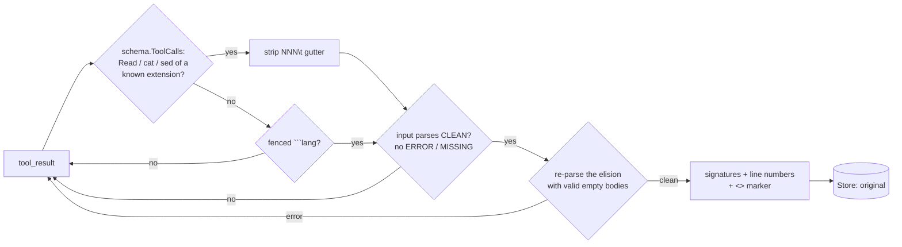

# skeleton

!!! danger "LOCAL ONLY — evaluation only, not enabled anywhere"
    `skeleton` is behind the `cg_skeleton` build tag, is **off by default**, is in **no
    preset**, and stays that way. It cannot have run in production: the tag is not passed
    by `make build`, so the shipped binary does not contain the component at all. It is
    the only component whose loss is *dangerous* rather than merely inconvenient — it
    removes function bodies from source the agent is reading, and an agent cannot tell an
    elided body from an empty one. See [Why this is not enabled](#why-this-is-not-enabled).

!!! info "Offload — lossy, reversible"
    Replaces function/method/constructor bodies with a placeholder, keeping signatures,
    imports, type declarations, decorators and constants; stashes the whole original.

## How it works

`skeleton` parses source with tree-sitter and replaces function/method/constructor
**bodies** with a placeholder, keeping signatures, imports, type declarations,
decorators/annotations, constants, comments and class bodies (so method signatures
survive). It stashes the whole original message, recoverable via the `<<cg:HASH>>`
marker.

It handles two input shapes, because they carry *position* differently:

- **A line-numbered file dump** — what a `Read` tool_result and `cat -n` / `sed -n`
  actually look like, and the shape that carries 70–88% of tool tokens on this box's
  traffic. The producing call is recovered with `schema.ToolCalls`, so the grammar comes
  from the file's **extension** (`Read.file_path`, or the single operand of a
  `cat`/`head`/`tail`/`sed`/`nl` command) — a raw dump carries no language token at all.
  The `NNN\t` gutter is stripped to parse and **restored on every surviving line**, so
  an elided body collapses to *one* gutter-prefixed line naming the range it replaced.
  No newline padding: the numbers, not the physical line count, are the anchor.
- **A fenced ` ```lang ` block.** Nothing else records where a line was, so the
  placeholder re-emits the elided newlines and the block keeps its line **count**.



Grammars: go, python, js/ts/tsx, rust, java, c/cpp, ruby, php, c#, kotlin, swift, scala.

### Build

It is the only cgo component (tree-sitter), so it is gated behind `cg_skeleton` to keep the
default build — and the AuthBridge plugin that embeds this module — pure-Go and static:

```bash
CGO_ENABLED=1 go build -tags cg_skeleton ./cmd/context-guru-proxy   # make build does NOT pass the tag
```

Without the tag it is **not registered**, so a config or preset naming it fails at pipeline
build with `components: unknown component "skeleton"` rather than running without it.

## Before → After

Real output, from `proxy/control.go` as a live `Read` in `bench/long.jsonl`
(29,010 → 12,838 tokens for the whole file):

```
BEFORE                                            AFTER
140  // MountControl registers the control-        140  // MountControl registers the control-
141  // plane routes. Called only in hosted…       141  // plane routes. Called only in hosted…
142  func (h *Handler) MountControl(m *…) {        142  func (h *Handler) MountControl(m *…) { … ⟪cg⟫ 8 lines elided: 142-149 }
143      if h.opts.Tenants == nil {                150
144          return                                151  // gate refuses a request that does not meet
145      }                                         152  // its route's declared scope, before the…
146      for _, rt := range h.ctlRoutes() {        …
147          m.HandleFunc(rt.pattern, …)           160  func (h *Handler) gate(scope ctlScope, …) … { … ⟪cg⟫ 21 lines elided: 160-180 }
148      }                                         181
149  }                                             182  // registry is the control-plane store…
150                                                183  func (h *Handler) registry() *tenant.Registry { … ⟪cg⟫ 6 lines elided: 183-188 }
```

Every surviving line keeps **its own original line number**, and each placeholder names
the range it ate — so a model that wants those 21 lines can ask for `160-180` directly,
and `context_guru_expand` returns the original bytes. Doc comments, imports, constants,
type declarations and signatures are spliced through verbatim.

## Measured, locally, on real traffic

`components/offload/skeleton_measure_test.go`, run against five captures of real Claude
Code / SWE-bench traffic from this box. Tokens are o200k via `internal/tokens`; dollars
price a removed token at **0.209× fresh ($0.6265/MTok)**, because this corpus is 90.54%
`cache_read` — pricing at 1.0× would overstate every figure below by ~4.8×.

```bash
CG_SKEL_CAPTURE=/home/vpcuser/cg-research/bench/long.jsonl CG_SKEL_SAMPLE=1 \
  CGO_ENABLED=1 go test -tags cg_skeleton ./components/offload -run SkeletonCapture -v
```

### The lever, per file dump

Every unique (tool call, output) pair, with a synthetic later read so the newest-read
guard does not mask the size of the mechanism:

| Capture | dump candidates | fire rate | tokens removed | share of ALL tool tokens | $ @ 0.209× |
|---|---|---|---|---|---|
| `bench/long` | 12 (88.4% of tool tokens) | 11/12 = **91.7%** | 58,427 (51.8%) | **44.4%** | $0.0366 |
| `bench/mixed` | 5 (78.9%) | 2/5 = 40.0% | 16,267 (54.5%) | 40.0% | $0.0102 |
| `bench/cold` | 1 (77.3%) | 1/1 = 100% | 9,145 (59.1%) | 45.7% | $0.0057 |
| `bench/short` | 2 (86.2%) | 1/2 = 50.0% | 487 (8.2%) | 2.6% | $0.0003 |
| `prod/bodies` | 64 (70.4%) | 12/64 = 18.8% (Read 8, Bash 4) | 46,136 (**64.6%**) | 14.8% | $0.0289 |

The mechanism works, and it is the biggest deterministic lever in the repo: **52–65% off
a source-file read**, the same lever headroom's `CodeCompressor` and rtk's signature
extraction pull always-on. The v1 fence-only matcher removed **0** from all five.

`prod/bodies`'s low 18.8% fire rate is the parse-clean guard doing its job: 50 of its 64
candidates are `sed -n 'A,Bp'` windows and truncated `head` output — real text from a
real file, but *not a file*, so they do not parse and are left verbatim.

### What a live turn actually gets: zero

The same component, over the largest transcript in each capture rebuilt faithfully
(`rebuildLast`), with the gates a live turn applies:

| Capture | transcript | warm (cache-tail gate) | cold (whole transcript eligible) |
|---|---|---|---|
| `bench/long` | 77 msgs / 73,082 tok | **0 tokens / $0.0000** | **0 tokens / $0.0000** |
| `bench/mixed` | 49 msgs / 48,983 tok | 0 / $0.0000 | 0 / $0.0000 |
| `bench/short` | 15 msgs / 24,301 tok | 0 / $0.0000 | 0 / $0.0000 |
| `bench/cold` | 19 msgs / 27,189 tok | 0 / $0.0000 | 0 / $0.0000 |
| `prod/bodies` | 141 msgs / 148,136 tok | 0 / $0.0000 | 0 / $0.0000 |

**Zero, warm and cold, on every arm.** Not the cache gate — cold removes nothing either.
Two structural causes, one per traffic shape, both from the safety rules and neither
accidental.

On the four bench arms it is this:

> **Every Read in a real transcript is the newest Read of its path.**

`bench/long`'s largest turn contains 9 Reads — 8 of them Go source worth 45,780 tokens —
across 9 *distinct* paths. An agent reads a file once and moves on; it does not re-read.
So `newest_read_of_path` (the rule protecting the file the agent is mid-edit on) declines
9 of 9, and the entire 44.4% lever is gated away. This is the same structural result
`readlifecycle` measured from the other side: `fresh_read` is the dominant class, and it
is exactly the class that must not be touched.

On `prod/bodies` it is the other guard: its largest transcript's 26 file dumps are all
`cat`/`sed -n` windows, and `dump_not_reducible` declines all 26 because a window into a
file is not a file and does not parse cleanly. Zero either way.

### The counterfactual, so the "no" rests on a number

If the newest Read were protected only while it is still near the tail — a guess about
the agent's *attention* rather than a fact about the file, and therefore **not
implemented**:

| Capture | protect within last 20 msgs | last 40 msgs |
|---|---|---|
| `bench/long` | 4 dumps, 17,811 tok = **$0.0112** | 3 dumps, 12,838 tok = $0.0080 |
| `bench/mixed` | 2 dumps, 16,315 tok = $0.0102 | 0 |
| `prod/bodies` | 0 | 0 |

So the *most* a live turn could buy, at the cost of eliding a body from a file the agent
may still be working on, is about **1.1 cents per turn** on the arm where file reads are
88% of tool tokens — and nothing at all on the production capture. That is the whole
prize.

## Risk table

How a skeletonized tool output can mislead a coding agent, and where we stand:

| # | Failure mode | Status | Mechanism |
|---|---|---|---|
| 1 | Elided body can never be recovered | **defended** | `marker_mode: full` only (`summary`/`off` are rejected at config time), and the pass declines outright when the store cannot persist the stash. Round-trip is asserted **byte-for-byte**, not "contains". |
| 2 | Line numbers shift, so a grep hit / stack frame / `sed -n` position points at the wrong line | **defended** | A numbered dump keeps **every surviving line's own `NNN\t` gutter**, and each placeholder names the range it replaced (`8 lines elided: 142-149`). A fenced block, which has no gutter, keeps its physical line count instead. Two tests pin it. |
| 3 | Signatures, imports, types, top-level declarations altered | **defended** | Only body byte ranges from the parse tree are replaced; every other byte is spliced through verbatim. |
| 4 | Agent's own code (user/assistant message) mangled, with no recovery path | **defended** | Only `role: tool` messages are considered. |
| 5 | Double elision / orphaned earlier stash | **defended** | `skipReduce` (existing marker or kept-verbatim) plus no recursion into an elided body. |
| 6 | Expand loop: agent expands, we re-compact, it expands again | **defended** | Kept-verbatim marking on expand. |
| 7 | Rewrite grows the message (marker cost) | **defended** | Marker-inclusive never-worse guard in `tryMark`, per message and per block. |
| 8 | Cache churn: the same read reduces differently on a later turn, or a rewrite lands inside the provider's already-cached prefix | **defended** | Three things. (a) The rewrite is a pure function of (content, grammar, config): the tree walk visits children in ascending order and never descends into a claimed body, so the range list is sorted and disjoint **by construction** — no `sort`, and no map, on the path that produces output bytes. A test re-renders 50× in-process and once in a **separate process with its own map seed** and compares bytes. (b) A *new* elision happens only in the uncached tail (`Ctx.TailOnly` / `MaxCachedIdx`), or at any depth on a provably cold turn under `cold_cache`. (c) A frozen decision is **replayed at any depth** on every later turn, so a message never flips skeleton→full→skeleton. |
| 9 | Malformed / hostile source crashes the proxy | **defended** | Parse failure fails open; `maxParseDepth` bounds the tree walk (a stack overflow is an uncatchable throw). |
| 9a | **Tree-sitter error recovery reports a "block" in text that is not the code it looks like** (a partial `sed -n` window, a grep of a source file, a truncated read) and an unrelated range is deleted | **defended** | The **input must parse with zero ERROR and zero MISSING nodes** or the text is returned unchanged. This is the load-bearing guard and the reason the loose "which command produced this" heuristic is safe; it is what declines 50 of 64 candidates on `prod/bodies`. Same contract as headroom's `CodeAwareCompressor` (`code_compressor.rs:1-40`). |
| 9b | The elision itself is structurally wrong | **defended** | The **output is re-parsed** too. The emitted placeholder is deliberately a syntax error (row 10), so what is re-parsed is the same elision rendered with a language-valid **empty** body (`{}`, or `pass` for Python): "does replacing these ranges with an empty body still yield the same well-formed file?" A grammar with no known empty-body form falls back to the original segment, so for those languages guard 9b degenerates to 9a — a stated limit, not a hidden one. |
| 9c | **The newest Read of a path is elided — the file the agent is mid-edit on** | **defended** | The highest-indexed `Read` of each path is never touched, whatever its size. Checked **before** the frozen-decision replay, because two Reads of a path can carry identical bytes and the freeze is keyed by content hash. Measured consequence: this declines every eligible dump on all four bench arms (see above). |
| 10 | **Agent writes the skeleton back to disk**, stubbing out every body | **partly defended** | The placeholder is a syntax error in every supported language, so a write-back fails loudly at compile/lint. Previously a bare `…` was emitted for suite-style bodies, which is *valid Python* (`Ellipsis`) — a silent stub. Nothing prevents the write itself. |
| 11 | **Agent edits against a body it never saw** | **undefended** | `skeleton` cannot know whether a read precedes an edit. Partial mitigation is external: Claude Code's `Edit` requires an exact `old_string` match, so an edit derived from a skeleton usually fails loudly rather than corrupting. `Write` has no such check. |
| 12 | **A string, constant or error message inside a body is gone** | **undefended** | An agent grepping for `"negative total: %w"` gets a file where it does not appear and may conclude the code does not exist. Pinned by test so this row cannot drift. |
| 13 | **Control flow / call graph inside a body is gone** | **undefended** | Inherent to the technique. "Who calls this?" is unanswerable from a skeleton; the agent must expand. |
| 14 | Blank-line padding removed by a later component, re-breaking line numbers | **undefended** | A downstream blank-run collapser (`collapse`, `agentdiet`) would undo row 2. No preset orders them together, and nothing enforces that. |

Rows 11–14 are why this stays off. They are not implementation defects; they are what
skeletonizing source code *is*.

## What changed in this pass

Reach, and then a great deal of risk reduction:

- **It reaches file dumps at all.** v1 only matched fenced ` ```lang ` blocks; a `Read`
  tool_result is a raw, unfenced, line-numbered dump, which is why v1 removed 0 tokens
  from every capture. The producing call now comes from `schema.ToolCalls`, so the
  grammar is picked from the file **extension** via `treesitter.LangForExt` — including
  `cat`/`head`/`tail`/`sed`/`nl` Bash dumps (4 of the 12 firings on `prod/bodies`).
- **The gutter is handled properly.** Stripped to parse, restored per surviving line, and
  each elision names its line range. A numbered dump needs **no newline padding** at all,
  because the numbers carry position — so the 0.7%-of-saving padding cost from v1 is gone
  on the path that matters.
- **Parse-clean rejection, both directions** (risk rows 9a/9b). Input must parse with no
  ERROR and no MISSING node; the elision is re-parsed with valid empty bodies. This is
  what makes a lossy rewrite of the agent's source survivable, and it is aggressive: it
  declines 50 of 64 candidates on the production capture.
- **The newest Read of a path is never touched** (row 9c), checked before the frozen
  replay.
- **Cache safety, like its siblings.** `Ctx.TailOnly` / `MaxCachedIdx` for new elisions,
  `cold_cache` to lift it on a provably cold turn, `freeze`/`reapplyFrozen` to replay a
  decision at depth, `repairLostFreeze` for a dropped freeze.
- **Gate reasons** (`newest_read_of_path`, `cached_prefix`, `dump_not_reducible`,
  `below_min_tokens`, `not_a_code_dump`, `marker_no_win`, `no_stash`) so a run that
  removes nothing says *why* — which is how the zero above was diagnosed.
- Tests (`-race`, `-tags cg_skeleton`): parse-error rejection on three real shapes,
  round-trip recovery **through the component**, determinism across a process boundary,
  frozen-prefix untouched, newest-Read untouched, gutter/line-number preservation, Bash
  dump selection, plus everything v1 pinned.

Carried over from the previous safety pass: `marker_mode: summary`/`off` rejected at
construction, the pass declining entirely when the store cannot persist, and a
placeholder that is a syntax error in every supported language.

## Why this is not enabled

Not because it is weak. It removes **52–65% of a source-file read**, and file reads are
70–88% of tool tokens on this box — the biggest deterministic lever measured anywhere in
this repo. Two reasons, and the second is new.

**1. What the remaining loss *is*.** Every other lossy component drops output the agent
can re-derive: a masked command output can be re-run, a summarized span can be expanded,
a filtered build log was noise. Skeleton drops **the content the agent's next action is
derived from**. An agent that reads a file, receives a skeleton, and then rewrites that
file has produced a broken commit — and it has no way to notice, because a `{ … }` body
and an empty body look identical to it. Reversibility does not fix that: expansion is
something the model must *choose* to do, and nothing guarantees it knows it needs to.

**2. Made safe, it removes nothing.** The measurement above is the honest verdict.
Condition 1 of the old list — "never the newest read of a file" — is now *implemented*,
and together with the parse-clean guard it declines **100%** of real traffic on all five
captures, warm and cold. Agents read each file once; every Read is the newest Read of its
path. The component is not "off
because we have not finished de-risking it" — the de-risking and the value are the same
knob. Turning it up to where it pays means eliding a body from a file the agent may still
be working on, and the whole prize for doing that is **~1.1¢ per turn** on the most
read-heavy arm and **$0.00** on the production capture.

That is not a trade worth a rare, silent, expensive-to-detect correctness failure. Cost
is recoverable; a corrupted file in a merged PR is not.

### Should it ever be enabled by default?

**No.** Not on the strength of these numbers, and the recommendation is not "not yet" —
it is no, on this traffic shape. The value is real only where the safety rule is not, and
$0.011/turn does not buy a class of failure that ends in a bad commit. The four
conditions below are all still open, and condition 4 in particular has never been run:

1. ~~Applied only to reads the agent has demonstrably finished with, never the newest
   read of a file.~~ **Done — and it is what makes the saving zero.**
2. A read is never skeletonized after the agent has edited, or announced an intent to
   edit, that path in the session. (`readlifecycle` supplies the *stale* signal; skeleton
   does not consume it, because on the measurement above there is nothing left to gain.)
3. The elision is visible enough in-band that the model reliably expands before editing —
   **measured, on a real agent**, not assumed. The line-range placeholder is a real
   improvement here, but improvement is not evidence.
4. An end-to-end coding benchmark (SWE-bench or Terminal-Bench) shows **no** reward
   regression against the same config without it. Never run for this component.

If it were ever enabled, it would be as an explicit opt-in on a `cg_skeleton` binary by
someone who has read this page — never in a preset, and never as a default.

### Does the CGO / build-tag arrangement stay?

**Yes, unchanged — and the measurement makes the question moot.** Tree-sitter *is* a real
advantage over a regex approach: guards 9a and 9b, which are the entire risk argument,
are only expressible against a real parse tree, and rtk's regex signature extraction
cannot make either claim. Nothing here should be traded for a pure-Go fallback.

But the tag is not what is keeping this out of production — the measured $0.00 is. So the
cost of cgo (a C toolchain, ~15 linked grammars, a non-static binary, no AuthBridge
plugin) is being paid by nobody, which is exactly the right outcome for a component that
is off. A pure-Go fallback (regex-recognised signature lines, brace/indent matching for
bodies) would cost the parse-clean guards entirely — no ERROR/MISSING notion exists
without a grammar — which would take this from "safe and worthless" to "unsafe and
worthless". Not worth building.

## Configuration

| Key | Default | Meaning |
|---|---|---|
| `min_tokens` | 80 | Minimum body size (per body) before it is skeletonized. |
| `marker_mode` | `full` | **`full` is the only accepted value.** `summary`/`off` fail at config load — an unrecoverable code elision is not a mode we offer. |
| `cold_cache` | `false` | Allow a new elision at any transcript depth on a turn whose prompt cache has provably expired. Off by default. |

## When it's inert

In practice: **always, on real traffic** — every Read is the newest Read of its path (see
the measurement). Also: a tool output whose producing call is not a file dump of a
supported language, source that does not parse cleanly (a `sed -n` window, a truncated
read, grep output), an elision that would not re-parse, a body below `min_tokens`, a
message inside the provider's cached prefix, a store that cannot persist, and whenever
the skeleton plus its marker would not be smaller than the original.

See also: [Components overview](../components.md) · [mask](mask.md) · [summarize](summarize.md)
