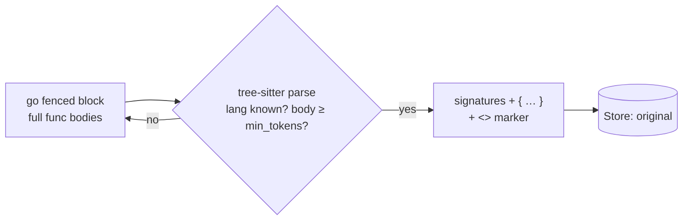

# skeleton

!!! info "Offload — lossy, reversible"
    Replaces function/method/constructor bodies in fenced code blocks with a placeholder, keeping signatures; stashes the whole original.

!!! warning "The one component behind a build tag"
    `skeleton` is the only cgo component (tree-sitter), so it is gated behind
    `cg_skeleton` to keep the default build — and the AuthBridge plugin that embeds this
    module — pure-Go and static. Build it in with
    `CGO_ENABLED=1 go build -tags cg_skeleton ./cmd/context-guru-proxy`; `make build` does
    not pass the tag.

    Without the tag it is **not registered**, so a config or preset naming it fails at
    pipeline build with `components: unknown component "skeleton"` rather than running
    without it. The [`coding` preset](../reference/presets.md) therefore needs a
    `cg_skeleton` binary.

## How it works

`skeleton` parses fenced ` ```lang ` code blocks with tree-sitter and replaces
function/method/constructor **bodies** with a placeholder, keeping signatures, imports, types, and
class bodies (so method signatures survive). It stashes the whole original message, recoverable via
the `<<cg:HASH>>` marker.



Grammars: go, python, js/ts/tsx, rust, java, c/cpp, ruby, php, c#, kotlin, swift, scala.

## Before → After

```
before:  func Add(a, b int) int {          after:  func Add(a, b int) int { … }
             return a + b                           func Sub(a, b int) int { … }
         }                                          <<cg:9f2a…>> [full source: call context_guru_expand]
```

## Lossiness

Lossy but reversible — the full original message is stashed in the Store and recovered via
`context_guru_expand` / `GET /expand`.

## Configuration

| Key | Default | Meaning |
|---|---|---|
| `min_tokens` | 80 | Minimum body size (per body) before it is skeletonized. |

## When it shines

The `coding` preset — the agent reads big source files but mostly needs the shape.

## When it's inert

No fenced blocks, unfenced file reads, unknown language, skeleton not smaller than the body.

See also: [Components overview](../components.md) · [Choose a preset](../how-to/choose-a-preset.md)
