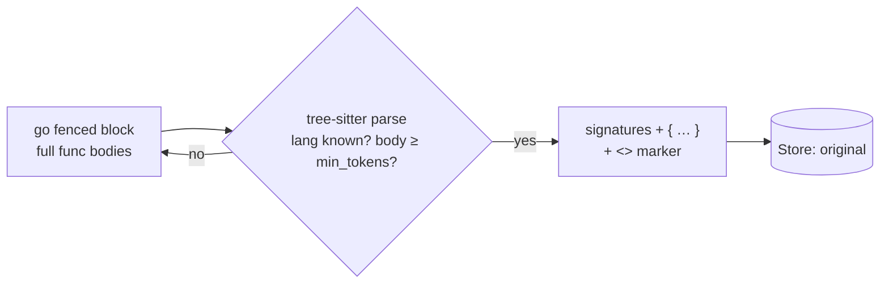

# skeleton

!!! danger "Evaluation only — not enabled anywhere"
    `skeleton` is behind the `cg_skeleton` build tag, is in no default pipeline, and
    stays that way. It is the only component whose loss is *dangerous* rather than
    merely inconvenient: it removes function bodies from source the agent is reading,
    and an agent cannot tell an elided body from an empty one. See
    [Why this is not enabled](#why-this-is-not-enabled).

!!! info "Offload — lossy, reversible"
    Replaces function/method/constructor bodies in fenced code blocks with a placeholder,
    keeping signatures; stashes the whole original.

## How it works

`skeleton` parses fenced ` ```lang ` code blocks with tree-sitter and replaces
function/method/constructor **bodies** with a placeholder, keeping signatures, imports, types, and
class bodies (so method signatures survive). It stashes the whole original message, recoverable via
the `<<cg:HASH>>` marker.



Grammars: go, python, js/ts/tsx, rust, java, c/cpp, ruby, php, c#, kotlin, swift, scala.

### Build

It is the only cgo component (tree-sitter), so it is gated behind `cg_skeleton` to keep the
default build — and the AuthBridge plugin that embeds this module — pure-Go and static:

```bash
CGO_ENABLED=1 go build -tags cg_skeleton ./cmd/context-guru-proxy   # make build does NOT pass the tag
```

Without the tag it is **not registered**, so a config or preset naming it fails at pipeline
build with `components: unknown component "skeleton"` rather than running without it.

## Before → After

```
before:  func Add(a, b int) int {          after:  func Add(a, b int) int { … }
             return a + b                           ⟵ blank: the elided line
         }                                          <<cg:9f2a…>> [full source: call context_guru_expand]
```

The placeholder keeps the body's **line count** (the elided newlines are re-emitted), so
every line after it still sits at its original line number.

## Measured, locally, on real traffic

Replayed against a capture of real Claude Code traffic from this box
(`/tmp/cgtune/capture.jsonl`, 59 requests, 66 distinct tool outputs) with
`components/offload/skeleton_measure_test.go`:

| | Result |
|---|---|
| **As shipped** (fenced ` ```lang ` blocks in tool outputs) | acted on **0 of 66** outputs — **0 tokens removed** |
| Tool outputs containing any fence | 4 of 66, all ` ```bash ` (no grammar) |
| **Headroom** — numbered code reads (16 python, 2 go) | 18 of 66 outputs; 15 skeletonizable |
| Headroom tokens on those reads | 68,680 → 22,310 — **46,370 removed (67.5%)** |
| Headroom as a share of all tool tokens in the capture | **27.6%** |
| Composition of what was removed | 100% function/method bodies (byte ranges from the parse tree; nothing else can be touched) |
| Cost of preserving line numbers | 317 tokens, **0.7% of the saving** |

Two conclusions from that table. First, **the component is inert on real agent
traffic**: Claude Code returns file reads as unfenced, line-numbered text, so the v1
fence-only matcher never sees them. Second, **the mechanism itself is the strongest
deterministic reducer we have** — 67.5% off a source-file read, the same lever
headroom's `CodeCompressor` and rtk's `AggressiveFilter` pull always-on. The gap
between 0% and 27.6% is one matcher, not a better algorithm.

The capture contains **zero Edit/Write tool calls** (it is a read-and-analyse session),
so it cannot bound the read-then-edit failure rate below. That risk is structural, not
measured.

## Risk table

How a skeletonized tool output can mislead a coding agent, and where we stand:

| # | Failure mode | Status | Mechanism |
|---|---|---|---|
| 1 | Elided body can never be recovered | **defended** | `marker_mode: full` only (`summary`/`off` are rejected at config time), and the pass declines outright when the store cannot persist the stash. Round-trip is asserted **byte-for-byte**, not "contains". |
| 2 | Line numbers shift, so a grep hit / stack frame / `sed -n` position points at the wrong line | **defended** | The placeholder re-emits the elided body's newlines; line count is unchanged. Costs 0.7% of the saving. |
| 3 | Signatures, imports, types, top-level declarations altered | **defended** | Only body byte ranges from the parse tree are replaced; every other byte is spliced through verbatim. |
| 4 | Agent's own code (user/assistant message) mangled, with no recovery path | **defended** | Only `role: tool` messages are considered. |
| 5 | Double elision / orphaned earlier stash | **defended** | `skipReduce` (existing marker or kept-verbatim) plus no recursion into an elided body. |
| 6 | Expand loop: agent expands, we re-compact, it expands again | **defended** | Kept-verbatim marking on expand. |
| 7 | Rewrite grows the message (marker cost) | **defended** | Marker-inclusive never-worse guard in `tryMark`, per message and per block. |
| 8 | Cache churn: the same read reduces differently on a later turn | **defended** | `skeletonize` is a pure function of (content, config); a test pins byte-identical output across turns. |
| 9 | Malformed / hostile source crashes the proxy | **defended** | Parse failure fails open; `maxParseDepth` bounds the tree walk (a stack overflow is an uncatchable throw). |
| 10 | **Agent writes the skeleton back to disk**, stubbing out every body | **partly defended** | The placeholder is a syntax error in every supported language, so a write-back fails loudly at compile/lint. Previously a bare `…` was emitted for suite-style bodies, which is *valid Python* (`Ellipsis`) — a silent stub. Nothing prevents the write itself. |
| 11 | **Agent edits against a body it never saw** | **undefended** | `skeleton` cannot know whether a read precedes an edit. Partial mitigation is external: Claude Code's `Edit` requires an exact `old_string` match, so an edit derived from a skeleton usually fails loudly rather than corrupting. `Write` has no such check. |
| 12 | **A string, constant or error message inside a body is gone** | **undefended** | An agent grepping for `"negative total: %w"` gets a file where it does not appear and may conclude the code does not exist. Pinned by test so this row cannot drift. |
| 13 | **Control flow / call graph inside a body is gone** | **undefended** | Inherent to the technique. "Who calls this?" is unanswerable from a skeleton; the agent must expand. |
| 14 | Blank-line padding removed by a later component, re-breaking line numbers | **undefended** | A downstream blank-run collapser (`collapse`, `agentdiet`) would undo row 2. No preset orders them together, and nothing enforces that. |

Rows 11–14 are why this stays off. They are not implementation defects; they are what
skeletonizing source code *is*.

## What changed in this pass

Safety only — no increase in aggression:

- `marker_mode: summary` / `off` are **rejected at construction**. For every other
  offloader an irreversible drop means "the agent must re-fetch"; here it means
  permanently missing code bodies with nothing to expand back.
- The pass **declines entirely** when `effectiveMode` degrades `full` to `off` because
  the store cannot persist. Previously that silently produced unrecoverable elisions.
- The placeholder **preserves line count** and is a **syntax error in every supported
  language** (suite-style bodies previously emitted a bare `…`, valid Python).
- Tests: byte-for-byte expand round-trip, line-count preservation, verbatim
  signatures/imports/types, cross-turn determinism, fail-open on unknown language /
  no fence / unparseable source, refusal without a persisting store.

## Why this is not enabled

Not because it is weak — it removes 67.5% of a source-file read, and that is the
biggest deterministic lever measured on this traffic. Because of what the remaining
loss *is*.

Every other lossy component drops output the agent can re-derive: a masked command
output can be re-run, a summarized span can be expanded, a filtered build log was
noise. Skeleton drops **the content the agent's next action is derived from**. An agent
that reads a file, receives a skeleton, and then rewrites that file has produced a
broken commit — and it has no way to notice, because a `{ … }` body and an empty body
look identical to it. Reversibility does not fix that: expansion is something the model
must *choose* to do, and the model has no signal that it needs to.

So the trade is not "27.6% of tool tokens versus some latency", it is "27.6% of tool
tokens versus a rare, silent, expensive-to-detect correctness failure". Cost is
recoverable; a corrupted file in a merged PR is not.

The build tag stays. `skeleton` is compiled out of the production binary and out of the
AuthBridge plugin, is in no default pipeline, and the safety work above exists so it can
be *evaluated* honestly, not so it can be shipped.

Conditions under which the answer could change — all of them, not any of them:

1. The reduction is applied only to reads the agent has demonstrably finished with
   (age-based, like `mask`), never to the newest read of a file.
2. A read is never skeletonized after the agent has edited, or announced an intent to
   edit, that path in the session.
3. The elision is visible enough in-band that the model reliably expands before
   editing — measured, on a real agent, not assumed.
4. An end-to-end coding benchmark (SWE-bench or Terminal-Bench) shows **no** reward
   regression against the same config without it.

Until 1–4 exist, the honest answer is no.

## Configuration

| Key | Default | Meaning |
|---|---|---|
| `min_tokens` | 80 | Minimum body size (per body) before it is skeletonized. |
| `marker_mode` | `full` | **`full` is the only accepted value.** `summary`/`off` fail at config load — an unrecoverable code elision is not a mode we offer. |

## When it's inert

Unfenced file reads (which is what real agent traffic contains — see the table above),
no fenced blocks, unknown language, store that cannot persist, and whenever the
skeleton plus its marker would not be smaller than the original.

See also: [Components overview](../components.md) · [mask](mask.md) · [summarize](summarize.md)
