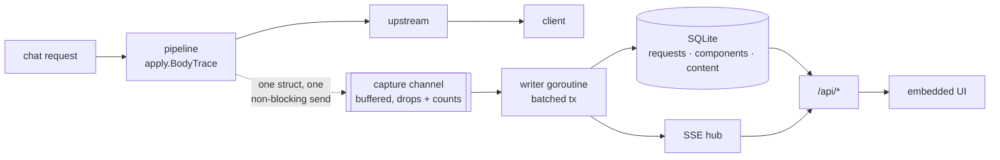

# Dashboard

context-guru ships a **persistent observability dashboard**: an embedded single-page UI
plus a JSON/SSE API, backed by a durable per-request store. It exists to answer one
question honestly — **what value is context-guru providing?** — and to make the answer
falsifiable, including when the answer is "less than you hoped".

```sh
context-guru-proxy --preset codesmart --dashboard
# open http://localhost:4000/dashboard/
```

It is **off by default**. Turning it on adds `/dashboard/` and `/api/*`; every existing
route, including [`/stats`](reference/routes.md), is byte-for-byte unchanged.


!!! info "No CDN, no build step, no network"
    The whole UI is three files (`index.html`, `style.css`, `app.js`) embedded in the
    binary with `go:embed`, served under a `default-src 'self'` CSP. Charts are
    hand-drawn SVG — no chart library, no framework, no npm. The page fetches nothing
    off-origin, so it works in a VPC or fully air-gapped, and a test asserts that.

## What it shows

### Overview

Every headline number, with the honesty machinery visible rather than hidden:

| Group | Fields |
|---|---|
| Volume | requests · sessions · tokens before/after |
| Savings | gross · unique · net-of-restores · overcount ratio |
| Money | baseline cost · actual cost · context-guru's own LLM spend · net dollars saved · **prefix-cache savings** · **total avoided** |
| Tokens billed | fresh input · cache reads · cache writes · output |
| Latency | context-guru added (mean + **p95**) · upstream (mean + p95) |
| Quality | restorations + rate · reverts · not-compacted count |

Three of those deserve their own explanation.

#### Four savings denominators, not one

A single "savings %" is a lie of omission. The dashboard ships four ratios, each
labelled with **what it divides by**, and each carrying that explanation in the payload
itself (`GET /api/stats` → `denominators[].description`):

| Denominator | Question it answers |
|---|---|
| **of what we tried to compact** | Are we good *when we have something to work with?* Divides by the tokens compaction was allowed to touch — the uncached tail when cache-aware. |
| **of new provider-billed input** | The honest economic ratio. Divides by fresh input + cache writes + what we removed, so transcript history the provider served from cache is not recounted. |
| **of the whole request (diluted)** | Kept for transparency. A long session re-sends its history every turn, so this denominator grows quadratically and trends to ~0% however well compaction works. |
| **unique, of the whole request** | The most conservative figure the dashboard can produce. |

The new-input ratio is guarded: with no provider usage data the denominator would be
`saved` alone and the ratio would read ~100%. It reports **n/a** instead.

!!! warning "Read the label on the tile: **Saved (gross)** is not what you saved"
    This is the single most misreadable pair of numbers in the UI, and the gap between
    them is not small — **13.1×** on a real 63-request window, *on the same data*.

    An agent re-sends its whole transcript every turn, so one compaction is counted again
    on every remaining turn. **Saved (gross)** is that cumulative figure — useful for "how
    much re-sent bulk did we keep out of every turn", useless as a savings claim.
    **Saved (unique)** is content that genuinely never reached the provider, and it is the
    only half that can be priced as a cache write.

    The tile's own subtitle says *recounts re-sent history*, and `overcount_ratio`
    (`gross ÷ unique`) sits beside the dollar figure so the inflation is visible rather
    than inferred. Cite the unique figure, or cite gross **with** its ratio.

#### The cost of our own safety mechanisms

Reported next to their benefit, because a compaction proxy that shows only tokens
removed is unfalsifiable:

- **Frozen for cache safety** — compaction deliberately *not* done on the already-cached
  prefix. Its benefit is the cache reads that stayed cheap; its cost is this.
- **Restored after offload** — content we removed and the model asked back for. A
  premature offload, paid for twice.
- **Reverted component runs** — the never-worse guard firing. Safety working, and its
  cost is the latency of the attempt.
- **context-guru's own latency and LLM spend** — paid out of the savings above.

#### Cumulative cost, with and without


The shaded band between the lines is money saved. Baseline prices the **unique** tokens we
removed at the **cache-write** rate they would have entered as — on a prompt-caching
backend that is ~11.5× a cache read — and the re-sent remainder at the **cache-read** rate
the provider would have served it from. That split is the whole reason token savings and
dollar savings diverge so sharply on this workload (see
[the SWE-bench comparison](results/comparison.md)).

Both halves matter, and getting either wrong inflates the headline. `saved_tokens` is
gross: the agent re-sends its transcript every turn, so one compaction is re-counted once
per remaining turn — a 13.1× overcount on the 63-request window that `dash/event.go`
documents. Only `saved_unique` is content that genuinely never reached the provider, and
only that part can be priced as a cache write; the re-sent remainder would have come from
the provider's cache at 1/11.5 the rate. Pricing gross savings as cache writes overstates
net savings by ~9× on the same data, which is why the dashboard puts `overcount_ratio`
right beside the dollar figure.

Beneath it, the **honest savings waterfall**: baseline → compaction savings →
context-guru's own LLM cost → net cost → net savings → prefix-cache savings → total
avoided. If context-guru cost more than it saved, the waterfall says so.

#### Two savings, added and not nested — and one number that is not a saving

There are two different counterfactuals on this page and conflating them is the easiest way
to overstate a dashboard.

**Compaction savings** (`net_saved_usd`) is baseline − actual − our own spend: what content
that never reached the provider would have cost. Its baseline prices the unique removal at
the cache-write rate and the re-sent remainder at the rate *this request actually paid* — the
cache-read rate when its cache hit, and the cache-**write** rate when it missed, because a
request whose cache had expired re-billed the whole prompt and would have re-billed the
removed part with it. On production traffic those expired turns were 4% of requests and 31%
of spend, so valuing their removals as cache reads understated them by ~12×.

**Prefix-cache savings** (`cachesplit_saved_usd`) is the one cache figure this project
claims. The mechanism is specific: Claude Code appends a live environment snapshot (branch,
git status, recent commits) to the **end** of its big system block, and that block is one
cacheable unit whose breakpoint sits *after* the churn — so the provider's hash covers the
snapshot, the prefix never matches across sessions, and every new session re-pays for ~7k
tokens of identical instructions. `cachesplit` splits the block in two and moves the
breakpoint onto the stable half: byte-identical prompt to the model, hash boundary that
excludes the churn.

A request contributes only when **all three** of these are true:

1. the split **actually ran** on it (`split_stable_tokens > 0`), which happens when
   `cachesplit` — or `cacheinject`, which enables the same rewrite — is in the pipeline and
   the request's system prompt really carried a volatile tail;
2. the provider **read at least that much** from cache **while writing less than it**. A hit
   alone is not enough: on the first request after the stable half itself changed (someone
   edited `CLAUDE.md`, the tool list moved) an earlier agent breakpoint still hits, so
   `cache_read > 0` while *our* half is billed as creation on that very request. Neither test
   can isolate our breakpoint from the usage block, so both are blunt and both err towards
   refusing the credit;
3. it was the **session's first request** — the one that would have missed without the split.

The third is the one that matters. Later turns in a session hit the cache whether or not the
tail was ever split, because the snapshot does not change mid-session; crediting them counts
the provider's money as ours. "First" survives a proxy restart (the recency map is seeded from
the database at startup) and is forgotten only once a session has been silent past every cache
TTL — before that, every restart handed out one bonus credit per live conversation.

**The amount is the stable half, not the request's whole `cache_read`.** That correction came
out of running the control arm rather than reasoning about it. Four real Claude Code sessions
through `ete-litellm`, each started after a fresh commit so the snapshot genuinely differed,
first request of each session:

| | `cache_read` | `cache_write` |
|---|---|---|
| cachesplit **on** | 54,304 | 1,063 |
| cachesplit **off** (control) | 45,805 | 9,555 |

The control still **hit**. Claude Code sets several breakpoints and the ones before this block
match whatever we do, so crediting the whole 54,304 would have booked the agent's own cache
placement as ours — a ~9.6× overstatement. What the split moved is the difference: 8,499
tokens, from the write tier to the read tier. The dashboard claims less still: the split's own
measurement of the half it moved (`split_stable_tokens`, 5,654 BPE tokens on that traffic).
The two disagree because they count different things — the provider reports block-granular
usage over a prefix that also gained a block boundary, while ours counts the text — and the
smaller one is what gets billed, because under-crediting is the only safe direction.

The counterfactual is a cache **miss**, not fresh input: those tokens carry `cache_control`,
so a miss bills them as cache *creation* — 1.25× fresh on the Anthropic family — and the next
turn pays again. Hence `split_stable_tokens × (max(cache_write_rate, input_rate) −
cache_read_rate)`, an 11.5×-fresh spread rather than 9×. The `max` floor covers a provider
that charges no write premium, where a miss still costs at least the fresh rate.

On that measured traffic it came to **$0.0099 per new session** — against **$0.0743** for the
provider's whole cache read on the *same request*, and **$0.2258** across the four requests of
the run. That $0.2258 is the number that used to be the headline.

It is a **floor**. A stable prefix serves a whole session while this counts one request of
it, and a session resumed from disk after the TTL expires starts another first-request hit
this cannot see. Under-crediting is the only direction a savings figure is allowed to be
wrong in. The independent evidence that the mechanism works is the A/B: **−34.1% cost, 0% →
96.7% cache hit** with the split on, on the same traffic.

They are **added**, never nested: `total_saved_usd = net_saved_usd + cachesplit_saved_usd`.
Both are ours and the token sets are disjoint.

**`cache_saved_usd` is not a saving of ours and is not on the page.** It is what the
*provider's* prompt cache saved over paying the fresh rate for the same tokens — typically
one to two orders of magnitude larger than the figure above, because the agent places most
breakpoints itself. The API and `cg_tenant_cache_saved_usd` still report it, as a
**diagnostic**: it is the number that collapses when a compaction pipeline rewrites deep
history, so watching it fall is how you catch a pipeline going too deep. It was briefly a
headline tile, alongside a "of which our components acted" subset. Both were removed: the
first measured somebody else's mechanism, and the second measured co-occurrence and read as
cause.

Both real savings are only as good as the per-model rates behind them. On a gateway that does
not charge the public API's prices — IBM's `ete-litellm` bills half of anthropic.com for
`claude-sonnet-5` — set [`MODEL_PRICES`](reference/config.md#per-model-prices-and-why-the-public-map-is-not-enough),
or every figure in this section is wrong by whatever margin your contract differs by.

### Components — which ones earn their place


Runs · acted · act rate · reverted · **unique** saved · **gross** saved · **overcount
ratio** · own latency · avg ms · errors, plus a plain-language verdict. On the real
traffic in that screenshot the verdicts are doing their job: `extract` is *earning its
place*, `cacheinject` *mutates, saves no content* (its win is provider-side and invisible
to content-token counts), and a component that burned wall time for nothing reads
*costly and inert*.

`overcount_ratio` is the number that keeps the rest honest: a ratio of 7× means the
gross figure counted the same compaction seven times as the agent re-sent its transcript.

**Why declined** is the column to read when `act rate` is 0%. It is the component's own gate
counts — `no_filter_match`, `no_obvious_noise`, `below_output_floor` — commonest first, with
the full list on hover, and the same column appears per component in the request drawer.
Without it a table of zeros is unfalsifiable: it looks the same whether the pipeline is
broken, the traffic is uncompactable, or the heuristics were written for a different agent's
tool-output shapes. On a Bob session it is usually the last of those, and it says so.

**LLM calls · LLM cost** are blank for every deterministic component and filled for the ones
that call a model themselves. Where they are filled, the verdict is stated in **dollars**
rather than inferred from tokens and latency: what that component's calls removed, valued at
the rate those tokens would actually have been billed at, minus what the calls cost. Cold-sweep
calls are valued at the cache-write rate and warm ones at the cache-read rate — a ~12.5×
spread, so a component whose calls are mostly cold is judged on the right basis. The value
deliberately counts only what the CALLS removed, not the component's total savings: most of an
extractor's realized value comes from frozen results replayed with no call at all (~93% on
measured traffic), and crediting that replay to the calls would make any amount of spending
look profitable.

### Compaction model calls

Open any request and, if a component made model calls on it, there is a row per call:
candidate size, tokens saved, prompt tokens, cost, **net**, latency, and an outcome —
`accepted`, or `no reduction` with the reason attached (`rejected by the acceptance check`,
`reply truncated at the output cap`, `no usable program or reply`). A `cold sweep` pill marks
calls made on a turn whose prompt cache had expired, and `escalated` marks one that fell back
to the agent's own model because the transcript would not fit the extraction model's window.
Underneath, the before/after of each call as a diff.

This is the only place the cost of an individual compaction call is visible. The request row
carries one rolled-up figure and the components table an aggregate, so before this an expensive
component could be ahead overall while a particular *kind* of call was quietly underwater.

Both halves of the text (before/after, and the model-written summary) are transcript content:
they are stored, and shown, only under the same per-account capture consent that governs the
diff view. The numbers are kept either way — consent is about storing transcripts, and dropping
the cost of a call would leave an account unable to answer the question the record exists for.

### Sessions


Searchable, filterable, paginated. Per session: model · agent · preset · turns · tokens
before/saved · dollars saved · cache reads/writes · restorations · context-guru latency ·
start time. Clicking a session filters the request list to it.

### Requests, and the diff


Server-side filters across every dimension, with **keyset** pagination (a cursor, not an
`OFFSET`, so page 500 costs the same as page 1). Click any row for the detail drawer:


…and, the headline feature, **what context-guru actually did to the wire**:


Git-style hunks with line numbers and collapsed unchanged runs, plus side-by-side and
after-only views. Both reference implementations carry this data and neither renders it.


#### Four views of one diff

Every rewritten message gets a toolbar with four modes — **Before**, **After**, **Inline
diff** (the default) and **Side by side** — and they are four renderings of *one* LCS
result, not four renderers. Sharing the diff output is what keeps the line tints and the
line numbers agreeing between modes. The elided-run markers (`… N unchanged lines …`)
appear in the single-side views too: dropping them made "Before" claim to be the whole
original text while quietly omitting every unchanged run, putting two lines side by side
that are two hundred apart in the real message.

The same block renders in the request drawer and in the whole-session view, so the two
cannot drift into showing the same data two different ways. The session view is **not** a
reconstructed transcript: what is captured is the messages context-guru *rewrote*, not the
conversation around them, so it shows those spans in order and its heading says exactly
that. Stitching a "session before compaction" out of them would be a fabrication wherever
nothing was touched.

#### Nine states, because "empty" is nine different facts

A diff panel with nothing in it is the most misread thing in the UI, so the state is
explicit and named. `GET /api/sessions/{session}/transcript` reports one of:

| State | Means | Can the reader act on it? |
|---|---|---|
| `hot` | Content is local and is in this response. | — |
| `cold` | Archived. Metrics are local and complete; the text is in cold storage. | Yes — press the button. |
| `fetched` | Pulled back out of cold storage on this request. | — |
| `nothing_changed` | Capture is on and context-guru rewrote nothing here. | No — this is a real answer. |
| `not_captured` | Capture is off, so there is nothing to show. | Sometimes — see [who has to act](#capture-needs-two-yeses-and-capture_blocked_by-says-whose-is-missing) below. |
| `not_permitted` | An untrusted address on a single-tenant proxy. | No — not theirs to change. |
| `never_archived` | Asked cold storage for it; it was never uploaded. | No. |
| `unreachable` | Cold storage is down. **The data is safe** — try later. | Yes — retry. |
| `unknown_session` | No such session for this caller. Served with **HTTP 404 and a JSON body** carrying this state, not a bare 404. | No. |

`never_archived` and `unreachable` are kept apart on purpose (`404` against `503` on the
API): conflating "this was never archived" with "the remote is down" makes an outage look
like data loss.

`unknown_session` carries a state like every other answer so a client has **one** branch on
`state` rather than a state machine plus a special case for one status code. It is
**deliberately the same answer** whether the session never existed or belongs to another
tenant: a distinguishable 404 would confirm other people's session ids to anyone willing to
enumerate them.

#### Capture needs two yeses, and `capture_blocked_by` says whose is missing

`not_captured` means "there is nothing stored", not "you forgot to switch something on". Both
the request view and the transcript view report two fields, and the second one exists because
the first cannot say who has to act:

| Field | Meaning |
|---|---|
| `content_captured` | The **effective** decision for the tenant whose rows these are — the operator's service-wide gate **and** that tenant's own consent, read fresh per request. It is no longer the process flag. |
| `capture_blocked_by` | `"operator"`, `"tenant"`, or `""` when nothing is blocking. `""` also for a manager looking at the whole service, who is not a party whose consent there is to report. |

The consequence worth knowing before you debug an empty panel: **capture needs both gates, and
only the operator's is off by default — so a tenant whose own switch is on (the registration
default) still gets nothing until the operator sets `--dashboard-content` /
`DASHBOARD_CONTENT`.** That state reads `content_captured: false` with
`capture_blocked_by: "operator"`, and the UI says so instead of pointing at a setting the
reader has already switched on — which is the bug the field was added to fix. In
single-tenant mode there is no second gate, so the operator flag is the whole decision.

#### Cold storage is never touched on page load

The transcript route is lazy, and that is why it exists as its own route. Without
`?fetch=1` it reads the local database only and reports `cold`; the network happens on
`?fetch=1` and nowhere else — that is, only when a human pressed the button. Otherwise a
session list of 100 rows would fire 100 rclone round trips to render.

Fetching is **read-only**: it does not reinsert the rows. Dragging an archived session back
into the hot tier would re-trigger the eviction that put it there, turning "let me look at
last month" into a write-amplification loop.

### Benchmarks


Point `--dashboard-bench-dirs` at a harness jobs root and every run's `summary.json` +
`rows-<arm>.json` is ingested — no new export format. Per arm: tasks · solved · solve
rate · mean reward · mean steps · total cost · cost per task · **cost per solve** · cache
hit rate · mean wall · exceptions, with a cost-vs-reward scatter and per-task drill-down.

Cost per solve is the number that matters: an arm that spends less by solving fewer tasks
has not saved anything.

Re-ingesting replaces a run rather than duplicating it, so restarting the proxy against a
jobs root is idempotent.

### Configuration


The **resolved** configuration — preset expanded, defaults filled, overrides applied —
not what was typed. Alongside it, the capture pipeline's own health, drop count included.

### Dark mode, small screens, empty states

Dark mode is not a retrofit: the palette is CSS custom properties from line one, and dark
mode redefines only the tokens.


Small viewports reflow; wide tables scroll inside their own container so the page body
never scrolls sideways.

<figure markdown>
  { width="320" }
  <figcaption>390&nbsp;px viewport</figcaption>
</figure>

An empty dashboard reads zero and explains why each panel is blank, rather than
rendering nothing:


## Honest-metrics rules

The dashboard follows five rules. They are the difference between a dashboard and a
marketing surface.

1. **Every ratio names its denominator.** See above.
2. **Gross, unique and adjusted are visibly distinct.** `overcount_ratio` is surfaced,
   not hidden.
3. **The cost of our own safety mechanisms sits beside their benefit.**
4. **`token_accounting` per row: `complete | partial | missing`.** Only `complete` rows
   have all four billed token tiers. A row we cannot price is rendered as *unknown* —
   never as free, and never as exact.
5. **Cache misses are attributed, and a cold start is not a failure.** Buckets:
   `hit · cold_start · ttl_expiry · prefix_change · unknown`. The first request of a
   session, or the first for a given model, has nothing to hit. TTL expiry wins ties
   against a changed prefix — a prefix that changed after the entry had already expired
   was not the cause.

Plus a sixth, which is really rule 0: **"why didn't you compact this?" is a first-class
answer**, not an absence of data. Buckets: `bypassed · no_messages · below_trigger ·
cache_frozen · found_nothing · reverted`, and an empty reason means we did compact.

## Architecture



Four properties, in order of importance:

**Capture is off the hot path.** The handler builds one struct from values the request
path already computed and hands it to a buffered channel with a `default:` branch. When
the channel is full the event is **dropped and counted** — never queued into a growing
backlog, never blocking. Observability cannot add latency to, or fail, a request.

**Measured overhead: no detectable per-request cost, content capture included.** Driving
the real handler over one keep-alive connection with a 24-tool-result transcript and
content capture ON, median of 40 paired requests against the same fake upstream: the
dashboard-on figure lands within noise of dashboard-off (repeatedly a shade *below* it).
The channel send itself is ~175 ns (`go test -bench BenchmarkRecord ./dash`).

The channel-send figure alone would be misleading, so it is not the guard. `finish` is
called from the handler's `defer`, which runs **before the handler returns**, so work placed
there is paid by the next request on a keep-alive connection — by every real agent. The
guard is therefore an end-to-end handler-latency test with content capture on
(`TestDashboardAddsNoRequestLatencyWithContentCapture`, budget 5 ms); moving redaction back
onto the request goroutine measures +87 ms and fails it.

**Redaction happens before the database, never on read.** Request headers are never
captured at all, so nothing redacts them; config keys are allowlisted, and an allowlisted
key's *value* is still checked for an embedded `user:password@` credential; captured content is
scrubbed of credential-shaped strings and size-capped. All of it runs on the writer
goroutine, immediately before the INSERT — off the request path, but still before anything
touches disk. A secret that reaches disk is a secret forever, and a redact-on-read filter
is one forgotten code path from leaking it.

Content is the one surface that **cannot** be allowlisted, because it is arbitrary agent
output. It gets pattern scrubbing, and a pattern denylist is structurally always behind
reality: a review of 22 realistic credential shapes found 11 passing through, the worst
being `Authorization: Bearer <token>`, where the pattern matched the scheme and left the
token in the diff view. Those are fixed and pinned by a table-driven test — but 22/22
passing does not prove completeness, which is why the capture is gated. Two switches, and
they default differently: the **operator's** `--dashboard-content` is process-wide and
defaults **off**, while the **per-tenant** switch behind it is created **on** (a hosted
account is registered with `capture_content: true`). So it is the operator's gate, not the
tenant's, that keeps a new account's source code off disk.

**Percentages at read time, cost at write time.** Every ratio is derived when queried, so
a filter change needs no rebuild; every cost is computed when the row is written, so
history does not silently reprice when a model's published rate changes.

One more, worth stating because it is what we chose *not* to build: **no rollup tables.**
Time series are bucketed in SQL at query time (`ts/bucket*bucket GROUP BY 1`). SQLite
handles millions of rows, and any bucket width works without a migration.

## Storage

SQLite via `modernc.org/sqlite` (pure Go — no C toolchain beyond the one tree-sitter
already requires), in WAL mode.

| Table | Holds |
|---|---|
| `requests` | one row per proxied request: identity, all four token tiers, costs, latencies, attribution, and the request's own **metadata** — reasoning effort, thinking mode and budget, sampling parameters (nullable, so "unset" stays distinct from `0`), `max_tokens`, streaming, `tool_choice`, tool and system-block counts, `cache_control` breakpoints **by location**, and the provider's stop reason. Every client-supplied text field among them passes through the redactor's shape check **before** the insert, like all other captured input |
| `request_components` | one row per component per request — the "which components earn their place" data |
| `request_content` | before/after text, gzip-compressed and size-capped; skippable entirely |
| `archived_sessions` | the cold-storage index — one small row per archived session, local and permanent, so the session list works while the remote is unreachable |
| `tenant_spend` | the month-to-date spend rollup Settings and the manager's roster display; retention and archiving never touch it, so evicting request rows inside the calendar month cannot make the figure under-count. Reported only — each account bills its own provider credential, so there is nothing to cap |
| `bench_runs` / `bench_tasks` | ingested harness runs and their per-task rows |

Timestamps are **epoch milliseconds** everywhere. A formatted locale string cannot be
range-queried, sorted portably, or bucketed; the UI formats in the viewer's locale at
render time.

Retention is bounded by **age and size**: rows older than `--dashboard-retention` are
dropped, then — if the file is still over `--dashboard-max-bytes` — the oldest requests
go until it fits. Age alone cannot bound a burst; size alone silently erases a quiet week.

The schema carries a version. On a mismatch the existing file is **renamed aside**
(`<path>.v<old>.bak`) and a fresh database is created: a dashboard is a derived view, so
discarding history beats refusing to boot, and renaming beats deleting a user's data.

**No-persistence mode:** `--dashboard-db :memory:` keeps everything in RAM. It is also
the automatic fallback when the configured path cannot be opened — the proxy's job is to
proxy, so an unwritable dashboard path logs a warning and degrades rather than failing to
start.

## Access

| Surface | Who can see it |
|---|---|
| Aggregates, series, component and session rollups, request metrics | anyone who can reach the port |
| Per-request **content** (the diff view) | loopback, or an explicit `--dashboard-trusted-cidrs` entry |
| Effective **configuration** | loopback, or a trusted CIDR |

Aggregates are deliberately open: a proxy bound to `0.0.0.0` should still show its own
numbers, and the point of this tool is observability. Content is gated because a
transcript can carry a user's source code. There is **no** "disable observability in
production" switch — for a tool whose value *is* observability, that would be backwards.

### On a hosted instance

The same UI, with a sign-in gate in front of it and four extra tabs. It decides which world
it is in by calling `GET /api/whoami`, which answers **200 in every case** — including "not
signed in" — and returns the account, its tokens and the registration mode in the same
round trip, so the probe and the first data fetch are one request. Detected rather than
compiled in, because a build flag is one more thing to keep in step with the server.

It used to probe by calling `/api/me` and reading its `401`, which worked and also put a red
error in the console of every user on every first load. A question with a legitimate negative
answer should not be asked with an error.

| Tab | Adds |
|---|---|
| **Setup** | The copy-paste base-URL/token blocks, with this deployment's real base URL. |
| **Settings** | Mode, upstream per dialect, component toggles, transcript-capture consent, month-to-date spend (reported, never capped), bound agent keys, tokens. |
| **Archive** | What has moved to cold storage, from the local index; opening one fetches it back read-only. |
| **Tenants** | Manager only: every account with its month-to-date spend, effective configuration and transcript state; read its metrics, disable it, reissue a lost token. No cap to set — each account bills its own provider credential. |

Two access rules differ from the local case, and both are enforced server-side:

- **Transcript capture has two independent switches, and they default differently.** The
  operator's `--dashboard-content` is process-wide and defaults **off**; the per-tenant
  switch behind it is created **on** — a hosted account is registered with
  `capture_content: true`. Either one alone stops the writes, so on a stock install the
  operator's switch is the one holding the line, and opening it starts capturing every account
  that has not turned its own switch off. A tenant clears their consent on **Settings**; an
  operator sets `DASHBOARD_CONTENT=false` for everyone. Whether the operator switch is open on
  a given deployment is a fact about that deployment rather than about this default, so check
  it rather than inferring it from the shipped `false` — `capture_blocked_by` answers it per
  request, from the reader's own side.
  The honest reason it matters is the one above: the redactor is a best-effort denylist, and a
  review of 22 realistic credential shapes found **11 passing through it**. 22-of-22 now
  passing does not prove completeness.
- **A manager sees everyone's metrics and everyone's transcripts.** An explicit owner
  decision: the account selector points the ordinary request drawer and diff view at any
  account. The archive route applies the same rule, so hot and cold cannot disagree.
  Everyone else still reads only their own, whatever they put in `?tenant=`.
- **Three surfaces become manager-only**, because they are not anybody's tenant data:
  the server's effective configuration (`/api/config`, which
  [says so in its own payload](reference/routes.md#the-config-route-serves-the-servers-configuration-not-yours)
  — a tenant's own config comes from the control plane instead), the ingested benchmark runs (`/api/benchmarks` and its task
  rows — the operator's eval history, and `?refresh=1` writes), and the capture pipeline's
  counters. `/api/capture` still answers a tenant, with the one field that is genuinely
  about them: the deployment's operating **mode**, because in observe mode nothing was
  enforced and their dashboard has to say so. The scoping decision is data in the mounted
  route table, and a test walks it and asserts every route's declared scope — which is how
  three unauthenticated routes shipped before it existed.

See [Hosted service](hosted.md) for the rest.

## Configuration

See [Config & environment](reference/config.md) for the full flag table. The short
version:

```sh
context-guru-proxy --preset codesmart \
  --dashboard \
  --dashboard-db /var/lib/context-guru/dashboard.db \
  --dashboard-retention 168h \
  --dashboard-max-bytes 1073741824 \
  --dashboard-bench-dirs /var/lib/context-guru/benchruns \
  --dashboard-trusted-cidrs 10.0.0.0/8
```

Every flag has an environment equivalent (`DASHBOARD`, `DASHBOARD_DB`, …) for container
deployments.

## API

See [Routes & headers](reference/routes.md) for the full list. All of it is plain JSON
plus one SSE stream, so the dashboard is not the only possible consumer:

```sh
curl -s localhost:4000/api/stats | jq '.denominators[] | {label, percent, available}'
curl -s 'localhost:4000/api/requests?component=extract&reason=compacted&limit=20'
curl -s 'localhost:4000/api/series?bucket=300000&since=1786300000000'
curl -N  localhost:4000/api/events        # live summary rows over SSE
```

## Verifying it yourself

```sh
CGO_ENABLED=1 go test ./dash/ ./proxy/           # unit + integration
CGO_ENABLED=1 go test -race ./dash/ ./proxy/     # capture path + SSE hub
CGO_ENABLED=1 go test -bench BenchmarkRecord ./dash/   # the overhead number
```

The UI itself is regression-tested two ways: a Go test asserts every stat tile's
`data-testid` exists (and that `app.js` parses — a dropped paren renders a blank page
that no Go test would otherwise catch), and a browser check drives the rendered app
end to end. See [Measure savings](how-to/measure-savings.md) for the workflow.
