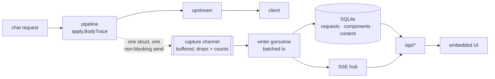

# Dashboard

context-guru ships a **persistent observability dashboard**: an embedded single-page UI
plus a JSON/SSE API, backed by a durable per-request store. It exists to answer one
question honestly — **what value is context-guru providing?** — and to make the answer
falsifiable, including when the answer is "less than you hoped".

```sh
context-guru-proxy --preset codesmart --dashboard
# open http://localhost:4000/dashboard/
```

It is **off by default**. Turning it on adds `/dashboard/` and `/api/*`; every existing
route, including [`/stats`](reference/routes.md), is byte-for-byte unchanged.


!!! info "No CDN, no build step, no network"
    The whole UI is three files (`index.html`, `style.css`, `app.js`) embedded in the
    binary with `go:embed`, served under a `default-src 'self'` CSP. Charts are
    hand-drawn SVG — no chart library, no framework, no npm. The page fetches nothing
    off-origin, so it works in a VPC or fully air-gapped, and a test asserts that.

## What it shows

### Overview

Every headline number, with the honesty machinery visible rather than hidden:

| Group | Fields |
|---|---|
| Volume | requests · sessions · tokens before/after |
| Savings | gross · unique · net-of-restores · **each reduction re-earned** (was "overcount ratio") |
| Amortization | **replay realized · replay ceiling · % of ceiling** |
| Money | baseline cost · actual cost · context-guru's own LLM spend · net dollars saved · **prefix-cache savings** · **total avoided** |
| Addressable spend | **addressable (input-side) spend · saved as % of it · output-token cost · reconciliation against the bill** |
| Tokens billed | fresh input · cache reads · cache writes · output — each **with what that tier cost** |
| Latency | context-guru added (mean + **p95**) · upstream (mean + p95) |
| Quality | restorations + rate · reverts · not-compacted count |

The headline row carries **prefix-change exposure** beside the savings, at the same weight.
See [What the value pass changed](#what-the-value-pass-changed) for which numbers changed
meaning and why.

Three of those deserve their own explanation.

#### Four savings denominators, not one

A single "savings %" is a lie of omission. The dashboard ships four ratios, each
labelled with **what it divides by**, and each carrying that explanation in the payload
itself (`GET /api/stats` → `denominators[].description`):

| Denominator | Question it answers |
|---|---|
| **gross, of what we tried to compact** | Are we good *when we have something to work with?* Divides by the tokens compaction was allowed to touch — the uncached tail when cache-aware. **Gross** over attempted, because `attempted_tokens` is re-counted every turn and a numerator deduplicated *across* turns is a different basis. It used to divide `saved_unique` by it, which made this bar 13× too small: 0.140% where the same-basis figure on the same corpus is **1.838%**. |
| **of new provider-billed input** | The honest economic ratio. Divides by fresh input + cache writes + what we removed, so transcript history the provider served from cache is not recounted. |
| **of the whole request (diluted)** | Kept for transparency. A long session re-sends its history every turn, so this denominator grows quadratically and trends to ~0% however well compaction works. |
| **unique, of the whole request** | The most conservative figure the dashboard can produce. |

The new-input ratio is guarded: with no provider usage data the denominator would be
`saved` alone and the ratio would read ~100%. It reports **n/a** instead.

!!! warning "Read the label on the tile: **Saved (gross)** is not what you saved"
    This is the single most misreadable pair of numbers in the UI, and the gap between
    them is not small — **13.1×** on a real 63-request window, *on the same data*.

    An agent re-sends its whole transcript every turn, so one compaction is counted again
    on every remaining turn. **Saved (gross)** is that cumulative figure — useful for "how
    much re-sent bulk did we keep out of every turn", useless as a savings claim.
    **Saved (unique)** is content that genuinely never reached the provider, and it is the
    only half that can be priced as a cache write.

    The tile's own subtitle says *recounts re-sent history*, and `overcount_ratio`
    (`gross ÷ unique`) sits beside the dollar figure so the inflation is visible rather
    than inferred. Cite the unique figure, or cite gross **with** its ratio.

#### The cost of our own safety mechanisms

Reported next to their benefit, because a compaction proxy that shows only tokens
removed is unfalsifiable:

- **Frozen for cache safety** — compaction deliberately *not* done on the already-cached
  prefix. Its benefit is the cache reads that stayed cheap; its cost is this.
- **Restored after offload** — content we removed and the model asked back for. A
  premature offload, paid for twice.
- **Reverted component runs** — the never-worse guard firing. Safety working, and its
  cost is the latency of the attempt.
- **context-guru's own latency and LLM spend** — paid out of the savings above.

#### Cumulative net saving


This panel plots the **difference** — baseline − billed − our own model spend, accumulated —
and not the two cost curves it is the difference of. It used to plot both and call the area
between them the money; on real traffic they are a few tenths of a percent apart, so there was
no visible area and the caption described something the chart could not show. The saving on its
own axis starts at zero, so the scale of the plot is the scale of the money, and the crossing
below zero — our own spend overtaking what compaction avoided — is impossible to miss. The two
cost totals are still tiles, where a number that differs in the third decimal belongs.

Baseline prices the **unique** tokens we
removed at the **cache-write** rate they would have entered as — on a prompt-caching
backend that is ~11.5× a cache read — and the re-sent remainder at the **cache-read** rate
the provider would have served it from. That split is the whole reason token savings and
dollar savings diverge so sharply on this workload (see
[the SWE-bench comparison](results/comparison.md)).

Both halves matter, and getting either wrong inflates the headline. `saved_tokens` is
gross: the agent re-sends its transcript every turn, so one compaction is re-counted once
per remaining turn — a 13.1× overcount on the 63-request window that `dash/event.go`
documents. Only `saved_unique` is content that genuinely never reached the provider, and
only that part can be priced as a cache write; the re-sent remainder would have come from
the provider's cache at 1/11.5 the rate. Pricing gross savings as cache writes overstates
net savings by ~9× on the same data, which is why the dashboard puts `overcount_ratio`
right beside the dollar figure.

Beneath it, the **honest savings waterfall**: baseline → compaction savings →
context-guru's own LLM cost → net cost → net savings → prefix-cache savings → total
avoided. If context-guru cost more than it saved, the waterfall says so.

#### Two savings, added and not nested — and one number that is not a saving

There are two different counterfactuals on this page and conflating them is the easiest way
to overstate a dashboard.

**Compaction savings** (`net_saved_usd`) is baseline − actual − our own spend: what content
that never reached the provider would have cost. Its baseline prices the unique removal at
the cache-write rate and the re-sent remainder at the rate *this request actually paid* — the
cache-read rate when its cache hit, and the cache-**write** rate when it missed, because a
request whose cache had expired re-billed the whole prompt and would have re-billed the
removed part with it. On production traffic those expired turns were 4% of requests and 31%
of spend, so valuing their removals as cache reads understated them by ~12×.

**Prefix-cache savings** (`cachesplit_saved_usd`) is the one cache figure this project
claims. The mechanism is specific: Claude Code appends a live environment snapshot (branch,
git status, recent commits) to the **end** of its big system block, and that block is one
cacheable unit whose breakpoint sits *after* the churn — so the provider's hash covers the
snapshot, the prefix never matches across sessions, and every new session re-pays for ~7k
tokens of identical instructions. `cachesplit` splits the block in two and moves the
breakpoint onto the stable half: byte-identical prompt to the model, hash boundary that
excludes the churn.

A request contributes only when **all** of these hold:

1. the split **actually ran** on it (`split_stable_tokens > 0`), which happens when
   `cachesplit` — or `cacheinject`, which enables the same rewrite — is in the pipeline and
   the request's system prompt really carried a volatile tail;
2. the **snapshot moved** since this session's previous request (`split_tail_hash` differs; a
   session's first request counts as moved, there was nothing to match). This is the condition
   that makes the hit *ours*: with the block unsplit a moved snapshot re-creates the whole
   thing, while a tail that did not move would have been served from cache either way;
3. the provider **read at least the stable half** from cache **while writing less than it** —
   on the first request after the stable half itself changed, an earlier agent breakpoint still
   hits while our half is billed as creation.

Condition 2 replaced "it was the session's first request", which sounded conservative and was
simply wrong about how this traffic behaves — see the measurement below.

**The amount is the stable half**, not the request's whole `cache_read`. From the control arm:

| first request of a new session | `cache_read` | `cache_write` |
|---|---|---|
| cachesplit **on** | 54,304 | ~1,050 |
| cachesplit **off** | 45,805 | ~9,560 |

The control still **hit** — Claude Code sets several breakpoints and the ones before this block
match whatever we do — so crediting the whole read would have booked the agent's own cache
placement as ours, **7.5× in dollars**. The counterfactual is a cache *miss*, not fresh input,
because those tokens carry `cache_control`: hence
`split_stable_tokens × (max(cache_write_rate, input_rate) − cache_read_rate)`, an 11.5×-fresh
spread rather than 9×.

#### What it is actually worth here, and why that is small

Measured on this deployment: **$0.0298 across 1,127 sessions / 11,361 requests.** That is a real
number, not a placeholder, and three independent measurements explain it:

* **The snapshot is captured once per session.** A nine-turn session in which the agent created
  and committed four files produced **one distinct `split_tail_hash`** — Claude Code does not
  refresh the environment block mid-session, even after commits. So within a session there is
  nothing for the split to protect, and every turn after the first hits regardless.
* **Session starts are almost always cold.** 1,105 of 1,127 first requests read **zero** tokens
  from cache: the previous session's prefix had expired under the provider's 5-minute TTL before
  the next session began. Only **9** session starts had a warm prefix to hit at all.
* **On those 9 it works exactly as designed** — 3 qualified and each earned ~$0.010, matching
  the controlled measurement above to the cent.

So the component is not broken and the figure is not a bug: the mechanism needs a *second
session inside five minutes*, and humans do not work that way. The SWE-bench A/B that measured
**−34.1% cost, 0% → 96.7% hit** ran tasks back-to-back inside the TTL, which is precisely the
regime where this pays — and is why the benchmark result and the production result differ by
three orders of magnitude without either being wrong.

The three counts behind the dollar figure are on the page for exactly this reason (**Prefix
split**: requests it ran on · snapshot had moved · served from cache). A small saving with no
counts beside it is indistinguishable from a broken component; that is not hypothetical, it is
what happened while the figure was gated on the session's first request and read ~$0.

**The pre-instrumentation window is valued on read, never stored.** The two facts the live
figure needs — the size of the half the split moved and the identity of the tail it moved off —
are recorded per request only since the instrumentation shipped, so every earlier row prices at
$0.00, which on the page is indistinguishable from "the component did nothing". So the API
computes a second figure, `cachesplit_historical`, over exactly those rows, and the tile
**Before we recorded it** shows it. Nothing in history is rewritten: it is recomputed from the
stored rows on every query.

What makes that legitimate rather than a guess is that the stable half is a property of the
*agent's system prompt*, not of the request, and it is measurably constant — per model on this
deployment the recorded minimum and maximum are the same number. `DB.CachesplitSizeSpread`
reports both so that gets checked rather than assumed. Three limits, all under-crediting: only
the session's **first** request (a mid-session credit needs the tail hash those rows lack), only
models whose stable half was actually measured (no median stands in for a model nobody has run),
and the same read/write test as the live path. It is therefore a floor on a floor. In Grafana it
is `cg_tenant_cachesplit_historical_usd`, and the *Prefix-cache saved this month* stat adds it to
the measured one.

**For some accounts it does nothing at all**, and the counts say so. Three of this deployment's
larger accounts have `cachesplit` running on 125, 1,035 and 1,972 requests and **acting on none
of them** — their system prompt carries no volatile tail for it to split, either because the big
block is under the 1,024-token floor or because it does not contain one of the snapshot markers
(`Recent commits:`, `Current branch: `, `gitStatus:`, `Here is a snapshot of the current
directory`). Agents run outside a git repository are the common case. "Requests it acted on: 0"
beside a nonzero run count on the Components tab is that situation: a fact about the prompt, not
a fault.

This is version-dependent. If a future Claude Code refreshes its environment block mid-session,
condition 2 starts matching many more turns and the figure rises on its own — which is the point
of measuring the tail rather than assuming it.

It is a **floor**. A stable prefix serves a whole session while this counts one request of
it, and a session resumed from disk after the TTL expires starts another first-request hit
this cannot see. Under-crediting is the only direction a savings figure is allowed to be
wrong in. The independent evidence that the mechanism works is the A/B: **−34.1% cost, 0% →
96.7% cache hit** with the split on, on the same traffic.

They are **added**, never nested: `total_saved_usd = net_saved_usd + cachesplit_saved_usd`.
Both are ours and the token sets are disjoint.

Every figure above is a *difference against a baseline*. The number on the invoice is separate
and now has its own Grafana stat, **Total cost of all requests**
(`cg_tenant_total_cost_usd` = `cg_tenant_cost_usd` + `cg_tenant_cg_llm_cost_usd`): the provider's
billed cost for the traffic plus context-guru's own compaction-model spend, with no
counterfactual in it. A deployment where the second term is a large fraction of the first is
paying too much to compact, and the Components tab says which component.

`cg_llm_cost_usd` is priced at the **compaction model's** own rate. It used to be priced at the
agent's rate, on the theory that a cheap model was "close enough" and that over-reporting our
own cost was the safe direction. It is not safe in either direction: on this deployment's rate
card opus is 4.75x haiku, so a sweep that really spent $0.21 of haiku reported $1.02, which was
enough to make a configuration that pays read as one that loses money — and this is the number
someone uses to decide whether to run the component at all. The model is taken from the calls
themselves; a request whose compaction mixed several models falls back to the agent's rate,
because no single rate is honest for it.

**`cache_saved_usd` is not a saving of ours and is not on the page.** It is what the
*provider's* prompt cache saved over paying the fresh rate for the same tokens — typically
one to two orders of magnitude larger than the figure above, because the agent places most
breakpoints itself. The API and `cg_tenant_cache_saved_usd` still report it, as a
**diagnostic**: it is the number that collapses when a compaction pipeline rewrites deep
history, so watching it fall is how you catch a pipeline going too deep. It was briefly a
headline tile, alongside a "of which our components acted" subset. Both were removed: the
first measured somebody else's mechanism, and the second measured co-occurrence and read as
cause.

**`prefix_change_cost_usd` is a second diagnostic, and it is bigger than every saving here.**
It sums the cost of requests whose cache missed with reason `prefix_change` *and* whose previous
turn in the same session had a component that mutated the transcript — the population where "we
rewrote history and the next turn re-billed the whole prompt" is a live hypothesis. On the
current corpus that is roughly **$24**, and **+$39** on transcripts past 60k tokens. It is
reported because a number that large may not be invisible, and it is **not subtracted from
net**, because mutation is not randomly assigned: components act where there is something to
act on, which are also the long, churny turns most likely to break a prefix on their own, and
`prefix_change` already loses ties to `ttl_expiry`. Settling it needs the A/B, not a bigger
query.

Both real savings are only as good as the per-model rates behind them. On a gateway that does
not charge the public API's prices — IBM's `ete-litellm` bills half of anthropic.com for
`claude-sonnet-5` — set [`MODEL_PRICES`](reference/config.md#per-model-prices-and-why-the-public-map-is-not-enough),
or every figure in this section is wrong by whatever margin your contract differs by.

### Components — which ones earn their place


Runs · acted · act rate · reverted · **unique** saved · **gross** saved · **overcount
ratio** · own latency · avg ms · errors, plus a plain-language verdict. On the real
traffic in that screenshot the verdicts are doing their job: `extract` is *earning its
place*, `cacheinject` *mutates, saves no content* (its win is provider-side and invisible
to content-token counts), and a component that burned wall time for nothing reads
*costly and inert*.

`overcount_ratio` is the number that keeps the rest honest: a ratio of 7× means the
gross figure counted the same compaction seven times as the agent re-sent its transcript.

**Why declined** is the column to read when `act rate` is 0%. It is the component's own gate
counts — `no_filter_match`, `no_obvious_noise`, `below_output_floor` — commonest first, with
the full list on hover, and the same column appears per component in the request drawer.
Without it a table of zeros is unfalsifiable: it looks the same whether the pipeline is
broken, the traffic is uncompactable, or the heuristics were written for a different agent's
tool-output shapes. On a Bob session it is usually the last of those, and it says so.

**Saved · LLM cost · net** is the per-component verdict, in dollars, and no bare cost is
rendered without it. `saved_usd` is that component's share of the request-level
counterfactual, priced **at write time from the request's own model** and at the tier the
request itself paid:

```
saved_usd(c,r) = u·W + (g − u)·tier(r)
```

where `g` is what the component removed on that turn, `u = min(unique, g)` is the
part that had never been sent before, `W` is the cache-creation rate, and `tier(r)` is the
cache-read rate on a turn that hit, the creation rate on a turn whose cache had expired and
whose whole prompt was re-billed, and the fresh rate on a backend with no cache. It is the same
rule and the same rates as the request-level baseline, so the per-component figures **sum** to
it — a unit fixture reconciles exactly, and production data to 0.9%. `net_usd` is
`saved_usd − llm_cost_usd`, and it is **negative when the component is underwater**, which is
a real outcome the page shows rather than hides.

Summing over a component's turns *is* the amortization: value realized turn by turn as a frozen
reduction replays, not a projection from one turn. That matters because most of an extractor's
realized value comes from replay with no call at all (~93% on measured traffic) — so a single
warm turn with one call sits near break-even by construction, and a verdict read off one turn
is not a verdict. Sessions still inside a provider cache TTL carry `in_flight` for exactly this
reason (see [Sessions](#sessions)).

Replay is priced at the cached rate on a warm turn deliberately: it is content removed on an
*earlier* turn that now sits deep inside the cached prefix, where the read rate is correct.
Re-pricing it fresh — which the cache-aware argument tempts you into, since compaction only
touches the *uncached tail* — confuses it with the unique term, which is already priced as a
write, and inflates warm-turn savings roughly 6× with nothing behind it.

**LLM calls · LLM cost** are blank for every deterministic component and filled for the ones
that call a model themselves. `llm_saved_tokens` counts only what the CALLS removed, which is
why it is not the same as the component's `saved_usd`: cold-sweep calls are valued at the
cache-write rate and warm ones at the cache-read rate — a ~12.5× spread, so a component whose
calls are mostly cold is judged on the right basis.

### Compaction model calls

Open any request and, if a component made model calls on it, there is a row per call:
candidate size, tokens saved, prompt tokens, cost, **net**, latency, and an outcome —
`accepted`, or `no reduction` with the reason attached (`rejected by the acceptance check`,
`reply truncated at the output cap`, `no usable program or reply`). A `cold sweep` pill marks
calls made on a turn whose prompt cache had expired, and `escalated` marks one that fell back
to the agent's own model because the transcript would not fit the extraction model's window.
Underneath, the before/after of each call as a diff.

This is the only place the cost of an individual compaction call is visible. The request row
carries one rolled-up figure and the components table an aggregate, so before this an expensive
component could be ahead overall while a particular *kind* of call was quietly underwater.

Both halves of the text (before/after, and the model-written summary) are transcript content:
they are stored, and shown, only under the same per-account capture consent that governs the
diff view. The numbers are kept either way — consent is about storing transcripts, and dropping
the cost of a call would leave an account unable to answer the question the record exists for.

### Sessions


Searchable, filterable, paginated. Per session: model · agent · preset · turns · tokens
before/saved · dollars saved · cache reads/writes · restorations · context-guru latency ·
start time. Clicking a session filters the request list to it.

`in_flight` marks a session whose last request is still inside one provider cache TTL. Its
dollar figures are an **incomplete amortization, not a verdict**: the next turn may replay the
same reduction and add to its value, so a young session with one extraction call reads
underwater and stops reading underwater as the turns come in. It is derived from the session's
`MAX(ts)`, not stored — nothing about it is a fact about a request.

### Requests, and the diff


Server-side filters across every dimension, with **keyset** pagination (a cursor, not an
`OFFSET`, so page 500 costs the same as page 1). Click any row for the detail drawer:


…and, the headline feature, **what context-guru actually did to the wire**:


Git-style hunks with line numbers and collapsed unchanged runs, plus side-by-side and
after-only views. Both reference implementations carry this data and neither renders it.


#### Four views of one diff

Every rewritten message gets a toolbar with four modes — **Before**, **After**, **Inline
diff** (the default) and **Side by side** — and they are four renderings of *one* LCS
result, not four renderers. Sharing the diff output is what keeps the line tints and the
line numbers agreeing between modes. The elided-run markers (`… N unchanged lines …`)
appear in the single-side views too: dropping them made "Before" claim to be the whole
original text while quietly omitting every unchanged run, putting two lines side by side
that are two hundred apart in the real message.

The same block renders in the request drawer and in the whole-session view, so the two
cannot drift into showing the same data two different ways. The session view is **not** a
reconstructed transcript: what is captured is the messages context-guru *rewrote*, not the
conversation around them, so it shows those spans in order and its heading says exactly
that. Stitching a "session before compaction" out of them would be a fabrication wherever
nothing was touched.

#### Nine states, because "empty" is nine different facts

A diff panel with nothing in it is the most misread thing in the UI, so the state is
explicit and named. `GET /api/sessions/{session}/transcript` reports one of:

| State | Means | Can the reader act on it? |
|---|---|---|
| `hot` | Content is local and is in this response. | — |
| `cold` | Archived. Metrics are local and complete; the text is in cold storage. | Yes — press the button. |
| `fetched` | Pulled back out of cold storage on this request. | — |
| `nothing_changed` | Capture is on and context-guru rewrote nothing here. | No — this is a real answer. |
| `not_captured` | Capture is off, so there is nothing to show. | Sometimes — see [who has to act](#capture-needs-two-yeses-and-capture_blocked_by-says-whose-is-missing) below. |
| `not_permitted` | An untrusted address on a single-tenant proxy. | No — not theirs to change. |
| `never_archived` | Asked cold storage for it; it was never uploaded. | No. |
| `unreachable` | Cold storage is down. **The data is safe** — try later. | Yes — retry. |
| `unknown_session` | No such session for this caller. Served with **HTTP 404 and a JSON body** carrying this state, not a bare 404. | No. |

`never_archived` and `unreachable` are kept apart on purpose (`404` against `503` on the
API): conflating "this was never archived" with "the remote is down" makes an outage look
like data loss.

`unknown_session` carries a state like every other answer so a client has **one** branch on
`state` rather than a state machine plus a special case for one status code. It is
**deliberately the same answer** whether the session never existed or belongs to another
tenant: a distinguishable 404 would confirm other people's session ids to anyone willing to
enumerate them.

#### Capture needs two yeses, and `capture_blocked_by` says whose is missing

`not_captured` means "there is nothing stored", not "you forgot to switch something on". Both
the request view and the transcript view report two fields, and the second one exists because
the first cannot say who has to act:

| Field | Meaning |
|---|---|
| `content_captured` | The **effective** decision for the tenant whose rows these are — the operator's service-wide gate **and** that tenant's own consent, read fresh per request. It is no longer the process flag. |
| `capture_blocked_by` | `"operator"`, `"tenant"`, or `""` when nothing is blocking. `""` also for a manager looking at the whole service, who is not a party whose consent there is to report. |

The consequence worth knowing before you debug an empty panel: **capture needs both gates, and
only the operator's is off by default — so a tenant whose own switch is on (the registration
default) still gets nothing until the operator sets `--dashboard-content` /
`DASHBOARD_CONTENT`.** That state reads `content_captured: false` with
`capture_blocked_by: "operator"`, and the UI says so instead of pointing at a setting the
reader has already switched on — which is the bug the field was added to fix. In
single-tenant mode there is no second gate, so the operator flag is the whole decision.

#### Cold storage is never touched on page load

The transcript route is lazy, and that is why it exists as its own route. Without
`?fetch=1` it reads the local database only and reports `cold`; the network happens on
`?fetch=1` and nowhere else — that is, only when a human pressed the button. Otherwise a
session list of 100 rows would fire 100 rclone round trips to render.

Fetching is **read-only**: it does not reinsert the rows. Dragging an archived session back
into the hot tier would re-trigger the eviction that put it there, turning "let me look at
last month" into a write-amplification loop.

### Benchmarks


Point `--dashboard-bench-dirs` at a harness jobs root and every run's `summary.json` +
`rows-<arm>.json` is ingested — no new export format. Per arm: tasks · solved · solve
rate · mean reward · mean steps · total cost · cost per task · **cost per solve** · cache
hit rate · mean wall · exceptions, with a cost-vs-reward scatter and per-task drill-down.

Cost per solve is the number that matters: an arm that spends less by solving fewer tasks
has not saved anything.

Re-ingesting replaces a run rather than duplicating it, so restarting the proxy against a
jobs root is idempotent.

### Configuration


The **resolved** configuration — preset expanded, defaults filled, overrides applied —
not what was typed. Alongside it, the capture pipeline's own health, drop count included.

### Dark mode, small screens, empty states

Dark mode is not a retrofit: the palette is CSS custom properties from line one, and dark
mode redefines only the tokens.


Small viewports reflow; wide tables scroll inside their own container so the page body
never scrolls sideways.

<figure markdown>
  { width="320" }
  <figcaption>390&nbsp;px viewport</figcaption>
</figure>

An empty dashboard reads zero and explains why each panel is blank, rather than
rendering nothing:


## Honest-metrics rules

The dashboard follows five rules. They are the difference between a dashboard and a
marketing surface.

1. **Every ratio names its denominator.** See above.
2. **Gross, unique and adjusted are visibly distinct.** `overcount_ratio` is surfaced,
   not hidden.
3. **The cost of our own safety mechanisms sits beside their benefit — as a number.**
   The freeze's benefit was prose for a long time; it is now priced (`frozen_read_usd`,
   `frozen_write_risk_usd`), and reads *unpriced* rather than *zero* where no rates exist.
4. **`token_accounting` per row: `complete | partial | missing`.** Only `complete` rows
   have all four billed token tiers. A row we cannot price is rendered as *unknown* —
   never as free, and never as exact.
5. **Cache misses are attributed, and a cold start is not a failure.** Buckets:
   `hit · cold_start · ttl_expiry · prefix_change · unknown`. The first request of a
   session, or the first for a given model, has nothing to hit. TTL expiry wins ties
   against a changed prefix — a prefix that changed after the entry had already expired
   was not the cause.

Plus a sixth, which is really rule 0: **"why didn't you compact this?" is a first-class
answer**, not an absence of data. Buckets: `bypassed · no_messages · no_tool_output ·
no_candidate · cache_frozen · found_nothing · reverted`, and an empty reason means we did
compact.

`no_tool_output` and `no_candidate` replace **`below_trigger`**, which was a wrong label rather
than a wrong number. `components.Trigger` is not consulted in that decision at all — the
condition is simply "no component mutated anything" — and of the eight components in the default
preset only `extract_llm` ever calls `Trigger.Fires`. The label was believed: it was reported
upward as *"$744.62 of spend was gated by the trigger"*, and an agent spent a full investigation
tuning triggers whose measured counterfactual on interactive traffic was **$0.00**. The real
cause is structural — every deployed offloader and both JSON reformatters rewrite `role == tool`
content and nothing else, so a request carrying no tool output has nothing any of them can act
on, whatever a trigger would have said. Measured over the 7,660 affected requests: 4,199 of them
(206.9M tokens, 54.3% of the gated total) carry four messages or fewer and so hold no
`tool_result` at all, the largest group being 734 `claude-cli` requests averaging 120,245 tokens
with **one** message and **zero** tools — Claude Code's own summarisation call, which flattens
the transcript into a single user text block. The rest are long transcripts 65–89% frozen whose
eligible tail holds no recognised candidate. Rows written before the rename keep the old slug and
are labelled with the same words as `no_candidate`.

**`frozen_tokens = 0` does not mean the provider's cache is cold.** It means our own
`MaxCachedIdx` was reset — a restart, or an evicted tracker entry. On the production corpus 3,092
such requests still cache-**HIT**, for 404,376,878 cache-read tokens. Nothing on this dashboard
should be read as "low frozen fraction ⇒ safe to rewrite deep history": priced on sonnet-5 that
reading is worth about **−$708** against **+$0.62** of upside.

## What the value pass changed

Nine numbers on this page were either wrong, mislabelled, or missing. This section records what
each one read before, what it reads now, and — where the change makes a figure *smaller* — why
that is the correct direction. Every figure below comes from a 14,407-request / 1,772-session
production snapshot; reproduce them with
`CG_SNAPSHOT_DB=/path/to/cg.db go test ./dash -run Snapshot -v`.

| # | Number | Before | After | Why |
|---|---|---|---|---|
| 1 | Components tab, `Saved $` | `$0.00` for 7 of 8 components; `$0.0064` in total | `$5.74` in total, marked with a `†` | `request_components.saved_usd` is an **additive column**. It arrived with a restart, so only the requests served after that restart carry it — 6 rows of 100,579. The write path was never broken; there was no read-time fallback, unlike the one `split_stable_tokens` already had. `DB.EstimateComponentSavedUSD` runs the write path's own arithmetic over the tokens and tiers those rows do carry, into a **separate** field, and a test pins it to the write path to the cent. |
| 1b | `extract_llm` net | `−$17.48` | `−$17.32` | Still negative, and it must be: $17.48 of our own model spend against $0.16 of value on this traffic. The estimate moved it by 16¢, not into the black. |
| 2 | `of what we tried to compact` | 0.140% | **1.838%** | Basis mismatch: unique numerator over a per-turn denominator. Now gross over the same per-turn denominator. One-line change; the conservative unique ratios are unchanged and still on the page. |
| 3 | `Overcount ratio 13.1×` | framed as a discount against us | **`Each reduction re-earned 13.1×`**, plus a new Amortization group: realized replay **7.96M** tokens against a ceiling of **148.5M** (**5.4%**) | The replay was always priced into `baseline_cost_usd` and into every component's `saved_usd`, per turn, at the tier each turn paid. Only the *label* said "overcount". The ceiling is new and it is the point: 94.6% of the possible replay is forgone by the cache-safety freeze, and nothing on the page could say so. |
| 4 | Savings ÷ the whole bill | 0.28% of spend, with no per-tier costs at all | Addressable-spend group + a cost figure under every billed-token tile | The correct denominator for an input-side saving is the input side. **But the audit's premise did not survive measurement**: it inferred that 67% of the bill is output tokens, so the ratio would triple. Solving each row exactly (`cost_usd = In × (fresh + 0.1·read + 1.25·write + 5·output)` fits **13,597 of 13,597** priced rows) gives output at **8.1%** of the bill and addressable at **91.9%**. So the reframing is right and the effect is small: **−0.395% → −0.430%**. Reported as it is. |
| 5a | Prefix split `844 acted / 314 moved / 3 credited` | internally inconsistent | **844 / 16 / 3**, plus `Credited and moved: 0` | One definition of "moved", used at both sites: differs from the last **non-zero** tail hash in the session, and a session with no earlier one counts as moved. The read path used to compare against the previous row's hash *including 0*, where 0 means "nothing was split on that turn". |
| 5b | `cachesplit_saved_usd $0.0287` on 3 requests | credited on `TailChanged` | Same stored $0.0287, and the page now says **none of the three** is a moved snapshot | Measured: the volatile tail does **not** move within a session (1 distinct hash across the largest session's 257 turns). All three credits were paid because the write-time tail map is process-scoped, so a restart or an eviction made a mid-session turn look like a first sighting. `Recorder.ObserveSplit` no longer treats a session it has **seen** but whose tail it has **forgotten** as a move, so the figure trends to $0 — which is the honest value of this credit condition on this traffic. The −34.1% the A/B measured was *cross-session* reuse, which this per-request condition cannot see, and no number is invented for it. |
| 6 | `cachesplit act_rate 0%` on 1,805 mutated requests | red, permanently | `acted_tokens 0 / acted_structural 1,805` | `acted` requires token removal, so any component whose value is cache *placement* was pinned at 0% forever. Derived on read from the stored `mutated`; no schema change. |
| 7a | `prefix_change` exposure | folded footnote, conditional figure only | Headline tile: **$156.55 over 214 turns**, with the after-mutation subset (**$73.49 / 60**) named inside it | 22× every saving on the page. Still subtracted from nothing — mutation is not randomly assigned — but a page that renders $7 of savings large and $157 of exposure small is not honest about which is bigger. |
| 7b | SafetyCost benefit | promised in prose, never computed | **396.5M frozen tokens billed $133 as reads; $1,530 of re-creation avoided** | The panel has always said "its benefit is the cache reads it preserved". Now it is a number, and it is the largest figure on the page — which is the actual argument for the freeze. |
| 8 | Prometheus | no dollar series at all | `cg_saved_usd` · `cg_baseline_cost_usd` · `cg_net_saved_usd` · `cg_frozen_tokens_total` | Grafana could plot every input to "is this worth running" and not the answer. `cg_net_saved_usd` goes negative and is not clamped. |
| 9 | Cumulative cost chart | two lines 0.28% apart, captioned "the area between the lines is the money" | one line: the cumulative net saving | See [Cumulative net saving](#cumulative-net-saving). |

### Three rules this pass added, and why each cost something to learn

**A column computed downstream of an outcome cannot validate a predictor of that outcome, and a
name containing a cause is a branch label, not a measured mechanism.** `below_trigger` is the
worked example: the branch was "nothing mutated", the name said "the trigger declined", and the
name was believed all the way up to a spend figure and an investigation.

**A missing component means NOT DEPLOYED, never "ran and did nothing."** `mask`, `skeleton`,
`summarize` and `agentdiet` have zero rows on this corpus because they are not in the running
preset. `DB.Components` returns only components that actually ran, so they are absent from the
table rather than present at 0% — rendering them as ineffective would be defaming code that
never executed. A component with rows and no mutations is the different, real case, and reads
*inert here*.

**`cache_saved_usd` is the PROVIDER's saving and must never appear as ours.** It is $3,339.18 on
this corpus against context-guru's $7.07 — a 470× overstatement one column away — and the agent
places most of those breakpoints itself. Two structural guards, not a remembered convention:
`total_saved_usd` is `net_saved_usd + cachesplit_saved_usd` and nothing else, and a test fails
if any line of the UI renders `cache_saved_usd` without naming the provider within three lines.

### What is still an estimate, and what is measured

* **Measured, from stored columns:** every token figure, the replay and its ceiling, the split
  counts, the prefix-change exposure, and the per-component saving on rows that carry
  `saved_usd`.
* **Derived at read time, and labelled:** the per-component saving on pre-column rows (`†`, with
  the row count and the unpriceable count in the cell's tooltip), and the per-tier cost split.
  The tier split is priced at **today's** rates over tokens billed at whatever the rate was
  then, so a gateway price change inside the window makes it drift from the bill; the group
  shows the derived total beside the billed total and flags a drift over 5%. On the production
  snapshot that drift is ~15%, because there are two distinct rate regimes per model in the
  window.
* **Not computed at all, deliberately:** any cross-session value for the prefix split, and any
  netting of the prefix-change exposure. Both need the A/B, not a bigger query.

## Architecture



Four properties, in order of importance:

**Capture is off the hot path.** The handler builds one struct from values the request
path already computed and hands it to a buffered channel with a `default:` branch. When
the channel is full the event is **dropped and counted** — never queued into a growing
backlog, never blocking. Observability cannot add latency to, or fail, a request.

**Measured overhead: no detectable per-request cost, content capture included.** Driving
the real handler over one keep-alive connection with a 24-tool-result transcript and
content capture ON, median of 40 paired requests against the same fake upstream: the
dashboard-on figure lands within noise of dashboard-off (repeatedly a shade *below* it).
The channel send itself is ~175 ns (`go test -bench BenchmarkRecord ./dash`).

The channel-send figure alone would be misleading, so it is not the guard. `finish` is
called from the handler's `defer`, which runs **before the handler returns**, so work placed
there is paid by the next request on a keep-alive connection — by every real agent. The
guard is therefore an end-to-end handler-latency test with content capture on
(`TestDashboardAddsNoRequestLatencyWithContentCapture`, budget 5 ms); moving redaction back
onto the request goroutine measures +87 ms and fails it.

**The tool-inventory capture is the one thing read on the request path**, because it reads
the *pristine* body alongside the metadata pass — 0.18 ms warm on a 121 KB, 24-tool body,
against a turn whose upstream leg is hundreds of milliseconds. Everything expensive (the
parse and the BPE weight of every declaration) is memoized by a digest of the declaration
set, so a session pays it on its first request and not on the other 64; the rows themselves
go to a second writer goroutine with the same drop-never-block contract. See
[Tool inventory](tool-inventory.md).

**Redaction happens before the database, never on read.** Request headers are never
captured at all, so nothing redacts them; config keys are allowlisted, and an allowlisted
key's *value* is still checked for an embedded `user:password@` credential; captured content is
scrubbed of credential-shaped strings and size-capped. All of it runs on the writer
goroutine, immediately before the INSERT — off the request path, but still before anything
touches disk. A secret that reaches disk is a secret forever, and a redact-on-read filter
is one forgotten code path from leaking it.

Content is the one surface that **cannot** be allowlisted, because it is arbitrary agent
output. It gets pattern scrubbing, and a pattern denylist is structurally always behind
reality: a review of 22 realistic credential shapes found 11 passing through, the worst
being `Authorization: Bearer <token>`, where the pattern matched the scheme and left the
token in the diff view. Those are fixed and pinned by a table-driven test — but 22/22
passing does not prove completeness, which is why the capture is gated. Two switches, and
they default differently: the **operator's** `--dashboard-content` is process-wide and
defaults **off**, while the **per-tenant** switch behind it is created **on** (a hosted
account is registered with `capture_content: true`). So it is the operator's gate, not the
tenant's, that keeps a new account's source code off disk.

**Percentages at read time, cost at write time.** Every ratio is derived when queried, so
a filter change needs no rebuild; every cost is computed when the row is written, so
history does not silently reprice when a model's published rate changes.

One more, worth stating because it is what we chose *not* to build: **no rollup tables.**
Time series are bucketed in SQL at query time (`ts/bucket*bucket GROUP BY 1`). SQLite
handles millions of rows, and any bucket width works without a migration.

## Storage

SQLite via `modernc.org/sqlite` (pure Go — no C toolchain beyond the one tree-sitter
already requires), in WAL mode.

| Table | Holds |
|---|---|
| `requests` | one row per proxied request: identity, all four token tiers, costs, latencies, attribution, and the request's own **metadata** — reasoning effort, thinking mode and budget, sampling parameters (nullable, so "unset" stays distinct from `0`), `max_tokens`, streaming, `tool_choice`, tool and system-block counts, `cache_control` breakpoints **by location**, and the provider's stop reason. Every client-supplied text field among them passes through the redactor's shape check **before** the insert, like all other captured input |
| `request_components` | one row per component per request — the "which components earn their place" data |
| `request_content` | before/after text, gzip-compressed and size-capped; skippable entirely |
| `archived_sessions` | the cold-storage index — one small row per archived session, local and permanent, so the session list works while the remote is unreachable |
| `tenant_spend` | the month-to-date spend rollup Settings and the manager's roster display; retention and archiving never touch it, so evicting request rows inside the calendar month cannot make the figure under-count. Reported only — each account bills its own provider credential, so there is nothing to cap |
| `tool_declarations` / `tool_uses` | which tools, MCP servers and skills each session **declared**, the token weight of carrying each, and which of them it actually **invoked** — see [Tool inventory](tool-inventory.md). Names and token counts are gated on tenant scoping rather than on content consent, because a tool or server name is an identifier of the caller's own configuration and not their transcript; keyed by session and declaration-set digest rather than per request. The one exception is `text_gz` — each declaration's own slice of the prompt, plus the system prompt on a `kind='system_prompt'` marker row — which **is** transcript-class content and rides the same operator-AND-tenant consent pair as `request_content.before_gz`. Without consent the row is still written and the column is `NULL`, so an account that declined transcript capture keeps the whole inventory feature and loses only the text |
| `bench_runs` / `bench_tasks` | ingested harness runs and their per-task rows |

Timestamps are **epoch milliseconds** everywhere. A formatted locale string cannot be
range-queried, sorted portably, or bucketed; the UI formats in the viewer's locale at
render time.

Retention is bounded by **age and size**: rows older than `--dashboard-retention` are
dropped, then — if the file is still over `--dashboard-max-bytes` — the oldest requests
go until it fits. Age alone cannot bound a burst; size alone silently erases a quiet week.

The schema carries a version. On a mismatch the existing file is **renamed aside**
(`<path>.v<old>.bak`) and a fresh database is created: a dashboard is a derived view, so
discarding history beats refusing to boot, and renaming beats deleting a user's data.

**No-persistence mode:** `--dashboard-db :memory:` keeps everything in RAM. It is also
the automatic fallback when the configured path cannot be opened — the proxy's job is to
proxy, so an unwritable dashboard path logs a warning and degrades rather than failing to
start.

## Access

| Surface | Who can see it |
|---|---|
| Aggregates, series, component and session rollups, request metrics | anyone who can reach the port |
| Per-request **content** (the diff view) | loopback, or an explicit `--dashboard-trusted-cidrs` entry |
| **Prompt text** — tool schemas, the skills listing, the system prompt (`/api/prompt`) | loopback, or a trusted CIDR |
| Effective **configuration** | loopback, or a trusted CIDR |

Aggregates are deliberately open: a proxy bound to `0.0.0.0` should still show its own
numbers, and the point of this tool is observability. Content is gated because a
transcript can carry a user's source code — and so is prompt text, for the same reason: a
tool schema is whatever an SDK author wrote, and a system prompt is whatever the user, their
`CLAUDE.md`, or something they pasted wrote. The token **weights** behind that text are
aggregates and stay open, so the inventory page still works from any address.

There is **no** "disable observability in production" switch — for a tool whose value *is*
observability, that would be backwards.

### On a hosted instance

The same UI, with a sign-in gate in front of it and four extra tabs. It decides which world
it is in by calling `GET /api/whoami`, which answers **200 in every case** — including "not
signed in" — and returns the account, its tokens and the registration mode in the same
round trip, so the probe and the first data fetch are one request. Detected rather than
compiled in, because a build flag is one more thing to keep in step with the server.

It used to probe by calling `/api/me` and reading its `401`, which worked and also put a red
error in the console of every user on every first load. A question with a legitimate negative
answer should not be asked with an error.

| Tab | Adds |
|---|---|
| **Setup** | The copy-paste base-URL/token blocks, with this deployment's real base URL. |
| **Settings** | Mode, upstream per dialect, component toggles, transcript-capture consent, month-to-date spend (reported, never capped), bound agent keys, tokens. |
| **Archive** | What has moved to cold storage, from the local index; opening one fetches it back read-only. |
| **Tenants** | Manager only: every account with its month-to-date spend, effective configuration and transcript state; read its metrics, disable it, reissue a lost token. No cap to set — each account bills its own provider credential. |

Two access rules differ from the local case, and both are enforced server-side:

- **Transcript capture has two independent switches, and they default differently.** The
  operator's `--dashboard-content` is process-wide and defaults **off**; the per-tenant
  switch behind it is created **on** — a hosted account is registered with
  `capture_content: true`. Either one alone stops the writes, so on a stock install the
  operator's switch is the one holding the line, and opening it starts capturing every account
  that has not turned its own switch off. A tenant clears their consent on **Settings**; an
  operator sets `DASHBOARD_CONTENT=false` for everyone. Whether the operator switch is open on
  a given deployment is a fact about that deployment rather than about this default, so check
  it rather than inferring it from the shipped `false` — `capture_blocked_by` answers it per
  request, from the reader's own side.
  The honest reason it matters is the one above: the redactor is a best-effort denylist, and a
  review of 22 realistic credential shapes found **11 passing through it**. 22-of-22 now
  passing does not prove completeness.
- **A manager sees everyone's metrics and everyone's transcripts, by default.** An
  explicit owner decision: a manager runs the service, so with no `?tenant=` at all every
  read route — including the live SSE feed — is service-wide, and the account selector
  points the ordinary request drawer and diff view at any account. `?tenant=<id>` picks one
  account, `?tenant=*` is the explicit form of the default, and **`?tenant=me`** is the way
  back to the manager's own traffic. The archive route applies the same rule, so hot and
  cold cannot disagree. Everyone else still reads only their own, whatever they put in
  `?tenant=` — the scope is resolved once, from the cookie-derived principal, and the
  narrowing assignment is an overwrite of the parsed filter rather than a merge into it.
  There is no client-supplied widening: no `?all=`, no header, nothing the browser echoes
  back. Because the scope is service-wide by default, the session list carries
  `tenant_id` (a comma-joined value if two accounts happen to share a session id), and a
  **single-session** view pins itself to the account whose first turn it is — a session id
  is unique per account, not per service, so an unpinned wide diff would interleave two
  people's code under one id.
- **Three surfaces become manager-only**, because they are not anybody's tenant data:
  the server's effective configuration (`/api/config`, which
  [says so in its own payload](reference/routes.md#the-config-route-serves-the-servers-configuration-not-yours)
  — a tenant's own config comes from the control plane instead), the ingested benchmark runs (`/api/benchmarks` and its task
  rows — the operator's eval history, and `?refresh=1` writes), and the capture pipeline's
  counters. `/api/capture` still answers a tenant, with the one field that is genuinely
  about them: the deployment's operating **mode**, because in observe mode nothing was
  enforced and their dashboard has to say so. The scoping decision is data in the mounted
  route table, and a test walks it and asserts every route's declared scope — which is how
  three unauthenticated routes shipped before it existed.

See [Hosted service](hosted.md) for the rest.

## Configuration

See [Config & environment](reference/config.md) for the full flag table. The short
version:

```sh
context-guru-proxy --preset codesmart \
  --dashboard \
  --dashboard-db /var/lib/context-guru/dashboard.db \
  --dashboard-retention 168h \
  --dashboard-max-bytes 1073741824 \
  --dashboard-bench-dirs /var/lib/context-guru/benchruns \
  --dashboard-trusted-cidrs 10.0.0.0/8
```

Every flag has an environment equivalent (`DASHBOARD`, `DASHBOARD_DB`, …) for container
deployments.

## API

See [Routes & headers](reference/routes.md) for the full list. All of it is plain JSON
plus one SSE stream, so the dashboard is not the only possible consumer:

```sh
curl -s localhost:4000/api/stats | jq '.denominators[] | {label, percent, available}'
curl -s 'localhost:4000/api/requests?component=extract&reason=compacted&limit=20'
curl -s 'localhost:4000/api/series?bucket=300000&since=1786300000000'
curl -N  localhost:4000/api/events        # live summary rows over SSE
curl -s 'localhost:4000/api/tools'        # declared vs used tools/MCP/skills, and the dead weight
```

## Verifying it yourself

```sh
CGO_ENABLED=1 go test ./dash/ ./proxy/           # unit + integration
CGO_ENABLED=1 go test -race ./dash/ ./proxy/     # capture path + SSE hub
CGO_ENABLED=1 go test -bench BenchmarkRecord ./dash/   # the overhead number
```

The UI itself is regression-tested two ways: a Go test asserts every stat tile's
`data-testid` exists (and that `app.js` parses — a dropped paren renders a blank page
that no Go test would otherwise catch), and a browser check drives the rendered app
end to end. See [Measure savings](how-to/measure-savings.md) for the workflow.

## The time range

The range control is a popover, not a dropdown, and it follows Grafana's model: the window
is a **pair** — `from` and `to` — and each side is *either* a relative token (`now-6h`,
`now`) or an absolute epoch-ms instant. Ten quick relative windows (5m to 30d, plus All
time) sit above two `datetime-local` inputs and an Apply button, and the summary always
reads the window currently in force.

Why a pair rather than one duration:

- **A relative window has to stay relative.** The old control stored a duration and
  resolved `Date.now() − duration` at fetch time. One `refresh()` fires the tiles, the
  series and the breakdown, so it called `Date.now()` three times and produced three
  slightly different windows for one screen of numbers. `refresh()` now stamps
  `state.nowMs` **once** and every token in that repaint resolves against that stamp.
- **`until` is omitted while `to` is `now`.** A shared link to a live window stays live for
  whoever opens it, instead of being pinned to the instant its author copied it.
- **An absolute window is frozen, so it is not repolled.** The 10-second overview poll is
  skipped whenever `to` is absolute: a past window cannot gain rows, and on a manager's
  service-wide scope that poll is a full-corpus aggregate every ten seconds for no new data.

On the wire this is `?since=`/`?until=` — `requests.ts` is epoch milliseconds UTC, `since`
inclusive, `until` exclusive, both covered by `idx_requests_ts`. In the URL it is
`#requests?from=now-24h&to=now`. Old `range=<ms>` bookmarks are still parsed and mapped to
the nearest relative token, so a link pasted into an issue last month does not silently
widen to all time.

The range params are written inside `qs()` rather than passed through its `extra` argument,
because `extra` drops any value that is `''`, `0` or `undefined` — so `until: 0` could never
have meant "unbounded" through it.

## Sortable columns — and the two tables that are not

Only the **Components** table sorts. `/api/components` has no `LIMIT`: every component that
ran in the window is in the response, so ordering it in the browser *is* a global ordering.
The default is untouched (`saved_unique DESC`, the order the bar chart beside it shares), and
the chosen column lands in the URL as `?sort=&dir=` so a link reproduces what its author was
looking at. A sort gets no removable chip — it narrows nothing.

**Sessions and Requests are deliberately inert.** They are `LIMIT 25` and `LIMIT 50`
server-side. A client-side sort there would label a column "Net saved $" and show the top
spender *of one arbitrary page*, under a header that reads as global — a feature that lies.
Sorting them honestly needs `?sort=`/`?dir=` pushed into the SQL (`ORDER BY` off a whitelist
of column names, keyed the way `Filter.where()` already keys its dimensions, with the
existing `idx_requests_ts` / `idx_requests_tenant` deciding which orders are cheap). Until
that lands, the headers carry no sort affordance at all rather than a broken one.

`aria-sort` on the `<th>` is the announced state, and the arrow glyph is drawn *from that
attribute* in CSS — so the thing a screen reader says and the thing an eye sees cannot drift
apart, which is the usual bug when the arrow lives in its own class.

## Manager scope

A manager's default scope is the **whole service**: no `?tenant=` means every account. The
filter bar's account select makes that visible and reversible — `All accounts` (the default),
`Mine` (`?tenant=me`), or one named account. It is `data-manager` and hidden for everyone
else; a non-manager cannot widen scope whatever they put in the query string, and the browser
never even asks for the roster.

Under wide scope the Sessions and Requests tables grow an **Account** column, because a
session id is only unique *within* an account and a service-wide list without it is
unattributable. The column disappears again when the scope names one account, where it would
only repeat the filter bar.

One server-side asymmetry to know about: a wide-scope single-session transcript is pinned to
the **first turn's** tenant. A manager who wants another account's copy of a shared session
id has to pass `?tenant=<id>` explicitly.

## Never a bare cost

The complaint this pass answers: users saw what `extract_llm` **cost** — a bare dollar
figure, with no saving and no net anywhere near it — and concluded the product was
worthless. Every place a cost appears now shows the saving and the net beside it.

- **Components table**: `LLM cost`, `Saved $`, `Net $`, adjacent. Both dollar figures come
  from the server (`ComponentRow.saved_usd` / `net_usd`), priced at write time from the
  request's own model and the tiers it actually paid.
- **Request drawer**: a `Net after our cost` row sits directly under `Our own LLM cost`
  (`baseline_cost_usd − cost_usd − cg_llm_cost_usd`).
- **Sessions table**: an `in flight` pill on any session whose last request is still inside
  one provider cache TTL. Such a session has paid for its extraction call and not yet
  collected the replay, so its net reads underwater and stops doing so as the turns arrive.
  The pill says the amortization is unfinished rather than letting a half-collected figure
  read as a verdict.

The browser no longer prices anything from a rate table. It used to: `3.00`/`3.75`/`0.30` per
MTok, hardcoded, sonnet-class — while this deployment bills opus (`4.75`/`0.38`), so every
figure derived from them was ~27% wrong in a direction no reader could see. The
component-level version also valued only what the *calls* removed and so discarded replay,
which is ~93% of an extractor's realized value. `verdict()` reads `net_usd`; the per-call
panel in the drawer derives its per-token value from the request's own
`(baseline_cost_usd − cost_usd) ÷ tokens removed`, which is the same rule the server uses,
and prints `—` rather than a number when the request is not fully priced.

### The prefix-change diagnostic

`prefix_change_cost_usd` appears as a sentence beside the cache-miss attribution it is
computed from, and the sentence says what it is: money billed on turns whose cache missed
with `prefix_change` directly after a turn we mutated. It is **not** a tile and it is
subtracted from no savings figure on the page. Components act on exactly the long, churny
turns most likely to break a prefix by themselves, so mutation is not randomly assigned and
this is a correlation; netting it would book a correlation as a debt. It is nonetheless
larger than every saving on some corpora, which is why hiding it would be the dishonest
option. Settling it needs the A/B, not a bigger query.
