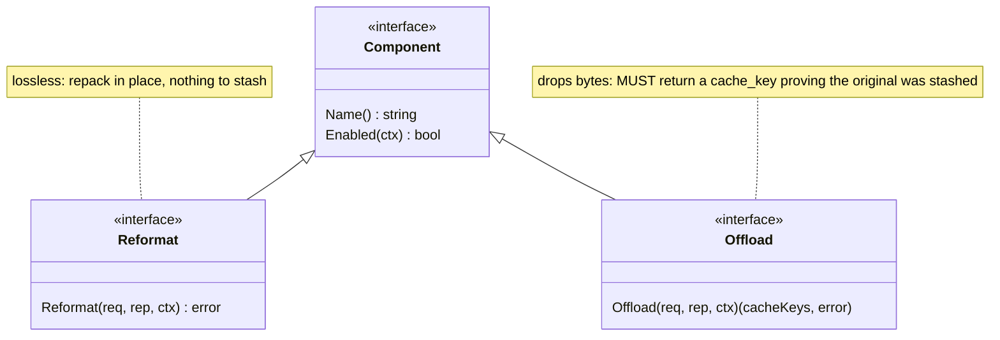
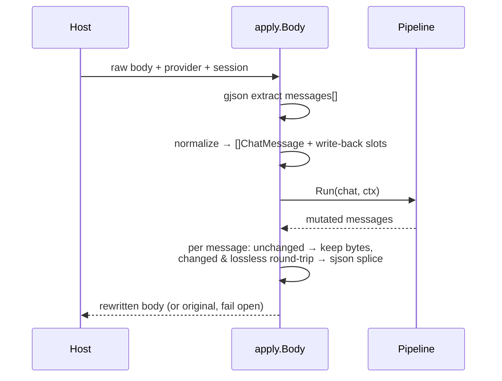
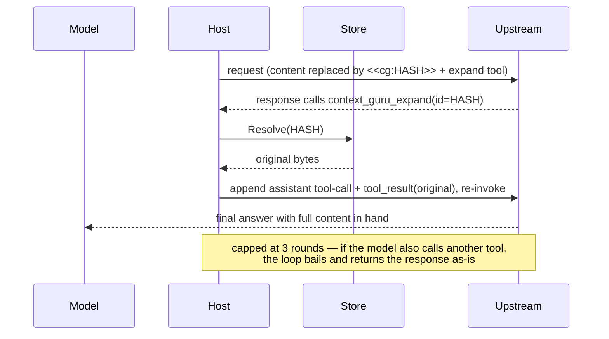

# Design

context-guru is one pure-Go `components` core operating on **bifrost `schemas` types**
(`BifrostChatRequest` / `ChatMessage`), exposing two lossiness-typed interfaces, run in a
**config-ordered, fail-open, never-worse pipeline**, driven unchanged by thin host adapters.
Reversibility, state, session keying, metrics, config, and a filter DSL are the shared
infrastructure the components sit on.

## Package map

| Package | Role |
|---|---|
| `components/` | `Component`/`Reformat`/`Offload` interfaces, `Report`, `Ctx`, the `Pipeline`, the registry |
| `components/reformat/` | lossless components: `format`, `cacheinject` |
| `components/offload/` | lossy-reversible components: `skeleton`, `dedup`, `collapse`, `failed_run`, `cmdfilter`, `extract`, `smartcrush`, `mask` |
| `components/dsl/` | declarative text-filter engine (wrapped by `cmdfilter`) |
| `components/all/` | blank-imports every component so `init()` registrations run |
| `schema/` | helpers over bifrost's schema: token counting, deep-clone, `MessageText`/`SetMessageText`, `Rewritable` |
| `apply/` | the one place the pipeline meets a raw wire body: extract `messages` → run → byte-lossless splice |
| `expand/` | reversibility: `<<cg:HASH>>` marker, the `context_guru_expand` tool def, response parsing + continuation |
| `store/` | `Store` interface + in-memory TTL+LRU backend (rewind + sticky ids) |
| `session/` | resolve the session key (explicit id, else content hash) |
| `modes/` | the per-session compaction generation (`Tracker`) + the bounded off-path worker pool (`Pool`) |
| `metrics/` | `Emitter` implementations: `Slog`, `Aggregator` (for `/stats`), `Tee` |
| `config/` | strict YAML loader, presets, pipeline builder |
| `proxy/` | the standalone/gateway HTTP proxy |
| `adapters/bifrost/` | `LLMPlugin` adapter to embed the pipeline in a bifrost deployment |
| `cmd/context-guru-proxy/` | the proxy binary / eval-containers gateway |

## The component model

Two interfaces, split by **lossiness**, so reversibility is type-enforced:



Optional capability interfaces a component may also implement: `Configurable` (receives its
YAML block as bytes), `NeedsModel` (declares it calls a cheap LLM — the model client is not
yet wired).

- **Reformat** = lossless repack (`format` re-encodes JSON compact; `cacheinject` adds
  `cache_control`). No information leaves the wire, so nothing is stashed.
- **Offload** = lossy-but-reversible. It drops bytes and returns the `cache_keys` under which
  it stashed the originals. If it shrinks the request but returns no keys, the pipeline treats
  it as a **failed offload and reverts** — you cannot silently lose data. Returning no keys and
  leaving the request unchanged is a legitimate no-op (`rep.Skipped`).

## The pipeline: fail-open, never-worse

`Pipeline.Run` walks components in config order. Each is isolated by a snapshot/restore guard
around a per-component `Report`. Token counts are measured on **message content text** (what
the model reads), not the JSON envelope — so `cacheinject` adding `cache_control` bytes never
looks "worse".


Revert conditions (each reverts only that component; the run continues):
1. the component **panicked or returned an error**;
2. an **Offload dropped content but returned no cache_key** (reversibility would be broken);
3. the component **grew** the request (never-worse).

A component registered but implementing neither interface is skipped, not failed.

## Wire ↔ pipeline: `apply.Body`

Both hosts funnel through `apply.Body(ctx, pipe, store, provider, body, session, bypass)`.
It never mutates fields the pipeline didn't touch — **byte-lossless for everything else**.



**Provider normalization.** Components expect OpenAI-shaped tool outputs (`role:"tool"`,
string content). The Anthropic Messages API carries tool outputs as `tool_result` blocks
*inside* user messages — a shape bifrost's schema cannot represent. So for Anthropic requests
`apply` expands each string `tool_result` block into a synthetic `role:tool` message, runs the
pipeline, then splices each rewritten output back into its exact source block via `sjson`.
Non-string tool_result content is skipped (never lose non-text). A whole-message change is only
spliced back if bifrost round-trips that message losslessly (`jsonEqual`); otherwise the change
is discarded — correctness over the marginal saving.

If a component changes the message *count* (none of the v1 set does), the slot map no longer
aligns, so `apply` forwards the original untouched.

Diagnostics: `CONTEXT_GURU_DEBUG=1` logs each tool output's token count + first line;
`CONTEXT_GURU_DUMP=<file>` appends a before→after JSON record per rewritten message.

## Reversibility: marker + expand loop

Offload writes a `<<cg:HASH>>` marker in place of dropped content and calls `store.Put(HASH, original)`.
The host injects a model-callable `context_guru_expand(id)` tool. The **continuation loop** is host
glue (it must re-invoke upstream); the marker format, tool def, response parsing and continuation
builder are shared in `expand/`.



An expired/evicted original resolves to an explicit placeholder rather than being omitted (the
provider requires one `tool_result` per `tool_call_id`). A miss silently turns a lossless offload
lossy — the known TTL edge.

## State: the Store

One `Store` interface, in-memory TTL+LRU default (both hosts share it). Defaults: **1800s TTL,
1000 entries, 100 sticky sessions**. It carries, keyed per session:

- **Rewind** — `cache_key → original bytes` (what the expand loop resolves).
- **Sticky** — the set of content ids already reduced on prior turns (for byte-stable output
  across turns; scaffolding for cache stability).

SQLite/Redis slot in behind the same interface when a durable/multi-replica deployment is real.

## Session keying

`session.Resolve(explicit, system, firstUser)`: an explicit host id wins; otherwise a stable
`sha256(system + firstUser)[:16]` so two turns of one conversation land on the same key.
Explicit id sources: proxy header `x-context-guru-session`; AuthBridge `pctx.Session`;
eval-containers stamps it in the gateway.

## Metrics

The pipeline depends only on the `Emitter` interface (`Component(Report)` + `Run(RunReport)`),
so it has no telemetry-backend dependency. Implementations: `Slog` (logs in `context_engineering.*`
vocabulary), `Aggregator` (in-process rollups behind `/stats`), `Tee` (fan-out), `NopEmitter`.

`/stats` savings are **token-weighted** (Σ saved / Σ before), the honest aggregate — not a mean
of per-request percentages. It also reports:
- `wasted_tokens` / `bounces` — content offloaded then re-served via expand (a premature offload);
- `adjusted_saved` = saved − wasted (bounce-adjusted, may be negative);
- `top_passthrough` — components that ran but never changed a request: dead weight to drop.

Mode is a dimension. `Report`/`RunReport` carry `Mode`, stamped by the pipeline from
`Ctx.Mode`, and the `Aggregator` routes on it:

- enforced requests split into `sync_enforced` / `async_enforced`;
- async adds the whole queue tuple (`queued`, `pending`, `processed`, `dropped`,
  `errors`, `stale_discarded`), `async_tail_unprotected_turns`, and
  `async_realized_saved_tokens` — the savings a turn got by replaying an earlier turn's
  deferred work. That last one is gated on the session having had a compaction actually
  land (`Tracker.Landed`): recording it on every async turn that saved anything made it a
  tautology that re-reported the inline saving, so it read equal to total savings even on
  turn 1 with no deferred work in existence;
- off-path (`Deferred`) runs are excluded from the enforced rollups entirely — their
  savings are counted where they are realized, on the request path;
- observe results land in **physically separate** accumulators serialized under
  `potential_*` / `projected_*`, which share no key with an enforced metric. In observe
  mode every enforced aggregate is zero by construction. Getting this wrong would
  silently inflate the headline savings claim, so it is a correctness requirement and a
  test asserts no enforced aggregate can reach an observe result.

Every pre-existing `/stats` field keeps its name and shape; mode fields are additive
(the harnesses in `deploy/harbor/*.py` parse this payload).

## Operating modes

Three modes, set explicitly by `mode:` (or `--mode` / `MODE`) and threaded onto
`components.Ctx` as `Ctx.Mode`. Never inferred. `sync` is the default and reproduces
pre-mode behavior byte for byte; a golden test compares the two entry points' output.

See [Operating modes](how-to/operating-modes.md) for the operator's view. What follows
is the mechanism.

### Generations: why an async result may be unsafe to apply

An async compaction lands in a session's frozen state at some later, unpredictable
moment. Between enqueue and commit the agent may have taken another turn, and another
job may already have committed. Applying a result computed from a snapshot that no
longer describes the session is how a compaction proxy corrupts a cached prefix.

So `modes.Tracker` keeps, per session under one lock:

- **`prevLen`** — the number of normalized messages the previous turn carried, i.e.
  the already-cached/uncached boundary. `Turn(session, n)` reads it and records the new
  one in a single locked call. This replaces the old read-then-`defer putLen` pattern in
  `apply`, which two concurrent turns of one session raced on (overlaps #25). It only
  ever grows: an agent re-sending a shorter transcript must not shrink the boundary, or
  content the provider already cached falls back into the mutable tail.
- **`gen`** — the compaction generation. A request records the generation it was built
  from. `CommitIfCurrent(session, gen, commit)` runs `commit` and advances the
  generation only if the session is still at `gen`, with `commit` called while the
  lock is held, so two jobs cannot both observe `gen` as current. A stale result is
  **discarded**, not applied.

**The generation advances on every TURN.** That is what makes "stale" mean what it says:
a job built from turn N is stale the moment turn N+1 ships. An earlier version advanced it
only on commit, which looked equivalent and was not — a job from turn 1 still read its own
generation as current after eight later turns and committed happily. The guard existed but
could only ever fire on a dedup collision, never on actual staleness.

The honest consequence: at agent turn rates (seconds) a compaction taking tens of seconds
is usually superseded before it lands, so async discards a lot of work it paid for.
`stale_discarded` is how you see that, and it is the number to watch when deciding whether
async suits a workload. Dedup on `(session, generation)` still keeps at most one job in
flight per session, and the deferral is not starving — a job that finishes inside one turn
commits — but "computed" and "applied" are genuinely different counts here.

A session that produces several unproductive jobs in a row stops enqueueing them
(`Tracker.Barren`): each one is a real cheap-model call, and traffic that does not compact
would otherwise buy an attempt every turn forever.

`store.Buffer` is what makes "discard" possible at all. A deferred run writes frozen
decisions, stashes and sticky ids as it goes, so throwing the result away after the
fact is not an option — by then the writes have landed. Running the job against a
copy-on-write overlay of the store makes the whole result one atomic, discardable
unit: `Commit()` flushes it, and never calling `Commit()` is the discard.

### Job lifecycle

`modes.Pool` is one bounded queue plus a fixed set of drain goroutines, owned by the
proxy — not a goroutine per request. The shape is headroom's `BackgroundCompressor`,
ported and extended.

1. The inline pass runs with **no model clients** (async's whole point), replaying
   whatever an earlier job froze, and returns the session id, `prevLen` and generation.
2. `Enqueue(key, run)` with `key = session@generation`. The pending slot is claimed
   **before** the job is observable in the queue, so dedup is atomic against a
   concurrent enqueue of the same key. A duplicate key is a coalesced supersession.
3. A full queue **drops** and counts, never blocks — the request was already forwarded.
4. The worker runs the pipeline against a `store.Buffer`, with the model clients, under
   the **pool's** context (not the request's, which is cancelled when the response is
   written) and with the turn's own `prevLen` (re-resolving would gate the run against
   a boundary its body never had).
5. `CommitIfCurrent` decides: flush, or discard and count `stale_discarded`.
6. `Stop()` cancels and waits; queued jobs are abandoned, since they were pure savings.

### The async cache policy

A cache-write costs 11.5x a cache-read, so letting the un-compacted tail be cached and
then replacing it converts a read into a write and makes async strictly worse than
sync — the failure that tripled headroom's cache-write on Terminal-Bench.

`apply` therefore sets `Ctx.TailCachePending` + `Ctx.NoCacheAtOrAfter`, and `cacheinject`
drops every breakpoint at or beyond that index, anchoring at the highest safe one instead
so the stable prefix is still written.

Four conditions gate it, each one a bug caught in review:

- **The protected span is the PREVIOUS turn's tail** (`Opts.PendingFrom`), not this
  turn's. The pending job was built from that turn's body, so that is what it will
  replace. Deriving the span from the current boundary protected messages no pending job
  would touch — off by one turn, and guarding the wrong bytes.
- **Only when something is actually pending.** A session's first turn has no queued job
  and nothing to protect; blocking there wrote zero breakpoints on precisely the turn whose
  job is to establish the cache.
- **Only when cache-aware.** With `cache_mode: off` there is no cached prefix to protect,
  so blocking suppressed caching forever for nothing.
- **Caller breakpoints too, or not at all.** `cacheinject` originally pruned only the
  positions it wanted, leaving breakpoints the *agent* set. claude-code marks its own
  newest message, so on the primary workload the doomed tail was cache-written anyway and
  the protection was a silent no-op — async paid the rewrite *and* lost a slot. It now
  either strips those (`async.strip_caller_breakpoints`) or declines the turn entirely via
  `Ctx.DeclineTailProtection`, and the host then does not defer
  (`async_tail_unprotected_turns`). Declining is the default because removing a directive
  an agent deliberately placed is a change to someone else's request.

The protection needs a separate bool rather than a sentinel index, because index 0 is
a legitimate value ("no breakpoint anywhere") — no integer is free to mean "off". The
bool defaulting to false also makes an unset field cost a missed optimisation rather
than a wrong request, which is the opposite of `MaxCachedIdx`'s `-1` (see #25).

`async.cache_uncompacted_tail: true` disables it, for a backend confirmed not to cache.

### Observe

The request path does **not** run the pipeline, and skips `expand.Inject` too — a tool
declaration is a modification. Byte-identity is therefore structural, not a property of
careful copying.

The off-path copy runs against `Handler.shadow`, observe's OWN store: as persistent as
the live one and completely disjoint from it. Both halves of that are load-bearing, and
both were found by comparing observe's projection against sync's actuals rather than by
reading the code:

- **Persistent**, because offloaders freeze a decision and replay it on every later
  turn — that replay is where most of the sustained saving lives. Running observe
  against a discarded buffer makes it see only the current tail and under-project by
  ~3x.
- **Disjoint**, because a decision observe made must never be replayable by a real
  request. That would be a request modification arriving by the back door.

Observe also shares the `Tracker`, so the projection is gated by the same
cached-prefix boundary an enforcing mode would use. Without it MaxCachedIdx is -1, the
tail gate never fires, and the projection overstates savings by the amount
cache-awareness costs (9.5% projected vs 0.8% enforced, measured). Sharing it is safe
off-path: `prevLen` only grows, so a late job cannot move the boundary backwards, and
observe never commits, so the generation stays put.

### Fail-open per mode

- `sync` / `async`: `apply` has a top-level recover, the pipeline has a per-component
  one, and the proxy backstops the whole pre-forward block. The pristine inbound body
  is always a valid fallback.
- `async` off-path: a panicking job is contained by the pool and counted as an error.
  Nothing was riding on it — the request went out long ago.
- `observe`: the forwarded body is the input, so there is nothing for a failure to
  damage.

## Config & registry

One strict YAML struct serves both hosts. `pipeline:` is an ordered name-list (order +
enablement); each component's typed block lives under `components:<name>` and is handed to its
constructor verbatim. A `preset` expands to a default pipeline; explicit fields override it.
Unknown keys are rejected.

```yaml
preset: balanced
pipeline: [format, dedup, failed_run, cmdfilter, cacheinject]   # order + enable
components:
  collapse:   { max_tokens: 2000, head_lines: 20, tail_lines: 20 }
  smartcrush: { min_items: 5, keep_first: 3, keep_last: 2 }
store: { ttl_seconds: 1800, max_entries: 1000 }
```

A component registers its constructor + config type via `init()`; adding one makes it
YAML-configurable with no core edit. See [components.md](components.md) for presets and every
component's config.

## LLM components

Most components are deterministic. Two call an LLM: `extract` (`strategy: code`/`rlm`, a Starlark
filter run in a sandbox) and `summarize` (whole-transcript summary). They implement `NeedsModel` and
call `Ctx.Model` — a `ModelSpec` the host resolves per request:

```mermaid
flowchart LR
  cfg["component config<br/>model.source"] --> res{"ModelSpec.For(source)"}
  res -->|incoming| inc["Incoming: request's own<br/>model + upstream + key<br/>(built in proxy.chat)"]
  res -->|config| stat["Static: cheap model<br/>(CHEAP_MODEL* env)"]
  res -->|nil| deg["degrade: extract→deterministic,<br/>summarize→no-op"]
  inc --> call["Model.Complete(ctx, prompt)"]
  stat --> call
```

- **`incoming`** (default) reuses the proxied request's model + the gateway's key — zero extra config,
  works through the eval-containers gateway. **`config`** uses a dedicated cheap model (`internal/cheapmodel`
  Anthropic/OpenAI). The AuthBridge host offers only `config` (its incoming key is a placeholder).
- The call is synchronous in the request path, so it's bounded (short timeout, retry) and **fail-open**:
  any error reverts the component (pipeline guarantee), and a missing model degrades gracefully.
- Reversibility is unchanged — the LLM output is still stashed under a `<<cg:HASH>>` marker for `expand`.
