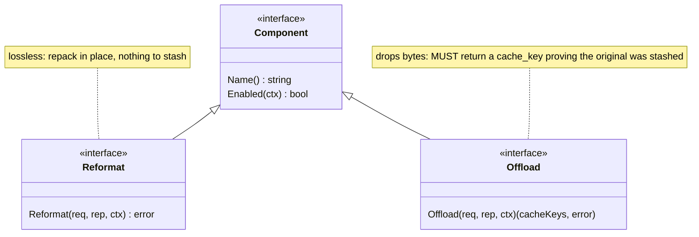
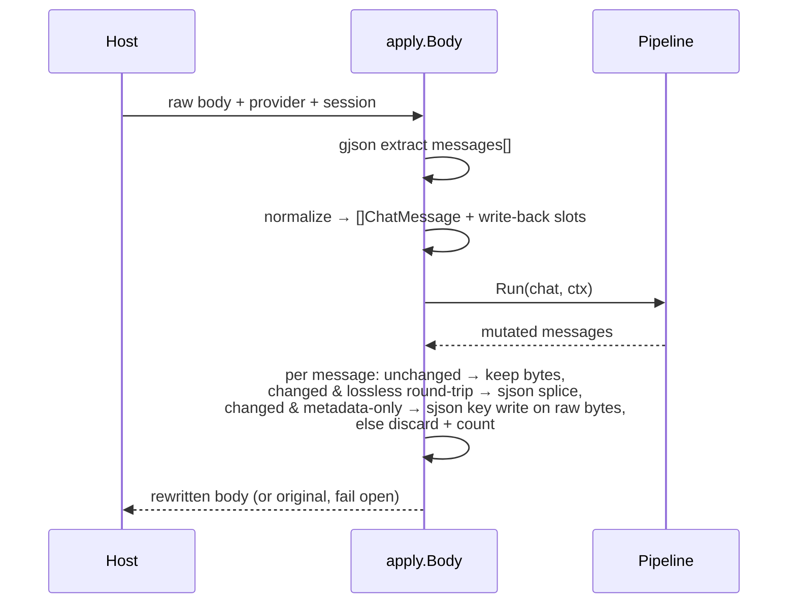
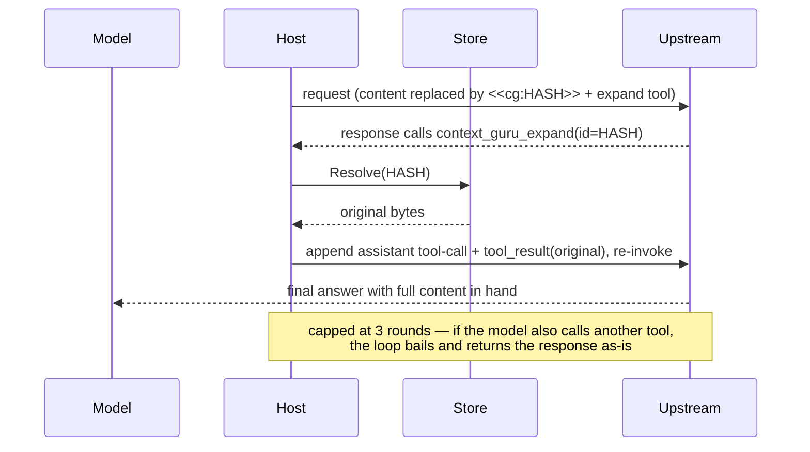
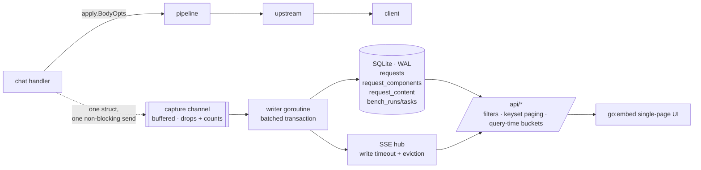

# Design

context-guru is one pure-Go `components` core operating on **bifrost `schemas` types**
(`BifrostChatRequest` / `ChatMessage`), exposing two lossiness-typed interfaces, run in a
**config-ordered, fail-open, never-worse pipeline**, driven unchanged by thin host adapters.
Reversibility, state, session keying, metrics, config, and a filter DSL are the shared
infrastructure the components sit on.

## Package map

| Package | Role |
|---|---|
| `components/` | `Component`/`Reformat`/`Offload` interfaces, `Report`, `Ctx`, the `Pipeline`, the registry |
| `components/reformat/` | lossless components: `format`, `toon`, `cacheinject`, `cachesplit` |
| `components/offload/` | lossy-reversible components: `skeleton`, `dedup`, `collapse`, `failed_run`, `cmdfilter`, `extract`, `extract_llm`, `smartcrush`, `mask`, `summarize` |
| `components/dsl/` | declarative text-filter engine (wrapped by `cmdfilter`) |
| `components/all/` | blank-imports every component so `init()` registrations run |
| `schema/` | helpers over bifrost's schema: token counting, deep-clone, `MessageText`/`SetMessageText`, `Rewritable` |
| `apply/` | the one place the pipeline meets a raw wire body: extract `messages` → run → byte-lossless splice |
| `expand/` | reversibility: `<<cg:HASH>>` marker, the `context_guru_expand` tool def, response parsing + continuation |
| `store/` | `Store` interface + in-memory TTL+LRU backend (rewind + sticky ids) |
| `session/` | resolve the session key (explicit id, else content hash) |
| `modes/` | per-session cached-prefix boundary (`Tracker`) + the bounded off-path worker pool (`Pool`) |
| `metrics/` | `Emitter` implementations: `Slog`, `Aggregator` (for `/stats`), `Tee` |
| `dash/` | the persistent observability layer: SQLite store, off-hot-path capture, SSE hub, JSON API, embedded UI |
| `config/` | strict YAML loader, presets, pipeline builder |
| `proxy/` | the standalone/gateway HTTP proxy |
| `adapters/bifrost/` | `LLMPlugin` adapter to embed the pipeline in a bifrost deployment |
| `cmd/context-guru-proxy/` | the proxy binary / eval-containers gateway |

## The component model

Two interfaces, split by **lossiness**, so reversibility is type-enforced:



Optional capability interfaces a component may also implement: `Configurable` (receives its
YAML block as bytes), `NeedsModel` (declares it calls a cheap LLM — the model client is not
yet wired).

- **Reformat** = lossless repack (`format` re-encodes JSON compact; `cacheinject` adds
  `cache_control`; `cachesplit` is a marker enabling a body-level split). No information leaves the
  wire, so nothing is stashed.
- **Offload** = lossy-but-reversible. It drops bytes and returns the `cache_keys` under which
  it stashed the originals. If it shrinks the request but returns no keys, the pipeline treats
  it as a **failed offload and reverts** — you cannot silently lose data. Returning no keys and
  leaving the request unchanged is a legitimate no-op (`rep.Skipped`).

## The pipeline: fail-open, never-worse

`Pipeline.Run` walks components in config order. Each is isolated by a snapshot/restore guard
around a per-component `Report`. Token counts are measured on **message content text** (what
the model reads), not the JSON envelope — so `cacheinject` adding `cache_control` bytes never
looks "worse".


Revert conditions (each reverts only that component; the run continues):
1. the component **panicked or returned an error**;
2. an **Offload dropped content but returned no cache_key** (reversibility would be broken);
3. the component **grew** the request (never-worse).

A component registered but implementing neither interface is skipped, not failed.

## Wire ↔ pipeline: `apply.Body`

Both hosts funnel through `apply.Body(ctx, pipe, store, provider, body, session, bypass)`.
It never mutates fields the pipeline didn't touch — **byte-lossless for everything else**.



**Provider normalization.** Components expect OpenAI-shaped tool outputs (`role:"tool"`,
string content). The Anthropic Messages API carries tool outputs as `tool_result` blocks
*inside* user messages — a shape bifrost's schema cannot represent. So for Anthropic requests
`apply` expands each string `tool_result` block into a synthetic `role:tool` message, runs the
pipeline, then splices each rewritten output back into its exact source block via `sjson`.
Non-string tool_result content is skipped (never lose non-text). A whole-message change is only
spliced back if bifrost round-trips that message losslessly (`jsonEqual`); otherwise the change
is discarded — correctness over the marginal saving.

**The metadata exception.** That guard has one deliberate hole, and it exists because the guard
alone made `cacheinject` a no-op. bifrost drops `tool_use.id/name/input` on unmarshal, so every
Anthropic assistant turn carrying a `tool_use` is non-round-trippable — and those are exactly the
only messages `cacheinject` can mark. Measured on 40 captured Claude Code requests: **46
breakpoints applied at the component level, 0 in the output body** (issue #32).

So `apply/metawrite.go` adds a narrow path: when a component's *only* change to a message is an
added `cache_control` key, that key is written at its exact path (`messages.<i>.content.<b>.cache_control`)
on the **original raw bytes** via `sjson`. `cache_control` is metadata, not content — it changes
nothing the model reads, so it needs no message model to express, and a targeted `sjson` write
provably cannot drop a field it never reads. The `metadataOnlyWrites` diff enforces "only that":
a text edit, a removed key, a changed block count, anything else at all, and the change is still
discarded. `applyMetaWrites` additionally refuses if the raw body's block layout disagrees with
the normalized view, so a key can never land on the wrong block, and never overwrites a
breakpoint the caller set.

**Discards are now loud.** `Pipeline.RecordDiscards` attributes each thrown-away change back to
the component that made it (via `Report.ChangedIdx`), surfacing as `discarded_changes` per
component and `top_discarded` in `/stats`. Before this, a mutated-then-discarded component looked
byte-identical to a working Reformat — which is how #32 survived two full benchmark studies.
Attribution is deliberately conservative, because a counter meant to catch that class of bug is
worthless if it cries wolf: `ChangedIdx` is recorded only on the surviving path (a reverted
component is never charged), and one discarded message is charged to exactly ONE component — the
last one to change it, whose state is what the writeback layer actually threw away.

**Breakpoint budgeting is a host job.** The provider caps `cache_control` at 4 across `system` +
`tools` + `messages` together, and a component sees none of the first two. Nor does it see a
`cache_control` on a `tool_result` block: `normalize` rebuilds those into synthetic `role=tool`
messages from text + `tool_use_id` alone (`toolMessage`), dropping the mark. (bifrost is not the
culprit here — it round-trips `cache_control` on `tool_result` fine.) On real Claude Code traffic
that hides all three of the agent's own breakpoints, so a component counting only what it saw
computed 4 free slots when 1 was free. `apply` counts them from the raw body (`wireBreakpoints`,
covering the Bedrock `cachePoint` spelling and its own `system`/`tools` entries) and passes the
total as `Ctx.ExistingBreakpoints`. A breach is logged only when *we* pushed the total over the
cap — an already-over-cap request is forwarded untouched and is not ours to report.

If a component changes the message *count* (none of the v1 set does), the slot map no longer
aligns, so `apply` forwards the original untouched.

Diagnostics: `CG_LOG_LEVEL=debug` (or the legacy `CONTEXT_GURU_DEBUG=1`) logs every
component's decision — verdict, token delta, and the gate that declined it — plus each tool
output's token count and first line;
`CONTEXT_GURU_DUMP=<file>` appends a before→after JSON record per rewritten message.

## Reversibility: marker + expand loop

Offload writes a `<<cg:HASH>>` marker in place of dropped content and calls `store.Put(HASH, original)`.
The host injects a model-callable `context_guru_expand(id)` tool. The **continuation loop** is host
glue (it must re-invoke upstream); the marker format, tool def, response parsing and continuation
builder are shared in `expand/`.



An expired/evicted original resolves to an explicit placeholder rather than being omitted (the
provider requires one `tool_result` per `tool_call_id`). A miss silently turns a lossless offload
lossy — the known TTL edge, much narrower now the TTL slides on every read (see
[Freeze lifetime](#freeze-lifetime-and-which-way-to-fail)).

## State: the Store

One `Store` interface, in-memory TTL+LRU default (both hosts share it). Defaults: **10000s sliding
TTL, 1000 entries, 100 sticky sessions**. It carries, keyed per session:

- **Rewind** — `cache_key → original bytes` (what the expand loop resolves).
- **Sticky** — the set of content ids already reduced on prior turns (for byte-stable output
  across turns; scaffolding for cache stability).

SQLite/Redis slot in behind the same interface when a durable/multi-replica deployment is real.

### Freeze lifetime, and which way to fail

The TTL exists to reclaim state for **finished** sessions. Applying it to a *live* one is a bug
with a price tag: a frozen compaction (`cg:frz:…`, the exact replacement bytes an offloader must
replay so an already-cached message stays byte-identical) that dies mid-task makes that message
flip representation inside the provider's cached prefix, and the whole suffix is re-written at
**11.5x** the cache-read price. So the store treats a *read* as proof of life:

- **Sliding TTL** — `Get` refreshes `expires`, not just LRU recency. An entry being replayed every
  turn never ages out; one nobody reads still expires on its original deadline.
- **Default 10000s** — Terminal-Bench tasks average ~1975s of wall clock and run to 4h, so the
  old 1800s default expired live decisions mid-task. Still `store.ttl_seconds`.
- **Replay decisions are pinned** against LRU eviction — `cg:frz:` (mask/failed_run), `cg:res:`
  (extract_llm's projection *and* its summary line, one key so they cannot half-survive) and
  `cg:len:` (apply's cache-boundary counter, whose loss makes `TailOnly` fail open). All are tiny;
  the pin is capped at half the entry cap so one session cannot starve the rewind stashes the
  expand loop needs. Eviction reclaims **expired** entries first, pinned included — otherwise a
  finished session's decisions are never read again, never expire, and permanently occupy the pin
  budget. The prefixes are supplied by their owners via `store.Options.PinPrefixes`; the store
  does not know component key layouts.

**The fail direction inverts for an established compaction.** Fail-open normally means "forward the
original", and for a *new* compaction that is right. But once the provider has cached the compacted
bytes, forwarding the original **is** the destructive act. A plain `Get` miss can't tell those cases
apart, so the store keeps the *fact* of a dropped freeze (`FrozenLoser.FrozenLost`, a bounded key
set — the payload need not survive, only the knowledge that it existed):

- **never frozen** → obey the tail gate; a new compaction stays in the uncached tail.
- **frozen, then lost** → re-derive it even at depth, but **only where re-derivation is
  reproducible**. `mask` and `failed_run` qualify: their replacement is
  `prefix + headPeek(content) + Marker(sha256(content))`, a pure function of
  `(content, config)` and independent of position, so re-deriving reproduces the *same* bytes the
  provider cached and re-establishes the freeze. Their windows (`keep_recent`, `runs[:len-1]`) gate
  *whether* a message is considered, never *what bytes* are emitted, and config cannot drift
  mid-session. The never-worse and kept-verbatim guards still apply, so the repair only lifts the
  depth restriction — it never authorizes new content loss.
- **`extract_llm` is deliberately excluded.** Its replacement is a *sampled* model output (the
  cheap-model client sends no temperature and no seed), so re-deriving could splice **different**
  bytes into the cached prefix — the exact corruption the repair exists to prevent. And the trade
  does not pay even ignoring that: if the bytes differ, the suffix is cache-written either way, so
  the repair branch would buy a model call for nothing. There is no upside, so a lost `extract_llm`
  decision simply declines and the message is forwarded verbatim. (Its entry is still pinned, so
  the common case is that it is never lost at all.) Re-enabling it would need deterministic
  decoding *plus* a check that the re-derived bytes match the stored hash before splicing. The
  dedicated `repairLostResult` path that used to attempt it was **removed** rather than left
  disabled — a repair that can splice different bytes is not a repair worth keeping behind a flag.
  `cg:res:` also unifies what were two keys (`cg:res:` + `cg:sum1:`) into one JSON value, so the
  projection and its summary line cannot half-survive a drop.

`/stats` reports `frozen_hits`, `frozen_misses`, `frozen_dropped`, `frozen_repaired`, and
`frozen_flips` (= dropped − repaired; should be 0). `frozen_misses` is a *lookup* counter dominated
by the ordinary "not compacted yet" case — `frozen_dropped` is the one that measures harm. See
[Routes](reference/routes.md#freeze-replay-health).

The related fail-*open* on `MaxCachedIdx`: `prevLen` returning 0 on a store miss yields
`MaxCachedIdx = -1`, and `Ctx.TailOnly` then permits mutating any index (measured on 11.2% of
Terminal-Bench requests). `cg:len:` is now pinned and the sliding TTL keeps it alive, so it
no longer expires mid-session — but inverting `TailOnly` to fail *closed* is a separate change.

## Session keying

`session.Resolve(explicit, system, firstUser)`: an explicit host id wins; otherwise a stable
`sha256(system + firstUser)[:16]` so two turns of one conversation land on the same key.
Explicit id sources: proxy header `x-context-guru-session`; AuthBridge `pctx.Session`;
eval-containers stamps it in the gateway.

## Metrics

The pipeline depends only on the `Emitter` interface (`Component(Report)` + `Run(RunReport)`),
so it has no telemetry-backend dependency. Implementations: `Slog` (logs in `context_engineering.*`
vocabulary), `Aggregator` (in-process rollups behind `/stats`), `Tee` (fan-out), `NopEmitter`.

`/stats` savings are **token-weighted** (Σ saved / Σ before), the honest aggregate — not a mean
of per-request percentages. It also reports:
- `wasted_tokens` / `bounces` — content offloaded then re-served via expand (a premature offload);
- `adjusted_saved` = saved − wasted (bounce-adjusted, may be negative);
- `top_passthrough` — components that ran but never changed a request: dead weight to drop. A
  component that mutated without saving *content* tokens (`cachesplit`) is not listed;
- `discarded_changes` (per component) / `top_discarded` — changes the writeback layer threw away.
  Before this existed, a mutated-then-discarded component was indistinguishable from a working
  Reformat, which is how the `cacheinject` bug survived two benchmark studies;
- `sse_streamed` / `sse_buffered` / `sse_buffered_pct` and `sse_ttfb_ms_avg` /
  `sse_ttfb_ms_avg_buffered` — streaming health: how many SSE responses had to be buffered whole to
  be inspected for an expand call, and what that cost. The `_buffered` average is
  time-to-*last*-byte by construction, so it is not comparable to `sse_ttfb_ms_avg`;
- `frozen_hits` / `frozen_misses` / `frozen_dropped` / `frozen_repaired` / `frozen_flips` — the
  cache-write cost line (see [Freeze lifetime](#freeze-lifetime-and-which-way-to-fail));
- `cmdfilter_families` / `cmdfilter_filters` / `cmdfilter_selector_misses` — which command families
  and individual filters pay off, and which output shapes matched nothing;
- `saved_tokens` vs `saved_tokens_unique` and `overcount_ratio` — cumulative vs distinct. The agent
  re-sends history verbatim every turn, so the cumulative figure double-counts. Quote the unique one;
- `mode` / `sync_enforced`, and the `potential_*` / `projected_*` observe namespace;
- the four provider-billed token tiers (`fresh_input_tokens`, `cache_read_tokens`,
  `cache_write_tokens`, `output_tokens`), plus `attempted_tokens` / `frozen_tokens` and the
  two extra ratios derived from them (`savings_pct_attempted`, `savings_pct_new_input`).

`/stats` is **append-only by contract**: `deploy/harbor/*.py` parses it to produce every
published benchmark result, so a rename would invalidate the reproduction path *silently*
(the harness would keep running and report zeros). A golden test asserts the exact key set
of both the top-level object and each per-component object. The full field list is in
[Routes](reference/routes.md#get-stats).

## Operating modes

Two modes, set explicitly by `mode:` (or `--mode` / `MODE`) and threaded onto
`components.Ctx` as `Ctx.Mode`, whose zero value resolves to `sync`. Never inferred. `sync`
reproduces pre-mode behavior byte for byte; a golden test compares the two entry points' output.
An `async` mode is implemented on a held branch and is **not** available — the loader accepts
only `sync` and `observe`.

See [Operating modes](how-to/operating-modes.md) for the operator's view. What follows is
the mechanism.

### Observe

The request path does **not** run the pipeline, and skips `expand.Inject` too — a tool
declaration is a modification. Byte-identity is therefore structural, not a property of
careful copying: no code path in observe mode can alter a forwarded body.

The off-path copy runs against `Handler.shadow`, observe's OWN store: as persistent as the
live one and completely disjoint from it. Both halves are load-bearing, and both were found
by comparing observe's projection against sync's actuals rather than by reading the code:

- **Persistent**, because offloaders freeze a decision and replay it on every later turn —
  that replay is where most of the sustained saving lives. Running observe against a
  discarded buffer makes it see only the current tail and under-project by ~3x.
- **Disjoint**, because a decision observe made must never be replayable by a real request.
  That would be a request modification arriving by the back door.

Observe also shares the `Tracker`, so the projection is gated by the same cached-prefix
boundary an enforcing mode would use. Without it `MaxCachedIdx` is -1, the tail gate never
fires, and the projection overstates savings by the amount cache-awareness costs (9.5%
projected vs 0.8% enforced, measured). Sharing it is safe off-path: the boundary only ever
grows, so a late job cannot move it backwards.

Measurements run on `modes.Pool` — one bounded queue plus a fixed set of drain goroutines
owned by the proxy, not a goroutine per request. The shape is headroom's
`BackgroundCompressor`: dedup by key with the pending slot claimed **before** the job is
observable in the queue (atomic against a concurrent enqueue), a full queue that **drops**
and counts rather than blocking, jobs under the pool's context rather than the request's,
and fail-open on every path including a panicking job. `Stop` bounds its wait: cancelling
cannot interrupt an in-flight HTTP call to the cheap model, and nothing waits on a
measurement's result.

### The cached-prefix boundary

`modes.Tracker` holds, per session under one lock, how many normalized messages the
previous turn carried — the boundary above which offloaders may mutate
(`Ctx.MaxCachedIdx`). `Turn(session, n)` reads it and records the new value in ONE locked
call.

That single call is the fix for a real race: the previous implementation read the value
from the TTL store and wrote it back in a `defer`, so two concurrent turns of one session
both read the same length and the second's write-back could land first, leaving a boundary
describing neither turn. A boundary that is too high lets an offloader mutate content the
provider has already cached, which costs a full cache-write of the suffix. Callers without
a tracker (library users, `/compact`) keep the legacy path unchanged.

The boundary only ever grows: an agent re-sending a shorter transcript must not shrink it,
or cached content falls back into the mutable tail.

### Fail-open per mode

- `sync`: `apply` has a top-level recover, the pipeline has a per-component one, and the
  proxy backstops the whole pre-forward block. The pristine inbound body is always a valid
  fallback.
- `observe`: the forwarded body *is* the input, so there is nothing for a failure to
  damage; a panicking observation is contained by the pool and counted.

## Observability: the dashboard store (D11)

`Aggregator` answers "what is happening now" and forgets everything on restart. The
[dashboard](dashboard.md) answers "what happened, and was it worth it" — which needs
durability, filtering and per-request detail. It is a **separate, additive layer**: the
aggregator is untouched and stays the fast in-process counter.



Five decisions, and what each one refuses:

**Capture is off the hot path, and drops rather than blocks.** The handler builds one
`dash.Event` from values the request path already computed and does a channel send with a
`default:` branch. A full queue increments a drop counter that the dashboard itself
displays. *Refuses:* observability that can add latency to, or fail, a request.

"Off the hot path" has to mean the whole pipeline, not just the send. The first version of
this layer redacted captured content inside the handler's `defer` — which runs *before the
handler returns*, so a keep-alive client's next request queued behind nine regexes over up
to 48 blobs. The channel send was genuinely ~175 ns and the request still got ~53 ms
slower. Everything expensive (redaction, gzip, the insert, the SSE fan-out) now happens on
the **writer goroutine**, and the regression test drives a real handler with content
capture ON rather than calling `Record` directly — a benchmark of the cheap half of a
two-part path will report the cheap half.

**`apply.BodyOpts` is the capture point.** `BodyFull` delegates to it, so the rewrite is
byte-identical whether or not anyone is looking; the `Trace` embedded in its `Result`
carries the resolved session, the `RunReport`, the cache-awareness facts
(`AttemptedTokens` / `FrozenTokens`) and each rewritten message's before/after text — the
same material `CONTEXT_GURU_DUMP` writes to a file. *Refuses:* a parallel accounting path
that could disagree with the pipeline's own.

**Redaction before the database, never on read.** Headers are blanket-redacted by key
against a short allowlist (a denylist fails the moment a gateway invents a new auth
header); config keys are allowlisted, with credential-named keys always withheld, and an
allowlisted key's *value* is still checked for an embedded `user:password@` credential.

Captured message **content** is the one surface that cannot be allowlisted — it is
arbitrary agent output — so it gets pattern scrubbing, and a pattern denylist is
structurally always behind reality: a review of 22 realistic credential shapes found 11
passing through, including `Authorization: Bearer <token>`, where the pattern matched the
scheme and left the token. The patterns are fixed and the shapes are now a table-driven
test, but the honest conclusion is that this mechanism cannot be *proved* complete, so
content capture is **opt-in** (`--dashboard-content`, default off) rather than opt-out.
*Refuses:* a secret on disk, a redact-on-read filter one forgotten code path from leaking
it, and a default that writes arbitrary transcripts to disk behind a denylist.

**Percentages at read time, cost at write time.** Ratios are derived per query, so a
filter change needs no rebuild. Costs are computed when the row is written, so history does
not reprice when a model's published rate changes. *Refuses:* a "savings" figure that
silently changes retroactively.

**No rollup tables.** Time series are bucketed in SQL (`ts/bucket*bucket GROUP BY 1`).
*Refuses:* a pre-aggregation layer to keep consistent before any query is measurably slow.

Timestamps are epoch **milliseconds** throughout — a formatted locale string cannot be
range-queried, sorted portably or bucketed. Retention is bounded by age **and** size. The
schema carries a version; a mismatch renames the old file aside and starts fresh, because a
dashboard is a derived view and discarding it beats refusing to boot.

Per-request **content** and the effective **configuration** are served to loopback or an
explicit trusted CIDR only; aggregates are open, because a proxy bound to `0.0.0.0` should
still report its own numbers.

## Config & registry

One strict YAML struct serves both hosts. `pipeline:` is an ordered name-list (order +
enablement); each component's typed block lives under `components:<name>` and is handed to its
constructor verbatim. A `preset` expands to a default pipeline; explicit fields override it.
Unknown keys are rejected.

```yaml
preset: balanced
pipeline: [format, dedup, failed_run, cmdfilter, cachesplit]   # order + enable
components:
  collapse:   { max_tokens: 2000, head_lines: 20, tail_lines: 20 }
  smartcrush: { min_items: 5, keep_first: 3, keep_last: 2 }
store: { ttl_seconds: 10000, max_entries: 1000 }
```

A component registers its constructor + config type via `init()`; adding one makes it
YAML-configurable with no core edit. See [components.md](components.md) for presets and every
component's config.

## LLM components

Most components are deterministic. Two call an LLM: `extract_llm` (`strategy: code`, a Starlark
filter run in a sandbox) and `summarize` (whole-transcript summary). The deterministic `extract` is a
separate component and never calls a model. They implement `NeedsModel` and
call `Ctx.Model` — a `ModelSpec` the host resolves per request:

```mermaid
flowchart LR
  cfg["component config<br/>model.source"] --> res{"ModelSpec.For(source)"}
  res -->|incoming| inc["Incoming: request's own<br/>model + upstream + key<br/>(built in proxy.chat)"]
  res -->|config| stat["Static: cheap model<br/>(CHEAP_MODEL* env)"]
  res -->|nil| deg["degrade: extract_llm→no-op,<br/>summarize→no-op"]
  inc --> call["Model.Complete(ctx, prompt)"]
  stat --> call
```

- **`incoming`** (default) reuses the proxied request's model + the gateway's key — zero extra config,
  works through the eval-containers gateway. **`config`** uses a dedicated cheap model (`internal/cheapmodel`
  Anthropic/OpenAI). The AuthBridge host offers only `config` (its incoming key is a placeholder).
- The call is synchronous in the request path (in `sync` mode; in `observe` it happens off-path), so
  it's bounded (short timeout, retry) and **fail-open**: any error reverts the component (pipeline
  guarantee), and a missing model degrades gracefully.
- Reversibility is unchanged — the LLM output is still stashed under a `<<cg:HASH>>` marker for `expand`.
