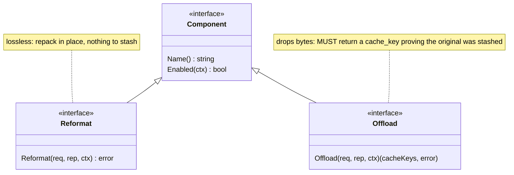
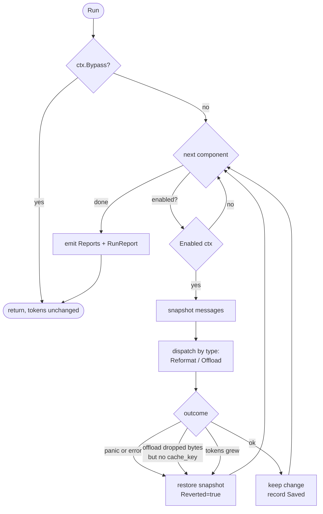
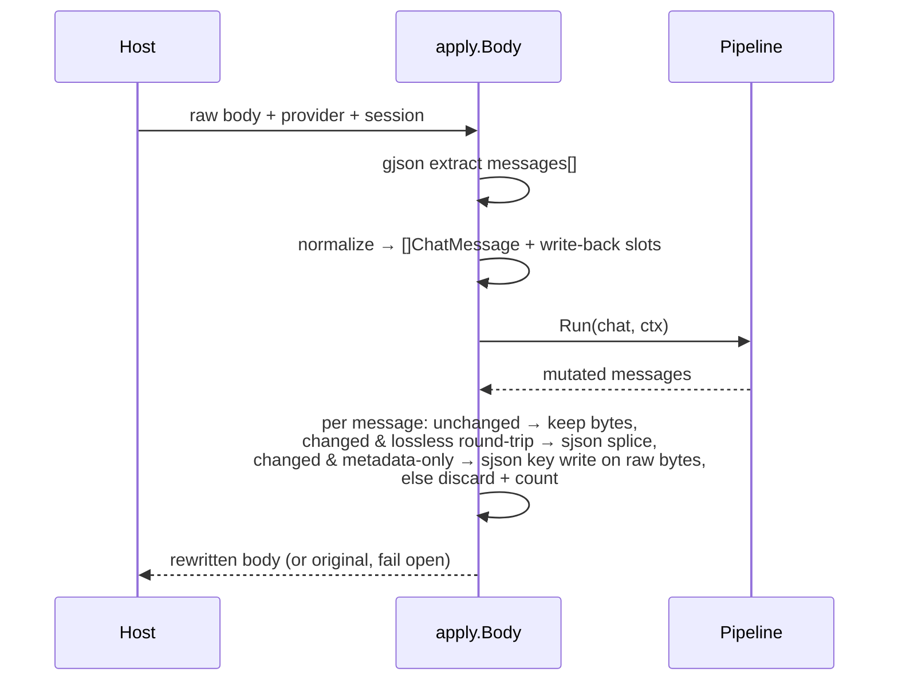
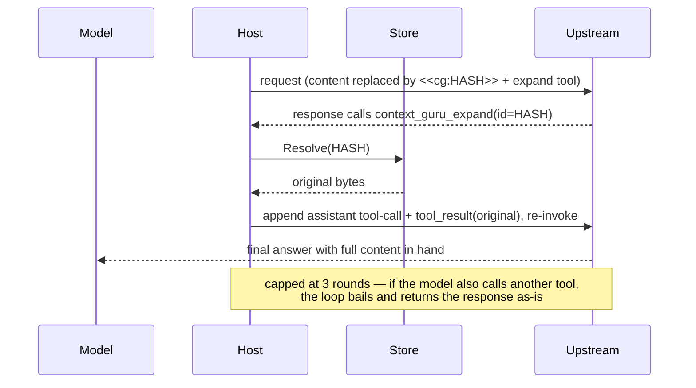
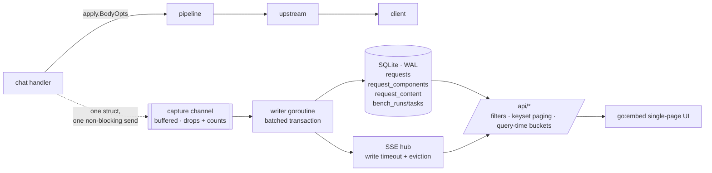
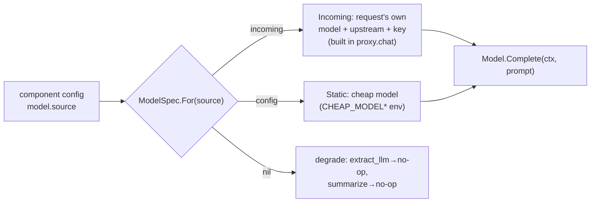

# Design

context-guru is one pure-Go `components` core operating on **bifrost `schemas` types**
(`BifrostChatRequest` / `ChatMessage`), exposing two lossiness-typed interfaces, run in a
**config-ordered, fail-open, never-worse pipeline**, driven unchanged by thin host adapters.
Reversibility, state, session keying, metrics, config, and a filter DSL are the shared
infrastructure the components sit on.

## Package map

| Package | Role |
|---|---|
| `components/` | `Component`/`Reformat`/`Offload` interfaces, `Report`, `Ctx`, the `Pipeline`, the registry |
| `components/reformat/` | lossless components: `format`, `toon`, `searchfold`, `cacheinject`, `cachesplit` |
| `components/offload/` | lossy-reversible components: `skeleton`, `dedup`, `collapse`, `failed_run`, `cmdfilter`, `extract`, `extract_llm`, `smartcrush`, `mask`, `summarize` |
| `components/dsl/` | declarative text-filter engine (wrapped by `cmdfilter`) |
| `components/all/` | blank-imports every component so `init()` registrations run |
| `schema/` | helpers over bifrost's schema: token counting, deep-clone, `MessageText`/`SetMessageText`, `Rewritable`, `ToolCalls` (pairs a tool result with the call that produced it), `ValidateShapeFor`/`ValidateShape` (static message-shape validation) |
| `apply/` | the one place the pipeline meets a raw wire body: extract `messages` → run → byte-lossless splice |
| `expand/` | reversibility: `<<cg:HASH>>` marker, the `context_guru_expand` tool def, response parsing + continuation |
| `store/` | `Store` interface + in-memory TTL+LRU backend (rewind + sticky ids) |
| `session/` | resolve the session key (explicit id, else content hash) |
| `modes/` | per-session cached-prefix boundary (`Tracker`) + the bounded off-path worker pool (`Pool`) |
| `metrics/` | `Emitter` implementations: `Slog`, `Aggregator` (for `/stats`), `Tee` |
| `dash/` | the persistent observability layer: SQLite store, off-hot-path capture, SSE hub, JSON API, embedded UI |
| `config/` | strict YAML loader, presets, pipeline builder |
| `proxy/` | the standalone/gateway HTTP proxy |
| `adapters/bifrost/` | `LLMPlugin` adapter to embed the pipeline in a bifrost deployment |
| `cmd/context-guru-proxy/` | the proxy binary / eval-containers gateway |

## The component model

Two interfaces, split by **lossiness**, so reversibility is type-enforced:



Optional capability interfaces a component may also implement: `Configurable` (receives its
YAML block as bytes), `NeedsModel` (declares it calls a cheap LLM — the model client is not
yet wired).

- **Reformat** = lossless repack (`format` re-encodes JSON compact; `cacheinject` adds
  `cache_control`; `cachesplit` is a marker enabling a body-level split). No information leaves the
  wire, so nothing is stashed.
- **Offload** = lossy-but-reversible. It drops bytes and returns the `cache_keys` under which
  it stashed the originals. If it shrinks the request but returns no keys, the pipeline treats
  it as a **failed offload and reverts** — you cannot silently lose data. Returning no keys and
  leaving the request unchanged is a legitimate no-op (`rep.Skipped`).

## The pipeline: fail-open, never-worse

`Pipeline.Run` walks components in config order. Each is isolated by a snapshot/restore guard
around a per-component `Report`. Token counts are measured on **message content text** (what
the model reads), not the JSON envelope — so `cacheinject` adding `cache_control` bytes never
looks "worse".



Revert conditions (each reverts only that component; the run continues):
1. the component **panicked or returned an error**;
2. an **Offload dropped content but returned no cache_key** (reversibility would be broken);
3. the component **grew** the request (never-worse).

A component registered but implementing neither interface is skipped, not failed.

## Wire ↔ pipeline: `apply.Body`

Both hosts funnel through `apply.Body(ctx, pipe, store, provider, body, session, bypass)`.
It never mutates fields the pipeline didn't touch — **byte-lossless for everything else**.



**Provider normalization.** Components expect OpenAI-shaped tool outputs (`role:"tool"`,
string content). The Anthropic Messages API carries tool outputs as `tool_result` blocks
*inside* user messages — a shape bifrost's schema cannot represent. So for Anthropic requests
`apply` expands each string `tool_result` block into a synthetic `role:tool` message, runs the
pipeline, then splices each rewritten output back into its exact source block via `sjson`.
Non-string tool_result content is skipped (never lose non-text). A whole-message change is only
spliced back if bifrost round-trips that message losslessly (`jsonEqual`); otherwise the change
is discarded — correctness over the marginal saving.

**The metadata exception.** bifrost drops `tool_use.id/name/input` on unmarshal, so every
Anthropic assistant turn carrying a `tool_use` is non-round-trippable — and those are exactly the
messages `cacheinject` marks, which made the round-trip guard alone turn `cacheinject` into a
no-op. So `apply/metawrite.go` adds a narrow path: when a component's *only* change to a message is
an added `cache_control` key, that key is written directly onto the original raw bytes via `sjson`
at its exact path, rather than requiring a full message round-trip. Any other kind of change is
still discarded.

**Discards are attributed.** `Pipeline.RecordDiscards` charges each thrown-away change back to the
component that made it, surfacing as `discarded_changes` / `top_discarded` in `/stats` — so a
mutated-then-discarded component isn't indistinguishable from a working one.

**Breakpoint budgeting is a host job.** The provider caps `cache_control` at 4 across `system` +
`tools` + `messages` together, and a component sees none of the first two (nor a `cache_control` on
a `tool_result` block, which `normalize` strips when rebuilding synthetic tool messages). `apply`
counts existing breakpoints from the raw body (`wireBreakpoints`) and passes the total as
`Ctx.ExistingBreakpoints`, so a component doesn't undercount what's already spent.

If a component changes the message *count* (none of the v1 set does), the slot map no longer
aligns, so `apply` forwards the original untouched.

Diagnostics: `CG_LOG_LEVEL=debug` logs every component's decision; `CONTEXT_GURU_DUMP=<file>`
appends a before→after JSON record per rewritten message.

## Reversibility: marker + expand loop

Offload writes a `<<cg:HASH>>` marker in place of dropped content and calls `store.Put(HASH, original)`.
The host injects a model-callable `context_guru_expand(id)` tool. The **continuation loop** is host
glue (it must re-invoke upstream); the marker format, tool def, response parsing and continuation
builder are shared in `expand/`.



An expired/evicted original resolves to an explicit placeholder rather than being omitted (the
provider requires one `tool_result` per `tool_call_id`). A miss silently turns a lossless offload
lossy — the known TTL edge, much narrower now the TTL slides on every read (see
[Freeze lifetime](#freeze-lifetime-and-which-way-to-fail)).

## State: the Store

One `Store` interface, in-memory TTL+LRU default (both hosts share it). Defaults: **10000s sliding
TTL, 5000 entries, a 256 MiB rewind reserve, 100 sticky sessions**. It carries, keyed per session:

- **Rewind** — `cache_key → original bytes` (what the expand loop resolves). Held in a reserve
  that **refuses** rather than evicting a live payload, because the marker naming it has already
  been sent: see the [config reference](reference/reference.md#store).
- **Sticky** — the set of content ids already reduced on prior turns (for byte-stable output
  across turns; scaffolding for cache stability).

SQLite/Redis slot in behind the same interface when a durable/multi-replica deployment is real.

### Freeze lifetime, and which way to fail

The TTL exists to reclaim state for **finished** sessions. Applying it to a *live* one is a bug
with a price tag: a frozen compaction (the exact replacement bytes an offloader must replay so an
already-cached message stays byte-identical) that dies mid-task makes that message flip
representation inside the provider's cached prefix, and the whole suffix is re-written at cache-write
rates. So the store treats a *read* as proof of life: TTL is sliding (`Get` refreshes `expires`,
not just LRU recency), the default is 10000s (long enough for a multi-hour agent task), and replay
decisions (`cg:frz:`, `cg:res:`, `cg:len:`) are pinned against LRU eviction — capped at half the
entry budget so one session can't starve the rewind stashes the expand loop needs.

**The fail direction inverts for an established compaction.** Fail-open normally means "forward the
original", which is right for a *new* compaction. But once the provider has cached the compacted
bytes, forwarding the original **is** the destructive act. So the store keeps the fact that a freeze
was dropped, and re-derives it even at depth where the replacement is a pure function of
`(content, config)` — `mask` and `failed_run` qualify, since their output depends only on content
and never on position. `extract_llm` is excluded: its replacement is a sampled model output, so
re-deriving could splice *different* bytes into an already-cached prefix, which is the exact
corruption this repair exists to prevent — a lost `extract_llm` decision simply forwards the
message verbatim instead.

### The one turn where depth is free: `cold_cache`

The tail gate protects the provider's cached prefix. On a turn whose prompt cache has **provably
expired** there is no prefix left to protect, so restricting a deterministic offloader to the tail
buys nothing on exactly the most expensive turns there are. `mask`, `failed_run` and `collapse`
therefore take a `cold_cache` option, **on by default** since 2026-08: when the session's own
message prefix is provably cold, it lifts the depth restriction for new decisions, which are then
frozen and replayed byte-for-byte on every later warm turn.

The predictor is deliberately conservative (an upper bound, never a guess), because the two errors
aren't symmetric: a missed cold turn only forgoes a saving, but a wrong cold reading forces a
cache-write of the whole suffix at roughly 12.5x the cache-read price. Only components whose
replacement is a pure function of `(content, config)` may opt in, for the same reason — the bytes
decided at depth on a cold turn must be re-derivable on every later warm turn.

The full measurement (the −$708 false-positive case that shaped the guard, the session-aliasing
edge cases the "cold" predicate has to survive, and the measured token deltas across corpora) is a
research write-up, not core design — see
[KV-cache TTL predictor: summary](results/kv-ttl-predictor-summary.md) and its companion pages for
the deep dive.

`/stats` reports `frozen_hits`, `frozen_misses`, `frozen_dropped`, `frozen_repaired`, and
`frozen_flips` (= dropped − repaired; should be 0) as the cache-write cost line. See
[Routes](reference/reference.md#freeze-replay-health).

The related fail-*open* on `MaxCachedIdx`: `prevLen` returning 0 on a store miss yields
`MaxCachedIdx = -1`, and `Ctx.TailOnly` then permits mutating any index (measured on 11.2% of
Terminal-Bench requests). `cg:len:` is now pinned and the sliding TTL keeps it alive, so it
no longer expires mid-session — but inverting `TailOnly` to fail *closed* is a separate change.

## Session keying

`session.Resolve(explicit, system, firstUser)`: an explicit host id wins; otherwise a stable
`sha256(system + firstUser)[:16]` so two turns of one conversation land on the same key.
Explicit id sources: proxy header `x-context-guru-session`; the external plugin's `pctx.Session`;
eval-containers stamps it in the gateway.

## Metrics

The pipeline depends only on the `Emitter` interface (`Component(Report)` + `Run(RunReport)`),
so it has no telemetry-backend dependency. Implementations: `Slog` (logs in `context_engineering.*`
vocabulary), `Aggregator` (in-process rollups behind `/stats`), `Tee` (fan-out), `NopEmitter`.

`/stats` savings are **token-weighted** (Σ saved / Σ before), not a mean of per-request percentages.
It also reports:
- `wasted_tokens` / `bounces` / `adjusted_saved` — content offloaded then re-served via expand (a
  premature offload), and saved minus wasted;
- `top_passthrough` — components that ran but never changed a request: dead weight to drop;
- `discarded_changes` (per component) / `top_discarded` — changes the writeback layer threw away;
- `sse_streamed` / `sse_buffered` / `sse_buffered_pct` / `sse_expand_after_stream` /
  `sse_ttfb_ms_avg` / `sse_ttfb_ms_avg_buffered` — streaming health, since a response that opens
  with an expand call must be buffered whole for the continuation loop to inspect;
- `frozen_hits` / `frozen_misses` / `frozen_dropped` / `frozen_repaired` / `frozen_flips` — the
  cache-write cost line (see [Freeze lifetime](#freeze-lifetime-and-which-way-to-fail));
- `cmdfilter_families` / `cmdfilter_filters` / `cmdfilter_selector_misses` — which command families
  and filters pay off, and which output shapes matched nothing;
- `saved_tokens` vs `saved_tokens_unique` and `overcount_ratio` — cumulative vs distinct (the agent
  re-sends history every turn, so cumulative double-counts; quote the unique one);
- `mode` / `sync_enforced`, and the `potential_*` / `projected_*` observe namespace;
- the four provider-billed token tiers (`fresh_input_tokens`, `cache_read_tokens`,
  `cache_write_tokens`, `output_tokens`), plus `attempted_tokens` / `frozen_tokens` and the two
  ratios derived from them (`savings_pct_attempted`, `savings_pct_new_input`).

`/stats` is **append-only by contract** — `deploy/harbor/*.py` parses it for every published
benchmark result, so a rename would invalidate the reproduction path silently. The full field list
is in [Routes](reference/reference.md#get-stats).

## Operating modes

Two modes, set explicitly by `mode:` (or `--mode` / `MODE`) and threaded onto
`components.Ctx` as `Ctx.Mode`, whose zero value resolves to `sync`. Never inferred. `sync`
reproduces pre-mode behavior byte for byte; a golden test compares the two entry points' output.
An `async` mode is implemented on a held branch and is **not** available — the loader accepts
only `sync` and `observe`.

See [Operating modes](how-to/operating-modes.md) for the operator's view. What follows is
the mechanism.

### Observe

The request path does **not** run the pipeline, and skips `expand.Inject` too, so no code path in
observe mode can alter a forwarded body. The off-path copy runs against `Handler.shadow`, observe's
own store: persistent (so a freeze can be replayed across later turns, where most of the sustained
saving lives) and disjoint from the live store (a decision observe made must never be replayable by
a real request). It also shares the `Tracker`, so its projection is gated by the same cached-prefix
boundary an enforcing mode would use — without that, the projection overstates savings.

Measurements run on `modes.Pool`, a bounded queue with a fixed set of drain goroutines: dedup by
key, drop-and-count rather than block when full, and fail-open on every path including a panicking
job.

### The cached-prefix boundary

`modes.Tracker` holds, per session, how many normalized messages the previous turn carried — the
boundary above which offloaders may mutate (`Ctx.MaxCachedIdx`). It is read and updated in one
locked call per turn, closing a race where two concurrent turns of one session could otherwise leave
the boundary describing neither. A boundary that's too high lets an offloader mutate content the
provider already cached, forcing a cache-write of the suffix; the boundary only ever grows, since an
agent re-sending a shorter transcript must not shrink it.

### Fail-open per mode

- `sync`: `apply` has a top-level recover, the pipeline has a per-component one, and the proxy
  backstops the whole pre-forward block — the pristine inbound body is always a valid fallback.
- `observe`: the forwarded body *is* the input, so there is nothing for a failure to damage.

## Observability: the dashboard store (D11)

`Aggregator` answers "what is happening now" and forgets everything on restart. The
[dashboard](dashboard.md) answers "what happened, and was it worth it" — which needs
durability, filtering and per-request detail. It is a **separate, additive layer**: the
aggregator is untouched and stays the fast in-process counter.



Key decisions, and what each refuses:

- **Capture is off the hot path, and drops rather than blocks.** The handler does one
  non-blocking channel send; everything expensive (redaction, gzip, the DB insert, the SSE
  fan-out) happens on a separate writer goroutine. *Refuses:* observability that can add latency
  to, or fail, a request.
- **`apply.BodyOpts` is the capture point**, so the rewrite is byte-identical whether or not
  anyone is looking. *Refuses:* a parallel accounting path that could disagree with the
  pipeline's own.
- **Redaction before the database, never on read.** Request headers are never captured at all.
  Config keys are allowlisted, with credential-named keys always withheld. Captured message
  content can't be allowlisted (it's arbitrary agent output), so it gets pattern-based
  scrubbing — an imperfect, best-effort mechanism, which is why capture is gated behind two
  switches that both default differently: an operator-wide `--dashboard-content` (off by
  default) and a per-tenant consent flag behind it (on by default once the operator opens
  theirs). Either switch alone stops the writes.
- **Percentages at read time, cost at write time.** Ratios are derived per query; costs are
  priced when the row is written, so history doesn't reprice when a model's rate changes.
- **No rollup tables.** Time series are bucketed in SQL at query time.

Timestamps are epoch milliseconds throughout. Per-request content and effective configuration
are served to loopback/trusted CIDR only; aggregates are open.

## Config & registry

One strict YAML struct serves both hosts. `pipeline:` is an ordered name-list (order +
enablement); each component's typed block lives under `components:<name>` and is handed to its
constructor verbatim. A `preset` expands to a default pipeline; explicit fields override it.
Unknown keys are rejected.

```yaml
preset: balanced
pipeline: [format, dedup, failed_run, cmdfilter, cachesplit]   # order + enable
components:
  collapse:   { max_tokens: 2000, head_lines: 20, tail_lines: 20 }
  smartcrush: { min_items: 5, keep_first: 3, keep_last: 2 }
store: { ttl_seconds: 10000, max_entries: 5000 }
```

A component registers its constructor + config type via `init()`; adding one makes it
YAML-configurable with no core edit. See [components.md](components.md) for presets and every
component's config.

## LLM components

Most components are deterministic. Two call an LLM: `extract_llm` (`strategy: code`, a Starlark
filter run in a sandbox) and `summarize` (whole-transcript summary). The deterministic `extract` is a
separate component and never calls a model. They implement `NeedsModel` and
call `Ctx.Model` — a `ModelSpec` the host resolves per request:



- **`incoming`** (default) reuses the proxied request's model + the gateway's key — zero extra config,
  works through the eval-containers gateway. **`config`** uses a dedicated cheap model (`internal/cheapmodel`
  Anthropic/OpenAI). The external plugin host offers only `config` (its incoming key is a placeholder).
- The call is synchronous in the request path (in `sync` mode; in `observe` it happens off-path), so
  it's bounded (short timeout, retry) and **fail-open**: any error reverts the component (pipeline
  guarantee), and a missing model degrades gracefully.
- Reversibility is unchanged — the LLM output is still stashed under a `<<cg:HASH>>` marker for `expand`.
