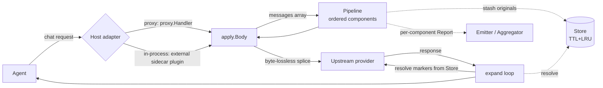
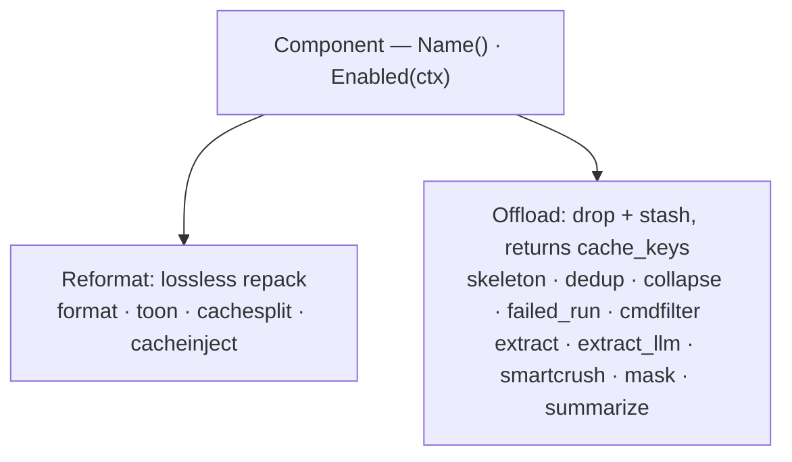

# Technical Overview

context-guru is provider-agnostic **context engineering** for LLM agents: a Go
core that shrinks the tokens a request carries — losslessly, or
lossy-but-reversible — **without touching the agent**. The same core runs as an
HTTP **proxy/gateway** or as an **in-process plugin**.

## The problem

Agents re-send bulky text on every turn: system prompts, past turns, and
especially **tool outputs** — file reads, command logs, API responses. On a
long agentic session (say Claude Code on SWE-bench) the transcript of tool
outputs re-sent each turn dominates the token bill — it costs money and latency
and pushes against the context window. context-guru parses the request's
`messages` array, rewrites the bulky parts, and hands back a **smaller request
of the exact same shape** before it reaches the model.

## The three guarantees

!!! note "These hold for every component, every request"
    - **Fail open, always** — any component error or panic reverts *that
      component only*; the original request is always a valid fallback.
    - **Never worse** — a component that grows the request is reverted.
    - **Reversible** — every lossy drop leaves a `<<cg:HASH>>` marker and stashes
      the original, recoverable via a model-callable `context_guru_expand` tool
      or `GET /expand`.

## Architecture

Components implement one of two lossiness-typed interfaces and are stacked in
config order:

## Core concepts

- **Component** — one compaction step with `Name()` and `Enabled(ctx)`.
- **Reformat vs Offload** — a *Reformat* component repacks losslessly (nothing
  leaves the wire, nothing to stash); an *Offload* component drops bytes and
  **must** return the `cache_keys` under which it stashed the originals, or the
  pipeline reverts it.
- **Pipeline** — the ordered list of components applied to a request, run
  fail-open and never-worse; each component is isolated by a snapshot/restore
  guard.
- **Marker** — the `<<cg:HASH>>` placeholder an Offload writes in place of
  dropped content, pointing at the stashed original.
- **Store** — the per-session state backend (in-memory TTL+LRU by default) that
  holds rewind data (`cache_key → original`) and sticky ids.
- **Session** — the key that ties turns of one conversation together (an
  explicit host id, else a content hash).
- **Preset** — a named default pipeline (e.g. `balanced`, `agent`) that explicit
  config fields override.
- **Expand loop** — the host-glue continuation that resolves a `<<cg:HASH>>`
  marker from the Store when the model calls `context_guru_expand`.

The deep dive lives in [Architecture](../design.md).

## Next steps

- :material-rocket-launch: **[Quickstart: Proxy](quickstart-proxy.md)**

    Build the binary, run `--preset balanced`, point an agent at it, and check
    savings.

- :material-scissors-cutting: **[Components](../components.md)**

    Every registered component: how it works, before → after, lossiness,
    config, best use.

- :material-book-open-variant: **[How-to Guides](../how-to/choose-a-preset.md)**

    Choose a preset, integrate as a plugin, recover offloaded context, measure
    savings.

- :material-chart-bar: **[Benchmarks](../RESULTS.md)**

    Live three-way SWE-bench Verified study — context-guru is the cheapest arm
    (−13.2% billed cost vs baseline) and solves the most tasks (88%).

