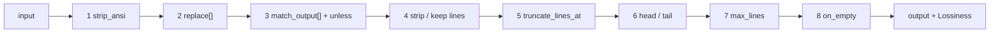

# Author a custom DSL filter

`components/dsl` is a declarative, user-extensible text-filter engine (adapted from rtk), wrapped by
the [`cmdfilter`](../components/cmdfilter.md) component. Filters are authored in YAML — **no
recompile** — matched by descending `priority` then by name, and each runs a fixed 8-stage pipeline. Because filters
drop lines they are lossy, which is why the wrapping `cmdfilter` is an
[Offload](../components.md#offload-lossy-reversible): it stashes the original first and appends a
`<<cg:HASH>>` recovery hint only when the filter was actually lossy.

## The 8-stage pipeline

A matched filter runs its input through these stages in order:



The engine reports `Lossiness` back to `cmdfilter`, which drives the recovery hint: `None` (nothing
dropped / reversible reformat, no hint), `Tail` (a clean contiguous tail dropped — the hint names the
cut point, since re-reading from there is cheaper than a full expand), `Whole` (non-contiguous or
whole-blob loss — the hint points at the expand tool).

## Filter fields

All optional except `match`.

| Field | Purpose |
|---|---|
| `match` | regex tested against the **selector** (the output's first few non-empty lines; `(?m)` is applied, so `^`/`$` anchor per line) — decides if this filter applies |
| `family` | command family for the per-family `/stats` ledger: `builds` / `tests` / `iac` / `pkg` / `net` / … |
| `priority` | match order — higher first, then by name. Use it to put a specific filter ahead of a generic one. |
| `strip_ansi` | strip ANSI escape codes |
| `replace` | chained `pattern` → `replacement` substitutions, `$1` backrefs |
| `match_output` | whole-blob short-circuit: `pattern` / `message` / `unless` |
| `strip_lines_matching` **xor** `keep_lines_matching` | drop, or keep-only, lines matching these regexes (mutually exclusive) |
| `truncate_lines_at` | per-line character cap |
| `head_lines` / `tail_lines` | keep the first / last N lines |
| `cap` / `cap_reduce` | a **shared** line budget by signal density — `errors` 20, `warnings` 10, `list` 20, `inventory` 50, `buildlog` 80; `cap_reduce: N` lowers it, underflow-safe. Prefer this to a hand-picked `max_lines`. |
| `max_lines` | absolute line cap with an omission marker (wins over `cap` if both are set) |
| `on_empty` | replacement text when the output ends up blank |

!!! warning "strip xor keep"
    `strip_lines_matching` and `keep_lines_matching` are mutually exclusive — set one or the other,
    never both.

!!! danger "Guard every `match_output` collapse with `unless`"
    A `match_output` rule replaces the **whole** output with one message. Without an `unless`, a
    build that emits a warning *and* a success marker collapses to `ok` and the warning is gone —
    and in a proxy the agent cannot re-run the command to find it. Every shipped collapse rule
    carries `unless: 'error|warning|failed|…'` plus a negative test proving the co-occurring case
    does **not** collapse. Do the same in your own filters.

    Watch for guards that can never fire: `dotnet build` prints `0 Error(s)` on success, so guarding
    on the word "error" would block every collapse. Guard on the diagnostic *form*
    (`(error|warning) [A-Z]+\d`) instead.

## A full example (pytest)

Documents load with `schema_version: 1` and strict unknown-field rejection.

```yaml
schema_version: 1
filters:
  pytest:
    description: keep failures + summary, drop passing noise
    match: "(pytest|=+ test session starts)"
    strip_lines_matching: ["^\\s*$", " PASSED", "^\\.+$"]
    max_lines: 80
    on_empty: "pytest: all passed"
tests:                       # inline; run via dsl.RunTests (a `verify` command)
  pytest:
    - name: all-green
      input: "pytest\n....\n"
      expected: "pytest: all passed"
```

### Ship tests with the filter

Inline `tests` (input → expected) **run at load time** as well as via `dsl.RunTests`, so a filter
that doesn't do what its tests say never loads at all. Above, the `all-green` case proves a passing
run collapses to the `on_empty` message — if a future edit breaks that, the load fails.

### Write the selector against a real sample

This is the step that most often goes wrong. `match` is tested against the output's **first few
non-empty lines**, not against a command. An `rtk`-style command regex (`^terraform\s+plan`) compiles
fine and never fires. Paste a real sample of the output and write the regex against a line that
actually appears near its top (`^Refreshing state`, `^> Task :`, `^==> Downloading`).

Two traps, both found by measuring real traffic rather than by reasoning:

- **Don't assume your signature is line 1.** Agent harnesses prepend their own preamble
  (`Exit code 1`, `Internet access disabled`), so the selector deliberately spans several lines. Do
  not write a filter that only works when its banner leads.
- **Key on tool identity, not a generic verb.** `^Compiling ` looks like a Swift signature and is
  also what Cython and cargo print — a filter anchored on it will strip other tools' output. Prefer a
  signature no other tool emits (`^Compiling \S+ \S+\.swift`), and give a filter whose selector is
  unavoidably generic a **negative** `priority` so it only catches leftovers.

Selectors that match nothing are logged: `/stats` exposes `cmdfilter_selector_misses`, the frequency-
ranked list of output shapes no filter claimed. That is the backlog of filters worth writing — the
shipped `apt` filter and `gcc`'s widened selector both came out of reading it.

### Be conservative with strip rules

A strip rule matching more than you meant is silent: the line is gone and the output still looks
plausible. `^debconf: ` looks like install noise and also matches
`debconf: unable to initialize frontend`. Write the rule as narrowly as the noise allows, and pair a
high-volume filter with a test that asserts a list of must-survive lines against a wall of
boilerplate (see `TestAptKeepsProblems`).

### The load-time guardrails

A document is rejected at load — not at first use — if two filters share a name, a regex doesn't
compile, `strip` and `keep` are both set, `cap` names an unknown class, `cap_reduce` appears without
`cap`, or any inline test fails.

## Load it into `cmdfilter`

Filters are passed to the [`cmdfilter`](../components/cmdfilter.md) component via its `filters`
config — inline filter YAML docs, added with **no recompile**:

```yaml
components:
  cmdfilter:
    filters:
      - |
        schema_version: 1
        filters:
          pytest:
            match: "(pytest|=+ test session starts)"
            strip_lines_matching: ["^\\s*$", " PASSED", "^\\.+$"]
            max_lines: 80
            on_empty: "pytest: all passed"
    disable_builtins: false   # keep the 26 shipped filters too
    min_size: 400             # byte floor: below it the marker costs more than the saving
```

- `cmdfilter` is `Enabled` only when ≥1 filter is loaded.
- It ships [26 filters](../components/cmdfilter.md#the-shipped-filter-set); set
  `disable_builtins: true` to run only your own.
- The output's first **six** non-empty lines are the selector each filter's `match` is tested
  against, in descending `priority` then name order.
- Outputs smaller than `min_size` (default **400** bytes) are skipped entirely. The floor is a
  measured value, not rtk's inherited 500 — see
  [the size floor](../components/cmdfilter.md#size-floor) for the sweep behind it.

!!! tip
    Filtering that doesn't shrink the output, or output whose first line matches no filter, is a
    no-op — `cmdfilter` leaves the message untouched (fail-open, never-worse). See
    [cmdfilter](../components/cmdfilter.md).
