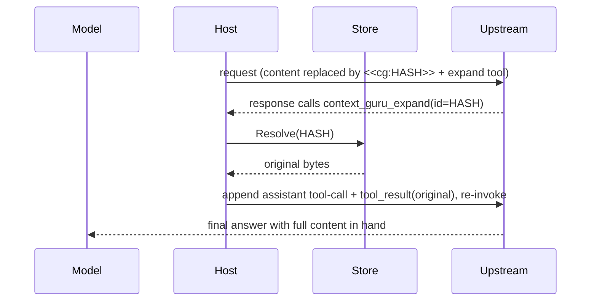

# Reversibility & recovery

Every lossy [Offload](../components.md#offload-lossy-reversible) is reversible: the
component replaces the content with a `<<cg:HASH>>` marker and stashes the original in the
[store](../design.md#state-the-store) under that hash. An offload that drops content but
returns no key is treated as a failure and reverted, so nothing is ever silently lost.

The marker is the recovery handle:

```text
[older tool output masked] <<cg:b162e82de872a202>> [full output: call context_guru_expand]
```

## Three ways to recover

**1. The model asks for it.** The host injects a `context_guru_expand(id)` tool into the
request. When the model needs what is behind a marker, it calls the tool with the hash.

**2. The host resolves it and continues.** The host looks the hash up, appends the original
as a tool result, and re-invokes upstream so the model finishes with the full content in
hand — all before the response reaches your agent.

!!! info "Recovered content is APPENDED, never put back where the marker was"
    The marker stays exactly where the offloader wrote it, hash id and all, and the original
    arrives at the **end** of the conversation as a `tool_result`. That is a prompt-cache
    property before it is anything else: `messages` is hashed in order, so rewriting a message
    in the middle of a transcript discards every cached byte from that point on, while
    appending two turns at the end leaves the whole prefix intact. Splicing the original back
    over its marker would read as a tidier transcript and cost the entire prefix on every
    expand call.

    Pinned by `TestContinuationAppendsAndNeverRewritesAnEarlierMessage`, which asserts that no
    pre-existing message changes by a single byte, that the marker survives, and that the
    recovered text appears **only** in the last message.



**3. Out of band.** `GET /expand?id=<hash>` returns an offloaded original directly.

## Recovery needs the store

The store *is* the reversibility mechanism. It defaults to in-memory TTL+LRU — 10000s
sliding TTL (refreshed on every read), 5000 entries, a 256 MiB rewind reserve, 100 sticky
sessions — and holds, per session:

- **Rewind** — `cache_key → original bytes`, what the expand loop resolves. These live in a
  **reserve** that is never evicted to admit a new payload: once a marker has been sent the
  promise is outstanding, so a full reserve makes the pipeline **decline the next removal**
  (counted as `stash_refused`) instead of quietly breaking an older one. Payloads carry a
  **shorter TTL** than everything else (`stash_ttl_seconds`, 1800 s) because each turn's replay
  re-derives them from the transcript — see
  [why payloads expire sooner](../reference/config.md#why-payloads-expire-sooner-than-decisions).
- **Sticky** — content ids already reduced on earlier turns, so output stays byte-stable
  across turns.
- **Frozen decisions** — the exact replacement bytes an offloader replays so an
  already-cached message stays byte-identical. These are pinned against eviction: losing one
  flips a message inside the provider's cached prefix and rewrites the whole suffix at
  ~11.5× the read price. The pin is capped at half `max_entries`, and pins plus rewind
  payloads together leave a quarter of `max_entries` always evictable, so neither exemption
  can starve the other or the plain cache.

Set `store.enabled: false` and offloads become **one-way** — nothing is stashed and nothing
can be recovered. The [llm-d compaction service](../examples/llm-d-service.md) does this
deliberately (with `marker_mode: off`) so `/compact` returns a clean, marker-free body.

<details markdown="1">
<summary>Troubleshooting</summary>

**The model called expand and got a placeholder back.** The original expired or was evicted
from the store. The provider requires one `tool_result` per `tool_call_id`, so an explicit
placeholder is sent rather than nothing — which turns that offload lossy. Check `stash_missing`
at [`/stats`](../reference/routes.md#get-stats): that is the one that means a marker went out with
nothing behind it. `stash_expired` on its own does **not** — a reclaimed payload is normally
re-derived by the next turn's replay, counted as `stash_revived` — so the remedy is the reserve
(`store.max_entries` / `store.stash_max_bytes`), which is what refused the re-stash, and
`store.stash_ttl_seconds` only if `stash_expired` is running far ahead of `stash_revived`.
`stash_refused` is the *other* case and needs `store.max_entries` or `store.stash_max_bytes` —
there nothing became irreversible, because the removals were declined.

The turn still **completes**: the placeholder continuation is sent even when *nothing*
resolved, so the model reads "no longer available" and finishes with text. It used to replay
the model's raw `tool_use` to the client in that case, which is a turn a client cannot answer
— and on an agent's own compaction request reads as a summary that came back empty. That is
also what lets the tool be advertised on every request in a session: the advertise condition
no longer has to avoid ever reaching this path, so it no longer has to read the turn, so the
`tools` array no longer changes shape and the prompt-cache prefix survives.

**Expansion did not happen at all.** The loop is capped at 3 rounds, and it bails if the
model calls another tool alongside the expand call — the response is returned as-is. Check
`bounces` in `/stats` to confirm whether restoration fired.

**Restoration does not fire on my streaming OpenAI traffic.** Streaming reconstruction is
Anthropic-only. A marker-bearing OpenAI *streaming* response is replayed raw (fail-open) and
restoration does not fire on it. Non-streaming OpenAI and streaming Anthropic both work
normally.

**One request lost its streaming.** A streaming response is inspected with a **bounded
peek**: the proxy buffers only up to the first `content_block_start`, and if that block is
not a call to the expand tool it flushes the peek and streams the remainder. Only a response
that *opens* with the expand call is read in full, and for that one time-to-first-byte
becomes time-to-last-byte. `/stats` reports the split: `sse_streamed`, `sse_buffered`,
`sse_buffered_pct`, `sse_ttfb_ms_avg`, `sse_ttfb_ms_avg_buffered`. The last of those is
time-to-*last*-byte by construction, so it is not comparable to `sse_ttfb_ms_avg`.

The peek's accepted limit: a response that opens with thinking or text and calls expand
*later* streams through, so the client receives the model's raw expand `tool_use` instead of
the proxy resolving it — the same outcome you already get when the model batches expand with
another tool, or when no id resolves. `sse_expand_after_stream` counts it, so the rate is a
number rather than an assumption. The trade is deliberate: buffering every advertised-tool
response cost ~21 s of extra time-to-first-byte on a third of all responses, and the expand
loop resolved 5 calls in 5,752 requests.

**A page or message that merely quotes a marker counts as marker-bearing.** Marker matching
accepts both the plain `<<cg:HASH>>` spelling and the HTML-escaped
`&lt;&lt;cg:HASH&gt;&gt;` form that Go's JSON encoder normally produces, case-insensitively.
The bias is deliberate: over-inspecting a response costs latency, missing a real expand call
costs content.

**Frozen-decision health.** `frozen_hits` / `frozen_misses` / `frozen_dropped` /
`frozen_repaired` / `frozen_flips` — see
[Routes](../reference/routes.md#freeze-replay-health). A dropped decision is re-derived when
re-derivation is reproducible (`mask`, `failed_run`, whose replacement is a pure function of
content and config). `extract_llm` is excluded on purpose: its replacement is sampled model
output, so re-deriving could splice *different* bytes into a cached prefix.

</details>

See also: [Components](../components.md) · [When your agent compacts](agent-compaction.md) ·
[Routes & headers](../reference/routes.md)
