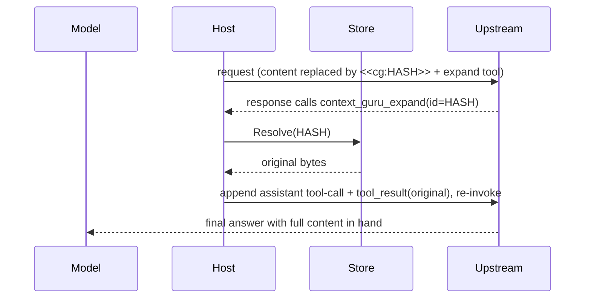

# Reversibility & recovery

Every lossy [Offload](../components.md#offload-lossy-reversible) is reversible: the
component replaces the content with a `<<cg:HASH>>` marker and stashes the original in the
[store](../design.md#state-the-store) under that hash. An offload that drops content but
returns no key is treated as a failure and reverted, so nothing is ever silently lost.

The marker is the recovery handle:

```text
[older tool output masked] <<cg:b162e82de872a202>> [full output: call context_guru_expand]
```

## Three ways to recover

**1. The model asks for it.** The host injects a `context_guru_expand(id)` tool into the
request. When the model needs what is behind a marker, it calls the tool with the hash.

**2. The host resolves it and continues.** The host looks the hash up, appends the original
as a tool result, and re-invokes upstream so the model finishes with the full content in
hand — all before the response reaches your agent.



**3. Out of band.** `GET /expand?id=<hash>` returns an offloaded original directly.

## Recovery needs the store

The store *is* the reversibility mechanism. It defaults to in-memory TTL+LRU — 10000s
sliding TTL (refreshed on every read), 1000 entries, 100 sticky sessions — and holds, per
session:

- **Rewind** — `cache_key → original bytes`, what the expand loop resolves.
- **Sticky** — content ids already reduced on earlier turns, so output stays byte-stable
  across turns.
- **Frozen decisions** — the exact replacement bytes an offloader replays so an
  already-cached message stays byte-identical. These are pinned against eviction: losing one
  flips a message inside the provider's cached prefix and rewrites the whole suffix at
  ~11.5× the read price. The pin is capped at half `max_entries` so one session cannot
  starve the rewind stashes.

Set `store.enabled: false` and offloads become **one-way** — nothing is stashed and nothing
can be recovered. The [llm-d compaction service](../examples/llm-d-service.md) does this
deliberately (with `marker_mode: off`) so `/compact` returns a clean, marker-free body.

<details markdown="1">
<summary>Troubleshooting</summary>

**The model called expand and got a placeholder back.** The original expired or was evicted
from the store. The provider requires one `tool_result` per `tool_call_id`, so an explicit
placeholder is sent rather than nothing — which turns that offload lossy. Raise
`store.ttl` / `store.max_entries` if you see it often.

**Expansion did not happen at all.** The loop is capped at 3 rounds, and it bails if the
model calls another tool alongside the expand call — the response is returned as-is. Check
`bounces` in `/stats` to confirm whether restoration fired.

**Restoration does not fire on my streaming OpenAI traffic.** Streaming reconstruction is
Anthropic-only. A marker-bearing OpenAI *streaming* response is replayed raw (fail-open) and
restoration does not fire on it. Non-streaming OpenAI and streaming Anthropic both work
normally.

**One request lost its streaming.** When a request carries no marker, the SSE response
streams straight through with no added latency. When a marker *is* present the response has
to be read in full and inspected, so time-to-first-byte becomes time-to-last-byte for that
request. `/stats` reports the split: `sse_streamed`, `sse_buffered`, `sse_buffered_pct`,
`sse_ttfb_ms_avg`, `sse_ttfb_ms_avg_buffered`. The last of those is time-to-*last*-byte by
construction, so it is not comparable to `sse_ttfb_ms_avg`.

**A page or message that merely quotes a marker counts as marker-bearing.** Marker matching
accepts both the plain `<<cg:HASH>>` spelling and the HTML-escaped
`&lt;&lt;cg:HASH&gt;&gt;` form that Go's JSON encoder normally produces, case-insensitively.
The bias is deliberate: over-inspecting a response costs latency, missing a real expand call
costs content.

**Frozen-decision health.** `frozen_hits` / `frozen_misses` / `frozen_dropped` /
`frozen_repaired` / `frozen_flips` — see
[Routes](../reference/routes.md#freeze-replay-health). A dropped decision is re-derived when
re-derivation is reproducible (`mask`, `failed_run`, whose replacement is a pure function of
content and config). `extract_llm` is excluded on purpose: its replacement is sampled model
output, so re-deriving could splice *different* bytes into a cached prefix.

</details>

See also: [Components](../components.md) · [When your agent compacts](agent-compaction.md) ·
[Routes & headers](../reference/routes.md)
