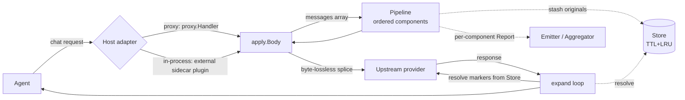
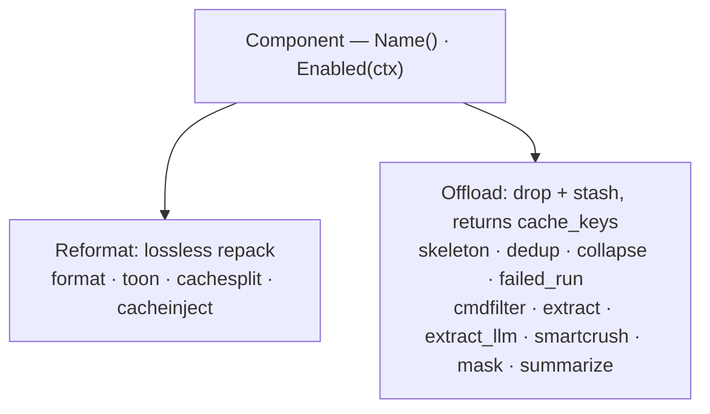

# context-guru: everything else

The [README](https://github.com/rossoctl/context-guru/blob/main/README.md) covers the Claude Code plugin quickstart. This page has the rest:
the safety guarantees, the benchmark, the architecture, the proxy/gateway path, every
component, the dashboard, operating modes, and how to integrate the core into your own service.

## Safety guarantees

context-guru is a single Go core that reduces the token cost of LLM-agent traffic. The **same
core** runs as an **HTTP proxy/gateway** (drop-in, any language, zero agent changes) or as an
**in-process plugin**. It operates on the messages array — dropping redundant tool output,
collapsing superseded runs, projecting large reads down to what's relevant — and every
reduction is **safe by construction**:

- **Fail open, always** — any component error or panic reverts *that component only*; the
  original request is always a valid fallback.
- **Never worse** — a component that would grow a message is reverted. You never pay to compact.
- **Reversible** — every lossy drop leaves a `<<cg:HASH>>` marker and stashes the original,
  recoverable via a model-callable `context_guru_expand` tool or `GET /expand`.

## Benchmark: the cheapest & highest-reward arm on SWE-bench Verified

Evaluated **live, end-to-end**, with the **claude-code** agent on **`aws/claude-sonnet-5`**, against a
no-compaction baseline, against the [**headroom**](https://pypi.org/project/headroom-ai/) request-stream
proxy, and against [**rtk**](https://github.com/rtk-ai/rtk) (Rust Token Killer, a shell-level Bash-output
hook). All 50 tasks scored under all **four** arms.

| dimension | baseline | **context-guru** | headroom | rtk |
|---|--:|--:|--:|--:|
| tasks solved | 86% | **88%** | 80% | 86% |
| **total billed cost** vs baseline | — | **−13.2%** | −5.3% | −9.0% |
| cache-read tokens vs baseline | — | **−17.8%** | −6.3% | −10.8% |
| cache-write tokens vs baseline | — | −0.4% | −0.9% | −1.1% |
| mean steps / task vs baseline | — | **−13.9%** | −2.8% | −8.0% |
| added latency / req | — | 117 ms | 63 ms | **0 ms** |
| tool's own LLM cost | — | $0.31 | $0 | $0 |

**context-guru is the cheapest arm and solves the most tasks** — it cuts billed cost **13.2%** vs no
compaction, driven by an **17.8%** cache-read reduction, while keeping cache-write within **1%** of baseline
(it never busts the cache). It does this by *freezing each compaction and replaying it byte-identically every
turn*, so the saving compounds across the whole session. The surprise is **rtk**: a simple deterministic
shell filter is the **2nd-cheapest** arm (**−9.0%**), **reward-neutral** (86% = baseline), at **zero
request-path latency and $0 tool cost** — it **beats the headroom proxy on both cost and reward**. rtk's
ceiling is that it only compresses **Bash-tool** output (Claude Code's built-in `Read`/`Grep`/`Glob` bypass
its hook), which is why the whole-request proxy goes deeper. Full four-way study, per-task/per-component
breakdowns, real before→after examples, and how to reproduce: **[docs/RESULTS.md](RESULTS.md)**.

## Architecture



Components implement one of two lossiness-typed interfaces and are stacked in config order:



## Claude Code plugin: advanced options

Change what it does:

```
/plugin configure   # context-guru → Preset → housellm          opt into context editing
/plugin configure   # context-guru → Cache strategy → none      stop the keep-alive pings
/context-guru:cache-strategy-picker   # names each strategy and what it costs
/context-guru:status                  # what is running, and what it saved (reads /stats)
/context-guru:uninstall               # undo the routing, restoring any base URL it replaced
```

**`/context-guru:status` is the one command for this — it takes no parameters.** There is no
separate `/stats` slash command: `/stats` is the proxy's own HTTP endpoint, and `/context-guru:status`
is what curls it (on the plugin's port, `8787` by default) and reports it back to you in Claude
Code. Hit the endpoint directly only if you want the raw JSON instead:

```sh
curl -s localhost:8787/stats | jq                 # same endpoint /context-guru:status reads
```

A changed option takes effect on your **next session**: the session hook stops the running proxy and
starts it with the new configuration.

| Option | Default | What it does |
|---|---|---|
| `preset` | `off` | The compaction PIPELINE — what happens to the request *body*. `off` is passthrough: nothing dropped, no marker written, no tool injected, no pipeline-triggered model call, because nothing is in the pipeline to do it. `house` and `housellm` opt into context editing. This does **not** mean the plugin is idle by default — see `cache_strategy` below, which is on out of the box. |
| `cache_strategy` | `5-min-ping` | Keep-alive, a.k.a. "cache" in casual use — separate from the `cache` *preset* above. **On by default**: it pings under the provider's 5-minute cache TTL so an idle session's cache is still live, which **spends your own quota** while nobody is at the keyboard. Under the default `off` preset this is the only thing context-guru actually does. `none` turns it off; `1-hour-head` asks for the 1-hour tier instead. |
| `port` | `8787` | Port the proxy listens on. |
| `idle_exit` | `24h` | Exit after this long with no requests. |
| `upstream` | — | Chain behind an existing gateway instead of going straight to Anthropic. |

Keep-alive targets a measured cost, not an assumed one: idle cache misses were 3.7% of requests and
**23.6% of all spend** over the measured window, at an 8.5x penalty each. Whether it nets positive on
*your* traffic is reported by `keepalive_net_usd`, in `/stats`' own `savings` block (see below,
`--dashboard` required) — no need to open the dashboard for this one number. A negative net is
possible, and `none` is a legitimate answer.

**If it breaks and Claude cannot fix it:** `~/.local/state/context-guru/context-guru-reset` undoes the
routing from a plain terminal — no session, no proxy, no network needed. A dead proxy fails every
request, including the ones an uninstall skill would need, so the way out cannot itself be a skill.

## Proxy / gateway: run it yourself

For a full org, run context-guru as a standalone proxy in front of the provider instead of the
per-machine plugin. Build and prerequisites: [docs/setup.md](setup.md).

A release binary is statically linked, **no Go and no C compiler needed** — or build from source
(see [docs/setup.md](setup.md)), or build the gateway image:

```sh
docker build -t context-guru:local .
```

```sh
# 1 — run the proxy (ships with the SWE-bench-winning cache-aware config by default)
./bin/context-guru-proxy                          # --preset house (the default); listens on :4000

# 2 — point any agent at it (one port serves both dialects)
export ANTHROPIC_BASE_URL=http://localhost:4000/anthropic
export OPENAI_BASE_URL=http://localhost:4000/openai/v1
claude                                            # e.g. Claude Code

# 3 — watch the savings add up
curl -s localhost:4000/stats | jq                 # token-weighted savings rollup
```

Real output from a live session (two turns, one keep-alive ping landed in between) —
`savings` reports the same shape for all three scopes (`current`, `live`, `all`), so a
session mid-flight and the lifetime total are directly comparable:

```json
{
  "keepalive": {
    "live_sessions": 1,
    "pings": 1,
    "skipped": 3,
    "failed": 0,
    "wrote_instead_of_read": 0,
    "spend_usd": 0.0033540999999999996
  },
  "savings": {
    "current": {
      "cost_usd": 0.023350649999999997,
      "baseline_cost_usd": 0.023350649999999997,
      "cg_llm_cost_usd": 0,
      "net_saved_usd": 0,
      "cachesplit_saved_usd": 0,
      "keepalive_ping_usd": 0.0033540999999999996,
      "keepalive_saved_usd": 0.03845715,
      "keepalive_net_usd": 0.035103050000000004,
      "total_saved_usd": 0.035103050000000004
    },
    "live": {
      "cost_usd": 0.023350649999999997,
      "baseline_cost_usd": 0.023350649999999997,
      "cg_llm_cost_usd": 0,
      "net_saved_usd": 0,
      "cachesplit_saved_usd": 0,
      "keepalive_ping_usd": 0.0033540999999999996,
      "keepalive_saved_usd": 0.03845715,
      "keepalive_net_usd": 0.035103050000000004,
      "total_saved_usd": 0.035103050000000004
    },
    "all": {
      "cost_usd": 0.21221960000000004,
      "baseline_cost_usd": 0.21221960000000004,
      "cg_llm_cost_usd": 0,
      "net_saved_usd": 0,
      "cachesplit_saved_usd": 0,
      "keepalive_ping_usd": 0.0033540999999999996,
      "keepalive_saved_usd": 0.03845715,
      "keepalive_net_usd": 0.035103050000000004,
      "total_saved_usd": 0.035103050000000004
    }
  }
}
```

Or drive it directly with an Anthropic-style request (this is exactly how the quickstart is tested — see
[docs/get-started/quickstart-proxy.md](get-started/quickstart-proxy.md)):

```sh
curl -s localhost:4000/anthropic/v1/messages \
  -H 'content-type: application/json' \
  -H "Authorization: Bearer $YOUR_KEY" \
  -d '{"model":"...","max_tokens":64,"messages":[ ... ]}'
```

Presets: **`house`** is the binary's default. **`codesmart`** is the SWE-bench-winning
cache-aware config, `[format, textclean, searchfold, dedup, failed_run, cmdfilter, extract_llm, extract, linecap, cachesplit]`, and is what the
published benchmark numbers describe — pass `--preset codesmart` to run it. **`codesafe`** (the same
minus the LLM pass — deterministic-only `[format, textclean, searchfold, dedup, failed_run, cmdfilter, extract, collapse, linecap, cachesplit]`,
zero model calls by policy), plus `general`, `agent`, `aggressive`, `coding`, `mcp`, `balanced`, `safe`,
`summarize`, `off`.
`codesmart`'s LLM relevance-trimmer (`extract_llm`) engages only when a cheap model is configured
(`CHEAP_MODEL*`); without one it safely no-ops and behaves like `codesafe`.
See [docs/components.md](components.md) and [docs/reference/presets.md](reference/presets.md).

| Flag / env | Default | Purpose |
|---|---|---|
| `--preset` / `PRESET` | `house` | pipeline preset when no `--config` |
| `--idle-exit` / `IDLE_EXIT` | `0` (never) | exit after this long unused; floor `max(2 × store.ttl_seconds, 1h)`, refused with `--upstreams` |
| `--version` | — | print version and commit, then exit |
| `--config` / `CONFIG` | — | YAML config (overrides preset) |
| `--listen` / `LISTEN_ADDR` | `:4000` | listen address. The flag exists so the port is visible in `ps` and to a supervisor |
| `--anthropic-upstream` / `ANTHROPIC_UPSTREAM` | `https://api.anthropic.com` | Anthropic upstream base |
| `--openai-upstream` / `OPENAI_UPSTREAM` | `https://api.openai.com` | OpenAI upstream base |
| `OPENAI_API_KEY` / `ANTHROPIC_API_KEY` | — | real key injected on forward (gateway mode); empty = pass client auth through |
| `CHEAP_MODEL` (+ `CHEAP_MODEL_*`) | — | dedicated cheap model for the LLM components (`extract_llm`, `summarize`) |
| `FORCE_MODEL` | — | overwrite the request `model` (eval-containers `EVAL_MODEL`) |

Routes: `POST /openai/v1/chat/completions`, `POST /anthropic/v1/messages`,
`POST /compact` (stateless — pipeline in, rewritten body out, no upstream call), `GET /healthz`,
`GET /stats` (savings rollups), `GET /metrics` (the same counters as Prometheus text),
`GET /expand?id=` (recover an offloaded original), and — with
`--dashboard` — `GET /dashboard/` plus `/api/*`. Per-request: header
`x-context-guru-session` sets the session key; `x-context-guru-bypass: true` skips the pipeline.

## Dashboard

`--dashboard` adds a persistent observability UI at `/dashboard/` plus a JSON/SSE API at
`/api/*`. It exists to answer the question the product exists to answer — **what value is
context-guru providing?** — and to make the answer falsifiable.

```sh
context-guru-proxy --preset codesmart --dashboard
# open http://localhost:4000/dashboard/
```

[](dashboard.md)

- **Four labelled savings denominators**, because a single "savings %" is a lie of
  omission: of what we tried to compact · of new provider-billed input · of the whole
  request (diluted) · unique-of-whole. Each one states what it divides by, and reports
  **n/a** rather than a number it cannot compute.
- **Baseline vs actual cumulative cost**, with the saved area shaded, plus an honest
  savings **waterfall** that will show a negative net if we spent more than we saved.
- **The cost of our own safety mechanisms beside their benefit** — cache-frozen tokens,
  restorations, reverts, and context-guru's own latency and LLM spend.
- **Per-component economics**: unique vs gross savings, `overcount_ratio`, own latency, and
  a verdict — so a component that burns wall time for nothing is obvious without a doc.
- **Sessions, requests, and the before/after Git-style diff** of exactly what was removed.
- **Benchmark ingestion** straight from `summary.json` + `rows-*.json`, with cost-vs-reward
  per arm and per-task drill-down.

Embedded via `go:embed` — no CDN, no npm, no build step, so it works air-gapped. Capture is
off the hot path (**~175 ns** per request, drops rather than blocks) and redaction happens
before anything reaches disk. `/stats` is unchanged.

Full guide: **[docs/dashboard.md](dashboard.md)**.

## The pipeline

Every component operates on tool-output messages. **Reformat** = lossless repack; **Offload** = drop
bytes, stash the original, leave a recoverable marker. Real, live-captured before→after examples for each
are in **[docs/components.md](components.md)** and **[docs/results/components.md](results/components.md)**.

| Component | Kind | What it does |
|---|---|---|
| `format` | Reformat | re-encodes pretty JSON tool output as compact JSON |
| `toon` | Reformat | re-encodes a uniform JSON array as TOON (header once, one row per item) |
| `cachesplit` | Reformat | splits the volatile tail off the `system` prompt so the shared prefix stays cacheable (in the default presets) |
| `cacheinject` | Reformat | places Anthropic `cache_control` breakpoints — **opt-in, in no preset**; placement is unmeasured |
| `dedup` | Offload | replaces a byte-identical earlier tool output with a pointer |
| `failed_run` | Offload | collapses superseded test/build runs, keeps the latest in full |
| `cmdfilter` | Offload | shrinks structured command output via declarative DSL filters |
| `extract` | Offload | deterministic noise collapse (repeated lines, blank runs, progress bars) |
| `extract_llm` | Offload (LLM) | a cheap model writes a sandboxed filter that trims to what's relevant |
| `collapse` | Offload | head/tail window on any oversized output (last-resort fallback) |
| `mask` | Offload | age-based GC — keep the newest N tool outputs, stash older ones |
| `skeleton` | Offload | replaces code-block function bodies with signatures (needs `cg_skeleton`) |
| `smartcrush` | Offload | keeps anchor items of a long JSON array, drops the middle |
| `summarize` | Offload (LLM) | compresses the middle of the trajectory into one summary (run alone) |

## Operating modes

`sync` (the default) compacts inline and the caller waits. One other mode changes that:

| Mode | The request path | Use it when |
|---|---|---|
| **`sync`** *(default)* | Compacts inline; the caller waits. | You want the savings. |
| **`observe`** | Forwards the request **untouched, byte for byte**, and reports what compaction *would* have saved. | You want to evaluate context-guru on your own traffic without enforcing it. |

```yaml
mode: observe
```

Byte-identity is **structural**: in observe mode the request path never runs the pipeline
at all (and never injects the expand tool), so no code path could alter a forwarded body.
Measured cost to the enforced path: **0.062 ms/req**, against 1,599 ms for `sync` on the
same benchmark.

Observe-mode numbers are reported under their own `potential_*` / `projected_*` keys that
share no name with an enforced metric, so a hypothetical can never be read as a realized
saving. On identical traffic its projection matches what `sync` actually achieved exactly
(23.06% both sides), and on traffic with nothing to save it correctly projects 0%.

This is a genuine differentiator, not a port: headroom has no observe/shadow/dry-run mode
at all — its `token` and `cache` modes are both enforcing.

Details in [docs/how-to/operating-modes.md](how-to/operating-modes.md).

## Integrate

| Option | What | Where |
|---|---|---|
| **Proxy / gateway** | `context-guru-proxy` in front of the provider; the eval-containers gateway image | `proxy/`, `cmd/context-guru-proxy/` |
| **In-process plugin** | an external sidecar plugin importing this module, running the same pipeline on `pctx.Body` | plugin lives in a separate repo; reuses `apply.Body` + `expand/` |
| _(also)_ **bifrost LLMPlugin** | run the pipeline as a `PreRequestHook` inside any bifrost deployment | `adapters/bifrost/` |

Details in [docs/integrations.md](integrations.md).

## Docs

- [docs/design.md](design.md) — architecture: component model, fail-open pipeline, store, session, expand loop, metrics, operating modes, the dashboard's capture/store layer.
- [docs/how-to/operating-modes.md](how-to/operating-modes.md) — sync vs observe: when to use each, and how to read observe's projections.
- [docs/dashboard.md](dashboard.md) — the persistent observability dashboard: metrics semantics, the diff view, storage, access gating, API.
- [docs/components.md](components.md) — every registered component: how it works, live before→after, lossiness, config, best use.
- [docs/integrations.md](integrations.md) — proxy gateway vs in-process plugin, with request paths.
- [docs/setup.md](setup.md) — setup + a concrete SWE-bench run through the eval-containers gateway.
- [docs/RESULTS.md](RESULTS.md) — the live four-way SWE-bench Verified benchmark (Claude Code, `aws/claude-sonnet-5`): context-guru is the cheapest arm (−13.2% billed cost vs baseline) and solves the most tasks (88%); headroom −5.3%/80%; rtk (shell-level Bash-output hook) −9.0%/86% at $0 tool cost.
