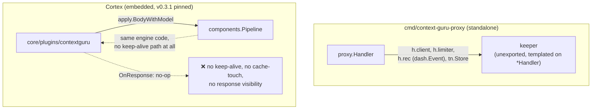
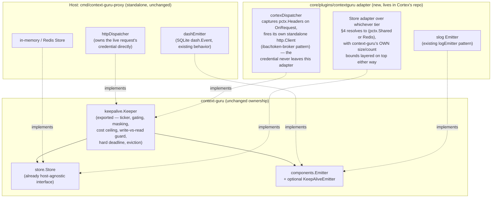
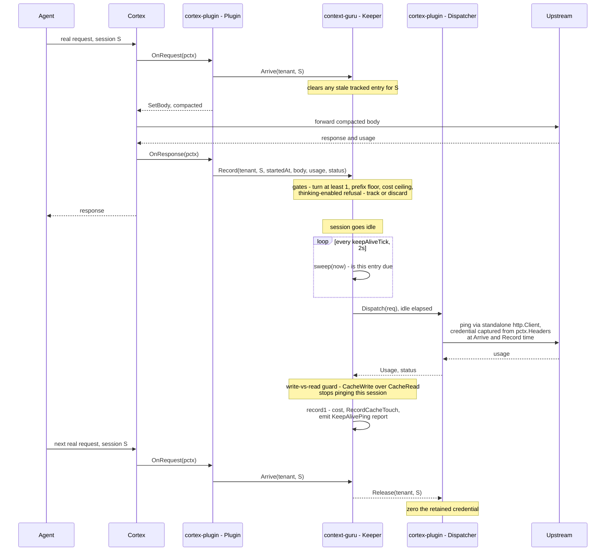
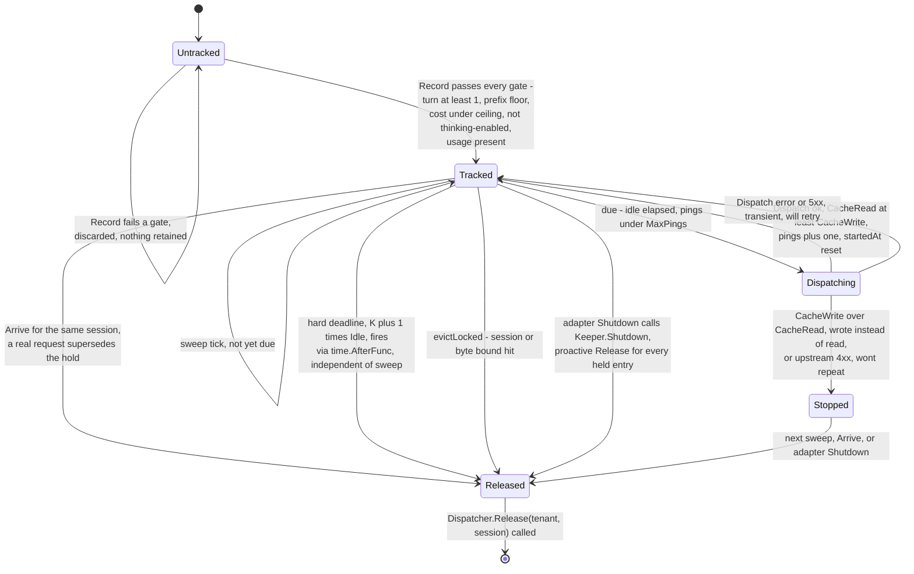
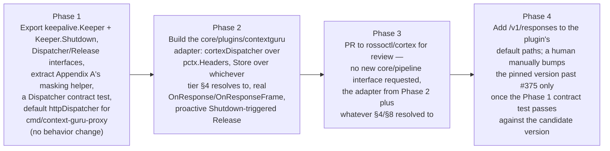

# Embedding context-guru in Cortex: a host-agnostic keep-alive, response and storage design

Status: draft for discussion with the Cortex (`rossoctl/cortex`) maintainers. Nothing here is
committed; "Cortex" sections describe what we'd ask them to build or decide, not what we're
building for them.

## 1. Why this exists

Cortex already embeds context-guru as a Go library (`core/plugins/contextguru`, pinned to
`v0.3.1`): a `WritesRequestBody` AuthBridge plugin that calls `apply.BodyWithModel` on the way
out. That covers context *compaction*. It does not cover three things the standalone
`cmd/context-guru-proxy` already does, because today they live in the `proxy` package, templated
directly on `*proxy.Handler`:

1. **Idle keep-alive** (`proxy/keepalive.go`) — a background goroutine that pings the upstream
   on its own schedule, independent of any inbound request, to stop a 5-minute prompt-cache
   entry from lapsing. Measured at **+$125/window, 12.9x everything the compaction pipeline
   delivered over the same window** — this is not a minor feature.
2. **Response visibility** — the plugin's `OnResponse` is a documented no-op today. Cache-touch
   recording, async summarize, and the keep-alive's own usage accounting all need the real
   response.
3. **Durable storage** for masked/offloaded content (`store.Store`) and for the keep-alive's own
   held state.

The governing constraint, settled in discussion: **all context-guru decision logic stays in
context-guru.** Cortex is piping — transport and credential custody, nothing else.

§3 covers how far that constraint goes for free: most of it already has a generic home in
Cortex's existing plugin surface. §4 is a place that genuinely doesn't have a settled answer yet —
stated as requirements and candidate options, not a decision we've made for Cortex. §5 is the
part that's ours — a self-contained addition to `core/plugins/contextguru`, buildable and
testable without Cortex deciding anything except §4. §8 is what we'd actually ask Cortex to
decide or confirm.

## 2. Current state



Two problems with this picture: the keep-alive logic cannot run inside Cortex at all today (it's
unexported and tied to `*Handler`), and even the parts that *could* run (compaction) aren't
getting the response back.

**The version pin itself is already a problem, independent of anything in this plan.** Cortex's
`core/go.mod` pins `v0.3.1`; context-guru's current tag is `v0.4.2` — six tagged releases ahead,
not just missing `#375` (named in §9's Phase 4). The one attempt to move it,
[cortex#1207](https://github.com/rossoctl/cortex/pull/1207) (`v0.3.1` → `v0.3.2`), was closed
without merging and without a stated reason. Before this plan adds a second, *stateful* exported
surface (`Dispatcher`, a background goroutine, held credentials) on top of the one pure function
(`apply.BodyWithModel`) Cortex depends on today, that version-skew story needs an answer — not
necessarily from us, but it needs to stop being silent. §9 proposes a concrete fix.

## 3. What Cortex already gives us — no infra change needed

Before designing anything new, it's worth being honest about how much of this is already there.
Four primitives in `core/pipeline` and `core/plugins/*` cover three of our four requirements
outright; the fourth (durable storage) is covered by an existing primitive whose fit is a real
open question, not a settled one — see §4.

| Requirement | Existing Cortex primitive | Where it's already proven |
|---|---|---|
| Initiate a request independent of any inbound call | `pipeline.Plugin`'s optional `Initializer`/`Shutdowner` interfaces (`Init(ctx) error`, `Shutdown(ctx) error`) run a background goroutine for the plugin's whole process lifetime, plus a plugin's own standalone `*http.Client` making calls that bypass the listener entirely | `core/plugins/ibac/plugin.go`: the judge call "uses a standalone http.Client that bypasses the listener," with a sentinel-header reentrancy guard (`X-IBAC-Judge: 1`) — the exact pattern `contextguru`'s own `cgModel`/`llmclient` extract-model call already uses (`X-Context-Guru-LLM`) |
| See the real response | `Pipeline.RunResponse` calls every plugin's `OnResponse(ctx, pctx)` with the full response body (if `ReadsBody`/`WritesResponseBody` is declared); `StreamingResponder.OnResponseFrame` for SSE | Already wired into the pipeline today — `contextguru`'s `OnResponse` is a no-op by *choice*, not a framework gap |
| The caller's credential, without Cortex having to custody it specially for us | `pctx.Headers http.Header` — the live request's raw headers, exposed directly, no accessor indirection | "Plugins read and mutate fields directly — there is no separate mutation API" (`core/pipeline/context.go`) |
| Durable, cross-request storage | `pctx.Shared` (`pipeline.SharedStore`, backed by `core/memstore.Store`) is one candidate — but see §4. `core/memstore/store.go`'s own doc calls it "intentionally semantics-free," and this repo's layout notes contrast it directly against `storage/` as the *non*-persistent tier | `core/plugins/sessionbudget` hit a structurally similar problem (per-session, cross-request, background-actor-readable state) and chose `core/storage`'s Redis backend instead, specifically because an in-memory, single-process, non-replicated store was the wrong tier for state a background actor depends on |

One non-obvious thing worth being precise about, because it decides whether *any* state we put in
`pctx.Shared` survives Cortex's hot-reload at all (independent of whether `pctx.Shared` is the
right tier — §4): `memstore.New()` is called exactly once per binary (`cmd/cortex/main.go`,
`cmd/cortex-envoy/main.go`, `cmd/cortex-cpex/main.go`) and assigned to the long-lived listener
objects (`rpSrv.Shared`, `fpSrv.Shared`). Cortex's reloader (`core/reloader/reloader.go`) rebuilds
and swaps the *pipeline* (every plugin's `Init`/`Shutdown` re-runs) on any config file change, but
the listener — and therefore `Shared` — is never part of that swap. That's true today, by
construction, in the current code — not something any doc comment or test currently commits to as
an invariant. `core/pipeline/sharedstore_test.go` only asserts that `memstore.Store` satisfies the
`SharedStore` interface and that `Context.Shared` is assignable; it says nothing about
reload-survival. §8 asks Cortex to make that a documented, tested guarantee if `pctx.Shared` is
the tier that ends up getting used for this (or for anything else that leans on it the way this
plan would).

## 4. Storage requirements for keep-alive state, and two candidates

This section exists because the previous draft of this plan asserted `pctx.Shared` was the answer
and asked Cortex to bless that assumption. That was the wrong order of operations — the review
that caught it is right that `core/plugins/sessionbudget` already faced a structurally identical
problem and chose differently. So: requirements first, then two concrete candidates with their
actual tradeoffs, with the choice — including "neither fits, build something new" — left to
Cortex.

### 4.1 What the state actually needs to do

- **Shape:** a per-(tenant, session) record holding a masked credential, the last body sent
  upstream, and a handful of scalars (turn count, prefix size, policy, ping count, cost spent) —
  `kaEntry` in `proxy/keepalive.go` today. Not large per entry (bounded by
  `maxKeepAliveBodyBytes`, 8 MiB today, almost always far smaller), but numerous (bounded by
  `maxKeepAliveSessions`, 512 today).
- **Written** once per real request (`Arrive`/`Record`, from `OnRequest`/`OnResponse`), **read**
  by a ticker goroutine on a 2-second sweep that isn't driven by any request.
- **Lifetime:** minutes typically, up to `(MaxPings+1)×Idle` at the outside — today's defaults put
  that under an hour, but a session override can extend it; not a multi-day retention need.
- **Consistency:** no cross-entry transaction needed. Each entry is independent; the only
  concurrency concern is two writers racing the *same* entry (handled today by `keeper`'s own
  mutex, and would need an equivalent under whatever storage tier is chosen).
- **Failure-mode tolerance — this is the one that actually decides the answer:** losing a tracked
  entry early (store eviction, process restart, replica that never gets to see it) means that
  specific session's idle gap goes unprotected and the *next real request* re-pays a normal
  cache-recreation cost. It is a missed optimization, not corruption, not a security property, and
  not something a caller observes as an error — consistent with context-guru's own "fail open,
  always" design posture (`CLAUDE.md`'s Hard Boundaries: "Any component error/panic reverts that
  component only; the original request is always forwarded as a valid fallback"). This is the
  concrete way this problem is **not** structurally identical to `sessionbudget`'s: losing budget
  state can let a tenant exceed a spend cap it was supposed to be prevented from exceeding — an
  enforcement failure with a security/cost-control consequence. Losing keep-alive state can't cause
  an over-spend or a wrong answer; at worst it reproduces exactly today's no-keep-alive behavior
  for one session.

### 4.2 Candidate A — `pctx.Shared` (`core/memstore`)

**Pros:** zero new dependency; works in every Cortex deployment today with no operator setup;
matches the failure-mode tolerance above directly (losing an entry degrades to the status quo).
**Cons:** single-process — invisible across replicas in a horizontally-scaled deployment; lost on
restart; no size/count bound of its own ("intentionally semantics-free" per its own doc), so the
adapter would need to layer `proxy/keepalive.go`'s existing bounds
(`maxKeepAliveSessions`/`maxKeepAliveBytes`/`maxKeepAliveBodyBytes`) on top itself rather than
relying on the store to protect memory; and — per §3 — its reload-survival is true by construction
today but not a documented or tested guarantee yet.

### 4.3 Candidate B — `core/storage` (Redis), matching `sessionbudget`'s precedent

**Pros:** survives process restarts and is visible across replicas — the stronger-precedent
choice, and the one `sessionbudget` already picked for a similarly-shaped problem;
`sessionbudget`'s `redis_unavailable: fail_open` config knob is a template for how to degrade
(which, per §4.1, is also the *correct* degrade mode for keep-alive specifically — losing the
Redis connection should mean "stop pinging," never "block the real request"). **Cons:** turns
keep-alive from a zero-dependency feature into one that requires Redis to be configured and
reachable in every deployment that wants it; a session's masked credential now exists outside
this process's memory, which changes (doesn't necessarily worsen, but changes) the threat model
Appendix A's masking discipline was designed against — worth Cortex's own security review if this
is the direction, since `sessionbudget`'s data (counters) and this data (credential material) are
not equally sensitive even if structurally similar in access pattern.

### 4.4 This is Cortex's decision, not ours

Both candidates are *existing* Cortex primitives — this plan isn't proposing a new storage layer
either way. What's open is whether either one, as it exists today, actually satisfies §4.1's
requirements, or whether it needs a small enhancement (a documented reload/size-bound contract for
`memstore`; a dedicated key namespace and masking review for the Redis path), or whether Cortex's
maintainers would rather do something neither candidate quite fits. We're not picking one in this
document — §8 asks the question directly, with the pros/cons above as the starting material rather
than a recommendation.

## 5. The context-guru-side adapter

Everything below lives in `core/plugins/contextguru` (or a sibling package) in the Cortex repo —
a PR we write and hand them for review, using only the primitives in §3 plus whichever storage
tier §4 resolves to. No new Cortex interface, no core-package change.

Export the keeper as its own context-guru package, decoupled from `*Handler` by one small
interface. The adapter (standalone binary's own existing wiring, or the new Cortex-side plugin
code) implements only transport and credential custody; everything else — timing, gating, cost
ceilings, the write-vs-read guard, storage, eviction — stays exactly the logic it is today in
`proxy/keepalive.go`, just not templated on `*Handler` anymore.



### 5.1 The two calls the adapter makes into `keepalive.Keeper`

Unchanged from `proxy/keepalive.go`'s `arrive`/`record`, just exported and no longer reading
`*http.Request` or `*Tenancy` directly — the adapter extracts what the keeper needs from `pctx`
and passes it as plain data:

```go
// Arrive: a real request just started on this session. Clears any stale
// entry so a ping can never race a real request on the same prefix.
func (k *Keeper) Arrive(tenant, session string) (pings int, refreshed int64, strategyID string)

// Record: the request that just finished might leave a cache entry worth
// protecting. body is the exact bytes sent upstream; everything else is
// what the host already has from its own request/response handling.
func (k *Keeper) Record(tenant, session string, startedAt time.Time, body []byte,
    provider bschemas.ModelProvider, route string, status int, u Usage, usageOK bool)
```

Under Cortex, `tenant` and `session` come straight off `pctx.Session.ID` (no new identity concept
needed — `SessionView.ID` is already exactly the correlation key the keeper wants), and `body` is
the same compacted bytes the plugin already computed via `apply.BodyWithModel` on `OnRequest`.

### 5.2 The one call `keepalive.Keeper` makes out — `Dispatcher`

```go
// Dispatcher performs one ping on the adapter's side. The keeper builds the
// exact ping body (pingBody: max_tokens:1/stream:false, byte-identical
// prefix) and the non-secret headers (anthropic-version, beta flags) —
// Dispatch never receives, and never needs, a credential from the keeper.
// It resolves tenant+session to whatever it captured off pctx.Headers at
// Arrive/Record time and attaches it itself.
type Dispatcher interface {
    Dispatch(ctx context.Context, req DispatchRequest) (Usage, status int, err error)

    // Release tells the adapter it may stop retaining whatever credential
    // material it holds for this session — the keeper is done with it
    // (stopped, retired, evicted, or hit its hard deadline).
    Release(tenant, session string)
}

type DispatchRequest struct {
    Tenant, Session, Route, Model string
    Body    []byte      // final ping bytes
    Headers http.Header  // non-secret only
}
```

`DispatchRequest.Headers` being "non-secret only" is enforced by construction, not by convention
to trust: the `Keeper` builds this set itself from an explicit allowlist
(`Anthropic-Version`/`Anthropic-Beta`/`OpenAI-Organization`/`OpenAI-Project` — mirroring
`pingHeaders()` in `proxy/keepalive.go` today), never by copying and redacting the live request's
full header set. There is no path by which a credential header could end up in it.

Everything that decides *whether and when* to call `Dispatch` — `due()`, `pingable()`, the
write-vs-read guard, `MaxUSDPerPing`, eviction, the `(K+1)×Idle` hard deadline — is unchanged
`keepalive.Keeper` logic, running inside context-guru's own package regardless of host.
`Dispatch`/`Release` is the entire surface the adapter implements, and — per §3 — every piece of
that implementation (reading `pctx.Headers`, firing a standalone `http.Client` call, masking the
credential while it's held) is a straightforward application of patterns Cortex's own codebase
already uses elsewhere. There is nothing here that needs Cortex's maintainers to design anything;
there's a PR for them to review.

### 5.3 Two correctness issues a hot-reload creates, and what closes each

**The double-fire window (cost, not safety).** The reloader starts the *new* pipeline's `Init`
before stopping the *old* one (after a drain window, default 30s), so for that window both the old
and new `Keeper`'s ticker could observe the same tracked entry and both consider it due. Since both
tickers resolve through the same `Dispatch` → real upstream call → write-vs-read guard, a
double-fire wastes one ping's worth of money rather than corrupting state. Closed by having the
adapter claim an entry atomically (compare-and-swap on a "claimed" marker in whichever store §4
resolves to, not just read-then-ping) before dispatching.

**The old instance's credential during its own `Shutdown` (a real gap in the previous draft).**
The claim above only protects the *cost* side. It does not address: when the *old* pipeline's
`Shutdown` runs (LIFO, under its own bounded deadline) while the old `Keeper`'s ticker still has a
tracked, credentialed entry it hasn't reached `due()` for yet, does anything call `Release` for
that entry before the old adapter's `Shutdown` returns? The state machine in §6.2, as drafted
before this revision, only reached `Released` via `Arrive`, the hard deadline, or eviction — never
via the adapter's own shutdown path. Left alone, that's either a credential sitting in memory with
nothing scheduled to zero it on a defined path, or it's fine because Appendix A's masking already
bounds it with a hard deadline regardless of whether anything is actively driving the `Keeper` —
but the plan should say which, not leave it implicit. **Fix:** the adapter's `Shutdown(ctx)` calls
a new, synchronous `Keeper.Shutdown()` method (stops the ticker, then walks every entry this
instance still holds and calls `Dispatcher.Release` for each one) *before* returning, so `Release`
is guaranteed to fire for every session the old instance held, within the plugin's own `Shutdown`
deadline — rather than depending on the ticker ever getting back around to it. Appendix A's masking
+ hard-deadline is the defense-in-depth backstop if even that is interrupted (a panic mid-shutdown),
not the primary mechanism.

### 5.4 The one thing that fails safely without a design change

**Pipeline-ordering between a credential-injecting plugin and this one.** If `static-inject` or
`token-exchange` isn't ordered before `contextguru` in a given deployment's pipeline YAML, the
adapter would capture whatever credential (or placeholder) was present at `Arrive`/`Record` time
instead of the final injected one. Concretely, that credential then gets used for a `Dispatch` call
later — against the real upstream, which either accepts it (if it happened to still be valid) or
rejects it with a 4xx, which `Keeper`'s existing "4xx stops repeating" guard (§6.2) already handles
by marking the session `Stopped` and never retrying. So a misconfiguration here fails as "keep-alive
silently never fires for this session" rather than as a security issue or a retry storm — not
silent in the sense of causing harm, but not surfaced to an operator either. Worth a line in
whatever deployment docs accompany this, not a design change.

## 6. Lifecycle

### 6.1 One session's idle gap, end to end

Three roles, carried as the visible label on each box: **context-guru** (the `Keeper` — unchanged
decision logic, host-agnostic), **cortex-plugin** (the new adapter in `core/plugins/contextguru` —
`Plugin` implements the two hooks, `Dispatcher` implements the one interface the `Keeper` calls
out through), and **cortex** (AuthBridge's own pipeline/listener — unmodified, just the thing that
invokes plugin hooks and carries traffic to and from `Agent`/`Upstream`).



### 6.2 One tracked entry's state machine



## 7. Response visibility and storage, concretely

- **Response visibility:** Cortex's pipeline already calls every plugin's `OnResponse(ctx, pctx)`
  on the real response, in reverse declaration order, with the full body if the plugin declares
  `ReadsBody`. Today's `contextguru` plugin's `OnResponse` is a no-op by choice. The fix is
  wiring: `OnResponse` extracts usage + body and calls `Keeper.Record` and feeds `apply`'s
  cache-touch/summarize-async machinery, same as the standalone proxy does on its own response
  path today. For streaming (SSE — the normal Claude Code shape), the plugin implements
  `StreamingResponder.OnResponseFrame` instead so it sees the usage block at the end of the
  stream rather than never getting a buffered response.
- **Storage:** `store.Store` (`Put`/`Get`/`Sticky`/`MarkSticky`/`Persists`) is already a small,
  host-agnostic interface — the adapter's implementation of it wraps whichever tier §4 resolves
  to. Because neither `memstore` nor a raw Redis client enforces a size or count bound of its own,
  the adapter must enforce *its own* bounds on top either way — mirroring
  `proxy/keepalive.go`'s existing `maxKeepAliveSessions`, `maxKeepAliveBytes`,
  `maxKeepAliveBodyBytes` constants — rather than trusting the backing store to protect memory for
  us. This is exactly the kind of thing the standalone proxy's `store.Store` implementations
  already do; the Cortex adapter just needs the same discipline over a different backing store.

## 8. What we're asking Cortex to decide or confirm

**The storage-tier decision in §4 is the real ask, not a confirmation.** Concretely, two
questions:

1. Does `pctx.Shared`'s reload-survival and unbounded sizing (true today by construction — see
   §3) hold up as something Cortex is willing to commit to as a documented, *tested* invariant —
   not just today's implementation accident — if that's the tier chosen?
2. Given `sessionbudget` already exists and chose Redis for a similarly-shaped problem, should
   this adapter target `core/storage` the same way, accepting a hard Redis dependency in exchange
   for durability §4.1 doesn't strictly require but might still be worth having? Or does the
   failure-mode difference in §4.1 mean this is a legitimate case for the lighter-weight tier where
   `sessionbudget` wasn't? We don't think we should answer this one unilaterally.

Two things we are **not** asking for, named here only so the record is honest about what we
considered and set aside:

- *A declared header-mutation-ordering capability*, analogous to `WritesRequestBody`'s pipeline
  ordering guarantee, so a credential-injecting plugin (`static-inject`/`token-exchange`) is
  provably ordered before ours. §5.4 covers why a misconfiguration here fails safely (a 4xx that
  stops the session's pings) rather than silently or dangerously. We're documenting the ordering
  requirement rather than asking for an enforcement mechanism — it would generalize well if it ever
  becomes a recurring problem for other plugins, but we have no evidence yet that it is one.
- *A way to re-inject a self-originated ping through the real outbound pipeline* (so AuthBridge's
  own observability/guardrail plugins see it too), instead of a standalone `http.Client` call that
  bypasses the listener. `ibac` already made the same tradeoff deliberately
  ("uses a standalone http.Client that bypasses the listener"), so we're following established
  precedent rather than introducing a new gap. Worth revisiting only if Cortex's own direction
  changes on that point independent of us. Related, and worth Cortex's own PR-review attention
  rather than ours to resolve here: today's plugin is stateless and carries no `/v1/pipeline`
  metrics or session-events surface; owning a resident background actor is new ground for it, and
  whether that changes its `optional`/no-default-profile build-tag classification
  (`scripts/profile-tags`) is a packaging call for whoever reviews the Phase 3 PR, not something
  this document resolves.

## 9. Phased plan



Phase 1 is entirely ours, ships independent of any Cortex decision, and is verified against the
existing keep-alive test suite (`keepalive_test.go`, `TestKeepAliveOnProductionSnapshot`,
`keepalive_openai_test.go`) with no behavioral delta expected for the parts that are pure
extraction. It also includes two things the review surfaced as missing: the masking helper
(Appendix A) extracted into its own package rather than left as a someday-refactor, and a
`Dispatcher`-contract test driven by the `Keeper`'s already-injectable test seams (`send`,
`dispatch`, `now`) so Phase 3's Cortex PR has something concrete to validate the adapter against
beyond manual diff review — and so a future context-guru release that changes `Keeper`'s behavior
has a chance of being caught by *this* repo's own CI before it ever reaches Cortex. Phase 2 is also
entirely ours, and — per §3/§5 — doesn't require Cortex to build or decide anything except
whichever way §4/§8 resolves. Phase 3 is the first point Cortex's maintainers are actually in the
loop, and what they're reviewing is a working adapter plus two real decisions (§8), not an abstract
design.

**The version bump stays a deliberate, manual act — this is not proposing automatic dependency
updates.** A human decides to open a bump PR, exactly as `cortex#1207` was a human-opened PR; what
changes is what that PR has to pass before another human merges it. Phase 4 adds `/v1/responses`
to the plugin's defaults, and separately — given the `v0.3.1`→`v0.3.2` bump already failed to land
once with no stated reason recorded anywhere — establishes a **gate**: whenever someone next
proposes bumping the pin (to close `#375`'s gap or for any later reason), that PR must run the
Phase 1 `Dispatcher`/`Keeper` contract test against the candidate version before it's eligible to
merge. The gate's job is narrower than "catch regressions" in the abstract — it's answering one of
two questions concretely for whichever version someone is considering: **did context-guru change
`Keeper`'s behavior in a way that breaks the contract this adapter depends on, or does adopting
this version require additional work in the adapter that wasn't needed before** (a new field on
`DispatchRequest`, a changed `Record` signature, a new required method)? A compile failure
localizes the latter; a contract-test assertion failure localizes the former. Either way, the
human doing the bump gets a concrete answer instead of a manual diff review of everything that
changed across however many releases — which is the discipline that was missing when
`cortex#1207` was abandoned with no comment.

## Appendix A — the credential retention discipline, portable as-is

This isn't Cortex's design to hand down — it's existing, working code we can hand them as a diff
(see Phase 1), because `proxy/keepalive.go`'s masking discipline (`credMask`, `xorMask`, `zero`,
`maskedHeader`) has no dependency on anything proxy-specific:

- Masked at rest with a per-process XOR key generated from crypto-rand — defends against
  accidental capture (heap dump, crash report, `/proc/pid/mem`, a stray `strings` pass), not
  against an attacker with code execution in the same process.
- Unmasked only for the duration of one `Dispatch` call, zeroed immediately after.
- Zeroed (not just dereferenced) on every removal path, because a dropped `[]byte` sits in the
  heap until a GC that may never come.
- Bounded by a hard `time.AfterFunc` deadline independent of any liveness loop, so a quiet process
  still drops the credential on schedule even if nothing else is running — and, per §5.3, is now
  also the explicit defense-in-depth backstop for the adapter's own proactive
  `Shutdown`-triggered release, not just the standalone proxy's safety net.

Extract this into a tiny shared helper package (`internal/credguard` or similar) that
`proxy/keepalive.go` and the new Cortex adapter both import, rather than copy-pasting it — one
security review covers both call sites instead of two. If Candidate B (§4.3) is the storage
direction Cortex picks, this masking review needs to happen *before* that lands, not after —
credential material leaving process memory for Redis changes what this discipline is protecting
against.
