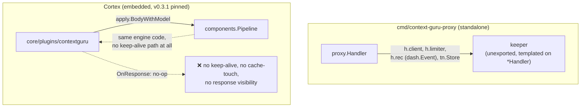
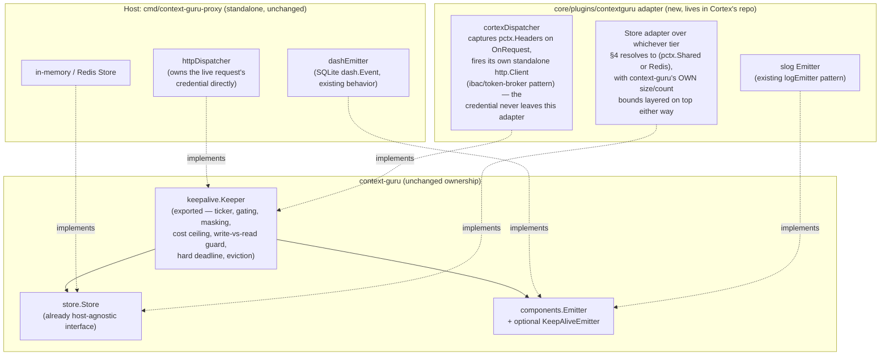
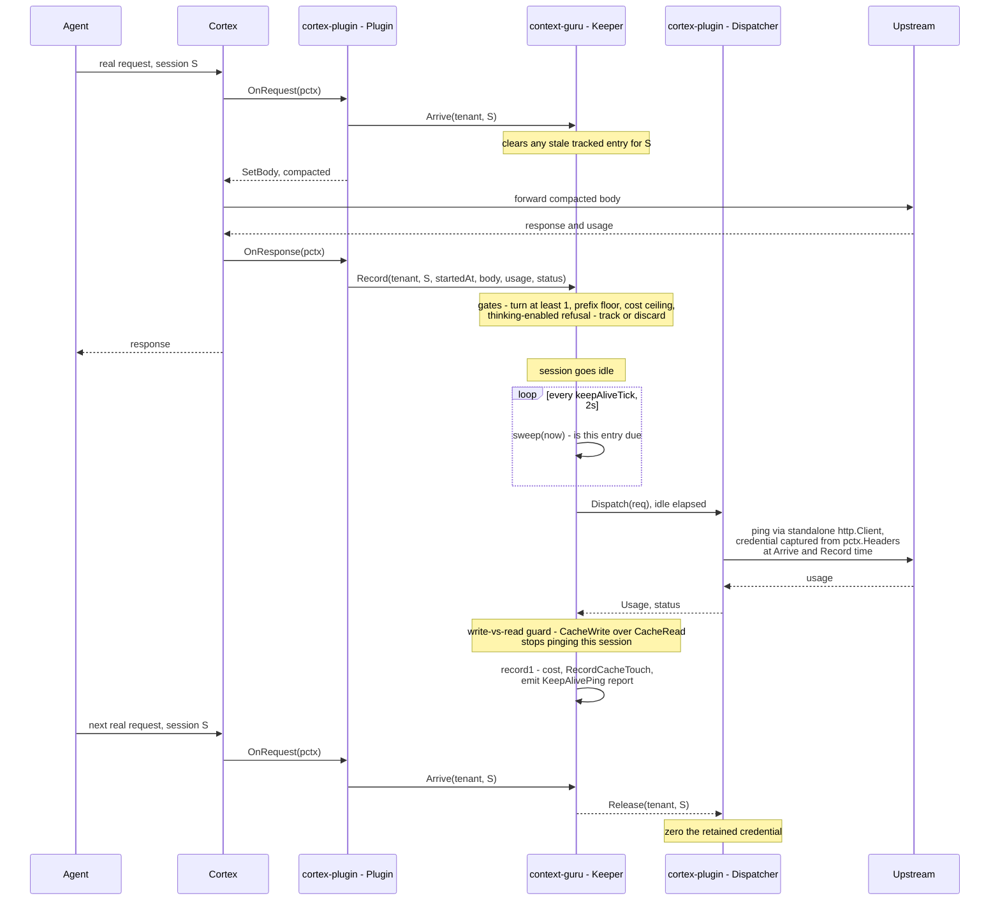
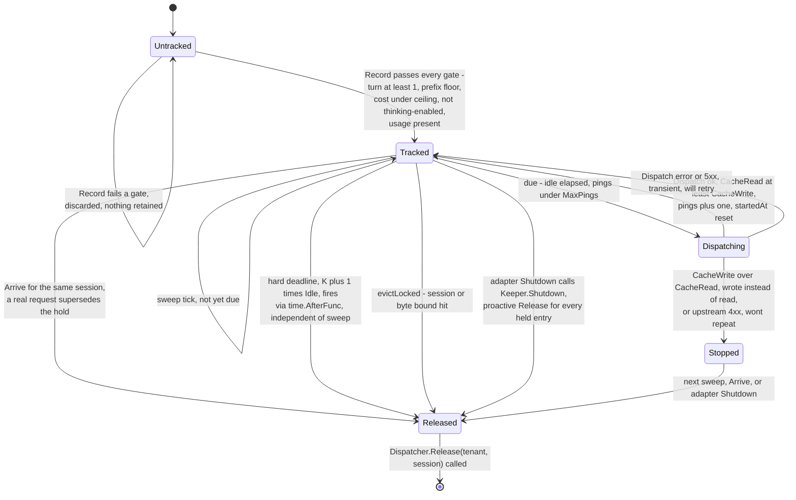
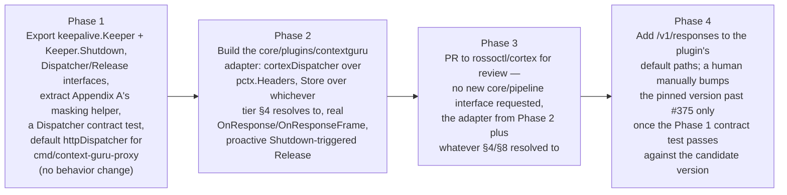

# Embedding context-guru in Cortex: a host-agnostic keep-alive, response and storage design

Status: draft for discussion with the Cortex (`rossoctl/cortex`) maintainers. Nothing here is
committed; "Cortex" sections describe what we'd ask them to build or decide, not what we're
building for them.

## 1. Why this exists

Cortex already embeds context-guru as a Go library (`core/plugins/contextguru`, pinned to
`v0.3.1`): a plugin that calls one function, `apply.BodyWithModel`, to compact an outbound
request's body before it leaves. That's it — one function call. It does not cover three other
things the standalone `cmd/context-guru-proxy` already does, because today they live in the
`proxy` package, wired directly to `*proxy.Handler`:

1. **Idle keep-alive** (`proxy/keepalive.go`) — a background goroutine that pings the upstream
   LLM on its own schedule, with no inbound request triggering it, so a 5-minute prompt-cache
   entry doesn't expire while the user is away. Measured impact: **+$125 per week of traffic,
   12.9x everything the compaction feature saved over the same window.** Not a minor feature.
2. **Seeing the response.** The plugin's `OnResponse` hook is a no-op today. Cache-touch
   recording, async summarization, and the keep-alive accounting above all need the real
   response, and nothing reads it right now.
3. **Somewhere to keep state between requests** — for the keep-alive's own bookkeeping, and for
   anything context-guru masks or sets aside for later (`store.Store`).

One rule we agreed on and aren't relaxing: **all of context-guru's decision-making logic stays in
context-guru.** Cortex only does plumbing — moving bytes, holding a credential — never deciding
anything.

Here's how the rest of this document answers that:

- **§3** — what Cortex already gives us for free. Turns out: most of it.
- **§4** — the one piece that's genuinely unresolved: where keep-alive's state should live.
  Written as requirements and two options, not a decision we've made on Cortex's behalf.
- **§5** — the part that's entirely ours to build: a new adapter inside
  `core/plugins/contextguru`. Buildable and testable without Cortex deciding anything except §4.
- **§8** — the actual, short list of things we're asking Cortex to decide or confirm.

## 2. Current state



Two problems with this picture: the keep-alive code can't run inside Cortex at all today — it's
not exported, and it's wired to `*Handler` directly. And even the part that *does* run today
(compaction) never finds out what came back from the real request.

**Separately, the version pin is already stale.** Cortex's `core/go.mod` pins `v0.3.1`.
context-guru's current release is `v0.4.2` — six releases ahead, not just missing `#375` (which
Phase 4 in §9 is about). Someone did try to bump it once:
[cortex#1207](https://github.com/rossoctl/cortex/pull/1207) was closed without merging, with no
reason given. This plan is about to make that gap matter more: it adds a `Dispatcher` interface,
a background goroutine, and a held credential — not just one pure function anymore. Before that
lands, there needs to be a real way to tell whether a new context-guru release still works with
what Cortex depends on. Not necessarily built by us, but it can't stay this quiet. §9 proposes a
fix.

## 3. What Cortex already gives us — no infra change needed

We checked how much of this Cortex can already do, instead of assuming we'd need something new.
Three of four requirements are already covered, fully, by existing generic mechanisms. The fourth
— durable storage — is covered by *an* existing mechanism, but whether it's the *right* one is a
real open question (§4), not a settled one.

| Requirement | Existing Cortex primitive | Where it's already proven |
|---|---|---|
| Fire a request with nothing inbound triggering it | A plugin can run a background goroutine for its whole lifetime (`Init`/`Shutdown`), and make its own HTTP calls that skip the normal request pipeline entirely | `core/plugins/ibac` does exactly this for its own LLM-judge call — "uses a standalone http.Client that bypasses the listener" — with a sentinel header so it never loops back on itself. context-guru's own plugin already uses the identical trick for its extract-model calls |
| See the real response | Every plugin's `OnResponse` hook already runs on the real response, with the full body, if the plugin asks for it. Same for streamed (SSE) responses, via a separate hook | Already wired into Cortex's pipeline today. `contextguru`'s `OnResponse` is empty by *choice*, not because the hook is missing |
| Read the caller's credential, without Cortex having to manage it specially for us | The live request's headers are exposed directly on the per-request object — no API, just a field | Plugins already read and write this field directly; it's how every other plugin touches headers |
| Somewhere to keep state across requests | `pctx.Shared` — an in-memory, per-process key-value store with expiry, handed to every plugin. One candidate; see §4 for why it might not be the right one | `core/plugins/sessionbudget` had a near-identical need (per-session state, read later by a background process) and chose Redis instead — for reasons §4 covers |

One thing worth getting precisely right, because it decides whether anything we store in
`pctx.Shared` survives a config reload at all (separately from whether `pctx.Shared` is even the
right place — §4): Cortex builds this store exactly once per process, at startup, and hands it to
the parts of the system that stay running. Reloading the config rebuilds the plugins, but not that
store — so state we put there survives a reload; state we keep inside the plugin itself does not.
That's true today because of how the code happens to be written, not because any test or doc
comment promises it'll stay true. §8 asks Cortex to make it a real, tested guarantee if this ends
up being the storage tier we use.

## 4. Storage requirements for keep-alive state, and two candidates

Keep-alive needs somewhere to hold its state between requests. Rather than pick a place and ask
Cortex to approve it, here's what that state actually needs (§4.1), two real options (§4.2,
§4.3), and why the choice belongs to Cortex, not us (§4.4).

### 4.1 What the state actually needs

- **What it holds:** one record per (tenant, session) — a masked credential, the last request
  body sent upstream, and a few small numbers (turn count, cost spent, how many pings so far).
  Each record is small (well under a megabyte almost always); there can be many of them (hundreds
  at a time, in the worst case).
- **Who writes it, who reads it:** written once per real request. Read back by a timer that fires
  every couple of seconds, completely independent of any request coming in.
- **How long it needs to live:** minutes, typically — under an hour even in the longest case
  today. Not something that needs to survive for days.
- **Concurrency:** no entry ever depends on another. The only thing that needs protecting is two
  writers touching the *same* entry at once.
- **What happens if an entry is lost early — this is the detail that actually decides the
  answer:** that one session's idle gap goes unprotected, and the next real request just pays the
  normal cost of rebuilding its cache. Nobody sees an error. Nothing is corrupted. This matches
  context-guru's own design rule of failing open — if something here breaks, the request still
  goes through normally, it just doesn't get the discount. That's genuinely different from
  `sessionbudget`'s problem: losing *its* state could let someone spend past a limit they were
  supposed to be stopped at. Losing keep-alive's state just means one session, briefly, behaves
  like keep-alive was never turned on.

### 4.2 Candidate A — the in-memory store Cortex already hands every plugin (`pctx.Shared`)

**Pros:** no new dependency, works today, and its failure mode (lose an entry, no harm done)
matches §4.1 exactly. **Cons:** it only exists on one process — invisible to any other replica,
and gone on restart. It also has no size limit of its own, so we'd need to add our own cap rather
than rely on it to protect memory. And, per §3, nothing currently guarantees it survives a config
reload — it just happens to, today.

### 4.3 Candidate B — Redis, the same way `sessionbudget` already uses it

**Pros:** survives restarts, visible across replicas — the stronger choice, and already proven
for a similar problem elsewhere in Cortex. `sessionbudget` also already solved "what if Redis is
down" (fail open, same answer §4.1 wants here). **Cons:** turns keep-alive into a feature that
needs Redis configured and reachable everywhere it's used. It also means a masked credential now
leaves this process's memory for Redis — not necessarily worse, but a different threat model than
the one our masking approach (Appendix A) was built for, and worth a security look specifically
because of that.

### 4.4 This is Cortex's decision, not ours

Both options already exist in Cortex today — we're not proposing a new storage layer either way.
What's open is whether either one, as-is, actually meets §4.1's needs, whether one needs a small
upgrade first (a documented guarantee for the in-memory store; a dedicated namespace and security
review for Redis), or whether Cortex would rather do neither. We're not picking for them — §8
turns this into the actual question.

## 5. The context-guru-side adapter

Everything in this section lives in `core/plugins/contextguru` (or a new package next to it) in
Cortex's own repo — a pull request we write and hand them to review, built only from what's in §3
plus whichever storage option §4 settles on. No new Cortex-wide interface, no change to Cortex's
core packages.

The plan: pull the keep-alive logic out of `proxy/keepalive.go` into its own exported package.
Whoever hosts it — the standalone proxy, or this new Cortex adapter — only has to supply two
things: a way to actually send a request, and somewhere to hold a credential. Everything else —
deciding when to ping, how much it's allowed to cost, when to give up — stays exactly the logic
that's already in `proxy/keepalive.go` today. It just stops being tied to `*proxy.Handler`.



### 5.1 The two calls the adapter makes into the keep-alive engine

These are the exact same two calls `proxy/keepalive.go` already makes internally today (there
`arrive`/`record`) — just exported, and no longer reading Go's raw `*http.Request` type directly.
The adapter pulls what it needs out of Cortex's own per-request object and passes it in as plain
values:

```go
// Arrive: a real request just started on this session. Clears any stale
// entry so a ping can never race a real request on the same prefix.
func (k *Keeper) Arrive(tenant, session string) (pings int, refreshed int64, strategyID string)

// Record: the request that just finished might leave a cache entry worth
// protecting. body is the exact bytes sent upstream; everything else is
// what the host already has from its own request/response handling.
func (k *Keeper) Record(tenant, session string, startedAt time.Time, body []byte,
    provider bschemas.ModelProvider, route string, status int, u Usage, usageOK bool)
```

Under Cortex, `tenant` and `session` come straight from the session ID Cortex already attaches to
every request — nothing new to invent there. `body` is the same compacted bytes the plugin
already produced for the existing compaction feature.

### 5.2 The one call the engine makes back out — `Dispatcher`

```go
// Dispatcher performs one ping on the adapter's side. The keeper builds the
// exact ping body (pingBody: max_tokens:1/stream:false, byte-identical
// prefix) and the non-secret headers (anthropic-version, beta flags) —
// Dispatch never receives, and never needs, a credential from the keeper.
// It resolves tenant+session to whatever it captured off pctx.Headers at
// Arrive/Record time and attaches it itself.
type Dispatcher interface {
    Dispatch(ctx context.Context, req DispatchRequest) (Usage, status int, err error)

    // Release tells the adapter it may stop retaining whatever credential
    // material it holds for this session — the keeper is done with it
    // (stopped, retired, evicted, or hit its hard deadline).
    Release(tenant, session string)
}

type DispatchRequest struct {
    Tenant, Session, Route, Model string
    Body    []byte      // final ping bytes
    Headers http.Header  // non-secret only
}
```

That `Headers` field only ever carries safe values (things like an API version string) — not by
convention or by someone remembering to strip the credential out, but because the engine builds
that list itself from a fixed, short allowlist. There's no code path by which a credential could
end up in it.

Beyond those two methods, nothing changes about how keep-alive decides things. Every rule it
applies today — when a session is worth tracking, how much a ping is allowed to cost, when to
give up on a session — stays exactly the logic already sitting in `proxy/keepalive.go`. (The code
has names for these checks internally; you don't need to know them to follow this plan — the
point is that none of that decision-making moves.) `Dispatch` and `Release` are the *entire*
surface the adapter has to implement, and every piece of implementing them — reading a header,
making a plain HTTP call, masking a credential while it's held — is something Cortex's own code
already does elsewhere (§3). There's nothing here that needs Cortex's maintainers to design
anything; there's a pull request for them to review.

### 5.3 Two problems a config reload can cause, and how each is closed

Reloading Cortex's config rebuilds every plugin, including this one. The old copy and the new copy
briefly exist at the same time (new one starts up first, old one gets 30 seconds to finish up
before being shut down). Two things can go wrong in that window:

**A session could get pinged twice.** Both the old and new copy's background timer could notice
the same idle session and both decide to ping it. Each ping still goes through the same real
upstream call and the same checks afterward, so the worst outcome is wasting the cost of one extra
ping — not corrupted state. **Fix:** before pinging, the adapter marks the entry as "claimed" in
shared storage first, so only one copy ever actually sends the ping.

**A credential held by the *old* copy might never get released.** This one needed an actual fix,
not just a note. If the old copy is in the middle of shutting down while it's still holding a
session's credential — and hasn't gotten around to pinging it yet — nothing today forces that
credential to be released before the old copy disappears. **Fix:** when the adapter shuts down, it
now calls a new method, `Keeper.Shutdown()`, which stops the timer and immediately releases every
session it's still holding, before shutdown finishes — instead of hoping the timer gets to it in
time. And as a backstop, even if that somehow gets interrupted (a crash mid-shutdown), the masking
approach in Appendix A still guarantees the credential self-destructs on a fixed schedule either
way.

### 5.4 One thing that's fine as-is

**What if the plugin that injects the real credential runs *after* this one, by mistake?** Then
this adapter would capture the wrong (placeholder) credential and later try to ping with it. That
ping would simply get rejected by the real upstream, and keep-alive's existing "stop retrying after
a rejection" rule kicks in — so the session just never gets keep-alive, silently. Not dangerous,
not a retry storm, just quietly missing a feature it should have had. Worth a line in deployment
docs ("make sure credential injection runs before this plugin"), not a code change.

## 6. Lifecycle

### 6.1 One session's idle gap, end to end

Each box below is labeled with who owns it: **context-guru** (the keep-alive engine — unchanged,
same logic as today, just not tied to any particular host), **cortex-plugin** (the new adapter —
the thing we're actually proposing to build), and **cortex** (Cortex's existing pipeline, which
doesn't change at all — it's just the thing that calls the plugin's hooks and carries traffic to
and from the agent and the real LLM).



### 6.2 One tracked entry's state machine



## 7. Response visibility and storage, concretely

- **Seeing the response:** Cortex already calls every plugin's `OnResponse` hook with the real
  response. `contextguru`'s version of that hook is just empty today, by choice. Fixing it means:
  on `OnResponse`, read the usage numbers and the body, hand them to `Keeper.Record`, and feed the
  same cache-touch/summarize bookkeeping the standalone proxy already does. For streamed
  responses, use the streaming version of the hook instead, so the usage numbers (which only show
  up at the very end of a stream) actually get seen.
- **Storage:** context-guru's own storage interface (`store.Store`) is already small and
  host-agnostic — the adapter just needs one implementation of it, wrapping whichever option §4
  settles on. Neither option (the in-memory store or Redis) enforces a size limit on its own, so
  the adapter still needs to enforce its own limits on top — the exact same discipline
  `proxy/keepalive.go` already applies today, just pointed at a different backing store.

## 8. What we're asking Cortex to decide or confirm

**The real ask is the storage-tier decision in §4 — not a rubber stamp.** Two concrete questions:

1. If the in-memory store (§4.2) is the one used: is Cortex willing to make its reload-survival
   and lack of a size limit an actual, tested guarantee — not just something that happens to be
   true about how the code is written today?
2. Given `sessionbudget` already exists and picked Redis for a similar-looking problem: should
   this adapter do the same, accepting a hard dependency on Redis in exchange for durability that
   §4.1 says isn't strictly required here? Or is the difference in §4.1 (losing this state is
   harmless, losing `sessionbudget`'s isn't) a real reason to make a different call? We don't
   think we should answer this one ourselves.

Two things we're deliberately **not** asking for, named so it's clear we considered them:

- **A guarantee that a credential-injecting plugin always runs before this one.** Right now that
  ordering is just a matter of how a deployment is configured, with nothing enforcing it. §5.4
  covers why getting it wrong fails harmlessly (keep-alive silently doesn't happen for that
  session) rather than dangerously. We're calling this out as a deployment requirement, not asking
  Cortex to build an enforcement mechanism for it.
- **A way for this plugin's own ping to flow back through Cortex's normal traffic pipeline**, so
  Cortex's other observability/security plugins would see it too, instead of going out through a
  plain, separate HTTP call. `ibac` already made the same choice for its own calls, so we're
  following existing precedent rather than introducing a new kind of gap.

One more thing worth naming, for whoever eventually reviews the actual pull request rather than
this document: today's plugin does nothing in the background and shows up nowhere in Cortex's own
metrics or session-event views. Once it owns a background timer, that changes, and whether that
also changes how the plugin should be packaged (it's currently excluded from Cortex's default
build) is a call for that reviewer to make — not something this document resolves.

## 9. Phased plan



**Phase 1** is entirely ours and ships whether or not Cortex adopts anything else here. It's
verified against context-guru's existing keep-alive tests, with no change in behavior expected
for the parts that are pure extraction. It also includes two things worth calling out
specifically: pulling the credential-masking code (Appendix A) into its own small package instead
of leaving it as a someday-task, and a new automated test that exercises the `Dispatcher`
interface using fake inputs. That test does two jobs: it gives Phase 3's Cortex pull request
something concrete to check the adapter against, and it means a future context-guru change that
breaks this contract gets caught in *our own* tests before it ever reaches Cortex.

**Phase 2** is also entirely ours, and doesn't need Cortex to build or decide anything beyond
whatever §4/§8 settles.

**Phase 3** is the first point Cortex's maintainers are actually involved — and what they're
reviewing is a working adapter plus two real decisions (§8), not an abstract proposal.

**Phase 4** closes the `/v1/responses` gap (§2) and fixes the version-bump problem (also §2) —
but the version bump itself stays a manual, deliberate action. **Nothing here proposes automatic
dependency updates.** A person still has to decide to open a bump pull request, exactly like
`cortex#1207` was a person's pull request. What's new is what that pull request has to pass before
another person merges it: Phase 1's `Dispatcher` test, run against whichever version is being
considered. If that version broke something, the test fails and says what. If adopting it needs
extra work in the adapter (a changed function signature, say), that shows up as a compile error
pointing at exactly what changed. Either way, whoever's doing the bump gets a concrete answer
instead of having to read every commit across however many releases by hand — which is the step
that was missing when `cortex#1207` quietly died.

## Appendix A — the credential retention discipline, portable as-is

This isn't something we're asking Cortex to design — it's existing, working code we can hand them
directly (as part of Phase 1), because the way `proxy/keepalive.go` already protects a held
credential has nothing proxy-specific about it:

- The credential sits in memory XOR-masked, using a random key generated once per process. This
  doesn't stop someone who can already run code in the same process, but it does stop the
  credential showing up in a crash dump, a `/proc` memory read, or a plain string search.
- Unmasked only for the brief moment it's actually used to send a ping, then masked again
  immediately.
- Actually zeroed out, not just dropped, on every path that releases it — a dropped value can sit
  in memory until garbage collection gets around to it, which might be a while.
- Backed by a hard timer that fires on a fixed schedule no matter what else is happening, so even
  a process that's gone quiet still drops the credential on time. Per §5.3, this is now the
  explicit safety net for the adapter's own shutdown path too, not just the standalone proxy's.

Plan: pull this into one small shared package that both `proxy/keepalive.go` and the new Cortex
adapter import, instead of having the same security-sensitive code copy-pasted in two places. If
Cortex ends up choosing Redis (§4.3) for storage, this masking code needs a security look *before*
that lands — once the credential leaves process memory for Redis, it's a different thing being
protected against.
