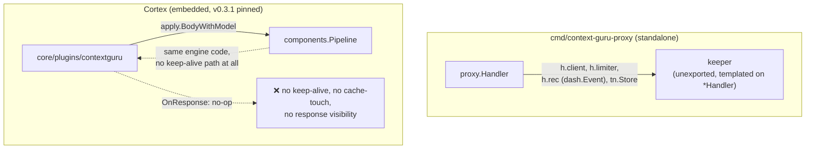
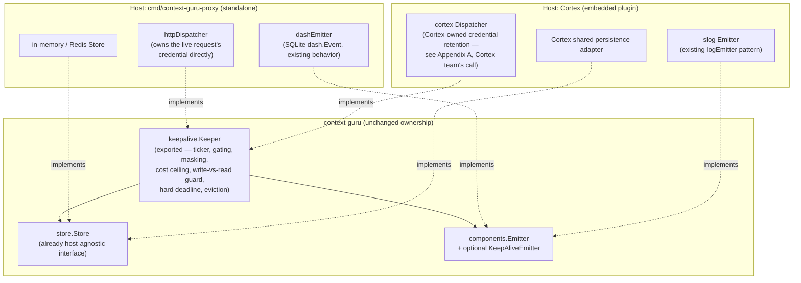
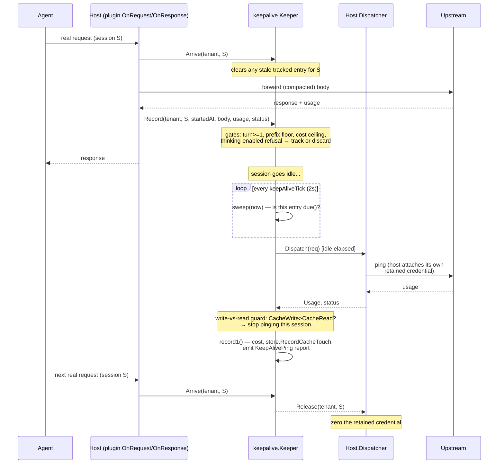
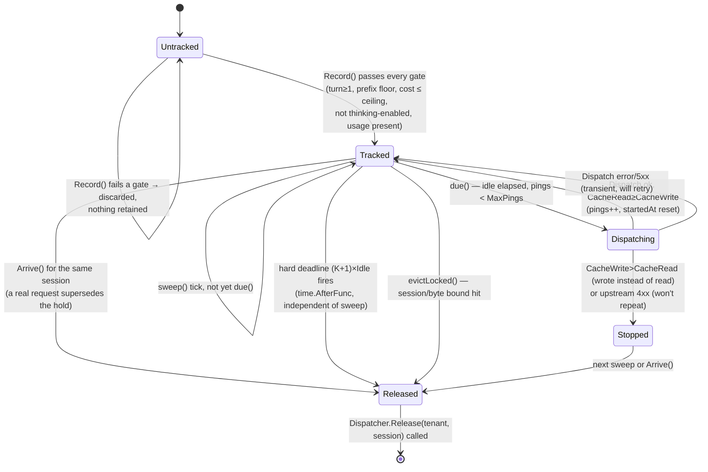
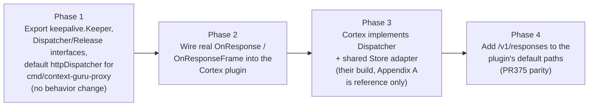

# Embedding context-guru in Cortex: a host-agnostic keep-alive, response and storage design

Status: draft for discussion with the Cortex (`rossoctl/cortex`) maintainers. Nothing here is
committed; "Cortex" sections describe what we'd ask them to build, not what we're building for
them.

## 1. Why this exists

Cortex already embeds context-guru as a Go library (`core/plugins/contextguru`, pinned to
`v0.3.1`): a `WritesRequestBody` AuthBridge plugin that calls `apply.BodyWithModel` on the way
out. That covers context *compaction*. It does not cover three things the standalone
`cmd/context-guru-proxy` already does, because today they live in the `proxy` package, templated
directly on `*proxy.Handler`:

1. **Idle keep-alive** (`proxy/keepalive.go`) — a background goroutine that pings the upstream
   on its own schedule, independent of any inbound request, to stop a 5-minute prompt-cache
   entry from lapsing. Measured at **+$125/window, 12.9x everything the compaction pipeline
   delivered over the same window** — this is not a minor feature.
2. **Response visibility** — the plugin's `OnResponse` is a documented no-op today. Cache-touch
   recording, async summarize, and the keep-alive's own usage accounting all need the real
   response.
3. **Durable storage** for masked/offloaded content (`store.Store`) and for the keep-alive's own
   held state.

The governing constraint, settled in discussion: **all context-guru decision logic stays in
context-guru.** Cortex is piping — transport and credential custody, nothing else. This document
is the plan for making that split real, independent of whether Cortex ever adopts it.

## 2. Current state



Two problems with this picture: the keep-alive logic cannot run inside Cortex at all today (it's
unexported and tied to `*Handler`), and even the parts that *could* run (compaction) aren't
getting the response back.

## 3. Target shape

Export the keeper as its own package, decoupled from `*Handler` by two small interfaces. The host
(standalone binary or Cortex) implements only transport and credential custody; everything else —
timing, gating, cost ceilings, the write-vs-read guard, storage, eviction — stays exactly the
logic it is today in `proxy/keepalive.go`, just not templated on `*Handler` anymore.



### 3.1 The two calls a host makes into `keepalive.Keeper`

Unchanged from `proxy/keepalive.go`'s `arrive`/`record`, just exported and no longer reading
`*http.Request` or `*Tenancy` directly — the host extracts what the keeper needs and passes it as
plain data:

```go
// Arrive: a real request just started on this session. Clears any stale
// entry so a ping can never race a real request on the same prefix.
func (k *Keeper) Arrive(tenant, session string) (pings int, refreshed int64, strategyID string)

// Record: the request that just finished might leave a cache entry worth
// protecting. body is the exact bytes sent upstream; everything else is
// what the host already has from its own request/response handling.
func (k *Keeper) Record(tenant, session string, startedAt time.Time, body []byte,
    provider bschemas.ModelProvider, route string, status int, u Usage, usageOK bool)
```

### 3.2 The one call `keepalive.Keeper` makes out — `Dispatcher`

```go
// Dispatcher performs one ping on the host's side. The keeper builds the
// exact ping body (pingBody: max_tokens:1/stream:false, byte-identical
// prefix) and the non-secret headers (anthropic-version, beta flags) —
// Dispatch never receives, and never needs, a credential from the keeper.
// It resolves tenant+session to whatever it's independently retaining and
// attaches it itself.
type Dispatcher interface {
    Dispatch(ctx context.Context, req DispatchRequest) (Usage, status int, err error)

    // Release tells the host it may stop retaining whatever credential
    // material it holds for this session — the keeper is done with it
    // (stopped, retired, evicted, or hit its hard deadline).
    Release(tenant, session string)
}

type DispatchRequest struct {
    Tenant, Session, Route, Model string
    Body    []byte      // final ping bytes
    Headers http.Header  // non-secret only
}
```

Everything that decides *whether and when* to call `Dispatch` — `due()`, `pingable()`, the
write-vs-read guard, `MaxUSDPerPing`, eviction, the `(K+1)×Idle` hard deadline — is unchanged
`keepalive.Keeper` logic. `Dispatch`/`Release` is the entire surface a host implements.

## 4. Lifecycle

### 4.1 One session's idle gap, end to end



### 4.2 One tracked entry's state machine



## 5. Response visibility and storage — smaller lifts

- **Response visibility (requirement #2):** Cortex's pipeline already calls every plugin's
  `OnResponse(ctx, pctx)` on the real response, in reverse declaration order, with the full body
  if the plugin declares `ReadsBody`. Today's `contextguru` plugin's `OnResponse` is a no-op by
  choice, not a framework gap. The fix is wiring: `OnResponse` extracts usage + body and calls
  `Keeper.Record` and feeds `apply`'s cache-touch/summarize-async machinery, same as the
  standalone proxy does on its own response path today. For streaming (SSE — the normal Claude
  Code shape), the plugin needs to implement `StreamingResponder.OnResponseFrame` instead so it
  sees the usage block at the end of the stream rather than never getting a buffered response.
- **Storage (requirement #3):** `store.Store` (`Put`/`Get`/`Sticky`/`MarkSticky`/`Persists`) is
  already a small, host-agnostic interface — nothing to design. Whatever shared persistence
  Cortex builds just needs one adapter type satisfying it, passed into `cfg.Build`/`cfg.NewStore`
  the same way `logEmitter` is injected today. The open question is entirely on Cortex's side:
  what their shared store's consistency/TTL semantics are, and whether `store.Store`'s TTL
  expectations (used for offload reversibility, not just caching) map cleanly onto it.

## 6. Phased plan



Phase 1 is entirely ours, ships independent of any Cortex decision, and is verified against the
existing keep-alive test suite (`keepalive_test.go`, `TestKeepAliveOnProductionSnapshot`,
`keepalive_openai_test.go`) with no behavioral delta expected. Phase 2 is also entirely ours,
inside the Cortex plugin file, once Phase 1 ships an exported package to call. Phase 3 is the one
phase that's actually the Cortex maintainers' decision — we hand them the two-method `Dispatcher`
interface and the lifecycle diagram above, not an implementation.

## Appendix A — reference retention discipline (non-binding)

Cortex owns how it retains a credential between `Arrive` and `Dispatch`/`Release`; this is not our
design to hand down. For reference, `proxy/keepalive.go`'s existing discipline (`credMask`,
`xorMask`, `zero`, `maskedHeader`) is:

- Masked at rest with a per-process XOR key generated from crypto-rand — defends against
  accidental capture (heap dump, crash report, `/proc/pid/mem`, a stray `strings` pass), not
  against an attacker with code execution in the same process.
- Unmasked only for the duration of one `Dispatch` call, zeroed immediately after.
- Zeroed (not just dereferenced) on every removal path, because a dropped `[]byte` sits in the
  heap until a GC that may never come.
- Bounded by a hard `time.AfterFunc` deadline independent of any liveness loop, so a quiet process
  still drops the credential on schedule even if nothing else is running.

If useful as a starting point for Cortex's own implementation, happy to extract this into a tiny
shared helper package either repo can import — but the call on whether to use it, extend it, or
build something native to Cortex's own credential-handling story is theirs.
