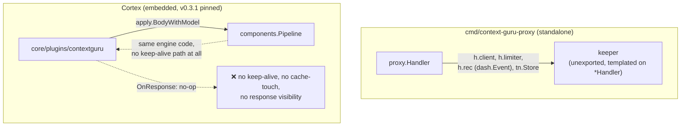
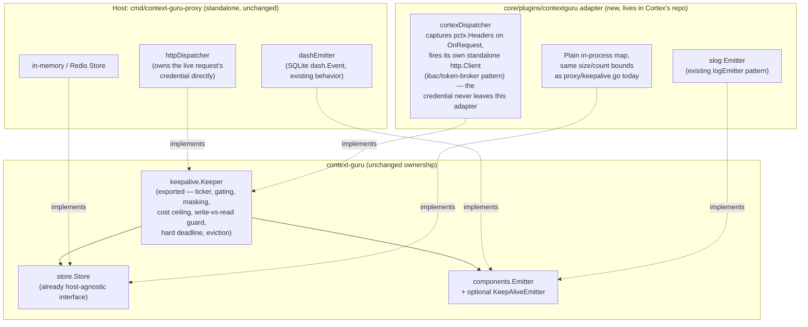
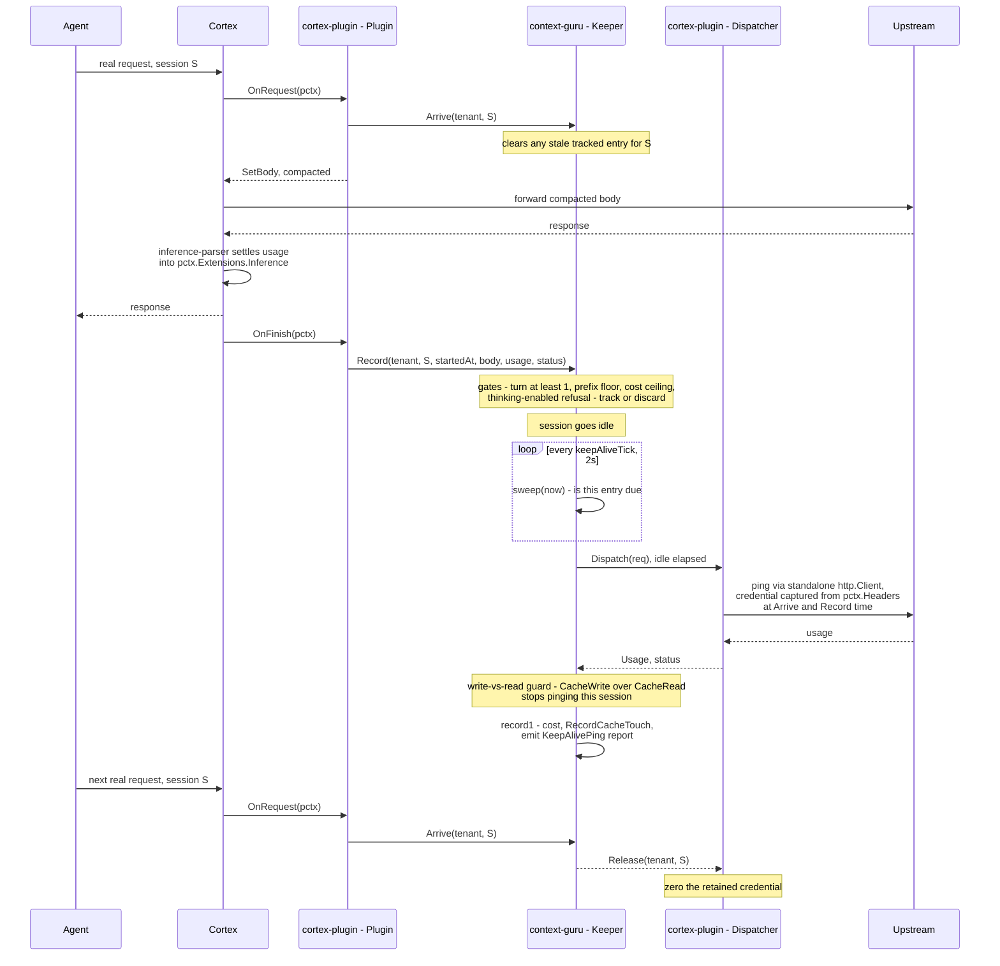
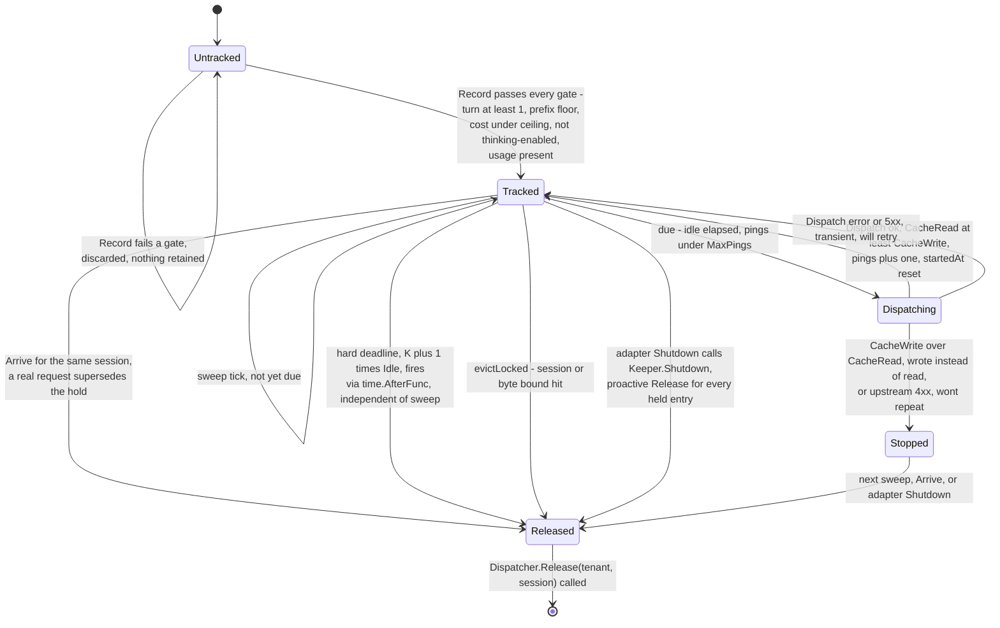
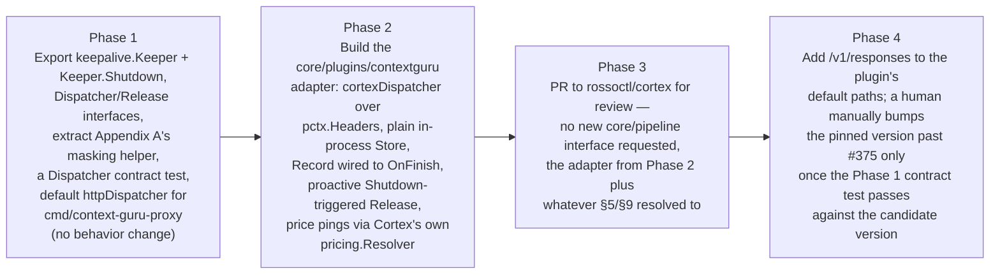

# Embedding context-guru in Cortex: a host-agnostic keep-alive, response and storage design

Status: draft for discussion with the Cortex (`rossoctl/cortex`) maintainers. Nothing here is
committed; "Cortex" sections describe what we'd ask them to build or decide, not what we're
building for them.

## 1. Why this exists

Cortex already embeds context-guru as a Go library (`core/plugins/contextguru`, pinned to
`v0.3.1`): a plugin that calls one function, `apply.BodyWithModel`, to compact an outbound
request's body before it leaves. That's it — one function call. It does not cover three other
things the standalone `cmd/context-guru-proxy` already does, because today they live in the
`proxy` package, wired directly to `*proxy.Handler`:

1. **Idle keep-alive** (`proxy/keepalive.go`) — a background goroutine that pings the upstream
   LLM on its own schedule, with no inbound request triggering it, so a 5-minute prompt-cache
   entry doesn't expire while the user is away. Measured impact: **+$125 per week of traffic,
   12.9x everything the compaction feature saved over the same window.** Not a minor feature.
2. **Seeing the response.** The plugin's `OnResponse` hook is a no-op today. Cache-touch
   recording, async summarization, and the keep-alive accounting above all need the real
   response, and nothing reads it right now.
3. **Somewhere to keep state between requests** — for the keep-alive's own bookkeeping, and for
   anything context-guru masks or sets aside for later (`store.Store`).

One rule we agreed on and aren't relaxing: **all of context-guru's decision-making logic stays in
context-guru.** Cortex only does plumbing — moving bytes, holding a credential — never deciding
anything.

Here's how the rest of this document answers that:

- **§3** — what Cortex already gives us for free, and where that stops being true.
- **§4** — a small, confirmed gap in letting a plugin rewrite a streamed response. Tracked, but
  not needed for anything in this plan.
- **§5** — where keep-alive's state lives. Settled: plain in-process memory, the same way the
  standalone proxy already does it.
- **§6** — the part that's entirely ours to build: a new adapter inside
  `core/plugins/contextguru`.
- **§9** — the actual, short list of things we're asking Cortex to decide, build, or confirm.

## 2. Current state



Two problems with this picture: the keep-alive code can't run inside Cortex at all today — it's
not exported, and it's wired to `*Handler` directly. And even the part that *does* run today
(compaction) never finds out what came back from the real request.

**Separately, the version pin is already stale.** Cortex's `core/go.mod` pins `v0.3.1`.
context-guru's current release is `v0.4.2` — six releases ahead, not just missing `#375` (which
Phase 4 in §10 is about). Someone did try to bump it once:
[cortex#1207](https://github.com/rossoctl/cortex/pull/1207) was closed without merging, with no
reason given. This plan is about to make that gap matter more: it adds a `Dispatcher` interface,
a background goroutine, and a held credential — not just one pure function anymore. Before that
lands, there needs to be a real way to tell whether a new context-guru release still works with
what Cortex depends on. Not necessarily built by us, but it can't stay this quiet. §10 proposes a
fix.

## 3. What Cortex already gives us — no infra change needed

We checked how much of this Cortex can already do, instead of assuming we'd need something new.
Three of four requirements are already covered, fully, by existing generic mechanisms. The fourth
(seeing the response) is covered for *reading* a finished response (confirmed below), but not for
the stronger thing `marker_mode: full` needs — see §4.

| Requirement | Existing Cortex primitive | Where it's already proven |
|---|---|---|
| Fire a request with nothing inbound triggering it | A plugin can run a background goroutine for its whole lifetime (`Init`/`Shutdown`), and make its own HTTP calls that skip the normal request pipeline entirely | `core/plugins/ibac` does exactly this for its own LLM-judge call — "uses a standalone http.Client that bypasses the listener" — with a sentinel header so it never loops back on itself. context-guru's own plugin already uses the identical trick for its extract-model calls |
| Read the final, settled usage numbers for a request | Not `OnResponse` — Cortex's `inference-parser` runs *after* this plugin on the response pass, so usage isn't final yet when `OnResponse` fires. The reliable point is `OnFinish`, called once everything else is done, where `pctx.Extensions.Inference` already carries cache-read/cache-write/output tokens and `pctx.Body` still holds the compacted bytes | Confirmed directly by Cortex (see §9) — this plan originally assumed `OnResponse` was enough; it isn't, and the fix needs no new Cortex capability, just the right hook |
| Read the caller's credential, without Cortex having to manage it specially for us | The live request's headers are exposed directly on the per-request object — no API, just a field | Plugins already read and write this field directly; it's how every other plugin touches headers |
| Somewhere to keep state across requests | Plain memory inside the plugin itself — the same way `proxy/keepalive.go` already does it. Settled; see §5 | Confirmed directly by Cortex (see §9): restarts and config reloads are rare enough that losing one keep-alive window when they happen is an acceptable cost, so no new storage guarantee is needed |

## 4. Streaming — a small gap, tracked but not needed for v1

context-guru can replace a large tool result with a short placeholder, and let the model ask for
the real thing back later through a tool call it names `expand`. There are three settings for
what happens to the real content behind that placeholder: `off` and `summary` just throw it away
for good (cheaper, but gone), and `full` — the actual default the moment any size-reducing
component is turned on — keeps it specifically so the model can ask for it back. This section is
about `full`.

Getting the content back works like this: context-guru notices the model called the `expand`
tool, looks up what it stashed, and quietly sends one more request to the real LLM with the real
content spliced back in. The agent never sees the `expand` call happen at all — it just gets a
normal answer a moment later. That trick is already fully built, in context-guru's own code
(`expand.Resolve`, `expand.Continuation`, `expand.ResponseCalls`). Deciding what to do here isn't
missing anything.

**Correction from an earlier draft of this section:** we originally thought a Cortex plugin
couldn't even see a streamed chunk before it reached the client, based on a doc comment in
`core/pipeline/pipeline.go` ("the listeners forward+flush before invoking the hook — for
observability only"). Checked against the actual listener code (`core/listener/reverseproxy`),
and that comment is stale: `RunResponseFrame` runs on every frame *before* it's written to the
client, in both the forward and reverse proxy listeners. So the hook already runs at the right
time.

**The real, much smaller gap:** today, a streaming hook can only say "let this frame through
unchanged" or "reject the whole stream." It has no way to say "forward something different
instead" — there's no path for a plugin's return value to become the bytes that actually go out.
That's the one thing expand's loop needs and doesn't have: a way to swap in a different frame (or
several, built from a hidden extra call to the real LLM) in place of the one that arrived.

Not needed for v1: the adapter forces `marker_mode` away from `full` regardless of config (see
§4.1), so nothing in this plan is blocked on it. Tracking it here because it's a real, small,
well-scoped gap that `marker_mode: full` will need eventually, and because it's useful to anyone
later working on a plugin that needs to rewrite a stream, not just us.

### 4.1 What's blocked without it, and what isn't

Only `marker_mode: full` needs this. Nothing else in this plan does:

- Compaction (already shipping today) never produces a placeholder or an `expand` call.
- Keep-alive (§7) only reads usage numbers out of a response, never its content.
- `marker_mode: summary`/`off` don't need an expand loop at all — they just drop content for
  good.

Until a frame-replacement capability exists, the adapter shouldn't just *refuse a request* to
turn `marker_mode` to `full` — it should actively force it back to `summary` (or `off`),
regardless of what preset or config asks for. `full` is already context-guru's own default the
moment any size-reducing component capable of dropping content is turned on, so leaving the
default alone and only blocking an explicit `marker_mode: full` setting would still let a
stronger preset turn this on by accident.

## 5. Where keep-alive's state lives

Keep-alive needs somewhere to hold its state between requests. Rather than pick a place and ask
Cortex to approve it, we wrote down what that state actually needs (§5.1) and asked. Cortex's
answer (§5.2, confirmed in §9) is simpler than either option we proposed.

### 5.1 What the state actually needs

- **What it holds:** one record per (tenant, session) — a masked credential, the last request
  body sent upstream, and a few small numbers (turn count, cost spent, how many pings so far).
  Each record is small (well under a megabyte almost always); there can be many of them (hundreds
  at a time, in the worst case).
- **Who writes it, who reads it:** written once per real request. Read back by a timer that fires
  every couple of seconds, completely independent of any request coming in.
- **How long it needs to live:** minutes, typically — under an hour even in the longest case
  today. Not something that needs to survive for days.
- **Concurrency:** no entry ever depends on another. The only thing that needs protecting is two
  writers touching the *same* entry at once.
- **What happens if an entry is lost early — this is the detail that actually decides the
  answer:** that one session's idle gap goes unprotected, and the next real request just pays the
  normal cost of rebuilding its cache. Nobody sees an error. Nothing is corrupted. This matches
  context-guru's own design rule of failing open — if something here breaks, the request still
  goes through normally, it just doesn't get the discount. That's genuinely different from
  `sessionbudget`'s problem: losing *its* state could let someone spend past a limit they were
  supposed to be stopped at. Losing keep-alive's state just means one session, briefly, behaves
  like keep-alive was never turned on.

### 5.2 Decided: plain memory inside the plugin, same as the standalone proxy

Cortex's call (§9): hold this state in ordinary memory inside the plugin itself — the same shape
`proxy/keepalive.go`'s own `keeper` struct already uses. Not even `pctx.Shared`; just a map the
plugin owns. Reasoning: restarts and config reloads are rare, and losing one keep-alive window
when they happen is an acceptable cost — exactly the failure-mode tolerance §5.1 above already
argued for. That settles it: no Redis, no new guarantee needed from `pctx.Shared`, and no new
size-bound design — the adapter ships with the exact same constants `proxy/keepalive.go` already
has (`maxKeepAliveSessions`, `maxKeepAliveBytes`, `maxKeepAliveBodyBytes`), unchanged.

One consequence worth being explicit about, since an earlier draft of this plan assumed shared
storage and designed around it: during a config reload, the old and new plugin instances now have
*completely separate* memory, with nothing shared between them. The new instance starts with zero
tracked sessions — it has nothing to race the old instance over. So the double-ping risk an
earlier draft needed a compare-and-swap to prevent can't actually happen; that fix is gone from
§6.3 below. The one reload-time risk that's still real is the *old* instance's own credential
during its own shutdown, which §6.3 still covers.

## 6. The context-guru-side adapter

Everything in this section lives in `core/plugins/contextguru` (or a new package next to it) in
Cortex's own repo — a pull request we write and hand them to review, built only from what's in §3
plus the plain in-process storage §5 settled on. No new Cortex-wide interface, no change to
Cortex's core packages.

The plan: pull the keep-alive logic out of `proxy/keepalive.go` into its own exported package.
Whoever hosts it — the standalone proxy, or this new Cortex adapter — only has to supply two
things: a way to actually send a request, and somewhere to hold a credential. Everything else —
deciding when to ping, how much it's allowed to cost, when to give up — stays exactly the logic
that's already in `proxy/keepalive.go` today. It just stops being tied to `*proxy.Handler`.



### 6.1 The two calls the adapter makes into the keep-alive engine

These are the exact same two calls `proxy/keepalive.go` already makes internally today (there
`arrive`/`record`) — just exported, and no longer reading Go's raw `*http.Request` type directly.
The adapter pulls what it needs out of Cortex's own per-request object and passes it in as plain
values:

```go
// Arrive: a real request just started on this session. Clears any stale
// entry so a ping can never race a real request on the same prefix.
func (k *Keeper) Arrive(tenant, session string) (pings int, refreshed int64, strategyID string)

// Record: the request that just finished might leave a cache entry worth
// protecting. body is the exact bytes sent upstream; everything else is
// what the host already has from its own request/response handling.
func (k *Keeper) Record(tenant, session string, startedAt time.Time, body []byte,
    provider bschemas.ModelProvider, route string, status int, u Usage, usageOK bool)
```

Under Cortex, `tenant` and `session` come straight from the session ID Cortex already attaches to
every request — nothing new to invent there. `body` is the same compacted bytes the plugin
already produced for the existing compaction feature. `Arrive` fires from `OnRequest`, same as the
standalone proxy. `Record` fires from `OnFinish`, not `OnResponse` — Cortex's `inference-parser`
runs *after* this plugin on the response pass, so the real, settled usage numbers (cache read,
cache write, output tokens) aren't ready yet when `OnResponse` runs. By `OnFinish`, they're
sitting in `pctx.Extensions.Inference`, already parsed, and `pctx.Body` still holds the compacted
bytes — so the adapter doesn't need any response-parsing logic of its own, just reads what's
already there.

### 6.2 The one call the engine makes back out — `Dispatcher`

```go
// Dispatcher performs one ping on the adapter's side. The keeper builds the
// exact ping body (pingBody: max_tokens:1/stream:false, byte-identical
// prefix) and the non-secret headers (anthropic-version, beta flags) —
// Dispatch never receives, and never needs, a credential from the keeper.
// It resolves tenant+session to whatever it captured off pctx.Headers at
// Arrive/Record time and attaches it itself.
type Dispatcher interface {
    Dispatch(ctx context.Context, req DispatchRequest) (Usage, status int, err error)

    // Release tells the adapter it may stop retaining whatever credential
    // material it holds for this session — the keeper is done with it
    // (stopped, retired, evicted, or hit its hard deadline).
    Release(tenant, session string)
}

type DispatchRequest struct {
    Tenant, Session, Route, Model string
    Body    []byte      // final ping bytes
    Headers http.Header  // non-secret only
}
```

That `Headers` field only ever carries safe values (things like an API version string) — not by
convention or by someone remembering to strip the credential out, but because the engine builds
that list itself from a fixed, short allowlist. There's no code path by which a credential could
end up in it.

Beyond those two methods, nothing changes about how keep-alive decides things. Every rule it
applies today — when a session is worth tracking, how much a ping is allowed to cost, when to
give up on a session — stays exactly the logic already sitting in `proxy/keepalive.go`. (The code
has names for these checks internally; you don't need to know them to follow this plan — the
point is that none of that decision-making moves.) `Dispatch` and `Release` are the *entire*
surface the adapter has to implement, and every piece of implementing them — reading a header,
making a plain HTTP call, masking a credential while it's held — is something Cortex's own code
already does elsewhere (§3). There's nothing here that needs Cortex's maintainers to design
anything; there's a pull request for them to review.

### 6.3 One problem a config reload can cause, and how it's closed

Reloading Cortex's config rebuilds every plugin, including this one. The old copy and the new copy
briefly exist at the same time (new one starts up first, old one gets 30 seconds to finish up
before being shut down). Because keep-alive's state is plain memory inside each plugin instance
(§5.2), not something shared between them, the new copy starts out knowing nothing about any
session the old copy was tracking — there's no risk of both copies pinging the same session, since
only the old copy ever knew about it in the first place.

What *is* still a real risk: **a credential held by the old copy might never get released.** If
the old copy is in the middle of shutting down while it's still holding a session's credential —
and hasn't gotten around to pinging it yet — nothing today forces that credential to be released
before the old copy disappears. **Fix:** when the adapter shuts down, it now calls a new method,
`Keeper.Shutdown()`, which stops the timer and immediately releases every session it's still
holding, before shutdown finishes — instead of hoping the timer gets to it in time. And as a
backstop, even if that somehow gets interrupted (a crash mid-shutdown), the masking approach in
Appendix A still guarantees the credential self-destructs on a fixed schedule either way.

### 6.4 One thing that's fine as-is

**What if the plugin that injects the real credential runs *after* this one, by mistake?** Then
this adapter would capture the wrong (placeholder) credential and later try to ping with it. That
ping would simply get rejected by the real upstream, and keep-alive's existing "stop retrying after
a rejection" rule kicks in — so the session just never gets keep-alive, silently. Not dangerous,
not a retry storm, just quietly missing a feature it should have had. Worth a line in deployment
docs ("make sure credential injection runs before this plugin"), not a code change.

## 7. Lifecycle

### 7.1 One session's idle gap, end to end

Each box below is labeled with who owns it: **context-guru** (the keep-alive engine — unchanged,
same logic as today, just not tied to any particular host), **cortex-plugin** (the new adapter —
the thing we're actually proposing to build), and **cortex** (Cortex's existing pipeline, which
doesn't change at all — it's just the thing that calls the plugin's hooks and carries traffic to
and from the agent and the real LLM).



### 7.2 One tracked entry's state machine



## 8. Response visibility and storage, concretely

- **Seeing the response:** not `OnResponse` — `OnFinish`. Cortex's `inference-parser` settles
  usage numbers *after* this plugin's response-pass hook would run, so `OnResponse` would see
  cache/output tokens that aren't final yet. `OnFinish` runs once everything else is done, and by
  then `pctx.Extensions.Inference` already has the settled numbers and `pctx.Body` still has the
  compacted bytes — so the adapter reads both and calls `Keeper.Record`, with no response-parsing
  logic of its own to write. This is true whether the response was streamed or not, so there's no
  separate streaming-hook path to build here. None of this needs §4's streaming interception —
  reading settled numbers after the fact is exactly what `OnFinish` already gives us; only
  `marker_mode: full`'s expand loop needs the stronger capability.
- **Storage:** context-guru's own storage interface (`store.Store`) is already small and
  host-agnostic — the adapter's implementation of it is just a plain in-process map, per §5,
  enforcing the same size/count limits `proxy/keepalive.go` already does today.

## 9. What we're asking Cortex to decide, build, or confirm

### 9.1 Already settled, in review on this plan

Cortex (Hai) answered these directly:

- **Storage (§5):** plain memory inside the plugin, no `pctx.Shared`, no Redis. Losing a window
  on a rare restart or reload is an acceptable cost.
- **Plugin ordering (§6.4):** a line in the deployment docs is enough; no enforcement mechanism
  needed.
- **Packaging:** once the adapter lands, it should ship in the laptop build as opt-in — that's
  where the real Claude Code traffic is. Today no shipped Cortex artifact includes the plugin at
  all.
- **The version bump (§2, §10 Phase 4):** confirmed — bumping to `v0.4.2` already builds and
  passes the plugin's existing tests with no code changes needed.
- **Pricing: nothing new needed.** `plugins.Deps` already injects Cortex's own pricing registry
  into any plugin implementing `pricing.ResolverConsumer` (`SetPricingResolver(Resolver)`),
  kept current across reloads — the same mechanism SPIFFE identity already uses. The adapter
  implements that interface and backs the `Keeper`'s `Prices` dependency with the injected
  resolver, so the pre-flight cost ceiling and the ledger figure (§9.3) read the *same* number —
  corrects the Phase 1 table below, which previously assumed these could stay two independent
  figures. One sharp edge inherited either way, not introduced by this plan: a model missing
  from the price table prices a ping at $0, which leaves the `$0.25` ceiling unenforced for that
  model, since zero never exceeds a ceiling. Worth knowing about, not something this plan fixes.
- **Rate limiting: dropped for v1.** Cortex has no rate limiter, so there's nothing for the
  `Keeper`'s spare-capacity check to plug into. The adapter's `Dispatch` simply doesn't have an
  equivalent gate — corrects the Phase 1 table below, which previously assumed one existed to
  check against.

### 9.2 Streaming frame replacement (§4) — tracked, not blocking v1

Not an ask for this plan — nothing here needs it, since the adapter forces `marker_mode` away
from `full`. Flagging it as a real, confirmed gap worth Cortex's own backlog: `OnResponseFrame`
already runs before a frame reaches the client, but can't supply replacement bytes, only
Continue/Reject. `marker_mode: full` needs that eventually; so would any other plugin that ever
needs to rewrite a stream in flight.

### 9.3 A proposal: let any plugin's own spend reach Cortex's cost ledger

Hai raised a real gap: a keep-alive ping spends real money, but because it goes out through this
plugin's own standalone `http.Client` instead of through Cortex's normal request pipeline, it
never reaches Cortex's own cost reporting. Cortex already prices and records cost for every real
request it handles — but that whole path, as it exists today, is built entirely around a live
request. Tracing it: `inferenceparser.settleCost` is the one place a cost gets priced and
published, and every function underneath it — `settle.Settle`, `settle.Publish`, `settle.Store` —
takes a `*pipeline.Context` as its first argument. A keep-alive ping has no `pipeline.Context`; it
isn't a request Cortex ever saw.

Hai agreed this is worth building, as a general capability any plugin making its own upstream
calls could use — not something scoped to keep-alive — with three corrections to how we first
sketched it:

- **Inject it like pricing, not like `pctx.Shared`.** Add it to `plugins.Deps`, delivered through
  a consumer interface the same way `pricing.ResolverConsumer` already is (§9.1) — not something
  captured off a live `pctx`, since the whole point is this gets called with no live request.
- **Don't build it on `core/session.Store.Append`.** That call makes a session *active* and
  refreshes it — exactly the session-recency signal a background ping must not produce (it isn't
  real agent activity, and letting it look like some would distort idle-gap tracking, which is
  the opposite of what §6 is trying to measure in the first place). Cortex's own `AppendTrailing`
  already does the right thing — reaches the ledger without touching session state — so the new
  capability should be built on that shape, not plain `Append`.
- **Carry client and host, not just a session ID.** So the resulting cost lands attributed to the
  right agent and endpoint, the same way a real request's cost would be.

**Proposed shape**, corrected:

```go
// CostRecorder lets a plugin publish a cost event when the spend didn't come
// from a request Cortex's own pipeline ever saw — e.g. a keep-alive ping fired
// from a background goroutine. Injected via plugins.Deps, the same way
// pricing.ResolverConsumer already is.
type CostRecorder interface {
    RecordCost(sessionID, client, host string, ev event.Event)
}
```

**Still entirely Cortex's own, self-contained work — context-guru's side needs no changes at
all.** `Dispatcher.Dispatch` already receives the real `Usage` numbers back directly, the moment a
ping's response arrives, before it even returns anything to the `Keeper` (§6.2's signature:
`Dispatch(...) (Usage, status int, err error)`). So Cortex's own `Dispatch` implementation, in that
same function, after getting the response:

1. Already has the usage numbers.
2. Prices them with the pricing resolver already injected per §9.1 — the same number the cost
   ceiling check used, not a second one.
3. Calls `CostRecorder.RecordCost`, carrying the session, client, and host.
4. Returns `Usage` to the `Keeper` exactly as it already does.

The `Keeper` never finds out a ledger exists. It just gets a `Usage` back, same as always.

Reusing `event.Event`'s existing wire shape means every consumer that already reads the `"cost"`
session-event key — `agentop`, dashboards, whatever's downstream — keeps working with no changes;
they'd just see an extra event, distinguishable by whatever `Source` we tag it with (`event.Source`
already has an enum for this; a new value for "a plugin's own background spend" would be a small
addition there too).

Not asking Cortex to build this unilaterally — this is the "let's work out a small API together,
usable by any plugin" item from Hai's own review, written up concretely enough to start from
rather than left as an open-ended ask.

### 9.4 Two things we're deliberately not asking for

Named so it's clear we considered them:

- **A guarantee that a credential-injecting plugin always runs before this one.** Already settled
  — §9.1.
- **A way for this plugin's own ping to flow back through Cortex's normal traffic pipeline**, so
  Cortex's other observability/security plugins would see it too, instead of going out through a
  plain, separate HTTP call. `ibac` already made the same choice for its own calls, so we're
  following existing precedent rather than introducing a new kind of gap. (§9.3's `CostRecorder`
  closes the one concrete cost consequence of that choice without needing to reverse it.)

## 10. Phased plan



One deliberate thing missing from the phases above: `marker_mode: full` support isn't in them.
It's not needed for v1 (§4) — the adapter actively forces `marker_mode` away from `full`
regardless of config (§4.1). Once Cortex's streaming hook can supply replacement frames (§4,
§9.2), adding `full` support is its own later phase — and a small one, since the decision logic
already lives in context-guru today; the adapter would just wire it to whatever Cortex builds.

**Phase 1** is entirely ours and ships whether or not Cortex adopts anything else here. It's
verified against context-guru's existing keep-alive tests, with no change in behavior expected
for the parts that are pure extraction. It also includes two things worth calling out
specifically: pulling the credential-masking code (Appendix A) into its own small package instead
of leaving it as a someday-task, and a new automated test that exercises the `Dispatcher`
interface using fake inputs. That test does two jobs: it gives Phase 3's Cortex pull request
something concrete to check the adapter against, and it means a future context-guru change that
breaks this contract gets caught in *our own* tests before it ever reaches Cortex.

Hai's review flagged something worth being explicit about here rather than discovering it during
Phase 2: `proxy/keepalive.go`'s `keeper` reaches into `*Handler`/`*Tenancy` for more than just the
HTTP call `Dispatch` already covers. Exporting the `Keeper` means deciding, for each one, what
replaces it:

| What `keeper` reaches for today | What it's for | What replaces it under Cortex |
|---|---|---|
| `k.h.client` | performs the actual ping | `Dispatcher.Dispatch` (already designed, §6.2) |
| `k.h.limiter.AcquireSpare` | refuses a ping when the tenant's rate/concurrency budget is tight | **Dropped for v1** — Cortex has no rate limiter to check against (confirmed by Cortex, §9.1). The adapter's `Dispatch` has no equivalent gate |
| `k.h.opts.Prices` | prices a ping twice: a rough estimate before firing, inside the `Keeper` (the cost ceiling check), and the actual figure after, for the dashboard/ledger | **One source, not two.** The adapter implements `pricing.ResolverConsumer`; Cortex injects its own pricing registry automatically (§9.1), kept current across reloads. The adapter backs the `Keeper`'s `Prices` dependency with that same injected resolver, so the pre-flight ceiling check and the ledger figure (§9.3) read the same number — no separate table, no risk of the two disagreeing the way `#383`'s bug did |
| `k.h.rec == nil` check | refuses to even hold a credential at all if nothing will account for what it's used for | This check lives inside the `Keeper` today, which — per §9.3 — never finds out whether Cortex's `CostRecorder` exists. So under Cortex it can't be the same per-call check; it becomes a one-time decision the *adapter* makes at startup: don't enable keep-alive at all if nothing is configured to record what it spends |
| `tn.Cache` (`CachePolicy`) plus manager-controlled strategies and session overrides | per-tenant policy: is keep-alive even on, `Idle`/`MaxPings`/`MaxUSDPerPing`, who can override it and how | Cortex has no multi-tenant control plane to match this against, and we don't think it needs one for this: one static policy from the plugin's own config block, no strategies, no per-session dashboard overrides. Simpler than the standalone proxy by design, not a gap |
| `tn.Preset` | a label on the dashboard row | cosmetic; the adapter supplies a fixed string or omits it |

The ledger-facing half of pricing (`k.h.opts.Prices`'s second use) and the audit-sink gate
(`k.h.rec`) both point at the same place: §9.3's `CostRecorder` proposal. If that lands, the
adapter can refuse to even start keep-alive when nothing is configured to record what it spends —
the same accountability rule the standalone proxy already enforces per-request, just checked once
at startup instead, and phrased in Cortex's terms instead of `dash`'s.

**Phase 2** is also entirely ours, and doesn't need Cortex to build or decide anything beyond
whatever §5/§9 settles.

**Phase 3** is the first point Cortex's maintainers are actually involved — and what they're
reviewing is a working adapter plus two real decisions (§9), not an abstract proposal.

**Phase 4** closes the `/v1/responses` gap (§2) and fixes the version-bump problem (also §2) —
but the version bump itself stays a manual, deliberate action. **Nothing here proposes automatic
dependency updates.** A person still has to decide to open a bump pull request, exactly like
`cortex#1207` was a person's pull request. What's new is what that pull request has to pass before
another person merges it: Phase 1's `Dispatcher` test, run against whichever version is being
considered. If that version broke something, the test fails and says what. If adopting it needs
extra work in the adapter (a changed function signature, say), that shows up as a compile error
pointing at exactly what changed. Either way, whoever's doing the bump gets a concrete answer
instead of having to read every commit across however many releases by hand — which is the step
that was missing when `cortex#1207` quietly died.

## Appendix A — the credential retention discipline, portable as-is

This isn't something we're asking Cortex to design — it's existing, working code we can hand them
directly (as part of Phase 1), because the way `proxy/keepalive.go` already protects a held
credential has nothing proxy-specific about it:

- The credential sits in memory XOR-masked, using a random key generated once per process. This
  doesn't stop someone who can already run code in the same process, but it does stop the
  credential showing up in a crash dump, a `/proc` memory read, or a plain string search.
- Unmasked only for the brief moment it's actually used to send a ping, then masked again
  immediately.
- Actually zeroed out, not just dropped, on every path that releases it — a dropped value can sit
  in memory until garbage collection gets around to it, which might be a while.
- Backed by a hard timer that fires on a fixed schedule no matter what else is happening, so even
  a process that's gone quiet still drops the credential on time. Per §6.3, this is now the
  explicit safety net for the adapter's own shutdown path too, not just the standalone proxy's.

Plan: pull this into one small shared package that both `proxy/keepalive.go` and the new Cortex
adapter import, instead of having the same security-sensitive code copy-pasted in two places.
