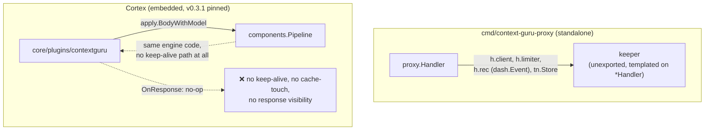
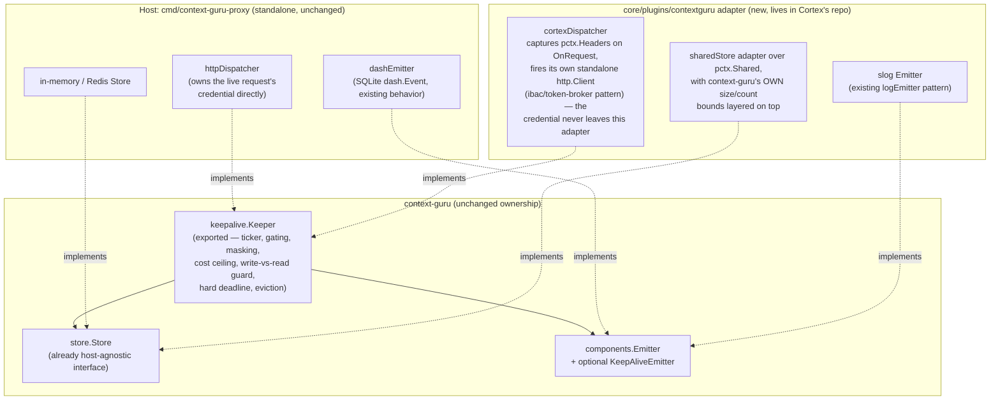
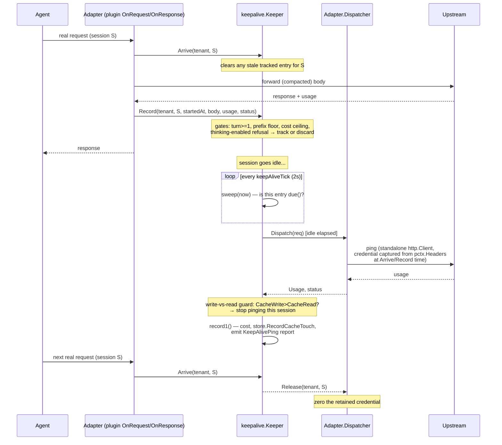
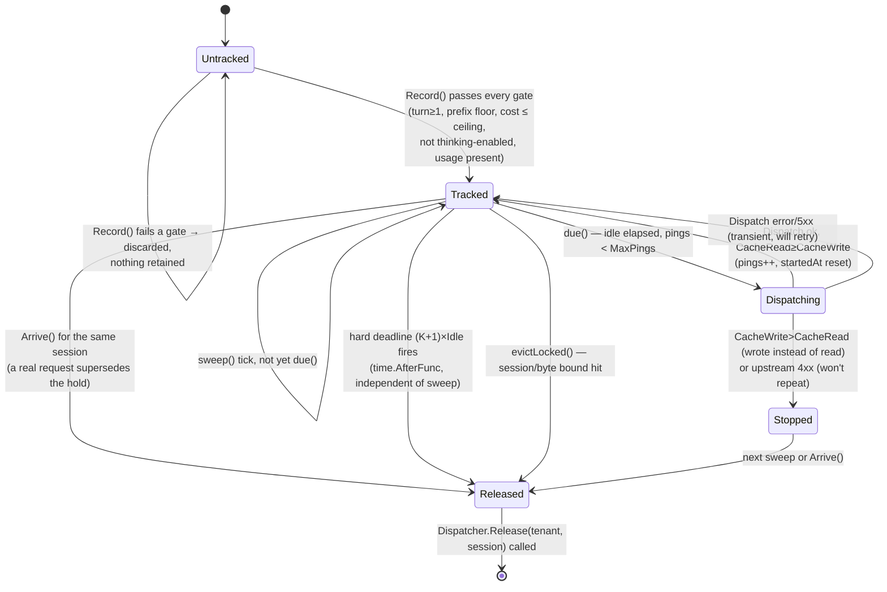
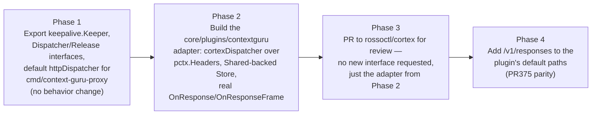

# Embedding context-guru in Cortex: a host-agnostic keep-alive, response and storage design

Status: draft for discussion with the Cortex (`rossoctl/cortex`) maintainers. Nothing here is
committed; "Cortex" sections describe what we'd ask them to build, not what we're building for
them.

## 1. Why this exists

Cortex already embeds context-guru as a Go library (`core/plugins/contextguru`, pinned to
`v0.3.1`): a `WritesRequestBody` AuthBridge plugin that calls `apply.BodyWithModel` on the way
out. That covers context *compaction*. It does not cover three things the standalone
`cmd/context-guru-proxy` already does, because today they live in the `proxy` package, templated
directly on `*proxy.Handler`:

1. **Idle keep-alive** (`proxy/keepalive.go`) — a background goroutine that pings the upstream
   on its own schedule, independent of any inbound request, to stop a 5-minute prompt-cache
   entry from lapsing. Measured at **+$125/window, 12.9x everything the compaction pipeline
   delivered over the same window** — this is not a minor feature.
2. **Response visibility** — the plugin's `OnResponse` is a documented no-op today. Cache-touch
   recording, async summarize, and the keep-alive's own usage accounting all need the real
   response.
3. **Durable storage** for masked/offloaded content (`store.Store`) and for the keep-alive's own
   held state.

The governing constraint, settled in discussion: **all context-guru decision logic stays in
context-guru.** Cortex is piping — transport and credential custody, nothing else.

That constraint turned out to be easier to satisfy than it looked. §3 is the reason: every one of
the three capabilities above already has a generic home in Cortex's existing plugin surface, with
no new interface and no core change. §4 is the part that's genuinely ours — a self-contained
addition to `core/plugins/contextguru`, buildable and testable without Cortex deciding anything.
§5 is the one place we'd actually ask Cortex for something, and it's a confirmation, not a code
change.

## 2. Current state



Two problems with this picture: the keep-alive logic cannot run inside Cortex at all today (it's
unexported and tied to `*Handler`), and even the parts that *could* run (compaction) aren't
getting the response back.

## 3. What Cortex already gives us — no infra change needed

Before designing anything new, it's worth being honest about how much of this is already there.
Four primitives in `core/pipeline` and `core/plugins/*` cover all three requirements:

| Requirement | Existing Cortex primitive | Where it's already proven |
|---|---|---|
| Initiate a request independent of any inbound call | `pipeline.Plugin`'s optional `Initializer`/`Shutdowner` interfaces (`Init(ctx) error`, `Shutdown(ctx) error`) run a background goroutine for the plugin's whole process lifetime, plus a plugin's own standalone `*http.Client` making calls that bypass the listener entirely | `core/plugins/ibac/plugin.go`: the judge call "uses a standalone http.Client that bypasses the listener," with a sentinel-header reentrancy guard (`X-IBAC-Judge: 1`) — the exact pattern `contextguru`'s own `cgModel`/`llmclient` extract-model call already uses (`X-Context-Guru-LLM`) |
| See the real response | `Pipeline.RunResponse` calls every plugin's `OnResponse(ctx, pctx)` with the full response body (if `ReadsBody`/`WritesResponseBody` is declared); `StreamingResponder.OnResponseFrame` for SSE | Already wired into the pipeline today — `contextguru`'s `OnResponse` is a no-op by *choice*, not a framework gap (confirmed last round; this section just explains why that choice is safe to reverse) |
| Durable, cross-request storage | `pctx.Shared` (`pipeline.SharedStore`, backed by `core/memstore.Store`) — a process-scoped, TTL'd key→value store, explicitly "intentionally semantics-free," injected once at `cmd/cortex/main.go` startup (`memstore.New()`) and handed to every listener | Already used by other plugins "to share state across the inbound→outbound request boundary (e.g. credential placeholders)" per its own doc comment |
| The caller's credential, without Cortex having to custody it specially for us | `pctx.Headers http.Header` — the live request's raw headers, exposed directly, no accessor indirection | "Plugins read and mutate fields directly — there is no separate mutation API" (`core/pipeline/context.go`) |

One non-obvious thing worth confirming rather than assuming, because it decides whether our state
survives Cortex's hot-reload: `memstore.New()` is called exactly once in `cmd/cortex/main.go` and
assigned to the long-lived listener objects (`rpSrv.Shared`, `fpSrv.Shared`). Cortex's reloader
(`core/reloader/reloader.go`) rebuilds and swaps the *pipeline* (every plugin's `Init`/`Shutdown`
re-runs) on any config file change, but the listener — and therefore `Shared` — is never part of
that swap. So state we put in `pctx.Shared` outlives a hot-reload; state we put in the plugin
struct's own Go memory does not. That one fact drives the design in §4: **the adapter must treat
`pctx.Shared` as the keeper's durable backing store, not as an incidental convenience**, or every
unrelated config change (someone else's `tool-prune` list edit) silently drops every session we're
currently holding a credential for.

Given all four rows above are already generic, general-purpose, and proven by other plugins, the
honest scope of what we'd ask Cortex to *build* is close to nothing. §5 names the one thing worth
raising with them anyway.

## 4. The context-guru-side adapter

Everything below lives in `core/plugins/contextguru` (or a sibling package) in the Cortex repo —
a PR we write and hand them for review, using only the primitives in §3. No new Cortex interface,
no core-package change.

Export the keeper as its own context-guru package, decoupled from `*Handler` by one small
interface. The adapter (standalone binary's own existing wiring, or the new Cortex-side plugin
code) implements only transport and credential custody; everything else — timing, gating, cost
ceilings, the write-vs-read guard, storage, eviction — stays exactly the logic it is today in
`proxy/keepalive.go`, just not templated on `*Handler` anymore.



### 4.1 The two calls the adapter makes into `keepalive.Keeper`

Unchanged from `proxy/keepalive.go`'s `arrive`/`record`, just exported and no longer reading
`*http.Request` or `*Tenancy` directly — the adapter extracts what the keeper needs from `pctx`
and passes it as plain data:

```go
// Arrive: a real request just started on this session. Clears any stale
// entry so a ping can never race a real request on the same prefix.
func (k *Keeper) Arrive(tenant, session string) (pings int, refreshed int64, strategyID string)

// Record: the request that just finished might leave a cache entry worth
// protecting. body is the exact bytes sent upstream; everything else is
// what the host already has from its own request/response handling.
func (k *Keeper) Record(tenant, session string, startedAt time.Time, body []byte,
    provider bschemas.ModelProvider, route string, status int, u Usage, usageOK bool)
```

Under Cortex, `tenant` and `session` come straight off `pctx.Session.ID` (no new identity concept
needed — `SessionView.ID` is already exactly the correlation key the keeper wants), and `body` is
the same compacted bytes the plugin already computed via `apply.BodyWithModel` on `OnRequest`.

### 4.2 The one call `keepalive.Keeper` makes out — `Dispatcher`

```go
// Dispatcher performs one ping on the adapter's side. The keeper builds the
// exact ping body (pingBody: max_tokens:1/stream:false, byte-identical
// prefix) and the non-secret headers (anthropic-version, beta flags) —
// Dispatch never receives, and never needs, a credential from the keeper.
// It resolves tenant+session to whatever it captured off pctx.Headers at
// Arrive/Record time and attaches it itself.
type Dispatcher interface {
    Dispatch(ctx context.Context, req DispatchRequest) (Usage, status int, err error)

    // Release tells the adapter it may stop retaining whatever credential
    // material it holds for this session — the keeper is done with it
    // (stopped, retired, evicted, or hit its hard deadline).
    Release(tenant, session string)
}

type DispatchRequest struct {
    Tenant, Session, Route, Model string
    Body    []byte      // final ping bytes
    Headers http.Header  // non-secret only
}
```

Everything that decides *whether and when* to call `Dispatch` — `due()`, `pingable()`, the
write-vs-read guard, `MaxUSDPerPing`, eviction, the `(K+1)×Idle` hard deadline — is unchanged
`keepalive.Keeper` logic, running inside context-guru's own package regardless of host.
`Dispatch`/`Release` is the entire surface the adapter implements, and — per §3 — every piece of
that implementation (reading `pctx.Headers`, firing a standalone `http.Client` call, masking the
credential while it's held) is a straightforward application of patterns Cortex's own codebase
already uses elsewhere. There is nothing here that needs Cortex's maintainers to design anything;
there's a PR for them to review.

One subtlety specific to Cortex's reload behavior (see §3): the reloader starts the *new*
pipeline's `Init` before stopping the *old* one (after a drain window, default 30s), so for that
window both the old and new `Keeper`'s ticker could observe the same tracked entry in
`pctx.Shared` and both consider it due. Since both tickers resolve through the same `Dispatch` →
real upstream call → write-vs-read guard, a double-fire wastes one ping's worth of money rather
than corrupting state — annoying, not unsafe — but the adapter should still claim an entry
atomically in `Shared` (compare-and-swap on a "claimed" marker, not just read-then-ping) to avoid
even that. This is an adapter-side locking detail, not something that needs a Cortex change.

## 5. Lifecycle

### 5.1 One session's idle gap, end to end



### 5.2 One tracked entry's state machine



## 6. Response visibility and storage, concretely

- **Response visibility:** Cortex's pipeline already calls every plugin's `OnResponse(ctx, pctx)`
  on the real response, in reverse declaration order, with the full body if the plugin declares
  `ReadsBody`. Today's `contextguru` plugin's `OnResponse` is a no-op by choice. The fix is
  wiring: `OnResponse` extracts usage + body and calls `Keeper.Record` and feeds `apply`'s
  cache-touch/summarize-async machinery, same as the standalone proxy does on its own response
  path today. For streaming (SSE — the normal Claude Code shape), the plugin implements
  `StreamingResponder.OnResponseFrame` instead so it sees the usage block at the end of the
  stream rather than never getting a buffered response.
- **Storage:** `store.Store` (`Put`/`Get`/`Sticky`/`MarkSticky`/`Persists`) is already a small,
  host-agnostic interface. The adapter's `store.Store` implementation wraps `pctx.Shared`,
  captured lazily from whichever `OnRequest` call happens to run first (there's no handle to it
  at `Init` time — only per-request `pctx` carries it). Because `memstore.Store` is deliberately
  "semantics-free" with no size or count bound of its own, the adapter must enforce *its own*
  bounds on top — mirroring `proxy/keepalive.go`'s existing `maxKeepAliveSessions`,
  `maxKeepAliveBytes`, `maxKeepAliveBodyBytes` constants — rather than trusting the shared store
  to protect memory for us. This is exactly the kind of thing the standalone proxy's `store.Store`
  implementations already do; the Cortex adapter just needs the same discipline over a different
  backing map.

## 7. The one thing worth asking Cortex for

Given §3, this is deliberately short — not a design ask, a confirmation ask:

**Please confirm `pctx.Shared`'s reload-survival and sizing assumptions are intentional, and
document them.** We're relying on two properties that are true today by construction
(`memstore.New()` called once at process start, outlasting pipeline hot-reloads; no built-in size
cap, "semantics-free" by design) but aren't actually guaranteed by any doc comment or test we
could find pinning them. If Cortex's maintainers are comfortable calling these invariants, a
one-line note in `core/memstore`'s package doc or `pipeline.SharedStore`'s interface doc would let
us (and any future plugin leaning on the same thing) rely on it without re-deriving it from
`main.go`'s wiring.

Two things we are **not** asking for, named here only so the record is honest about what we
considered and set aside:

- *A declared header-mutation-ordering capability*, analogous to `WritesRequestBody`'s pipeline
  ordering guarantee, so a credential-injecting plugin (`static-inject`/`token-exchange`) is
  provably ordered before ours. Headers are mutated freely today with no declared capability, so
  the only thing enforcing "we see the post-injection credential" is pipeline YAML ordering in
  whatever deployment runs us. We're documenting that as a deployment requirement rather than
  asking Cortex to add an enforcement mechanism for it — it would generalize well if it ever
  becomes a recurring problem for other plugins, but we have no evidence yet that it is one.
- *A way to re-inject a self-originated ping through the real outbound pipeline* (so AuthBridge's
  own observability/guardrail plugins see it too), instead of a standalone `http.Client` call that
  bypasses the listener. `ibac` already made the same tradeoff deliberately
  ("uses a standalone http.Client that bypasses the listener"), so we're following established
  precedent rather than introducing a new gap. Worth revisiting only if Cortex's own direction
  changes on that point independent of us.

## 8. Phased plan



Phase 1 is entirely ours, ships independent of any Cortex decision, and is verified against the
existing keep-alive test suite (`keepalive_test.go`, `TestKeepAliveOnProductionSnapshot`,
`keepalive_openai_test.go`) with no behavioral delta expected. Phase 2 is also entirely ours, and
— per §3/§4 — doesn't require Cortex to build or decide anything; it's new code against their
existing, already-generic primitives. Phase 3 is the first point Cortex's maintainers are actually
in the loop, and what they're reviewing is a working adapter, not a design: the only real "ask" in
this whole plan is §7's documentation confirmation, which can land independently of and before the
adapter PR.

## Appendix A — the credential retention discipline, portable as-is

Unlike the previous draft of this plan, this isn't Cortex's design to hand down — it's existing,
working code we can hand them as a diff, because `proxy/keepalive.go`'s masking discipline
(`credMask`, `xorMask`, `zero`, `maskedHeader`) has no dependency on anything proxy-specific:

- Masked at rest with a per-process XOR key generated from crypto-rand — defends against
  accidental capture (heap dump, crash report, `/proc/pid/mem`, a stray `strings` pass), not
  against an attacker with code execution in the same process.
- Unmasked only for the duration of one `Dispatch` call, zeroed immediately after.
- Zeroed (not just dereferenced) on every removal path, because a dropped `[]byte` sits in the
  heap until a GC that may never come.
- Bounded by a hard `time.AfterFunc` deadline independent of any liveness loop, so a quiet process
  still drops the credential on schedule even if nothing else is running.

Plan is to extract this into a tiny shared helper package (`internal/credguard` or similar) that
`proxy/keepalive.go` and the new Cortex adapter both import, rather than copy-pasting it — one
security review covers both call sites instead of two.
