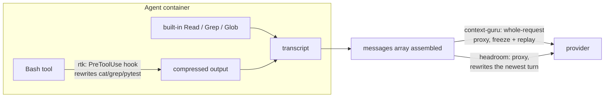

# context-guru vs headroom vs rtk — what we did, and why it won

A mechanism-first summary of the four-arm study on **SWE-bench Verified**: what the three
compaction layers actually do differently, and which of those differences the bill rewarded.
The numbers and per-task tables live in the [full comparison](comparison.md); this page
explains *why* they came out the way they did.

## The three designs intercept at different points

All three tools shrink what the model reads. They disagree about where to stand.

- **rtk** (Rust Token Killer) — a shell hook. Compresses Bash output **before it enters the
  transcript**. Zero request-path latency, $0, and cache-safe by construction: the compressed
  form is the only form ever cached.
- **headroom** — a request-stream proxy that compresses the **live zone** (the newest turn) and
  replays its rewrites on subsequent turns.
- **context-guru** — a request-stream proxy that compacts the **whole `messages` array**, then
  **freezes each decision and replays it byte-identically** for the rest of the session.

Each choice buys something and costs something. The benchmark is largely a measurement of
which trade the bill rewards.

## The result

**SWE-bench Verified · 50 tasks · `claude-code` agent on `aws/claude-sonnet-5`**, run live.
All 50 tasks scored under all four arms, zero infrastructure exceptions.

| dimension | baseline | **context-guru** | headroom | rtk |
|---|--:|--:|--:|--:|
| solved / 50 | 43 (86%) | **44 (88%)** | 40 (80%) | 43 (86%) |
| total billed cost | $31.98 | **$27.77 (−13.2%)** | $30.30 (−5.3%) | $29.09 (−9.0%) |
| cache-read tokens | 102.8M | **84.5M (−17.8%)** | 96.4M (−6.3%) | 91.7M (−10.8%) |
| cache-write tokens | 1.855M | 1.847M | 1.839M | **1.835M** |
| mean steps / task | 36.1 | **31.1** | 35.1 | 33.2 |
| added latency / req | — | 117 ms | 63 ms | **0 ms** |
| tool's own LLM cost | $0 | $0.31 | **$0** | **$0** |
| content removed / req | 0 | 1.09% | 2.64% | 65.8% *of bash only* |

context-guru is the cheapest **and** highest-reward arm. rtk is the surprise second — a simple
deterministic shell filter, reward-neutral, free, and it **beats headroom on both cost and
reward**.

## Why it won

### 1. Freeze the decision, then replay it byte-identically

The counter-intuitive pair of rows in that table: context-guru removes the **least** content
per request (1.09%, vs headroom's 2.64%) and is still the **cheapest** arm by a wide margin.

A modern Claude Code request is ~98% cached, so removing unique tokens is close to a rounding
error against the bill. What matters is that the *same* removal is present on **every**
subsequent turn — subtracted from every cache-read for the rest of the session — while the
cached prefix stays byte-stable so nothing gets re-written:

- one compaction decision → recorded in the store, keyed by content hash;
- every later turn → the identical bytes replayed, no re-derivation, no drift;
- result → **cache-read −17.8%** with **cache-write within 1% of baseline**.

Removing more per request is not the objective. Removing the same thing every turn, without
disturbing what is already cached, is. The leverage is visible in the aggregate: a compaction
budget measured in hundreds of thousands of tokens turns into **−18.3M cache-read tokens**,
because each frozen decision is paid for once and collected on ~31 times.

### 2. Don't disturb what is already cached

Cache-write is priced at $2.50/M against cache-read's $0.20/M, so **one cache-write costs the
equivalent of 11.5 cache-reads**. Any layer that mutates content already inside the cached
prefix re-writes the whole suffix behind it — a trade that needs a very large read saving to
break even, and usually does not get one.

On this benchmark all four arms stay within 1.1% of baseline on cache-write (1.835–1.855M), so
none of them busts the cache and the ranking is decided on cache-read. That is a property of
the workload as much as of the tools — SWE-bench contexts are comparatively small and
localized — and it is exactly why our design keeps the compaction frozen and the prefix stable
rather than recompressing per turn. The cache-stability discipline costs nothing here and is
what makes the aggression safe.

### 3. Fail open, never worse, always reversible

Three invariants, cheap to state, and the reason aggressive compaction is safe to ship:

- **fail open** — a component that errors or panics reverts *that component only*; the original
  request is always a valid fallback;
- **never worse** — a component that would grow the request is reverted, so you never pay to
  compact;
- **reversible** — every lossy drop leaves a `<<cg:HASH>>` marker with the original stashed,
  recoverable via `context_guru_expand` or `GET /expand`.

The type system enforces the third: an `Offload` that drops bytes but returns no cache key is
treated as a *failed* offload and reverted — you cannot silently lose data. See
[Architecture](../design.md). Zero infrastructure exceptions across 200 trials is a consequence
of this posture, not luck.

### 4. Reach the whole request, not one tool

rtk's ceiling is structural: Claude Code's built-in `Read`/`Grep`/`Glob` never touch a shell, so
its hook never sees them. It compressed **65.8% of bash output** and that netted **−9.0%** on
the bill — real, free, and capped. Note the denominators in the last table row are not
comparable: context-guru and headroom measure removal against the whole request, rtk against
bash output only, which is why a 66% bash cut becomes −9% end to end.

Sitting on the request means the biggest file reads are in scope no matter which tool produced
them. That is where `extract_llm`'s skeletonization of large reads and logs earns its $0.31.

### 5. Fewer steps is the same thing as less money

context-guru used **31.1 steps/task vs baseline's 36.1 (−13.9%)** — the largest step reduction
of any arm — and finished tasks in less wall-clock (352 s vs 380 s). Steps and cost move
together almost perfectly: every extra turn re-reads the entire accumulated prefix at $0.20/M
*and* emits more output at $10/M. A smaller context per turn is worth something; a shorter
trajectory is worth much more, and it is the mechanism doing most of the work behind the
−13.2%.

## Where each competitor's design costs it

| | owns | pays for it in |
|---|---|---|
| **rtk** | cache-safe by construction; 0 ms added latency; $0; fully deterministic | only ever sees Bash output — the built-in `Read`/`Grep`/`Glob` bypass its hook entirely, a hard ceiling on reach; its guard is per-command and byte-local, so it cannot see whether a lossy cut will cost a step |
| **headroom** | the strongest *lossless* layers — tool-schema compaction and AST/prose compressors — and the most raw content removed per request (2.64%) | rewrites the live zone and must replay it, so its savings depend on replay state holding; it lost 3 more tasks than baseline (40 vs 43) and lands third on cost despite removing the most |
| **context-guru** | whole-request reach, freeze-and-replay cache safety, reversibility; cheapest and highest-reward arm | 117 ms/req added latency (highest of the three) and $0.31 of its own haiku spend; fixed per-request overhead means small, short conversations are a net loss |

Both competitors own a genuinely good idea, and neither conflicts with ours. rtk's is *operate
at the source and freeze on first sight* — pairing each tool output with the command that
produced it is a better dispatch key than matching output text, and it would let us cover the
built-in tools that are rtk's own blind spot. headroom's is *savings that touch nothing cached*:
its tool-schema compaction frees roughly 825 tokens/request losslessly, about 3× its entire
content saving here. Both are on our roadmap.

## The honest read

- context-guru is the cheapest arm (**−13.2%**, $27.77 vs $31.98) and solved the most tasks
  (44/50) on this benchmark.
- **Reward differences are within run-to-run noise.** 43 / 44 / 40 / 43 out of 50 at n=1 per
  task is not a reliable ranking of solve rates. The deterministic signals — cache-write,
  cache-read, and the per-component token accounting — are the trustworthy ones, and the cost
  result rests on those.
- **This is one benchmark, and it is the favourable regime for compaction.** SWE-bench tasks
  are localized with comparatively small contexts, where cache-read dominates the bill and
  cache-write is a rounding error. A layer's value is workload-dependent; we do not claim this
  −13.2% transfers unchanged to long-horizon, large-context, open-ended work. Measuring that
  regime is ongoing.
- Compaction is **not** free money in general. Fixed per-request overhead means short
  conversations can end up a net loss for every arm, which is why gating on conversation size
  matters more than compression ratio.

## Where to go next

- [Full four-way comparison](comparison.md) — cost decomposition, per-task plots, caveats.
- [Component internals & real examples](components.md) — every context-guru component, headroom
  compressor, and rtk filter, with before→after captures side by side.
- Per-arm detail: [baseline](swebench-arms.md#full-results-baseline-off-swe-bench-verified-50-tasks) · [context-guru](swebench-arms.md#full-results-context-guru-codesmart-final-swe-bench-verified-50-tasks) ·
  [headroom](swebench-arms.md#full-results-headroom-hd-cache-swe-bench-verified-50-tasks) · [rtk](swebench-arms.md#full-results-rtk-rust-token-killer-swe-bench-verified-50-tasks).
- [Reproduce](REPRODUCE.md) — install and run all four arms yourself.
