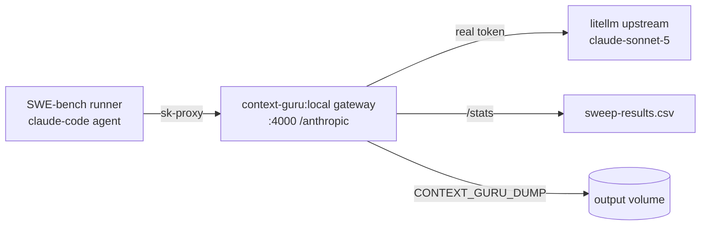

# Setup & example run

Build the binary/image, then run context-guru as the eval-containers gateway for a real
SWE-bench task driven by Claude Code.

## Prerequisites

- **Go 1.26** and a **C toolchain** — `CGO_ENABLED=1` (bifrost's tokenizer and, with the
  `cg_skeleton` tag, tree-sitter, use cgo). bifrost is an ordinary module dependency; nothing
  to check out beside this repo.
- **Docker** (for the gateway image / eval-containers), and the **eval-containers** repo.

## Build

Local binary (from the repo root):

```sh
CGO_ENABLED=1 go build -tags cg_skeleton -o bin/context-guru-proxy ./cmd/context-guru-proxy
```

Gateway image:

```sh
docker build -t context-guru:local .
```

The image entrypoint is `deploy/eval-containers/start`, which reads `EVAL_MODEL`, targets the
upstream, injects the real key, and selects the pipeline. It exposes `:4000` with
`/openai/v1/chat/completions`, `/anthropic/v1/messages`, `/healthz`, `/stats`, `/expand`.

## Quick local smoke test

```sh
./bin/context-guru-proxy --preset general
# then, from an agent or curl, against http://localhost:4000/anthropic/v1/messages
curl -s localhost:4000/stats | jq        # token-weighted savings rollup
```

## Example: SWE-bench + Claude Code through the gateway

This uses the committed compose override
[`deploy/eval-containers/compose.contextguru.yaml`](https://github.com/rossoctl/context-guru/blob/main/deploy/eval-containers/compose.contextguru.yaml),
which swaps the eval-containers gateway for `context-guru:local` and wires it to an
Anthropic-native upstream (IBM litellm). Model: **`aws/claude-sonnet-5`**.



### 1. Set env and run one task

```sh
cd .../eval-containers/containers/benchmarks/swe-bench

export EVAL_TASK_ID=django__django-11820
export EVAL_MODEL=aws/claude-sonnet-5
export EVAL_AGENT=claude-code
export ANTHROPIC_API_BASE=<IBM litellm base URL>
export ANTHROPIC_API_KEY=<litellm token>
export OPENAI_API_KEY=unused OPENAI_API_BASE=http://unused.invalid/v1   # base service marks them required
export CONTEXT_GURU_PRESET=balanced        # or `off` for the passthrough baseline

docker compose \
  -f compose.yaml \
  -f .../lab-context-engineering/deploy/eval-containers/compose.contextguru.yaml \
  up --abort-on-container-exit
```

- `EVAL_MODEL` = `<provider>/<model>`: the model pins every call (`FORCE_MODEL`), the provider
  selects the upstream.
- The agent is handed a placeholder `sk-proxy`; the gateway injects `ANTHROPIC_API_KEY` on forward.
- **Pipeline selection**: `CONTEXT_GURU_PIPELINE` (comma-separated names) wins if non-empty, else
  `CONTEXT_GURU_PRESET`. Use `CONTEXT_GURU_PRESET=off` for the baseline (empty pipeline = passthrough).
- Optional: `CONTEXT_GURU_DUMP=/output/cg-dump.jsonl` writes a before→after record per rewritten
  message to the shared output volume; `CG_LOG_LEVEL=debug` logs every component's decision and the gate that declined it.

### 2. Where results land

- **Task reward / pass** — the runner writes `task/result.json` (and `agent/result.json`) to the
  compose **`output` volume**.
- **Token savings** — the gateway's `/stats`:
  ```sh
  docker exec <project>-gateway-1 sh -c 'curl -s localhost:4000/stats'
  ```
  Reports `tokens_before/after`, `saved_tokens`, `savings_pct` (token-weighted), plus
  `wasted_tokens`/`bounces` and per-component rollups.

### 3. Sweep many task × config cells

[`deploy/eval-containers/sweep.py`](https://github.com/rossoctl/context-guru/blob/main/deploy/eval-containers/sweep.py) automates the matrix
(baseline vs each component alone vs the `balanced` preset vs competitors) over a task list. It
runs each cell, waits for the runner to exit, and appends reward + wall-clock + `/stats` savings
to `deploy/eval-containers/sweep-results.csv`. It is **resumable** — cells already in the CSV are
skipped.

```sh
python3 deploy/eval-containers/sweep.py                       # built-in 10 tasks × all configs
python3 deploy/eval-containers/sweep.py --only baseline cg-dedup
python3 deploy/eval-containers/sweep.py --one-task django__django-11820
```

The config selector grammar (CSV `config` column): `cg:off` (passthrough), `cg:<a,b,c>` (pin a
pipeline), `cg:preset=<name>`, or a competitor label like `headroom`.

### Measuring the effect of one component

Run the same task twice — once with the component in the pipeline, once with
`CONTEXT_GURU_PRESET=off` — and compare reward + `/stats`. Or per-request, have the agent send
`x-context-guru-bypass: true` to skip the pipeline for that call.

> Credentials note: `sweep.py` reads the litellm base + token from `~/.claude/settings.json`
> (`env.ANTHROPIC_BASE_URL` / `env.ANTHROPIC_AUTH_TOKEN`).
