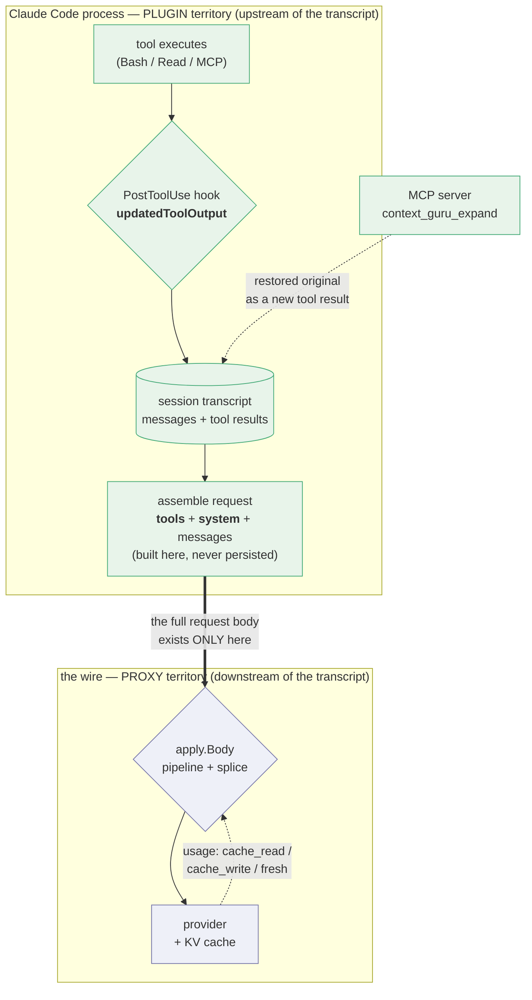

# Claude Code plugin as a fourth transport for context-guru

> **What this document is, and is not.** It evaluates **plugin-as-interceptor** — a plugin
> that rewrites tool output in-process via `PostToolUse`, and is therefore a genuinely new
> transport. That design is **unbuilt**, and this evaluation recommends building it.
> [#130](https://github.com/rossoctl/context-guru/pull/130) proposes a **different** design
> that reuses the same plugin surface — plugin-as-installer-for-the-proxy — and gives up none
> of the component set. The two are not variants of one plan; see
> [§Two candidates](#two-candidates-and-only-one-of-them-is-a-new-transport). This document is
> not the justification for #130.

Scope: can the existing `components` core be deployed as a [Claude Code
plugin](https://code.claude.com/docs/en/plugins) — as a *thin* fourth host next to
`proxy/`, the AuthBridge plugin and `adapters/bifrost`, reusing components via
configuration rather than reimplementing them? And does building it help the DAM push?

Not a replacement for the proxy. Deployment/transport only.

## The one constraint that decides everything

**No plugin surface can read or write the outbound Messages API request.** Confirmed
against the [hooks reference](https://code.claude.com/docs/en/hooks#decision-control):
across all 33 hook events there is no field that rewrites `messages[]`, `system[]`,
`tools[]`, or any `cache_control`. `UserPromptSubmit` explicitly "can't replace the
prompt; it only injects `additionalContext` alongside it".

A plugin **manifest's** `settings.json` accepts only `agent` and `subagentStatusLine`, so a
plugin cannot point the session at the proxy *declaratively, from its own manifest*. Read as
"a plugin cannot set `ANTHROPIC_BASE_URL`" that would be wrong, and the distinction turns out
to matter more than anything else here: a plugin **can** write the key into the user's real
`settings.json` from an install skill, which is exactly the design #130 proposes and this
document does not evaluate as a transport candidate. See
[§Two candidates](#two-candidates-and-only-one-of-them-is-a-new-transport).

Verified twice over during review of this PR, and by a stronger method than the docs: 11 hook
events exercised live (including `PostToolBatch`, `PreModelSwitch`/`PostModelSwitch` and
`InstructionsLoaded`, which this doc had not covered), plus a direct read of the installed
CLI's own `hookSpecificOutput` validation schema — 33 events, only 22 carrying output fields
at all, and the validation union touches no envelope field. `cache_control` **is** present in
the captured wire body, placed by the CLI on system blocks and the trailing message; it is
simply never visible to, or writable by, any hook.

**One precision, so this is not read as more absolute than it is.** "No plugin surface can set
`cache_control`" is true, but cache *TTL* is not entirely out of reach: `promptCacheTtl` /
`CLAUDE_CODE_PROMPT_CACHE_TTL` is a real lever (5m default on an API key, 1h on a
subscription) — reachable through `settings.json` or the environment, **not** through any hook
or plugin manifest field, and session-wide and static rather than per-breakpoint. It changes
nothing here, because `cachesplit` and `cacheinject` both turn on per-breakpoint,
per-turn reasoning that remains unreachable from plugin-land. It is worth stating because a
settings-based install — the shape proposed for local distribution — *can* set it, and a flat
claim of "zero cache control" would overstate the gap.

What *is* interceptable is **one tool result, at the moment it is produced, before it
enters context** — `PostToolUse` → `hookSpecificOutput.updatedToolOutput`, which
"replaces the tool's output with the provided value before it is sent to Claude". The
docs name this use case directly: *"For redaction or transformation use cases, intercept
at `PreToolUse` for outbound tool inputs and `PostToolUse` for inbound tool results."*

**On the figures quoted throughout — and one correction to how this document used them.**
Component measurements cited below are this repo's own recorded results, quoted accurately from
code comments and `docs/RESULTS.md`. An earlier revision of this document called them "not
re-verified against current traffic"; for `cachesplit` that is **false**, and the correction
matters to a decision made at the end of this document.

`cachesplit`'s **−34.1% / 0%→96.7%** is a *warm-regime* figure: `docs/components/cacheinject.md:203`
records one Terminal-Bench task × 3 trials at Sonnet 5 rates, and `:209` says in terms *"treat
34.1% as one task measured three times, not a fleet average"*. `docs/dashboard.md:219` states the
A/B *"ran tasks back-to-back inside the TTL"*, which is the only regime where a volatile-tail split
can pay. Against that, `docs/dashboard.md:204` records the *cold interactive* figure on this
deployment: **$0.0298 across 1,127 sessions / 11,361 requests.** Both numbers are right. They
differ by three orders of magnitude because they measure different regimes.

Three facts bound the cold case further, all from `docs/dashboard.md`: the environment block is
snapshotted **once per session** (a nine-turn session that created and committed four files
produced *one* volatile-tail hash), **1,105 of 1,127** first requests read **zero** tokens from
cache because the previous prefix had expired under the 5-minute TTL, and only 9 session starts had
a warm prefix at all. `cachesplit` also does nothing outside a git repo, and is a no-op on implicit
prefix-cache backends (`config/config.go:379-380`).

So the rule for reading every figure below: **name the regime.** A plugin user is a human running
interactive sessions minutes or hours apart — definitionally the cold regime — not a benchmark
harness running tasks back-to-back. Asking the reader to trust "order of magnitude" is asking them
to trust the one property that is regime-dependent.

So the dividing line through our component set is not lossy-vs-lossless. It is:

- **per-tool-output text transform** → works, sometimes better than the proxy;
- **needs the request envelope, or needs to rewrite an *earlier* message** → impossible.

That second clause is the expensive one. `PostToolUse` fires once, at message birth. It
can never go back.

## The one picture: the transcript is the boundary

Everything below follows from *where* each host sits relative to Claude Code's session
transcript. The plugin is **upstream** of it; the proxy is **downstream** of it.



Read off the consequences:

| | Plugin (upstream) | Proxy (downstream) |
|---|---|---|
| Sees `tools` / `system` / `cache_control` | **No** — assembled after it, never persisted | Yes |
| Sees provider usage (cache tiers, cost) | **No** | Yes |
| Sees one tool output before it is recorded | **Yes** | No — only after, re-sent every turn |
| Effect on the transcript | **Permanent** — rewrites history at birth | Per-request — must re-derive each turn |
| Knows session lifecycle (`Stop`, `SessionEnd`, `PreCompact`) | **Yes, explicitly** | Inferred from traffic |

So the split is not "which components are portable". It is: **anything that needs the
request body or the provider's response must be on the wire, and that is the definition of
the proxy. The plugin's entire boundary is "everything except the wire."**

That single fact decides `cachesplit`, `cacheinject`, the keepalive ping, `/stats` cost
accounting, and the freeze/replay layer — in that order of importance.

## Why this distribution method fits offloaders but not cache management

The two families differ in *what they need to touch*, and the plugin boundary cuts exactly
between them.

**An offloader needs one tool output.** `cmdfilter` filtering `terraform plan` noise,
`collapse` windowing a 2,000-line log, `skeleton` reducing a source read — each is a pure
function from one blob of text to a shorter blob of text. It needs no neighbouring message,
no `system` array, no provider response. `PostToolUse` hands it exactly that blob and
accepts a replacement. The unit of work and the unit of interception are the same size, so
the transport is a fit rather than a compromise.

**Cache management needs the whole request, and needs to write metadata into it.** Not one
message — the *shape* of the entire prefix:

- `cachesplit` restructures the top-level `system` array. Components never see it; only
  `apply` does, from the raw body.
- `cacheinject` reasons over `messages[]` positionally — divergence point, turn-stable
  anchors, the 4-slot budget counted across `system` + `tools` + `messages` together — and
  its output is a `cache_control` key, which is request metadata, not content.
- the keepalive must *originate* a request that byte-exactly reproduces a prefix, and price
  the decision from `CachedTokens`, which only the provider's response carries.

None of that is a large tool output. It is the envelope, and the envelope is assembled after
the plugin's last hook has run and is never written to disk. Verified: a session transcript carries
`messages` and `toolUseResult`, and no system prompt or tool schemas — see
`deploy/harbor/inspect_transcript.py`. Read its output carefully: it inspects transcript **key
names**, so `system-ish keys: NONE` is the finding, while the `record types` tally it also prints
does contain a `system` entry — a transcript *event* type, not a request `system` array. The wire
capture in §0 is what establishes the point conclusively.

So the rule is not "lossy vs lossless" or "cheap vs expensive". It is:

> **Content-scoped work distributes to the harness. Envelope-scoped work requires being on
> the wire.**

And there is a second, sharper asymmetry in how the two families *fail*. An offloader that
gets it wrong wastes an expand round-trip — bounded, recoverable, and reversibility is
type-enforced. Cache work that gets it wrong inverts: a mistimed keepalive creates an entry
at 1.25× instead of refreshing at 0.1×; a breakpoint over budget is a hard 400; a
representation flip inside a cached prefix re-writes the suffix at 11.5×. Envelope-scoped
work has no fail-open direction that is merely "no saving" — which is precisely why it wants
the host that can see the whole request and the provider's answer to it.

## The KV-cache layer: the defensive half is free, the offensive half is impossible

This is the part that matters most, and the answer is not one answer. Our KV-cache
awareness is two separate mechanisms with opposite fates under a plugin.

### Defensive: keep the provider's cached prefix byte-stable

`components/offload/state.go`, `Ctx.CacheAware` / `Ctx.MaxCachedIdx`, `modes.Tracker`,
`cg:frz:`, `FrozenLost` / `repairLostFreeze`, `frozen_flips`, the sticky-session set,
`cg:len:`. This is the single hardest body of code in the repo, and `state.go` states
exactly why it exists:

> once an offloader compacts an output, it must send the SAME bytes for that output on
> every later turn — **otherwise the agent (which re-sends the ORIGINAL each turn)** makes
> the output flip compacted→full→compacted, churning the provider KV cache.

The parenthetical is the whole load-bearing premise, and **a `PostToolUse` hook falsifies
it.** The agent cannot re-send the original because the agent never received the original.
`updatedToolOutput` replaces the output *before it enters Claude Code's transcript*, so
the reduced bytes are what the transcript holds and what gets re-sent, verbatim, forever.

Every consequence follows mechanically:

- **No re-derivation, so no freeze.** `freeze` / `reapplyFrozen` / `frozenKey` exist to
  reproduce byte-identical output on turn *n+1*. There is no turn *n+1* decision to make.
- **No lost-freeze problem.** `frozenLost`, `repairLostFreeze`, `FrozenLoser`,
  `frozen_dropped` / `frozen_repaired` / `frozen_flips`, and the "fail direction inverts
  for an established compaction" reasoning in design.md all describe a store entry whose
  loss corrupts a cached prefix. Nothing is replayed, so nothing can be lost.
- **No tail gate.** `MaxCachedIdx` / `TailOnly` / `modes.Tracker` restrict mutation to
  messages the provider hasn't cached. A hook mutates content that has **never been sent
  to the provider at all** — it is not merely in the uncached tail, it is pre-wire. This is
  strictly stronger than the invariant the tracker enforces, and it removes the
  read-then-write race that `Tracker.Turn` was built to fix.
- **`extract_llm`'s nondeterminism stops being disqualifying.** It is excluded from
  `repairLostFreeze` because a sampled model output "may emit different bytes at depth". A
  decision made exactly once cannot differ from itself. (Its *economics* still don't work
  on caching backends — separate problem, unchanged.)
- **Sticky ids and the overcount correction go away.** `saved_tokens` vs
  `saved_tokens_unique` exists because the agent re-sends history and the cumulative figure
  double-counts. In plugin form each saving is realized once, at birth.
- **Agent self-compaction stops being inferred.** `proxy/agentcompaction.go` detects it by
  string-matching the agent's compaction prompt — pinned to Claude Code 2.1.215's
  `Jao()`/`GMu()` internals, with a documented reachable false positive (our own docs page
  quoting the phrase). A plugin gets `PreCompact` / `PostCompact` as first-class events. A
  fragile phrase match against a specific agent build is replaced by a signal.

So the defensive half isn't ported — it's **obviated**. That is the strongest argument for
the plugin, and it is structural rather than a matter of care.

### Offensive: make the provider cache more of the prefix

`cachesplit` (the volatile-tail system split) and `cacheinject` (breakpoint placement).
Both write request metadata. Both are categorically unreachable — see the component table.

**But this half only exists on explicit-breakpoint backends.** `apply/prefixsplit.go` is
explicit:

> Only meaningful where breakpoints are EXPLICIT (Anthropic family). Under an implicit
> longest-prefix cache the match already ends at the divergence, so a block boundary buys
> nothing.

That splits the verdict by backend, and it is the crux of the whole evaluation:

| Backend | Offensive half | Plugin's net cache position |
|---|---|---|
| Anthropic / Bedrock / Vertex (explicit `cache_control`) | `cachesplit` is unreachable — worth **−34.1%** warm (one task, back-to-back inside the TTL) but **$0.0298 / 1,127 sessions** cold | **Loss of cents, in the regime a plugin user is actually in.** Real on a benchmark harness; close to the vLLM row for an interactive human. |
| vLLM / llm-d / on-prem, OpenAI auto-cache (implicit longest-prefix) | `cachesplit` and `cacheinject` are **already no-ops** | **No loss at all** — and the defensive half, which is the *entire* cache story there, comes free. Strictly better than the proxy on the cache axis. |

Given `extract_llm.go`'s "on-prem vLLM under KV-cache pressure" measurements and the llm-d
TOON config, the implicit case is a real target, not a hypothetical. On that traffic a
plugin is the better cache deployment. On Anthropic traffic — which is what Claude Code on
DAM will actually be — it is not.

## Two candidates, and only one of them is a new transport

The whole document to this point analyses **one** way to use the plugin surface. There is a
second, and it is the one #130 proposes. They share a package format and nothing else —
different interception point, different capability set, different risk.

| | **(A) plugin-as-interceptor** | **(B) plugin-as-installer-for-the-proxy** |
|---|---|---|
| Mechanism | `PostToolUse` → `updatedToolOutput`, in-process | `SessionStart` hook + an install skill that writes `env.ANTHROPIC_BASE_URL` into the user's real `settings.json` |
| Where the work happens | inside Claude Code, upstream of the transcript | on the wire, in `proxy/` — unchanged |
| Is it a new transport? | **Yes** — a fourth one, hence this document's title | **No.** It is transport #1 (the proxy) in new packaging |
| Component set | offloaders only; the cache half is unreachable | **all of it.** Nothing is given up, because the proxy still sees the envelope |
| `/stats`, cost tiers, benchmarks | unavailable — no provider response | unchanged |
| Status | **unbuilt.** Recommended below | proposed in #130 |
| Defensive KV-cache layer | obviated (the win in §KV-cache) | still required, exactly as today |

**Everything in this document's component tables describes (A).** Every "unreachable from a
plugin" verdict below is a statement about interception inside the harness, and is
**irrelevant to (B)**, which runs the full proxy and therefore keeps `cachesplit`,
`cacheinject`, `mask`, `failed_run` and `/stats`. A reader who takes the tables below as a
description of the plugin #130 ships will be wrong about most of the component set.

(B) also disposes of this document's own headline blocker, and it is worth being explicit that
it does so *legitimately* rather than by a loophole: the manifest cannot carry
`ANTHROPIC_BASE_URL`, but nothing stops a skill from merging that key into the settings file
the user already owns. This document mentions settings-based installation only as a
`promptCacheTtl` aside and never weighs it as a transport candidate. It is the option that won,
and the reason it wins is that it pays none of the costs enumerated here.

So the two are complementary rather than competing: **(B) is how you get the proxy onto a
stranger's machine; (A) is a capability the proxy does not have** — offload at birth, and the
defensive cache layer becoming unnecessary. (A) remains unbuilt and remains the live question.

**On the transport count.** (A) would be a fourth transport beside `proxy/`, the AuthBridge
plugin and `adapters/bifrost`. (B) adds none, so README's three-transport *Integrate* table is
correct as it stands and should not change on account of #130.

**Status, and why this document should not be read as a record of it.** (A) has never been
built. (B) is specified in #130 — three skills over three scripts plus a `SessionStart` hook that
self-gates on `$ANTHROPIC_BASE_URL` matching its own port — and its implementation is in flight, so
the authority on what (B) actually ships is #130 and its implementing PR, never this page. What
matters here is only the design distinction: **(B) does not need any of the interception this
document analyses, and therefore pays none of its costs.**

## Component verdicts

### Reformat (lossless)

| Component | Plugin | Why |
|---|---|---|
| `format` | **Yes** | Acts only on tool messages whose text is JSON — a pure per-output recompaction. Nothing envelope-level despite the name. |
| `toon` | **Yes** | Same shape: one tool output's uniform JSON array → TOON. |
| `cacheinject` | **No — categorically** | Four independent blockers, below. |
| `cachesplit` | **No — categorically** | Its whole effect is a rewrite of the top-level `system` array (`apply/prefixsplit.go`). There is no `system` array in plugin-land. |

**`cacheinject` in detail** — the offensive half's second component, and the single worst
fit in the repo:

1. Its output *is* request metadata. `cache_control` on a message content block. No hook
   emits that.
2. Even granted a write channel, the algorithm is **positional over the whole
   `messages[]` array**: `want[len(req.Input)-1]`, `commonPrefix(prev, now)` for the
   divergence point, and the `lookbackBlocks`-strided turn-stable anchors. A
   `PostToolUse` hook sees one tool result and no array at all.
3. `Ctx.ExistingBreakpoints` is computed by `apply` from the **raw wire body**, spanning
   `system` + `tools` + `tool_result` blocks — the exact three places components can't
   see, which is what issue #32 was. That body does not exist in a hook.
4. The v2 contract is *"keep every breakpoint the caller set, then spend the leftover
   slots"* — where the caller is Claude Code itself. A plugin cannot observe Claude
   Code's own breakpoints, so it cannot compute the budget, and overshooting the
   provider's cap of 4 is a hard 400.

`cacheinject` is in no preset today (placement is unmeasured), so losing it costs nothing
measured. **`cachesplit` is the larger loss of the two, and smaller than this document first
claimed.** It is in every preset, and an earlier revision called it "the best-evidenced component
we have" — which `docs/components/cacheinject.md:209` contradicts directly, since the −34.1% is one
task measured three times. Priced in the regime a plugin user occupies it is **$0.0298 across 1,127
sessions**, and on Terminal-Bench it recorded `cachesplit acted=0` for a *structural* reason
(`docs/results/terminal-bench-comparison.md:155`: the SDK never appends the git/env snapshot the CLI
does). The plugin gives up cents on interactive traffic and gains the free defensive half.

### Offload (lossy, reversible)

| Component | Plugin | Why |
|---|---|---|
| `cmdfilter` | **Yes — better than the proxy** | Per-output DSL filter, and the hook input hands you the actual `tool_input.command`. The proxy has to infer the command from the transcript; a hook is told. Should cut `cmdfilter_selector_misses`. |
| `collapse` | **Yes** | Head/tail window over one oversized output. |
| `smartcrush` | **Yes** | Crushes one output's homogeneous array. |
| `extract` | **Yes** | Deterministic per-output noise collapse. |
| `skeleton` | **Yes — better than the proxy** | Per-output tree-sitter reduction, and the hook supplies `tool_input.file_path`, so language selection stops being content sniffing. Still needs the `cg_skeleton` build tag. |
| `dedup` | **Yes, with state** | Replaces the *later* byte-identical output — forward-only, which is exactly what a hook can do. Needs cross-turn digests, so it needs a store that outlives one hook process. |
| `extract_llm` | **Technically yes; leave it off** | The transform is per-output, but its economic gate needs the caching-backend fact and the fresh/cache-read token split, none of which a hook can see. Since #28 it declines on caching backends anyway (**82×** underwater on Terminal-Bench — 197,548 unique tokens saved, worth $0.0395 at the cache-read rate they actually bill at, for $3.26 spent; the earlier "~8×" priced those tokens as *fresh* when they sit in the cached prefix). A synchronous cheap-model call inside a per-tool-call hook is also the worst place to put one. |
| `extract_llm_sweep` | **No** | Landed in #118 after this evaluation was written. It adjudicates *spent* tool outputs over the model's already-cached transcript, so it is retroactive by construction — it decides about messages that are already in Claude Code's history. Same wall as `mask` and `failed_run`, and for the same reason. |
| `failed_run` | **No** | It keeps the newest run and collapses **earlier** runs. Retroactive by definition; at the moment run 2 is produced, run 1 is already in Claude Code's transcript and immutable. |
| `mask` | **No** | Age-based GC of *older* tool outputs. Same retroactivity. It is the largest *known* token lever on our target traffic — **~27.5–29.5%, a single-task replay, never enforced in a benchmark arm** (`docs/components.md:439` says 27.5% Terminal-Bench / 12.5% SWE-bench; `docs/results/terminal-bench-comparison.md:86` says ~29.5%, from an arm where `mask` was **not** enabled) — and it is unreachable. Treat it as an unenforced upper bound, not a realized saving. |
| `summarize` | **No** | Whole transcript, and it changes the message count. |

### Infrastructure

| Package | Plugin | Notes |
|---|---|---|
| `expand/` | **Yes — strictly better** | Ship `context_guru_expand` as an MCP tool via `.mcp.json`. This deletes the proxy's worst machinery: the 3-round `maxExpandRounds` cap, the response parsing, the continuation builder, and above all the **SSE buffering** (today a streaming response must be buffered whole to detect an expand call — `sse_buffered_pct` / `sse_ttfb_ms_avg_buffered`). An MCP tool call is just a tool call. Nothing to buffer, no round cap. |
| `store/`, `session/` | **Yes, needs a home** | Hooks are one-shot processes; our store is in-memory with sliding TTL and pinned prefixes. Either a long-lived process holds it (the MCP server already is one) or SQLite under `${CLAUDE_PLUGIN_DATA}`. Session keying gets *simpler*: hook input carries `session_id`, so `session.Resolve`'s content-hash fallback is never needed. |
| `config/` | **Yes, unchanged** | One new preset. This is the "reuse via specific configuration" the plugin should be. |
| `metrics/`, `/stats` | **Partial — and this bites** | Content-token savings are countable. The four provider-billed tiers (`fresh_input_tokens`, `cache_read_tokens`, `cache_write_tokens`, `output_tokens`) come from the API *response*, which a plugin never sees. So `savings_pct_attempted`, `savings_pct_new_input`, every cost figure, and the `deploy/harbor/*.py` reproduction path do not exist in plugin mode. Worse, Claude Code's own OTel spans capture the **original** output — the docs are explicit that telemetry runs before the hook. **The plugin cannot be benchmarked the way the proxy is.** |
| `dash/` | **Yes** | Runs alongside; `monitors/monitors.json` can launch it, a skill can open it. Content capture stays opt-in. |
| `modes.Tracker`, `MaxCachedIdx`, `TailOnly`, freeze/repair | **Moot — and that is the upside** | See below. |
| `apply/` | **No — replaced by something much smaller** | No wire body, so `normalize`, the round-trip guard, the `metawrite` metadata exception, `wireBreakpoints` and `prefixsplit` all have nothing to do. A new `adapters/cchook` needs none of it. |
| `proxy/` control plane — `spendgate`, `tenancy`, `limits`, `refusals`, `promexport` | **No** | Multi-tenant gateway concerns. A plugin is single-user and local. |
| `adapters/bifrost` | N/A | |

## Prior art: rtk already ships this architecture, and we already benchmarked it

This document proposed a hook that rewrites tool output before it enters context without noting
that **we have measured exactly that design** — as a competitor, in a full benchmark arm.
[rtk](https://github.com/rtk-ai/rtk) (Rust Token Killer) is a shell-level Bash-output hook, and
`docs/results/rtk.md:11` records it on SWE-bench Verified, 50 tasks:

| arm | billed cost | vs baseline | reward | steps | request-path latency |
|---|--:|---|--:|--:|---|
| baseline (no compaction) | $31.98 | — | 43 solved | 36.1 | — |
| **rtk** | **$29.09** | **−9.0%** | 43 solved (**neutral**) | 33.2 (−8%) | **zero** |
| context-guru (proxy) | — | −13.2% | — | — | on the wire |

So the expected value of candidate (A) is not unknown, and it is not the "−6,285 tokens on one
session" figure quoted in §0 — that has no denominator, no percentage, no `acted` count and no
paired arm, so by this repo's own conventions it is a demonstration that the mechanism works, not a
savings measurement. **Use −9.0%, reward-neutral, at zero request-path latency as the floor.**

**And this design should beat rtk, for a structural reason worth stating because it is the clearest
unclaimed edge here.** rtk is a *shell* hook, so it only ever sees `Bash`. Claude Code's built-in
`Read`, `Grep` and `Glob` bypass it entirely — that is rtk's ceiling, and on code traffic those tools
carry a large share of the tokens. `updatedToolOutput` has no such ceiling: the hook manifest
proposed below uses matcher `".*"`, so `skeleton` on a `Read` and `extract` on a `Grep` are reachable
where rtk cannot go. Expected value: **≥ −9.0%, because matcher `.*` reaches the built-in file tools
rtk cannot**, and because `expand/` gives back a reversibility rtk does not have.

The honest counterweight: rtk achieves its −9.0% with no store, no MCP server and no expand path, so
it is also the argument that the *first* useful version of (A) is small.

## Permanence cuts both ways

The defensive-half argument above is the plugin's best property, but it has a symmetric
downside that has to be priced in.

Under the proxy, an offload decision is re-made every turn and is therefore *revisable*.
Under a hook it is made once and is **irrevocable from the transcript's point of view**:

- A good reduction is permanently good — realized once, re-sent free forever.
- A **premature offload is permanently bad.** Today a bounce (`wasted_tokens` / `bounces`)
  costs one round-trip and the next turn can decide differently. In plugin form, when the
  model calls `context_guru_expand`, the restored original arrives as a *new* MCP tool
  result appended to the transcript — the marker stays where it was, and now both the marker
  and the full original are re-sent for the rest of the session. An expand goes from a
  per-turn cost to a permanent one, *plus* the marker overhead.

Note what this does to `state.go`'s kept-verbatim machinery: `keptKey` / `isKeptVerbatim` /
`MarkKeptVerbatim` exist to stop an expand→re-compact→expand loop. That loop is impossible
here (the hook never revisits the message), so the guard is unnecessary — but the *reason*
it was needed becomes a worse problem rather than a solved one.

The design consequence is concrete: **the plugin should be tuned more conservatively than
the proxy**, favouring high-confidence deterministic reductions (`cmdfilter`, `format`,
`toon`, `extract`) over speculative ones (`collapse`'s blind head/tail window). It also
makes `mask`'s `keep_head_chars` head-peek idea — which measurably stops needless expands —
more valuable exactly where it cannot run.

One piece of `state.go` gets *better*, not obviated: the **global (session-independent)
result cache**. `getResultGlobal` / `extract.ResultKey` exploit cross-session content
recurrence — measured 82 of 103 unique contents recurring across sessions, ~93% of
`extract_llm`'s realized value. The proxy holds that in an in-memory store that dies on
restart. A plugin store under `${CLAUDE_PLUGIN_DATA}` is a per-user file that survives
session exit and reboot, so it can realize *more* of that reuse than the proxy does.
`markSeenContent`'s recurrence signal keeps working for the same reason.

## What the plugin would actually contain

```
context-guru-plugin/
  .claude-plugin/plugin.json     # userConfig: preset, ttl, dashboard, log level
  .mcp.json                      # context-guru --mcp  → context_guru_expand (+ holds the Store)
  hooks/hooks.json               # PostToolUse (matcher ".*") → context-guru --hook
  monitors/monitors.json         # optional: dashboard / stats tail
  skills/                        # /cg:stats, /cg:preset, /cg:explain
  bin/                           # the binary, if not vendored via userConfig path
```

New Go code, all of it thin:

- `adapters/cchook` — read the hook JSON on stdin, wrap the tool output as a single
  synthetic `role:"tool"` `ChatMessage`, run the configured pipeline, emit
  `updatedToolOutput`. Fail open on everything (echo nothing → original stands).
- an MCP stdio mode on the existing binary, serving `expand/`'s tool def and owning the
  store the hook talks to.
- one preset, e.g. `hook: format → toon → dedup → cmdfilter → extract → smartcrush → collapse`
  — `general` minus `mask`, `failed_run`, `cachesplit`, `extract_llm`, `summarize`.

Everything under `components/`, `components/offload/`, `components/dsl/`, `store/`,
`session/`, `config/`, `expand/`, `metrics/`, `dash/` is reused unmodified.

## Gate 0: persistence — RESOLVED, in this proposal's favour

Everything above rested on one unverified fact: that the *replacement* is what Claude Code
stores and re-sends, not just what it shows the model once. The counter-hypothesis — original
retained, replacement applied to a single request — would have collapsed the whole
proposition, because the freeze/replay layer would be needed again with no way to run it.

**Measured, 2026-08-30 (review of this PR).** A `PostToolUse` hook replaced a Bash output
with a sentinel; the outbound body was captured through a raw-logging reverse proxy — the
wire, not just the transcript file — across two turns of a real session. Turn 2,
`messages[3]`:

```json
{"tool_use_id": "toolu_bdrk_01SC6Vg1gZAtY1WEVe7xsbsR", "type": "tool_result",
 "content": "SENTINEL-OBJ-999-REPLACED", "is_error": false}
```

The real content appears in **no** resent `tool_result`, and a later turn asked for the exact
tool output answered with the sentinel at `input_tokens: 69` — i.e. from resent history, not
regeneration. **The replacement persists and is resent verbatim.**

A working `PostToolUse` collapse plugin (matcher `Bash`, head/tail with an omitted-count
marker) was then A/B measured on a real session: **−6,285 tokens**, appearing as the *same*
reduction on turn 1's cache-write and turn 2's cache-read. Two independent measurements of
one session, which is what distinguishes a permanent reduction of resent context from a
one-turn display trick.

So the defensive-half-is-free argument holds, and the recommendation below is an
empirically-grounded bet rather than a reasoned one.

### The operational gotcha, hit exactly as predicted

`updatedToolOutput` **must be the object shape** matching the tool's `tool_response` schema —
for `Bash`: `{stdout, stderr, interrupted, isImage, noOutputExpected}`. A **bare string is
silently ignored** and the original output stands. The first implementation attempt during
review did exactly this and read as a negative result until the shape was corrected.

This is the failure mode flagged below as the thing to guard against, and it arrived on the
first try. The adapter must verify its own emission and count rejections; a silently inert
plugin is the #32 bug in a new costume.

## Remaining risks

1. **Shape validation fails silently** — see above. Now demonstrated, not hypothetical.
   `adapters/cchook` needs an emission-verified counter from day one.
2. **Oversized emissions degrade rather than fail — and the earlier "10,000-char cap" figure
   in this doc was wrong.** Measured by bisection with distinct-letter payload segments:
   `updatedToolOutput.stdout` goes out verbatim and uncapped up to ~30,000 chars, with the
   real threshold somewhere in **(30,000, 40,000]** — a bracket 10,000 wide, deliberately not
   narrowed to a round guess, since no governing constant appears near `updatedToolOutput` in the
   binary. That is 3–4× the figure this doc first cited from the `additionalContext` / `systemMessage` / plain-stdout cap, which does
   not govern this field. Above the threshold there is neither truncation nor rejection: the
   CLI's ordinary large-tool-output handler takes over, so the wire `tool_result` becomes a
   ~2,260-char `<persisted-output>` wrapper carrying a 2 KB preview plus a pointer to the full
   content on disk, while the local `toolUseResult` record stays intact (confirmed at 100,000
   chars). "Cap" was the wrong frame — this is graceful degradation into the same
   preview-plus-pointer pattern Claude Code already applies everywhere, and for an oversized
   hook emission it is a token-cost *improvement*, not a hazard to design around.
3. **Event coverage.** `PostToolUse` does not fire for tool calls rejected before execution,
   and tool *errors* route to `PostToolUseFailure` — a nonzero-exit `Bash` call is still a
   success, so the `cmdfilter` path is covered, but full coverage needs both events.

## Does this help the DAM push?

[DAM](https://github.com/dam-agents/dam) is TypeScript, explicitly harness-plural (Claude
Code, Pi Agent, Bob, Codex, plus "bring your own harness — any runtime compatible with
ACP"), and runs agents in isolated pods behind **policy-enforced gateways** with zero-trust
credentials the runtime never sees.

**Mostly no.**

- A Claude Code plugin covers **one of four named harnesses** and none of the
  bring-your-own case. The proxy covers all of them because it sits at the transport.
- DAM's egress shape *is already* our gateway credential model — provider key injected at
  the gateway, agent holds a placeholder. `proxy/` drops into that path introducing no new
  concept; the plugin would have to be installed and force-enabled per harness, per pod.
- Long-lived agents are DAM's headline, which makes **cache economics** the dominant cost
  term. Claude Code on DAM means Anthropic/Bedrock — the explicit-breakpoint column, where the
  offensive half is unreachable from a plugin. **But price this carefully rather than at −34.1%:**
  long-lived agents on a platform are closer to the *warm* regime than a human's interactive
  sessions are, so this is the one place the benchmark figure is the more relevant one — and it is
  still a single-task measurement, not a fleet average. (Were DAM routing to an on-prem vLLM/llm-d
  backend, this row would flip: there the offensive half is already a no-op and the plugin's free
  defensive half would be the better cache deployment. Worth confirming which backends DAM actually
  targets before treating this as settled.)
- `spendgate`, `tenancy`, `limits`, `promexport` are what a platform actually needs to
  enforce, and they are proxy-only. A plugin is user-installable and user-disableable; a
  platform wants a policy.
- No `/stats`, so no benchmark reproduction on DAM traffic.

**The narrow yes.** DAM already ships `.agents/skills`, so it has a skills-shaped
distribution channel. Three pieces are worth shipping there *on top of* the gateway:

1. the **MCP expand server** — valuable regardless of transport, because it removes SSE
   buffering from the gateway's hot path;
2. the **operator surface** — skills for `/cg:stats`, the dashboard monitor;
3. the **`adapters/cchook` boundary itself** — a per-tool-output adapter is reusable by any
   ACP harness exposing a tool-result hook, so the refactor has cross-harness value even
   where the packaging does not.

## What the plugin is actually for

Stated bluntly, because it is easy to lose in the detail: **the keepalive idle signal is not
a reason to build a plugin.** It is a rider on one, worth having only if a plugin exists for
other reasons. If the list below doesn't stand up, don't build it.

Ranked by what the plugin uniquely provides — things the proxy *cannot* do, not things it
already does:

1. **Offload at birth, permanently** *(the whole case)*. Rewriting a tool output before it
   enters the transcript means the reduction is realized once and re-sent free forever, and the
   entire defensive KV-cache layer — `state.go`'s freeze/replay, `MaxCachedIdx`, `Tracker`,
   `frozen_flips`, sticky ids — stops being necessary rather than being ported. That is the only
   item here that changes the architecture. **§0 settled the persistence question it used to rest
   on: the replacement is what Claude Code stores and re-sends.**
2. **`context_guru_expand` as an MCP tool.** Deletes the 3-round `maxExpandRounds` cap, the
   response parsing, and the whole-SSE-buffering penalty. Worth doing *even with no hook at
   all*, and it works alongside the proxy rather than instead of it.
3. **Better selectors for free.** `cmdfilter` gets the actual `tool_input.command` and
   `skeleton` gets `tool_input.file_path`, instead of inferring both from transcript text.
4. **Explicit lifecycle signals.** `PreCompact`/`PostCompact` replace
   `proxy/agentcompaction.go`'s string match against Claude Code 2.1.215's internals — which
   has a documented reachable false positive. `SessionEnd` tells a proxy-side keepalive that
   a session is dead rather than thinking, which is the waste that caps `K` at 2–3.
5. **Durable cross-session result cache.** `${CLAUDE_PLUGIN_DATA}` survives restarts; the
   proxy's in-memory store does not. On the measured 82-of-103 cross-session content
   recurrence, that realizes more reuse than the proxy can.
6. **Distribution.** `/plugin install` and a marketplace, versus "point your agent at a
   proxy". Real, but packaging, not capability.

Items 3–6 are worth a few hundred lines. They do not justify the project on their own. **The
project is item 1, or it is item 2 alone.** §0 settled item 1; decide item 2 on its own merits.

## Recommendation

The one-line version, and the honest scope of the claim: **a Claude Code plugin can replicate
the offloader half of this repo — persistently, measurably — and categorically cannot
replicate the cache-management half.** Not "a plugin can do what the proxy does."

Build it, scoped as a transport for that half:

- **Do**: MCP expand server, `PostToolUse` offload hook, operator skills, one `hook` preset.
- **Don't**: attempt `cacheinject`, `cachesplit`, `mask`, `failed_run`, or `/stats` cost
  accounting in plugin form. Cache work and multi-tenant policy stay in the proxy, which
  remains the only place they are possible.
- **For DAM**: land the proxy in the gateway. Ship the plugin as the Claude-Code-session
  layer on top of it — never as the DAM integration. Note that this call now rests on
  `spendgate` / `tenancy` / `limits` / `promexport` and harness-plurality, **not** on the −34.1%
  figure an earlier revision leaned on: DAM is closer to the warm regime than a human is, but the
  figure is still one task, and the platform-policy argument is the one that carries weight.
- **Not a substitute for (B).** If the goal is "an evaluator tries context-guru in one command",
  that is candidate (B) in [§Two candidates](#two-candidates-and-only-one-of-them-is-a-new-transport)
  and #130, which keeps the whole component set. (A) is a capability argument, not a distribution
  one — item 6 below is packaging, and (B) does packaging better.
- **Gate 0 is now closed** (persistence confirmed on the wire, plus a −6,285-token A/B on a
  real session), so the build is no longer conditional. Carry forward one hard requirement
  instead: the adapter emits the **object** `tool_response` shape and counts its own
  rejections, because a bare string is accepted silently and does nothing.
